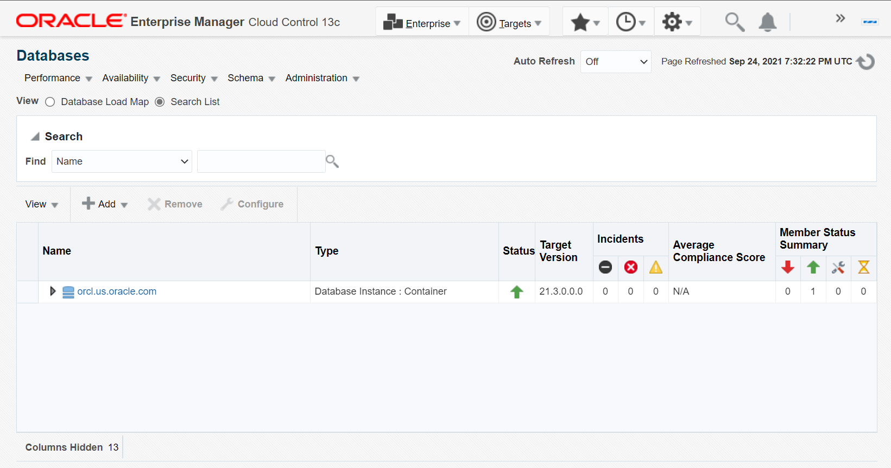
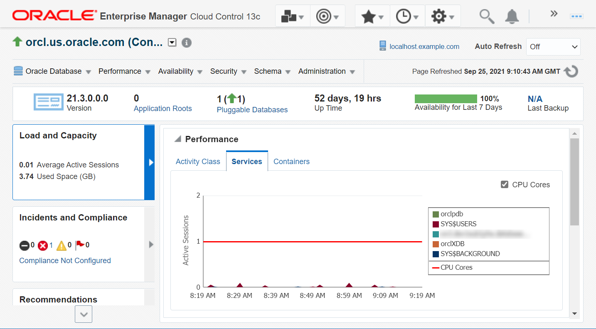
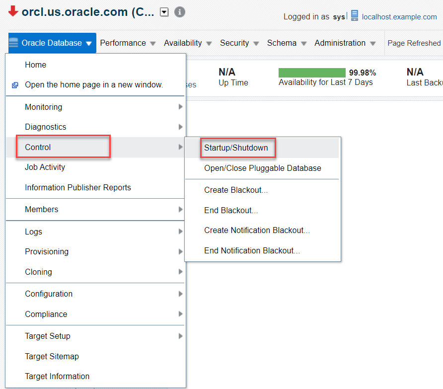
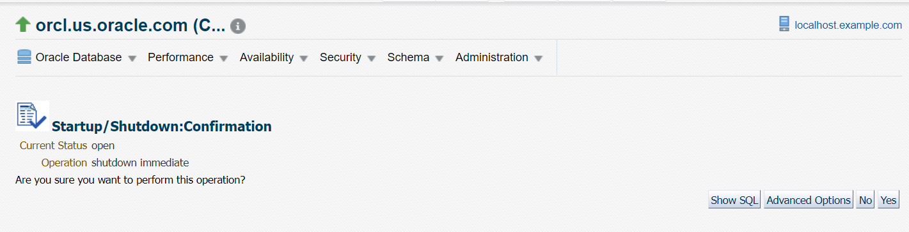
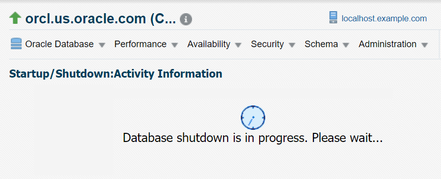
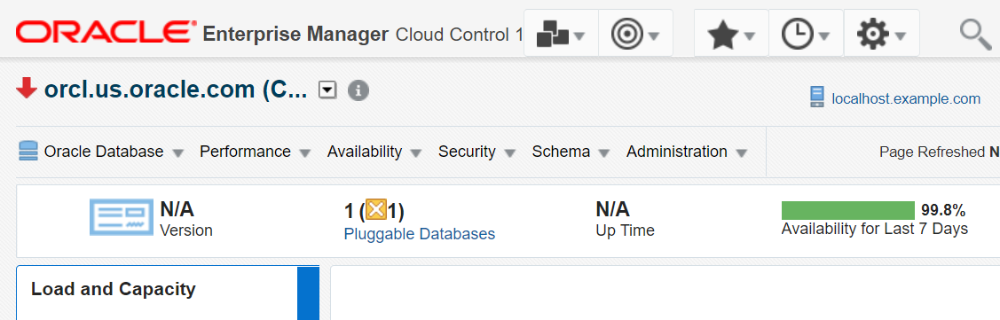
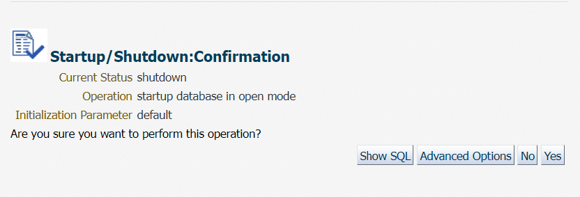
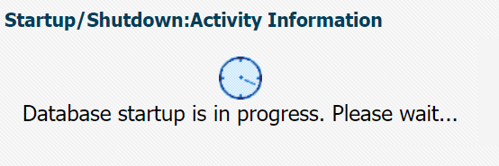
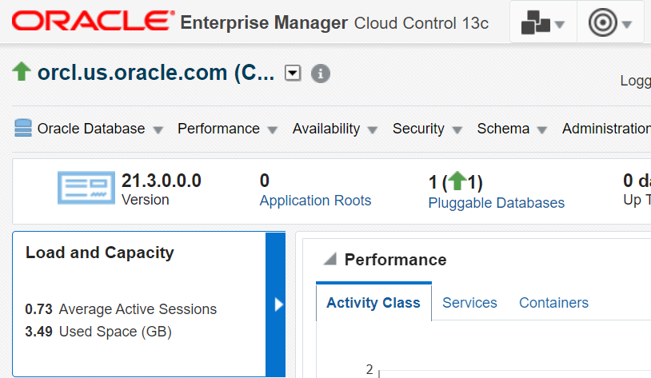

# Shut down and Start up the Database Instance

## Introduction

This lab steps you through the procedure to shut down and start up the Database Instance using SQL commands and Oracle Enterprise Manager Cloud Control (Oracle EMCC) .

Estimated Time: 15 minutes

### Objectives

- Set the environment variables.
- Shut down and start up the Database Instance from SQL command line.
- Shut down and start up the Database Instance from Oracle EMCC. 

### Prerequisites

This lab assumes you have -

-   A Free Tier, Paid or LiveLabs Oracle Cloud account
-   Completed -
    -   Lab: Prepare Setup (*Free-tier* and *Paid Tenants* only)
    -   Lab: Setup Compute Instance
    -   Lab: Initialize Environment
-   Oracle EMCC with Oracle Database 21c and listener added as managed targets.

## Task 1: Set the Environment

To shut down and start the Database Instance using SQL commands, you must set the environment first. 

1.  Log in to your host as *oracle*, the user who can perform database administration.  

2.  Open a terminal window and change the current working directory to `$ORACLE_HOME/bin`.

    ```
    $ <copy>cd /u01/app/oracle/product/21.0.0/dbhome_1/bin</copy>
    ```

3.  Run the command `oraenv` to set the environment variables.  

    ```
    $ <copy>. oraenv</copy>
    ```

4.  Enter Oracle SID `orcl`.  

    ```
    ORACLE_SID = [oracle] ? <copy>orcl</copy>   
    The Oracle base has been set to /u01/app/oracle
    ```
    This command also sets the Oracle home path to `/u01/app/oracle/product/21.0.0/dbhome_1`.

You have set the environment variables for the active terminal session. You can now connect to Oracle Database and run the commands.

**Note**: Every time you open a new terminal window, you must set the environment variables to connect to Oracle Database from that terminal. Environment variables from one terminal do not apply automatically to other terminals.   

Alternatively, you may run the script file `.set-env-db.sh` from the home location and enter the number for `ORACLE_SID`, for example, *3* for `orcl`. It sets the environment variables automatically.

## Task 2: Shut down the Database Instance from SQL Command Line

After setting the environment as instructed in *Task 1* of this lab, you can shut down the Database Instance from SQL command line.

1.  From `$ORACLE_HOME/bin`, log in to SQL Plus as SYSDBA.

    ```
    $ <copy>./sqlplus / as sysdba</copy>
    ```

    ```
    SQL*Plus: Release 21.0.0.0.0 - Production on Tue Nov 28 08:23:15 2021
    Version 21.3.0.0.0

    Copyright (c) 1982, 2021, Oracle.  All rights reserved.

    Connected to:
    Oracle Database 21c Enterprise Edition Release 21.0.0.0.0 - Production
    Version 21.3.0.0.0

    SQL>
    ```

2.  View the current status of Database Instance. Verify that the instance is *OPEN*.  

    ```
    SQL> <copy>select status from v$instance;</copy>    
    ```
    ```    
    STATUS
    ------------
    OPEN
    ```

3.  Close the Oracle Database and shut down the instance in *IMMEDIATE* mode from the SQL prompt.

    ```
    SQL> <copy>shutdown immediate</copy>
    ```
    ```
    Database closed.

    Database dismounted.

    ORACLE instance shut down.
    ```

    The Oracle Database shuts down immediately.

4.  View the current status of the Database Instance. Verify that the Oracle Database is not open.

    ```
    SQL> <copy>select status from v$instance;</copy>
    ```
    ```
    ERROR:
    ORA-01034: ORACLE not available
    ```

    The output confirms that Oracle Database is in closed state. 

    You have now shut down the Database Instance. 

## Task 3: Start the Database Instance from SQL Command Line

To run SQL commands, you must start the Database Instance.

1.  Start the Database Instance again and open Oracle Database from SQL command line.

    ```
    SQL> <copy>startup</copy>
    ```
    ```
    ORACLE instance started
    Total System Global Area 4647288568 bytes
    Fixed Size                  9694968 bytes
    Variable Size            1073741824 bytes
    Database Buffers         3556769792 bytes
    Redo Buffers                7081984 bytes
    Database mounted.
    Database opened.
    ```

    The Database Instance starts in the default mode, *OPEN*.

	**Note:** When you start the CDB, all PDBs remain in the mounted mode. There is no default mechanism to automatically open PDBs when the CDB starts.

2. 	View the current status of the PDBs.

    ```
    SQL> <copy>show pdbs</copy>
    ```
  	```
        CON_ID CON_NAME                       OPEN MODE  RESTRICTED
    ---------- ------------------------------ ---------- ----------
             2 PDB$SEED                       READ ONLY  NO
             3 ORCLPDB                        MOUNTED

  	```

3.  Start all PDBs in your Oracle Database.

    ```
    SQL> <copy>alter pluggable database all open;</copy>
    ```
    ```
    Pluggable database altered.
    ```

    The Database Instance opens all PDBs in the container. 

4.  View the status of the current Database Instance. Verify that the Oracle Database is *OPEN*.

    ```
    SQL> <copy>select status from v$instance;</copy>
    ```
    ```
    STATUS
    ------------
    OPEN  
    ```

You have restarted the Database Instance successfully.

##Task 4: Shut down the Database Instance from Oracle EMCC

Log in to Oracle EMCC from a web browser and shut down the Database Instance as follows.

1.  From the **Targets** menu, select **Databases**.

      

    The Databases page displays a list of Oracle Databases added to Oracle EMCC as managed targets.  
    The values may differ depending on the system you are using.  
      

2.  Click on the Database Instance name, *orcl.us.oracle.com*, to open the instance home page.   
	The values may differ depending on the system you are using.
      

3.  From **Oracle Database** menu, go to **Control** option and select **Startup/Shutdown**.   
	The values may differ depending on the system you are using.

      

    The Host and Database Credentials page appears.  

      

4.  For Host Credentials, specify the following.  

    **Credential**: *Named*  
    Oracle EMCC fills in the **UserName** and **Password** fields automatically.  
    You can click **More Details** and then click **Test** to verify that the specified host credentials are working.  

5.  For Database Credentials, specify the following.  

    **Credential**: *Preferred*. This is the default value selected.  
    **Preferred Credential Name**: *SYSDBA Database Credentials*. This is the credential you assigned during Oracle Database installation.  

    Click **OK** to proceed.  

6.  The window prompts you to confirm the operation. Click **Yes** to initiate the `SHUTDOWN IMMEDIATE` operation on Oracle Database.   
	The values may differ depending on the system you are using.
      

    The Startup/Shutdown Activity Information page appears, informing you that the database is being shut down.   
	The values may differ depending on the system you are using.

      

7.  After a few minutes, click **Refresh** to return to the Database home page.   
	The values may differ depending on the system you are using.

      

The downward red arrow in the status indicates that Oracle Database is down.  

## Task 5: Start the Database Instance from Oracle EMCC

After shutting down Oracle Database in Oracle EMCC, you can start the Database Instance by following the instructions as provided below.

1.  On the instance home page from the **Oracle Database** menu, select **Control** option and click **Startup/Shutdown**.   
	The values may differ depending on the system you are using.

      

    The Host and Database Credentials page appears.

    

2.  For Host Credentials, specify the following.  

    **Credential**: *Named*  
    Oracle EMCC fills in the **UserName** and **Password** fields automatically.  
    You can click **More Details** and then click **Test** to verify that the specified host credentials are working.  

3.  For Database Credentials, specify the following.  

    **Credential**: *Preferred*. This is the default value selected.  
    **Preferred Credential Name**: *SYSDBA Database Credentials*. This is the credential you assigned during Oracle Database installation.  

    Click **OK** to proceed.  

4.  Click **Yes** to start the database in the `OPEN` mode.  

      

    The Startup/Shutdown Activity Information page appears, informing you that the database is being started.  

      

5.  After a few minutes, click **Refresh** to return to the Database home page.   
	The values may differ depending on the system you are using.

    
    The upward green arrow in the status indicates that Oracle Database is up and running.

To learn more about the various start up modes, see [Appendix 1: Overview of Oracle Database Instance and Memory Management](?lab=intro-instance-memory#Appendix1:OverviewofOracleDatabaseInstanceandMemoryManagement) in the *Introduction* lab.


## Acknowledgements

- **Author** - Manisha Mati, Senior User Assistance Developer
- **Contributors** - Suresh Rajan, Manish Garodia, Kurt Engeleiter, Suresh Mohan, Jayaprakash Subramanian, Ashwini R
- **Last Updated By/Date** - Manisha Mati, January 2022
