# Close and open PDBs

## Introduction

This lab shows how to administer the Pluggable Databases (PDBs) in a multitenant Container Database (CDB) from Oracle Enterprise Manager (Oracle EM). You can close one or more PDBs in the database simultaneously. Similarly, you can open one PDB or all the PDBs together in your database.

Estimated time: 10 minutes

### Objectives

Perform these tasks in the CDB from Oracle EM:
 -   Close the PDBs
 -   Open the PDBs

### Prerequisites

This lab assumes you have -

 -   An Oracle Cloud account
 -   Completed all previous labs successfully
 -   Logged in to Oracle EM in a web browser as *sysman*

## Task 1: Close the PDBs in the CDB

Oracle EM provides an option to close PDBs from the database instance home page. This option is not available on the CDB or the PDB home page. Closing a PDB may disrupt any ongoing operations on that PDB.

You can close one PDB in your database or close all the PDBs together in a single step. To close all the PDBs in the CDB, at least one of the PDBs must be open.

In this task, you will close the PDBs, namely *ORCLPDB* and *PDB3*, in the CDB. Before closing a PDB, check its current status. You can open the Databases page from the menu **Targets** &gt; **Databases**. 

1.  On the Database pages, click on the Database Instance name, for example *orcl.us.oracle.com*, to open the instance home page.  
    The values may differ depending on the system you are using.  

	 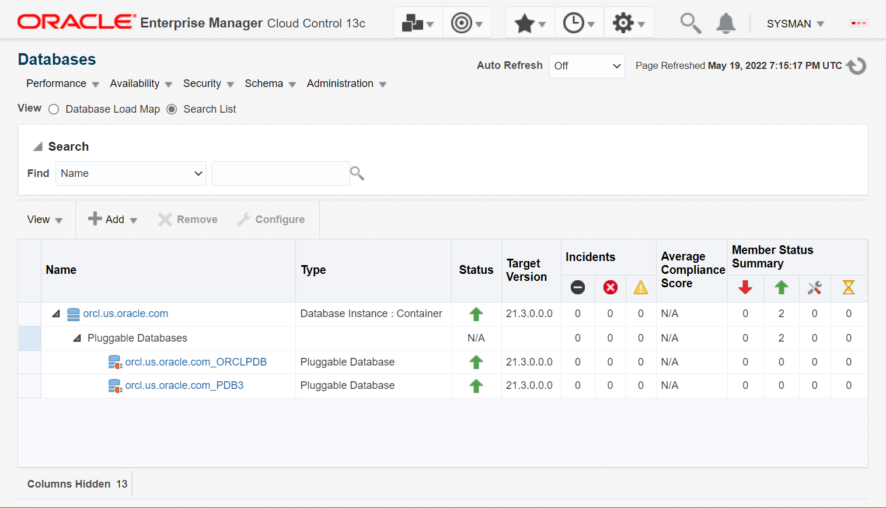

    The green upward arrows in the **Status** field indicate that the database instance and the PDBs are up and running.

	

1.  From the **Oracle Database** menu on the instance home page, select **Control** &gt; **Open/Close Pluggable Database**.  
    The values may differ depending on the system you are using.  

	 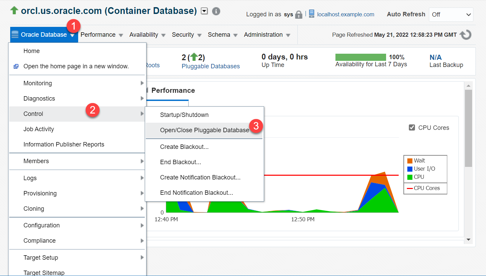

	 

    The values may differ depending on the system you are using.

	 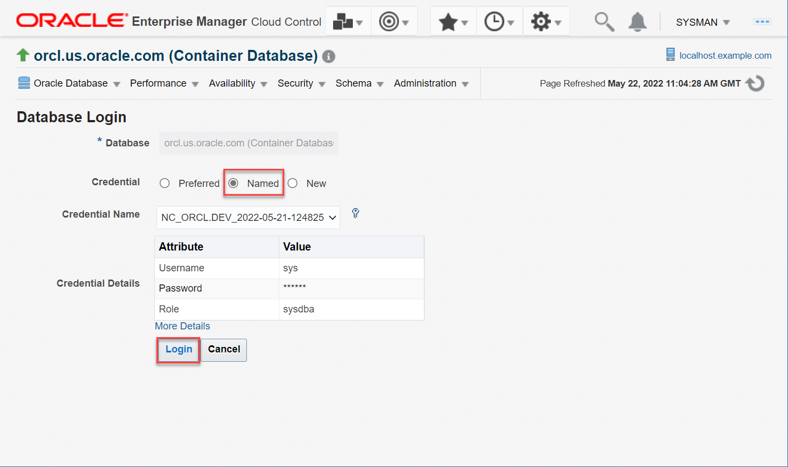

1.  Oracle EM opens the Open and Close PDB page. Verify that it displays all the PDBs in your container.  You can search for a PDB by its name or use the **State** field to view the PDBs that are either *Opened* or *Closed*.   
    The values may differ depending on the system you are using.

	 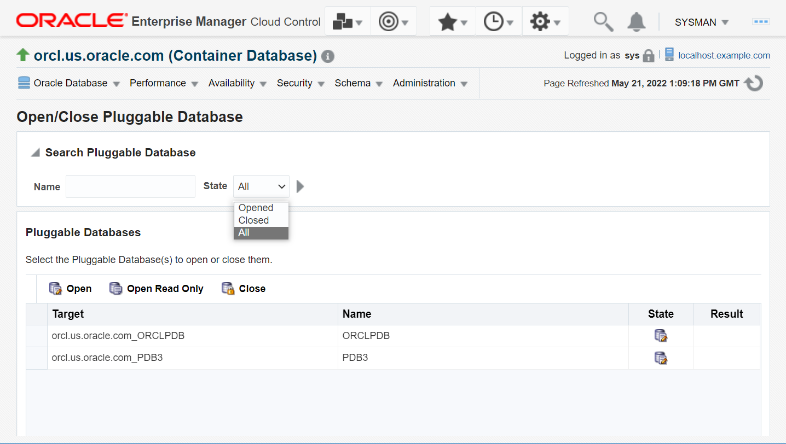

    The table displays the following information for each target PDB:

     -   **Target** - the discovered database system targets
     -   **Name** - the PDB name
     -   **State** - indicates whether the PDB is *Open* (an icon with a pencil) or *Close* (a lock)
     -   **Result** - indicates whether the task that you perform succeeded or not

1.  For the PDBs, the **State** column displays an icon with a pencil. Mouse over the icon and verify that the PDBs are *Open*.   
    The values may differ depending on the system you are using.

	 

     > **Note:** With the **Open Read Only** option, users can run queries on the PDBs to view information but cannot perform transactions on the database, such as create, insert, update, or delete operations. For this lab, do not use this option.  

1.  Select the PDB, *ORCLPDB*, and click **Close** to initiate closing the PDB.   
    The values may differ depending on the system you are using.

	 

     > **Note:** The Open and Close PDB page allows multi-select. Use the **Shift** or the **Ctrl** button to select more than one PDB. You can also use **Ctrl**+**A** to select all the PDBs.  

1.  Oracle EM displays a pop-up window to confirm this activity. Click **Yes** to close the PDB.   

	 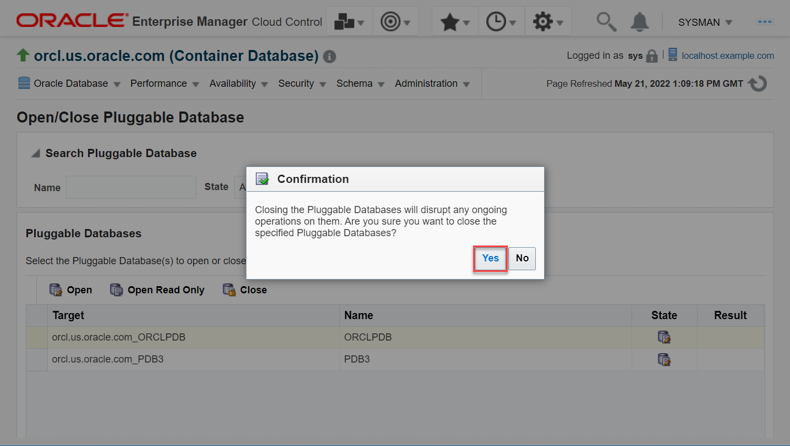

    Oracle EM performs validation and closes the PDB instantly. The icon in the **State** column for *ORCLPDB* changes to a lock and the **Result** column displays a tick mark.   

	 

    You have closed the PDB *ORCLPDB* but the other PDB *PDB3* is still open.  

     > **Note:** If you try closing a PDB which is already in the *Close* state, then the **Result** column displays an icon to indicate that Oracle EM did not perform the task.  

1.  Now close the other PDB. Select *PDB3* and click **Close**.   

	 

1.  On the confirmation window, click **Yes** to close the PDB.  

	 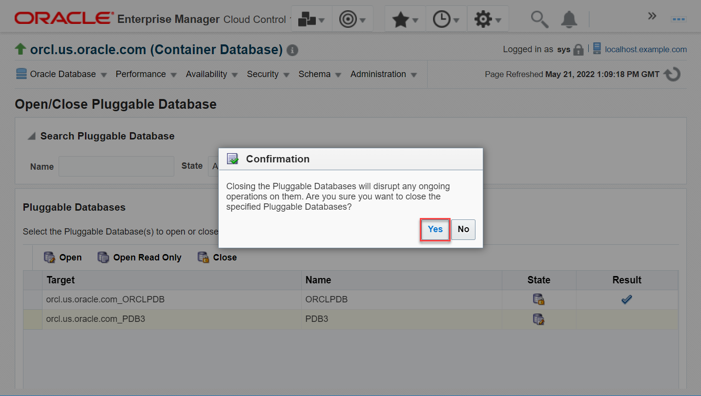

    Oracle EM performs validation and closes the PDB. The **State** column for *PDB3* displays a lock icon and the **Result** column displays a tick mark indicating that the PDB closure task *Succeeded*. 

1.  Mouse over the icons in the **State** column to view that the PDBs are in the *Close* state.  

	 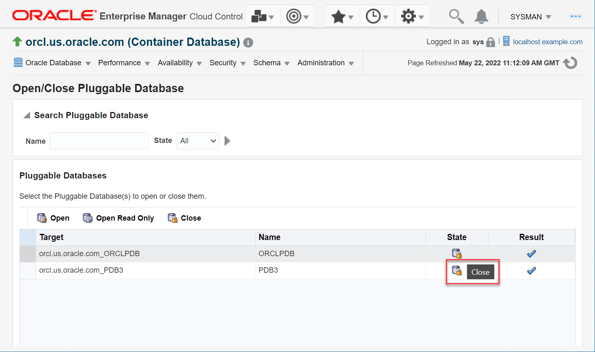

You have closed the PDBs, namely *ORCLPDB* and *PDB3*, in the CDB. Thus, you can close one PDB in your database or close all the PDBs together in a single step. 

Now, try opening these PDBs again from Oracle EM. 

## Task 2: Open the PDBs

Oracle EM provides an option to open PDBs from the database instance home page. You can open one PDB in your database or open all the PDBs together in a single step.

In this task, you will open the PDBs, namely *ORCLPDB* and *PDB3*, in the CDB. Before opening a PDB, check its current status. 

1.  From the **Targets** menu, select **Databases** to open the Databases page.  

	 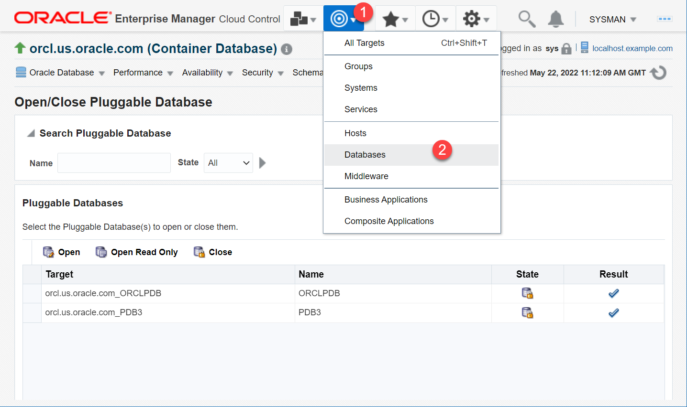

1.  Use the expand/collapse triangle next to the database name to view the PDBs in the database.   

	 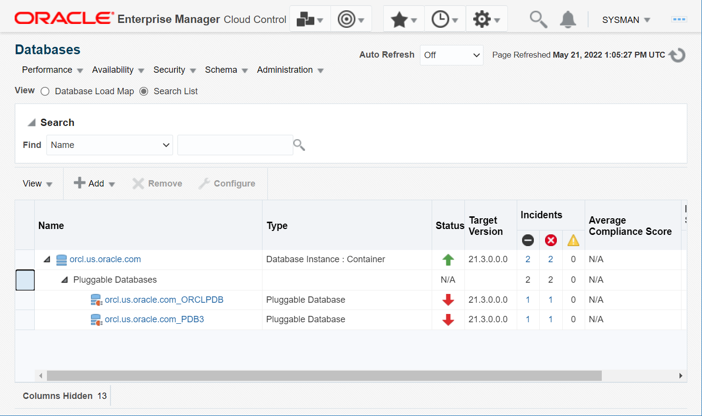

     > **Note:** If you have more PDBs in your database, you will see green upward arrows in the **Status** column for the database instance and for each PDB. However, for *ORCLPDB* and *PDB3*, the **Status** column shows red downward arrows indicating that the PDBs are currently *close*.  

    Now proceed with opening the PDBs. Click on the Database Instance name, for example *orcl.us.oracle.com*, to open the instance home page.  

1.  From the **Oracle Database** menu on the instance home page, select **Control** &gt; **Open/Close Pluggable Database**.  
    The values may differ depending on the system you are using.  

	 

	
	 
	 Oracle EM opens the Open and Close PDB page.   

1.  Select both PDBs, *ORCLPDB* and *PDB3*, and click **Open**.  
    The values may differ depending on the system you are using.  

	 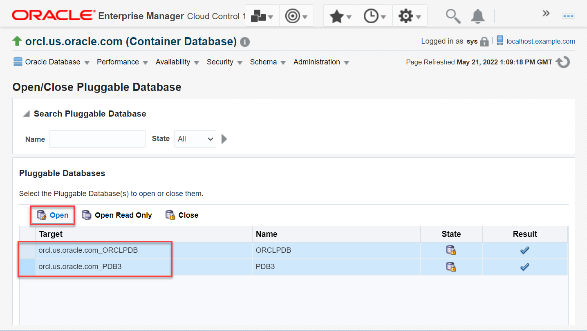

    Oracle EM performs validation and opens the PDBs in the Read Write mode. The **State** column for the PDBs displays an icon with a pencil and the **Result** column displays tick marks. 

1.  Mouse over the icon in the **Result** column to view that the task *Succeeded*.   

	 

     > **Note:** If you try opening a PDB which is already in the *Open* state, then the **Result** column displays an icon to indicate that Oracle EM did not perform the task.  

1.  From the **Targets** menu, select **Databases** to open the Databases page.  

	 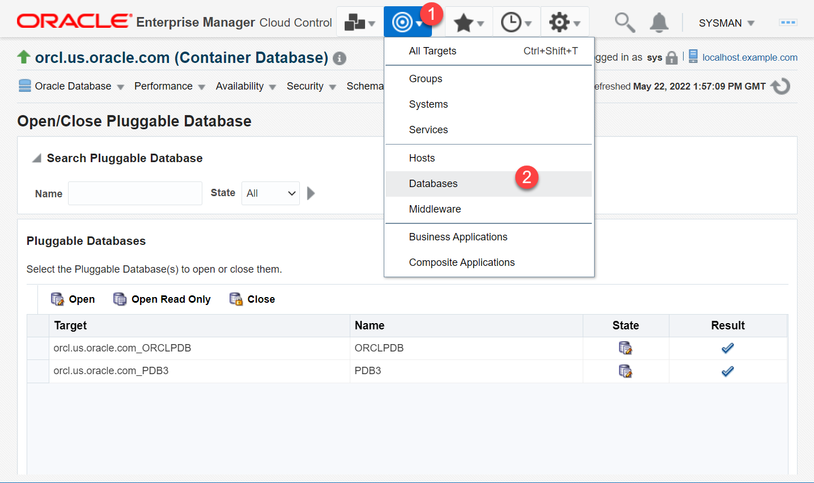

1.  Use the expand/collapse triangle next to the database name to view the current status of the PDBs.   
    The values may differ depending on the system you are using.  

	 

    The green upward arrows in the **Status** field indicate that the database instance and the PDBs are up and running. 

You have opened the PDBs, *ORCLPDB* and *PDB3*. Thus, you can open one PDB in your database or open all the PDBs together in a single step. 

Congratulations! You have successfully completed this workshop on *PDB management and administration in Oracle Database*.

In this workshop, you not only learned different ways of creating new PDBs in the CDB but also how to delete PDBs from the container. You unplugged PDBs from the root container and plugged them back into the container. You also performed PDB administration from Oracle EM, such as closing and opening PDBs in your Oracle Database and checking their current status.  

## Acknowledgements

 -   **Author**: Manish Garodia, Database User Assistance Development team
 -   **Contributors**: Suresh Rajan, Ashwini R, Jayaprakash Subramanian
 -   **Last Updated By/Date**: Manish Garodia, November 2022
