# Provision a Pluggable Database (PDB)

## Introduction

This lab shows how to provision Pluggable Databases (PDBs) in a multitenant Container Database (CDB) from Oracle Enterprise Manager (Oracle EM).  

Estimated time: 30 minutes

### About creating PDBs in Oracle Database

Oracle EM provides various options to create PDBs in a CDB. For example, you can create PDBs from the Seed (*PDB$SEED*) or clone from another PDB. However, the process of creating the PDB and the steps involved are similar no matter which option you select. Oracle EM takes you through a wizard to perform the PDB create operation. 

> **Note:** Another way of creating PDBs is by plugging in an unplugged PDB. To plug a PDB into the CDB, you must have a PDB that is unplugged. You will learn more about these tasks in the subsequent labs.

### Objectives

Perform these tasks from Oracle EM:
 -   Create a new PDB in the CDB from the Seed
 -   Create a PDB by cloning a local PDB
 -   View the newly created PDBs

### Prerequisites

This lab assumes you have -

 -   An Oracle Cloud account
 -   Completed all previous labs successfully
 -   Logged in to Oracle EM in a web browser as *sysman*

## Task 1: Create a new PDB in the CDB from the Seed

Oracle EM provides options to provision PDBs from the database instance home page. These options are not available on the CDB or the PDB home page. 

In this task, you will create a new PDB, namely *PDB1*, in the CDB from the Seed using Oracle EM.

1.  From the **Targets** menu, select **Databases** to open the Databases page.  

	 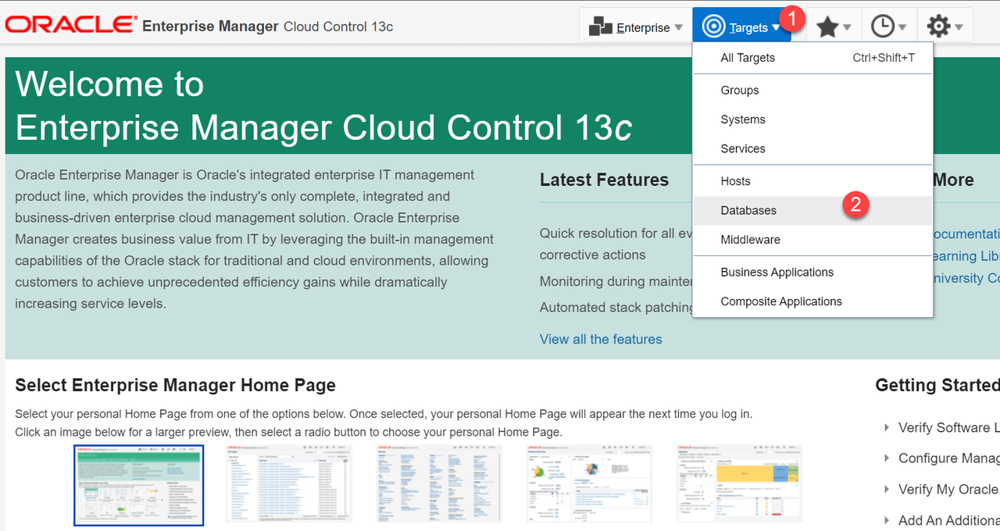

1.  The Databases page displays the discovered database system targets, that is, the Database Instances on the host and the PDBs in each instance.  
    The values may differ depending on the system you are using.  

	 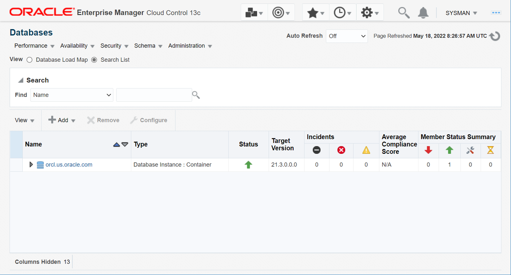

    The green upward arrow in the **Status** field indicates that the database instance is up and running.

	

    Click on the Database Instance name, for example *orcl.us.oracle.com*, to open the instance home page. 

1.  From the **Oracle Database** menu on the instance home page, select **Provisioning** &gt; **Provision Pluggable Databases**. The values may differ depending on the system you are using.  

	 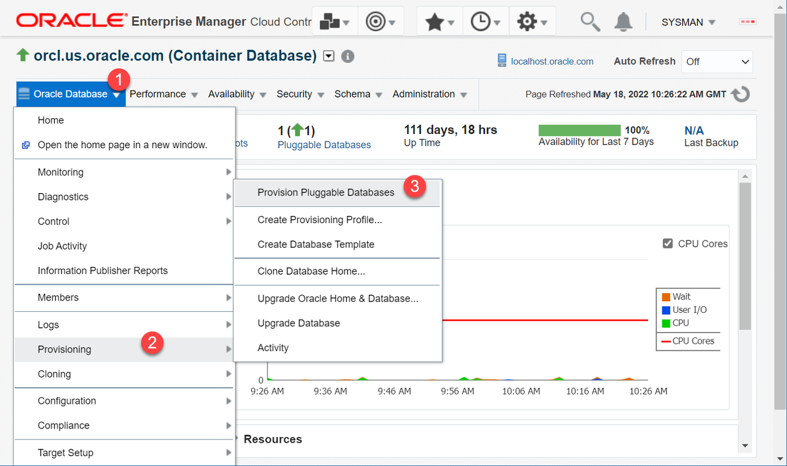

1.  The Provision Pluggable Databases Console opens and displays the options for various PDB operations.  
    Scroll down the page and select **Create New Pluggable Databases**.  
    The values may differ depending on the system you are using.  

	 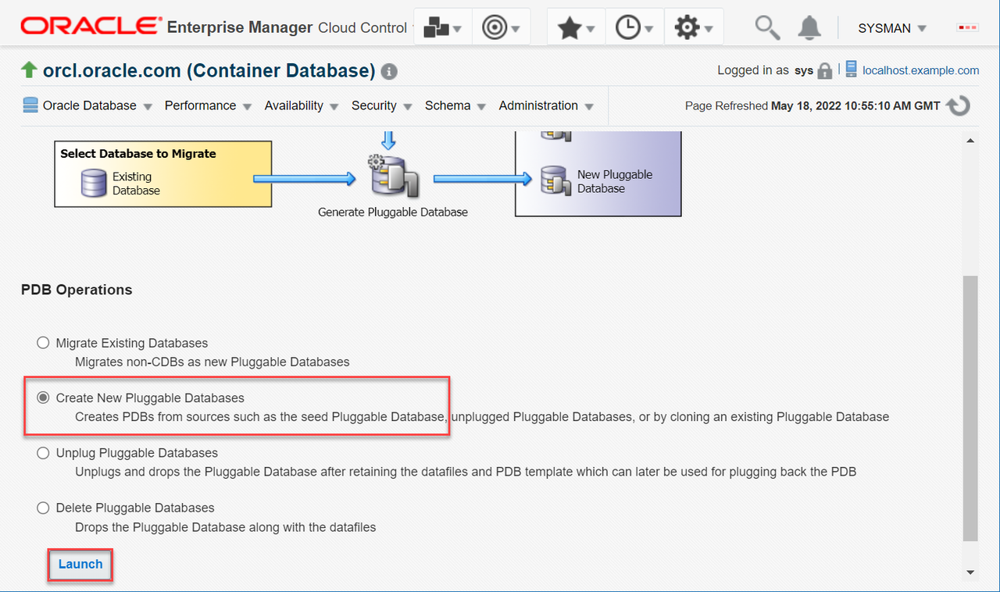

    Click **Launch** to start the PDB create operation.  

	

    The values may differ depending on the system you are using.  

	 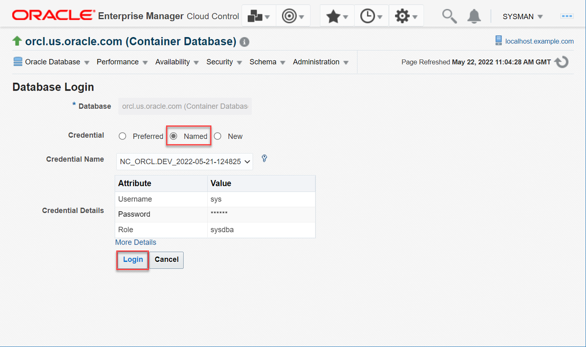

1.  Verify that the PDB Creation page displays the default option, *Create a New PDB*, selected. This option creates a new PDB from the Seed.   
The values may differ depending on the system you are using.  

	 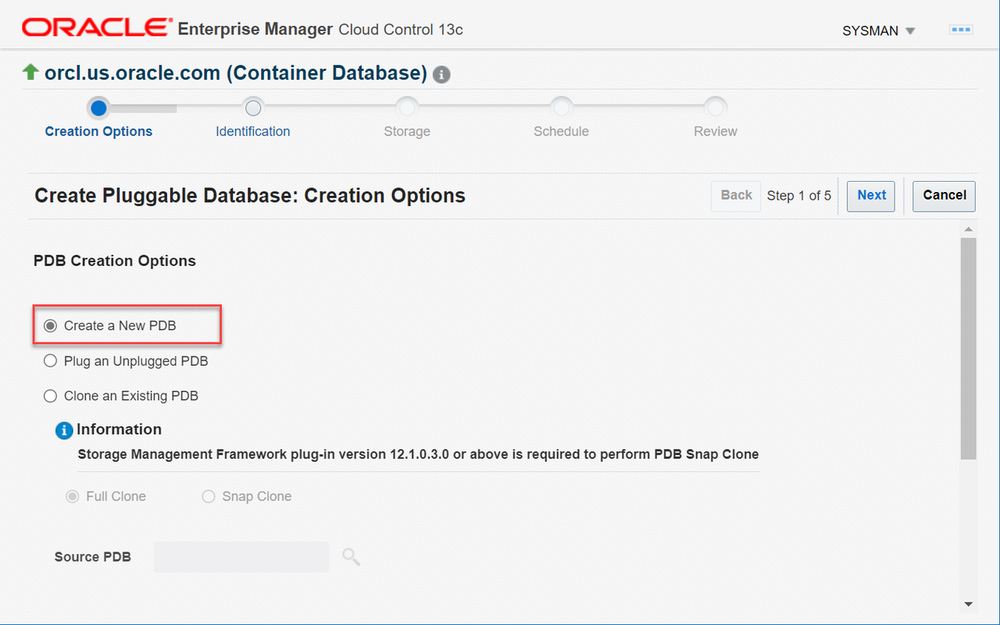

    The PDB Creation page also has other options for creating a PDB. For this task, ignore the other options.   

	

1.  Scroll down the page. Under **Container Database Host Credentials**, select the *Named* Credential option, if not already selected. The values may differ depending on the system you are using.  

	 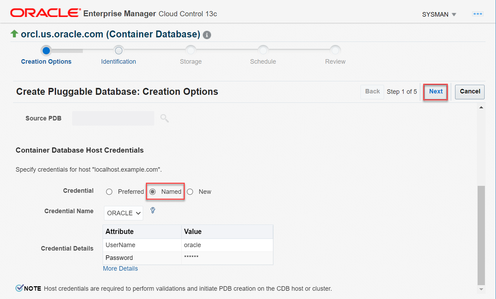

	

    Click **Next** to proceed.  

1.  On the Identification page, you will see a PDB name automatically assigned.  

	 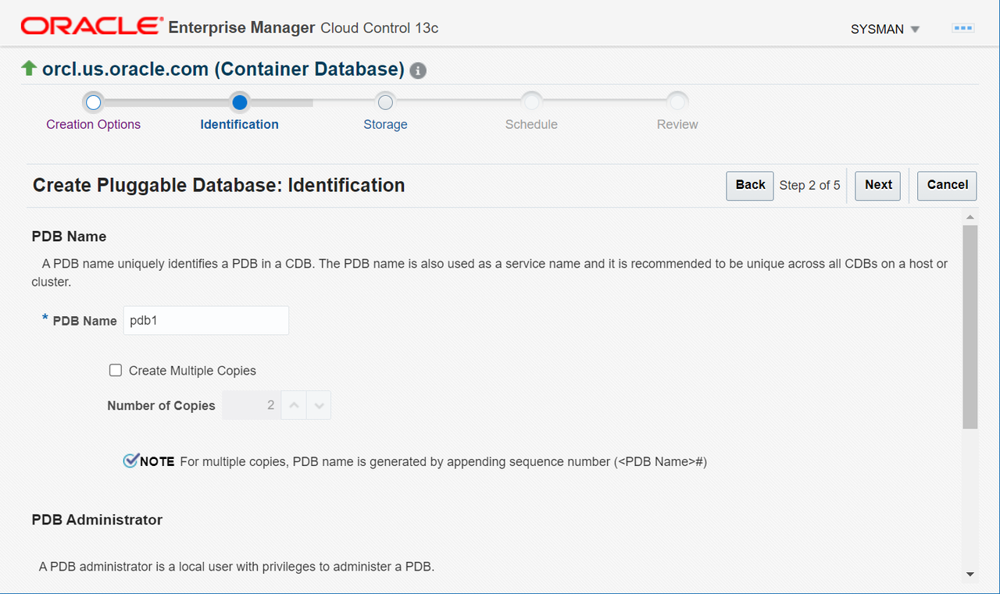

    For this lab, specify the following:  
     - **PDB Name** - Delete the default text and enter a unique name for the PDB you are creating. For this task, enter *PDB1*.  
		 

     - **Create Multiple Copies** - Do not select this check box and create only one PDB in the database.   
    You can create up to *252* PDBs in a CDB. 

1.  Enter the login credentials for the administrative user.  

	 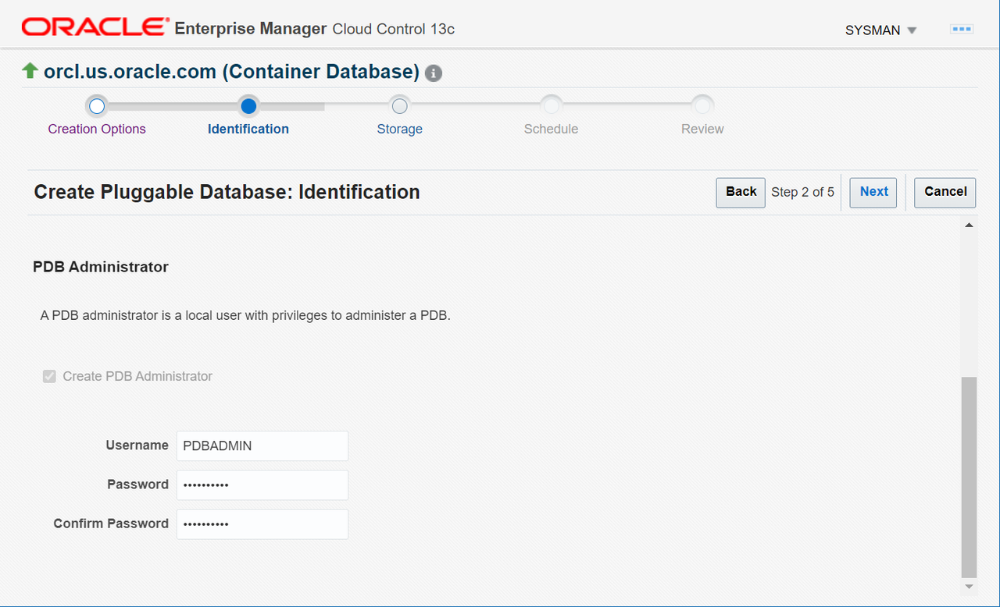

    Specify the following:  
     - **Username** - *PDBADMIN*   
	 This is the default administrative user who will manage the PDB. Though Oracle EM allows you to modify the user name, for this lab, leave the default value.  

     - **Password** - Set a password, for example, *mypassword*  
    Ensure to note this password because when you log in to the PDB as *PDBADMIN*, you require this password.  

	 

    Click **Next** to proceed.  

1.  You can select the storage options for the PDB, such as the storage type, the location to store data files and temporary files, and so on.  

	 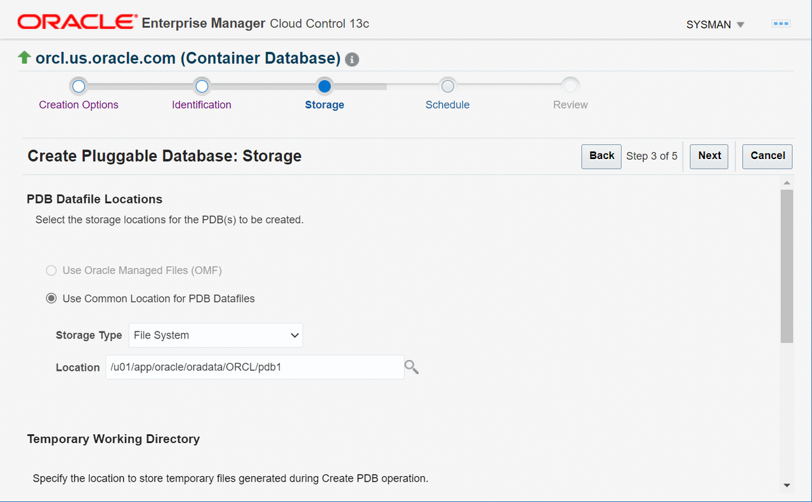

    For this lab, leave the default storage options.   

	 

	 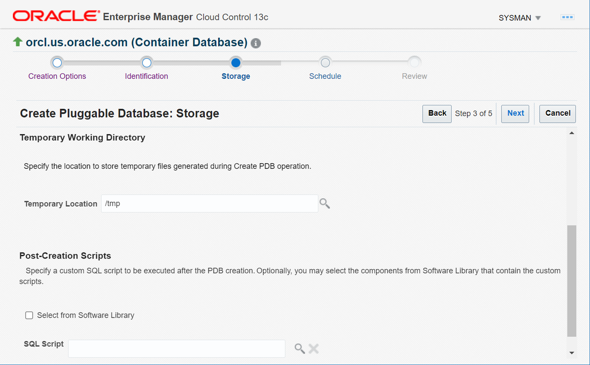

    Click **Next** to proceed.  

1.  Oracle EM takes a while to validate and prompts to schedule the create operation.

	 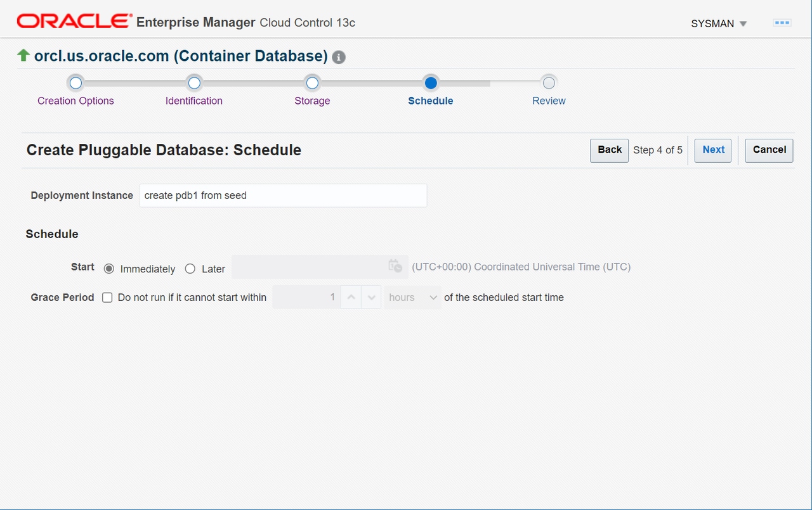

    Specify the following:  

     - **Deployment Instance** - Delete the default text and enter a unique name, *create pdb1 from seed*.  
		 

		> **Note:** If the instance name already exists, then Oracle EM returns a validation error. You cannot create procedures in Oracle EM with duplicate names.   

     - **Start** - Leave the default, *Immediately*, to run the procedure now.   

	

    Click **Next** to proceed.  

1.  The Review page displays a summary of the PDB create operation. For example, the container database name, the PDB name which you entered, the host details, the storage options, and so on.    
	The values may differ depending on the system you are using.  	

	 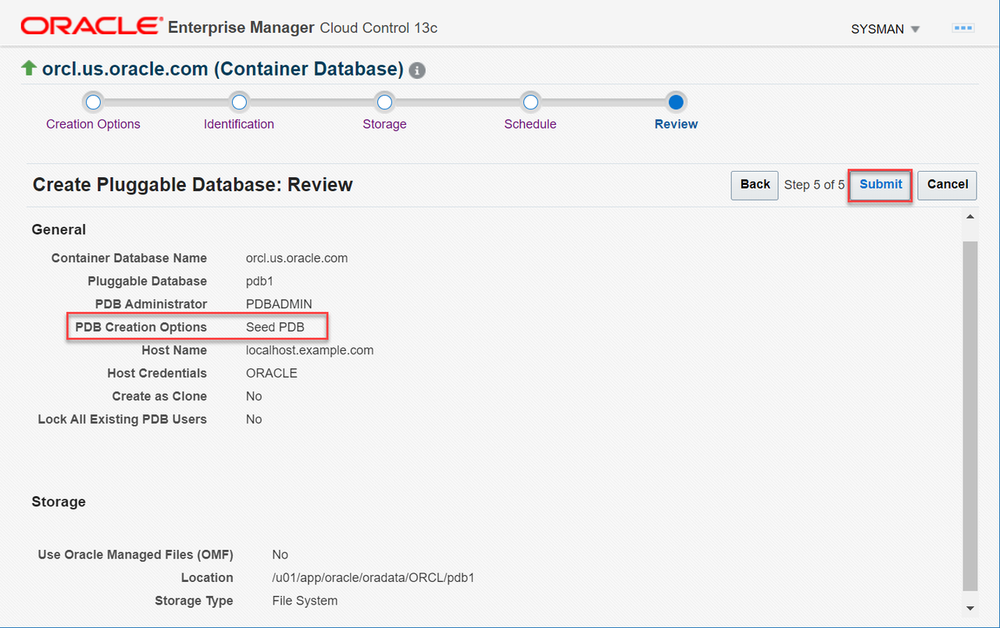

    Verify that the **PDB Creation Options** field displays *SEED PDB*.   
    Review the details and click **Submit** to start creating the PDB.  

1.  Oracle EM displays a confirmation pop-up.   

	 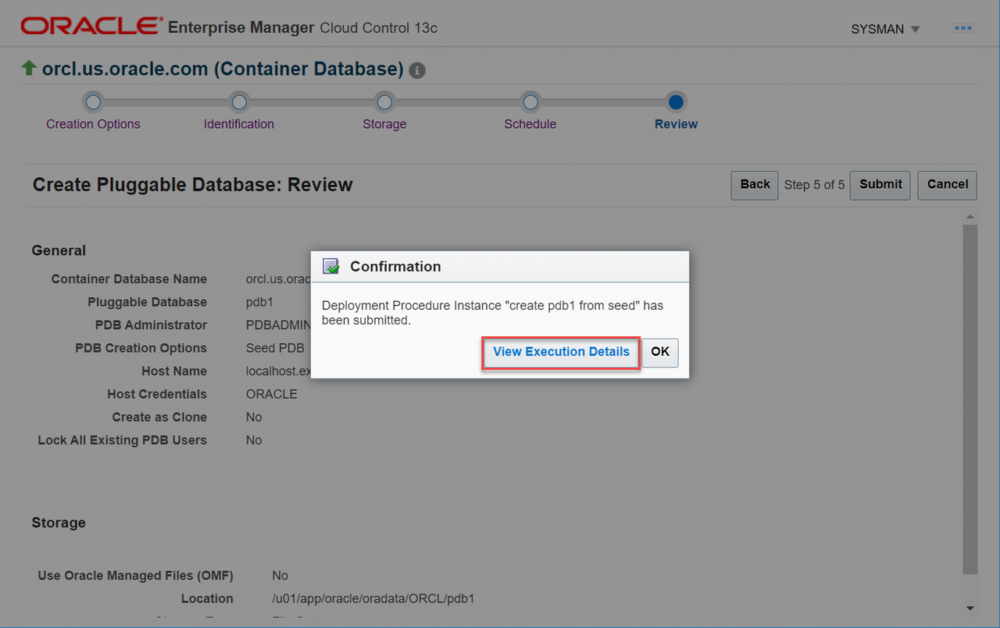

    Click **View Execution Details** to open the Procedure Activity page and view the status of the procedure. 

     > **Note:** If you click **OK**, then Oracle EM goes to the Provision Pluggable Databases page.   
	
	The Procedure Activity page contains detailed steps of the PDB operation. After the PDB is created, the **Status** field changes from *Running* to *Succeeded*.   
	The values may differ depending on the system you are using.  

	    

	

You have created *PDB1* in the CDB from the Seed. The PDB is open in the `Read Write` mode. You can view the newly created PDB in Oracle EM from the Databases page. 

Now, try creating a new PDB using another method, that is, by cloning an existing PDB in the local container. 

## Task 2: Create a PDB by cloning an existing PDB

Oracle EM provides options to provision PDBs from the database instance home page. These options are not available on the CDB or the PDB home page. The PDB cloning procedure contains a prerequisite step that checks for plug compatibility. The default setting for this step in Oracle EM is disabled. 

In this task, you will clone a local PDB using the full clone method to create a new PDB, namely *PDB2*, in the CDB using Oracle EM.

1.  From the **Targets** menu, select **Databases** to open the Databases page.  

	 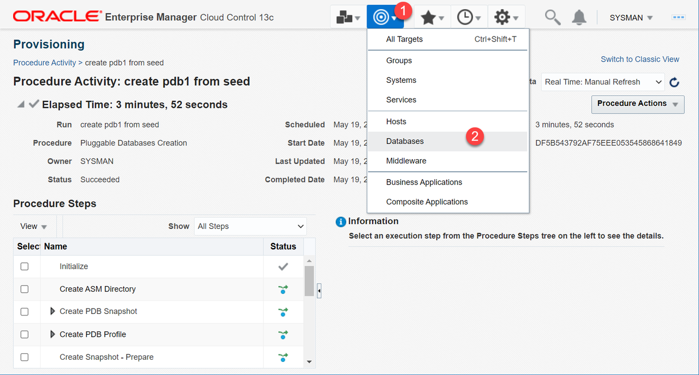

1.  The Databases page displays the discovered database system targets.  
    The values may differ depending on the system you are using.  

	 

    Click on the Database Instance name, for example *orcl.us.oracle.com*, to open the instance home page. 

1.  From the **Oracle Database** menu on the instance home page, select **Provisioning** &gt; **Provision Pluggable Databases**. The values may differ depending on the system you are using.  

	 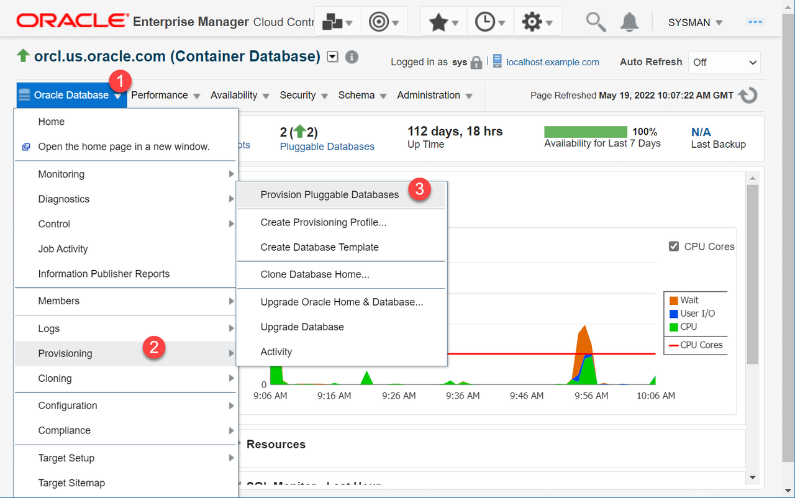

1.  The Provision Pluggable Databases Console opens and displays the options for various PDB operations.  
    Scroll down the page and select **Create New Pluggable Databases**.  
    The values may differ depending on the system you are using.  

	 

    Click **Launch** to start the PDB clone operation.  

	
	
1.  On the PDB Creation page, select the option *Clone an Existing PDB*. This option creates a clone of an existing PDB.  
    The page displays the default option *Full Clone* selected.  

    For creating a clone, you need to specify a **Source PDB**. Click on the magnifier icon next to this field to search and select the source PDB. The values may differ depending on the system you are using. 

	 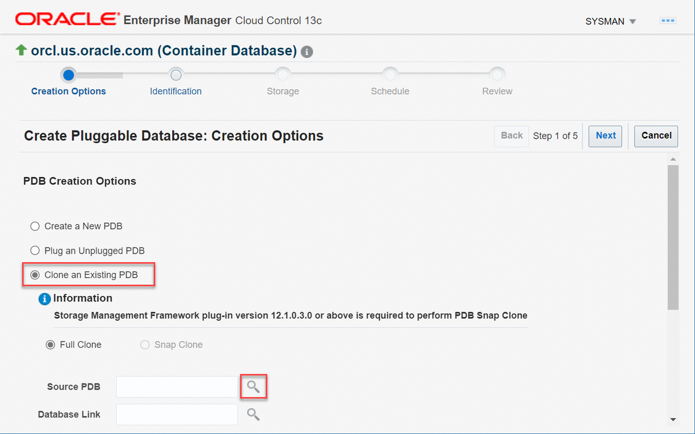

     > **Note:** Though you can type the PDB name in this field, Oracle recommends that you use the Search and Select PDB option.

    The PDB Creation page also has other options for creating a PDB. For this task, ignore the other options.   

1.   Oracle EM opens a pop-up to search and select the existing PDBs in the database. Select the PDB from the table that you want to clone. The values may differ depending on the system you are using.  

	 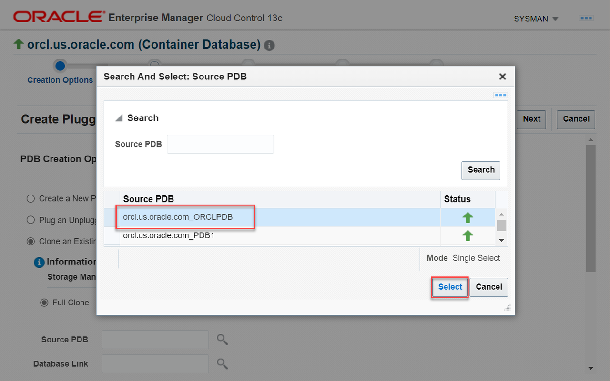

    The green upward arrows in the **Status** field indicate that the PDBs are up and running. 

	 > **Note:** This window allows single-select, which means you can select only one source PDB.   

    For this task, select *ORCLPDB* and click **Select** to proceed. The window goes back to the PDB Creation page.  

1.  Verify that the **Source PDB** field displays the PDB name you selected. Leave the **Database Link** field blank. For this task, it is not applicable.  
    Scroll down the page. Under **Container Database Host Credentials**, select the *Named* Credential option, if not already selected. The values may differ depending on the system you are using.  

	 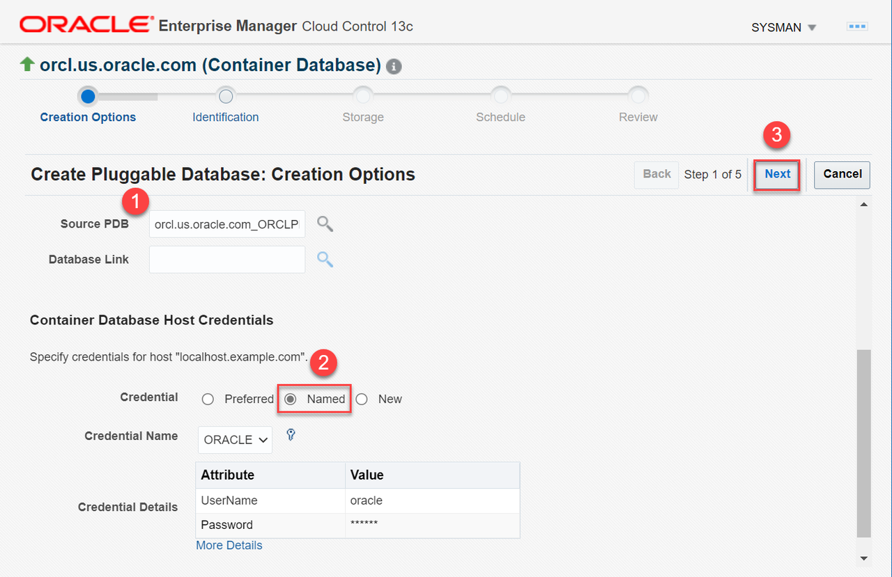

    Click **Next** to proceed.  

1.  On the Identification page, you will see a PDB name automatically assigned.  

	 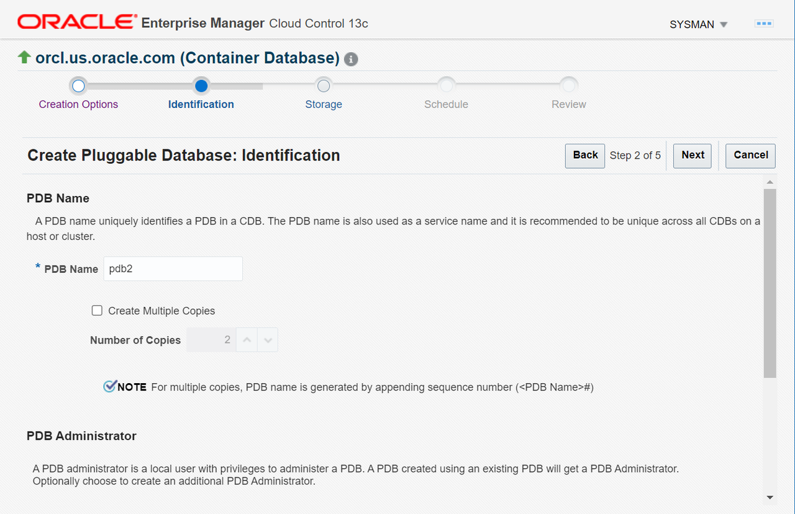

    Specify the following:  
     - **PDB Name** - Delete the default text and enter a unique name for the PDB you are cloning. For this task, enter *PDB2*.

     - **Create Multiple Copies** - Do not select this check box. For this lab, create only one PDB in the database.   
    You can create up to *252* PDBs in a CDB. 

1.  Select the **Create PDB Administrator** option to create a new administrative user account for the PDB.   
    If you want to use the administrative user account of the source PDB, then do not select this option.  
    The values may differ depending on the system you are using.  

	 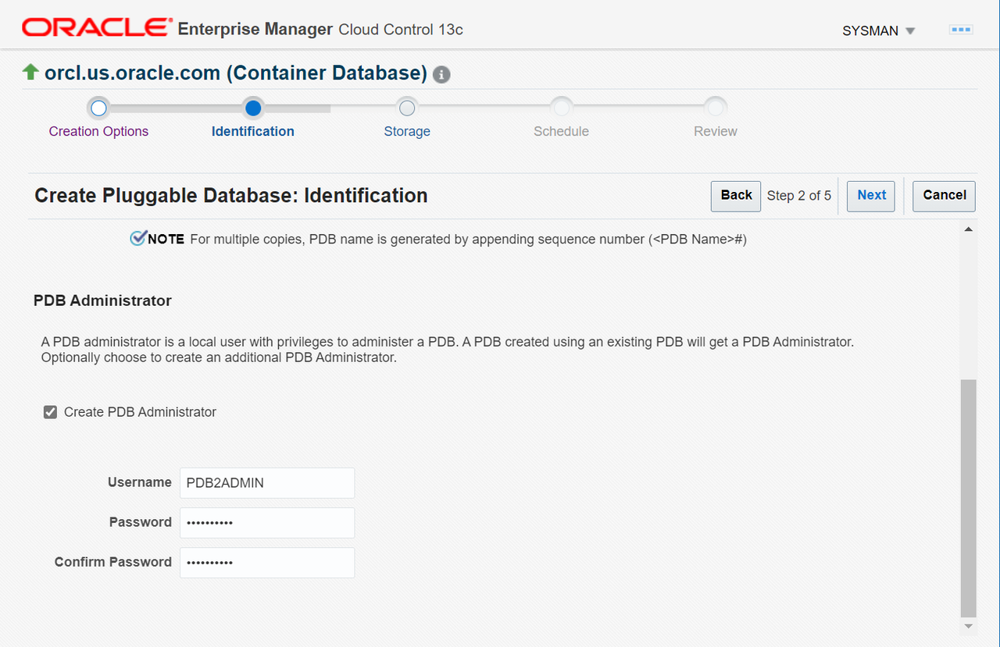

    Enter the login credentials for the new administrative user.  

     - **Username** - *PDB2ADMIN*  
     - **Password** - Set a password, for example, *mypassword*  
    Ensure to note this password because when you log in to the PDB as *PDB2ADMIN*, you require this password.  

	 

	Optionally, Oracle EM may display a section for the Source CDB Login Credentials. If you are cloning the source PDB into the same root container, then Oracle EM does not display this section.

    Click **Next** to proceed.  

1.  Select the storage options for the PDB, such as the storage type, the location to store data files and temporary files, and so on.  

	 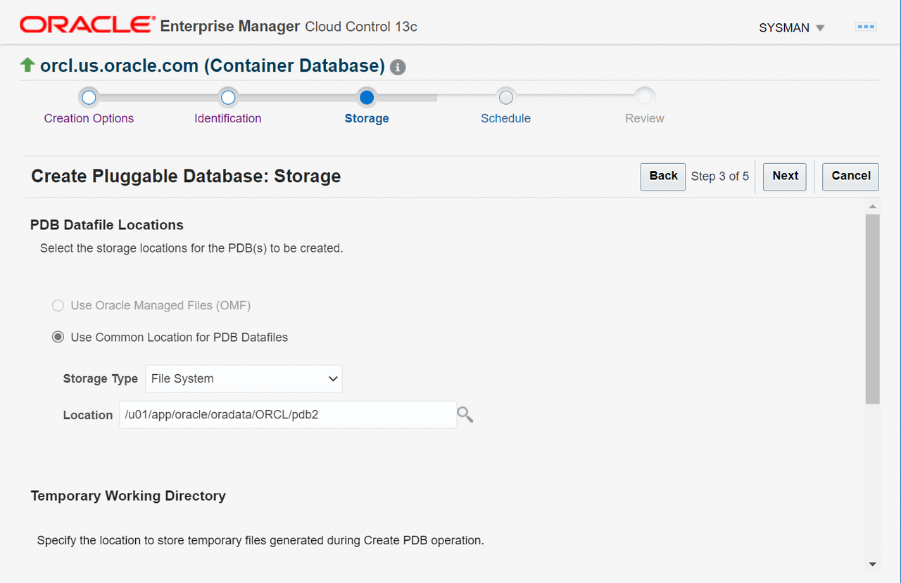

    For this lab, leave the default storage options.

	 

	 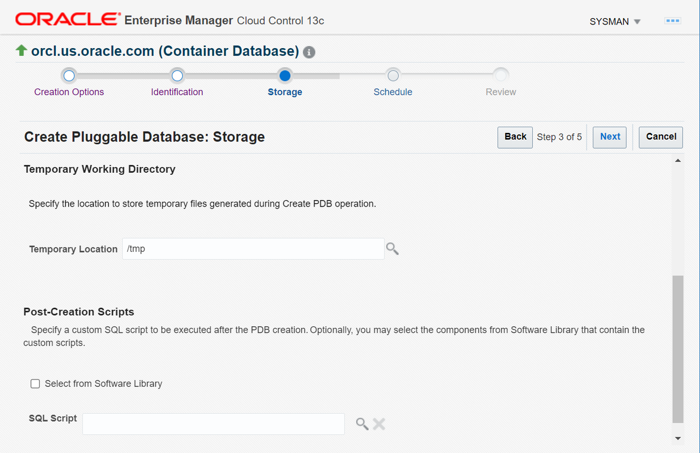

    Click **Next** to proceed.  

1.  Oracle EM takes a while to validate and prompts to schedule the clone operation.  

	 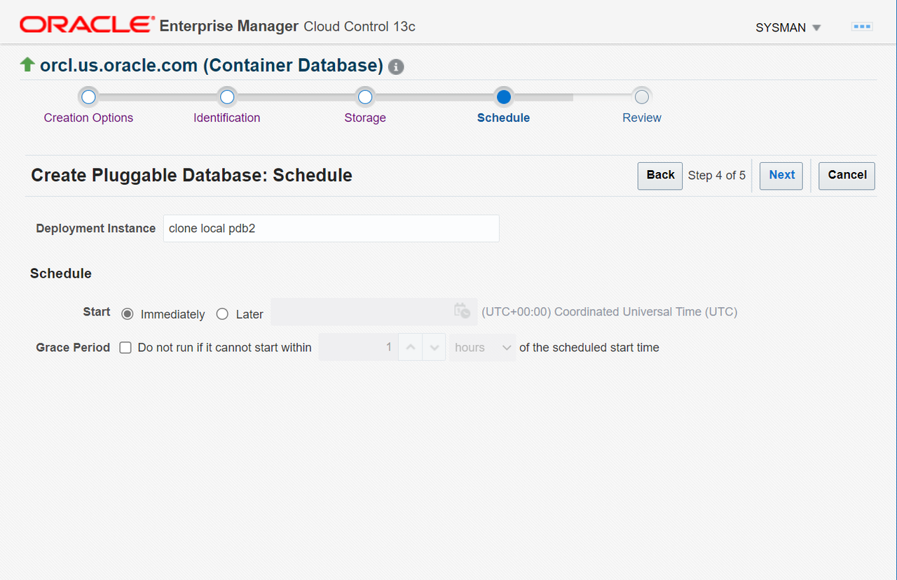

    Specify the following:  

     - **Deployment Instance** - Delete the default text and enter a unique name, *clone local pdb2*.  
		 
     - **Start** - Leave the default, *Immediately*, to run the procedure now.  

    For this lab, do not select the grace period option.   
    Click **Next** to proceed.  

1.  The Review page displays a summary of the PDB clone operation. For example, the container database name, the PDB name which you entered, the host details, the storage options, and so on.   
	The values may differ depending on the system you are using.

	 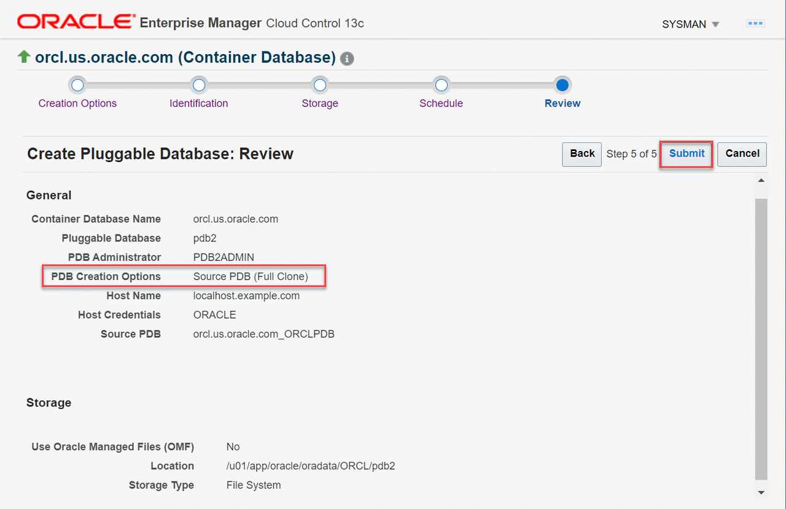

    Verify that the **PDB Creation Options** field displays *Source PDB (Full Clone)*.   
    Review the details and click **Submit** to start cloning the PDB.  

1.  Oracle EM displays a confirmation pop-up.   

	 

    Click **View Execution Details** to open the Procedure Activity page and view the status of the procedure.   

     > **Note:** If you click **OK**, Oracle EM goes to the Provision Pluggable Databases page.  

    The Procedure Activity page contains the detailed steps of the PDB operation. After the PDB is created, the **Status** field changes from *Running* to *Succeeded*.  
    The values may differ depending on the system you are using.  

	 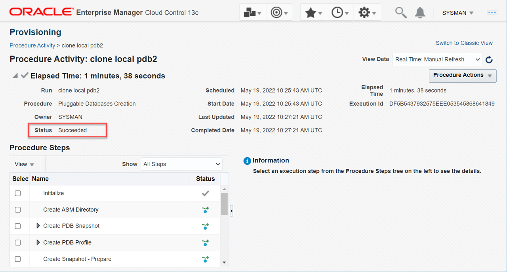

You have created *PDB2* in the same container by cloning the local PDB, *ORCLPDB*. The PDB is open in the `Read Write` mode. 

Now, view the newly created PDBs that you created in the above tasks.  

## Task 3: View the newly created PDBs

After creating the PDBs in the above tasks, you can check that Oracle Database displays the newly created PDBs. 

In this task, you will view the new PDBs, namely *PDB1* and *PDB2*, in your database.

1.  From the **Targets** menu, select **Databases** to open the Databases page.   
    The values may differ depending on the system you are using.  

	 

1.  The Databases page displays the discovered database system targets. 

	Click on the expand/collapse triangle next to the instance name, for example *orcl.us.oracle.com*, where you created the PDBs. The values may differ depending on the system you are using.  

	 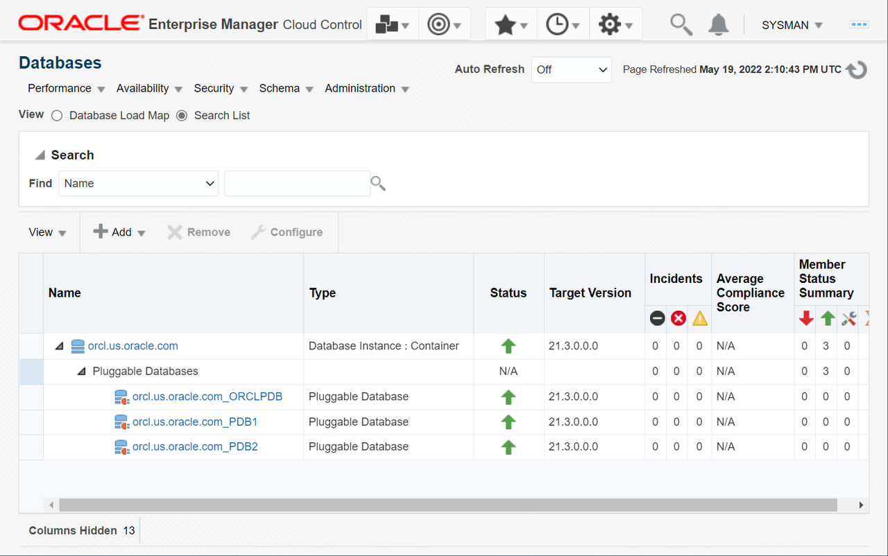

    The Databases page displays the new PDBs, namely *PDB1* and *PDB2*, along with the existing PDB, *ORCLPDB*. The green upward arrows in the **Status** field indicate that the database instance and the PDBs are up and running. 

In this lab, you learned different ways of creating PDBs, such as using the Seed and cloning another PDB in the root container. After creating the PDBs, you viewed the new PDBs in the database instance. You can also delete PDBs and remove them from the database. 

You may now **proceed to the next lab**.

## Acknowledgements

 -   **Author**: Manish Garodia, Database User Assistance Development team
 -   **Contributors**: Suresh Rajan, Ashwini R, Jayaprakash Subramanian
 -   **Last Updated By/Date**: Manish Garodia, November 2022
