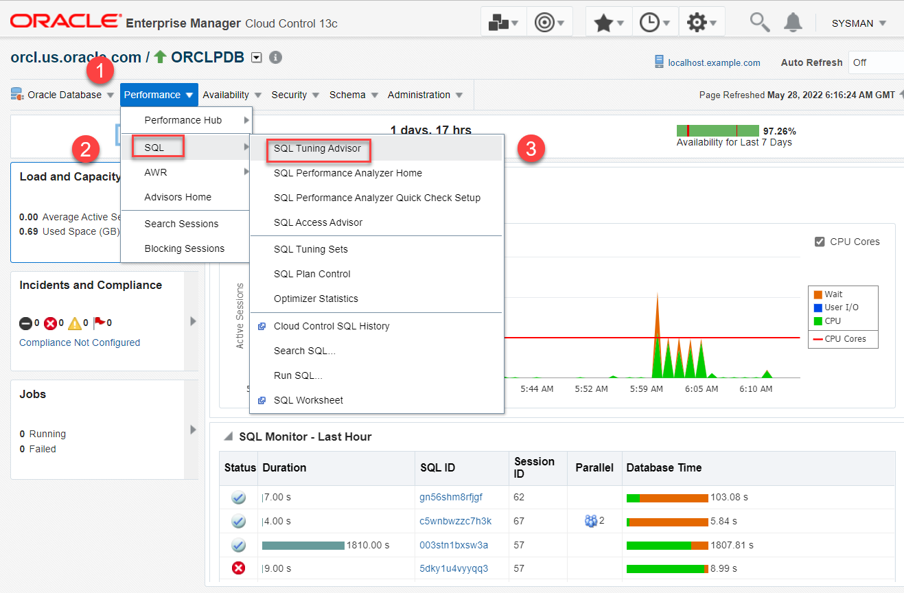
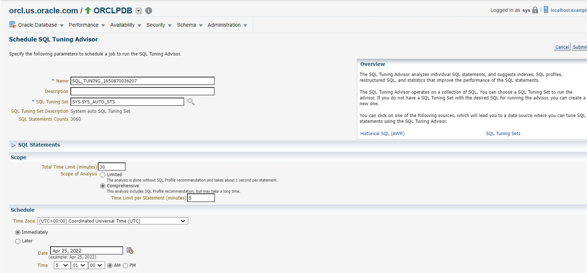
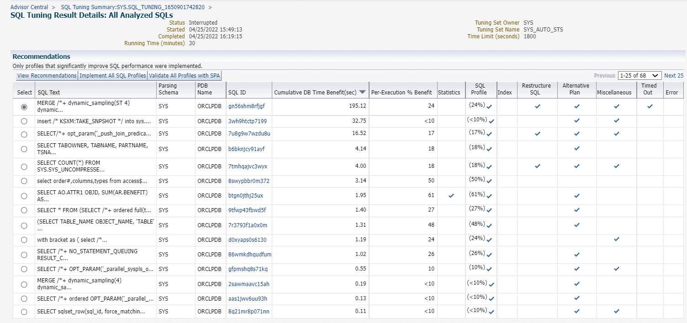
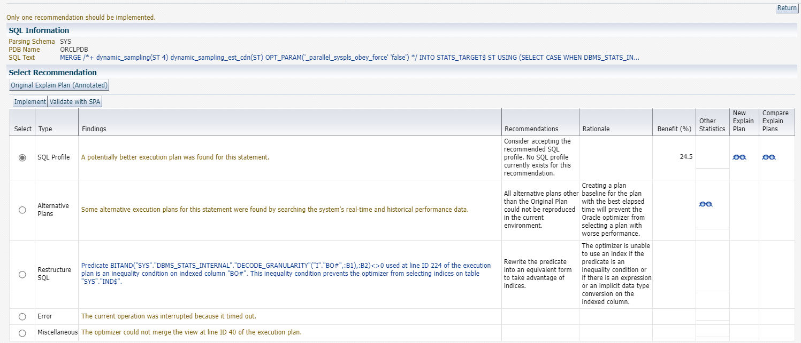
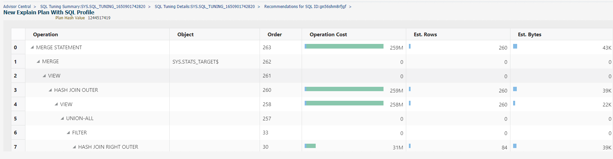
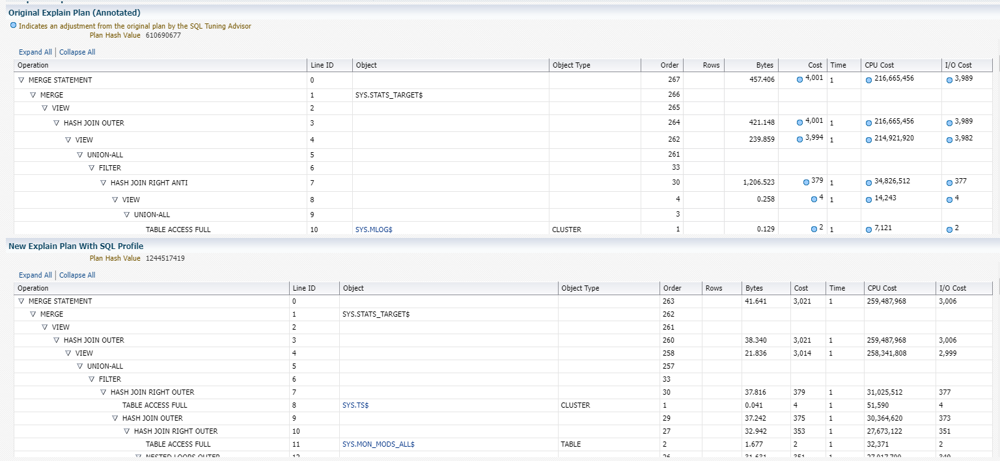
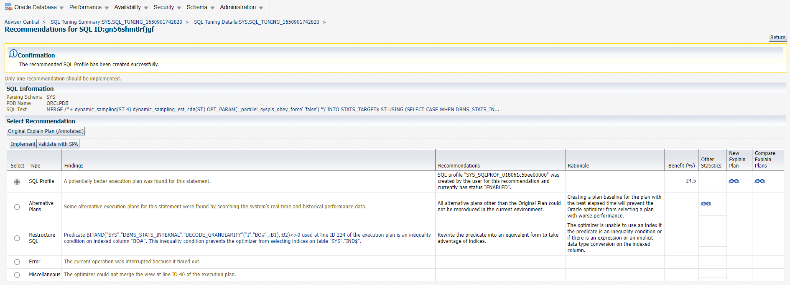

# Diagnose problems and improve performance using SQL Tuning Advisor

## Introduction

This lab shows the steps for diagnosing problems in Oracle Database 21c and improving performance using Automatic SQL Tuning Advisor from Oracle Enterprise Manager Cloud Control (Oracle EMCC). 

Estimated time: 45 minutes

### Objectives

Diagnose problems and improve performance using Automatic SQL Tuning Advisor from Oracle EMCC.

### Prerequisites

This lab assumes you have -

-   A Free Tier, Paid or LiveLabs Oracle Cloud account
-   Completed -
    -   Lab: Prepare setup (*Free-tier* and *Paid Tenants* only)
    -   Lab: Setup compute instance
    -   Lab: Initialize environment
-   Logged in to Oracle EMCC in a web browser as *sysman*

## Task 1: Configure Automatic SQL Tuning Advisor

In this lab, configure Automatic SQL Tuning Advisor to implement SQL profile recommendations automatically.

1.  From the **Targets** menu, select **Databases**.

    

    The Databases page displays a list of Oracle Databases added to Oracle EMCC as managed targets.   
    The values may differ depending on the system you are using.

    

2.  Select the View drop-down and change the view to **Expand All Below**.

    

3.  Click on the Pluggable Database (PDB) *orclpdb*.   
    The values may differ depending on the system you are using.

	

    It opens the PDB home page.

4.  From the **Performance** menu, go to the **SQL** option, and select **SQL Tuning Advisor**.

	

5.  The Schedule SQL Tuning Advisor wizard appears.

     

	Specify the following to schedule a job and run the SQL Tuning Advisor.

     - **Name**: Leave the default value
     - **Description**: You can enter a brief note about the job
     - **SQL Tuning Set**: Click the magnifier icon and select *`SYS_AUTO_STS`* from the list.

    Under Scope, specify the following for this lab:
     - **Total Time Limit (minutes)**: *30*  
     - **Scope of Analysis**: *Comprehensive* 
	 - **Time Limit per Statement field**: *5*

    You can schedule the SQL Tuning Advisor to analyze the SQL statements. 

     - **Schedule**: For this lab, leave the default *Immediately*

    Click **Submit** to run the job. SQL Tuning Advisor starts tuning the SQL statements.

    

    A processing dialog box appears which displays the status of the tuning task. The SQL Tuning set you select runs the Advisor which analyzes the individual SQL statements and displays the progress of the analysis.

    

    After the SQL Tuning Advisor finishes the analysis of the SQL statements, the **Status** of the SQL Tuning Advisor task changes to *Completed*. 
	
	If the Advisor is unable to analyze all the SQL statements, the task is still complete after it reaches the time limit, however the status of the task is interrupted. It displays the results of the SQL statements that the Advisor was able to analyze within the given time frame.

     > **Note**: You can click **Interrupt** to stop the task. Clicking **Cancel** or closing the page will not stop the task run by the Advisor.

    After the Status is complete, you can view the SQL Tuning result summary page. It displays the graphical summary of the Automatic SQL Tuning Advisor activity.

     - It shows the count of SQL statements the Advisor analyzed in the task.  

     - It also displays the SQL Profile Potential DB Time Benefit chart. The benefit of the SQL profile recommendations in DB time (in seconds) is displayed in bar charts. The bar charts have before and after bars, which denote the actual DB time and improved DB time respectively.  

     - The SQL Examined Status pie chart displays the status of SQL statements the Advisor examined with findings, without findings, and skipped due to errors. You can click the legends of the pie chart to view the summary of the tuning recommendation for the SQL Statements for the selected type. Close the summary window.  

     - The Breakdown By Finding Type bar chart displays the count of SQL statements on the basis of the SQL Profile, Index, Statistics, Restructure SQL and Alternative Plan. Click on the bar to view the summary of the tuning recommendations for the selected bar. Close the summary window. 

    The values may differ depending on the system you are using.

    

6.  Click on **Show all results** to view the summary of the tuning recommendations for all the SQL statements analyzed. You can view the summary of the tuning recommendations the Advisor provides during the time frame you select. 

	For this lab, the time frame is 30 minutes. The values may differ depending on the system you are using.

    

7.  Select **View Recommendations** to view the details about the recommendation provided. It displays an overview of the recommendations. The different types of recommendation are SQL Profile, Alternative Plans, Restructure SQL, Error and Miscellaneous. The Select Recommendation table lists the following information on the type of recommendation you select:

    - **Findings**: The analysis of the recommendation.  
    - **Recommendation**: The recommendation advised by the Advisor.   
    - **Rationale**: The justification of the recommendation.  
    - **Benefit (%)**: The estimated performance benefit calculated in percentage.  
    - **Other Statistics** : It displays an Other Statistics icon. 
    - **New Explain Plan**: It displays a New Explain Plan icon. 
    - **Compare Explain Plan**: It displays a Compare Explain Plan icon. 

    

8.  Click on the **Original Explain Plan** button in the Select Recommendation table to view the current execution plan of the statement generated by the system.

    The values may differ depending on the system you are using.

    

	Close this window. 

9.  Click on the **Other Statistics** icon in the Select Recommendation table to view the Alternative Plan page. An alternate execution plan of the statement is generated by the system's real time and historical performance data.

    The values may differ depending on the system you are using.

    

	Close this window. 

10.  Select **Create SQL Plan Baseline** to create a SQL plan baseline for the alternative plan. The Oracle optimizer will pick the alternative plan for the statement in the future.

11.  Click on the **New Explain Plan** icon in the Select Recommendation table to view the steps of execution of the New Plan.

    The values may differ depending on the system you are using.

    

12.  Click on the **Compare Explain Plan** icon in the Select Recommendation table to view the Original Explain Plan and New Explain Plan. The Plans are in tabular format which shows the comparison between the Original Explain Plan and New Explain Plan.

    The values may differ depending on the system you are using.

    

13.   Go back to the **Select Recommendation** table and continue.

    > **Note:** The database advises that you can implement only one recommendation. You must select the recommendation with the maximum benefit.

    

    For this lab, select **SQL Profile** and click **Implement**.

	A confirmation message appears asking you to confirm the initiation of implementation.

    

    Select **Yes** to proceed with the implementation.

14.  The Recommendations for the SQL ID you select appears with the confirmation message that the recommended SQL Profile is created successfully.

      

	You can learn more about this task from [SQL Tuning Advisor in Oracle Cloud Infrastructure Database Management](https://www.youtube.com/watch?v=WwEADRBqmAc).

Congratulations! You have successfully complete the workshop on *monitoring and tuning the Oracle Database*. 

## Acknowledgements

- **Author** - Manisha Mati, Database User Assistance team
- **Contributors** - Suresh Rajan, Ashwini R, Jayaprakash Subramanian, Manish Garodia
- **Last Updated By/Date** - Manisha Mati, June 2022