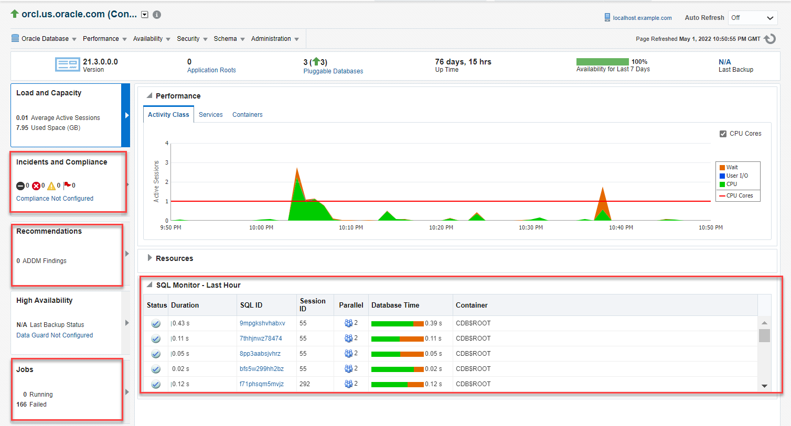

# Monitor general state of Oracle Database

## Introduction

This lab walks you through the procedure to monitor the state and workload of your Oracle Database using Oracle Enterprise Manager Cloud Control (Oracle EMCC).  
  
Estimated time: 15 minutes

### Objectives

View and monitor the state of the database from Oracle EMCC. 

### Prerequisites

This lab assumes you have -

-   A Free Tier, Paid or LiveLabs Oracle Cloud account
-   Completed -
	-   Lab: Prepare setup (*Free-tier* and *Paid Tenants* only)
	-   Lab: Setup compute instance
	-   Lab: Initialize environment
-   Logged in to Oracle EMCC in a web browser as *sysman*

## Task 1: Monitor the state and workload of your database

Logging in to Oracle EMCC as *sysman* enables you to track the state and workload of your database.  

1.  From the **Targets** menu in the Oracle EMCC home page, select **Databases**.  

    

    The Databases page displays a list of Oracle Databases added to Oracle EMCC as managed targets.   
    The values may differ depending on the system you are using.

    

	Click the Database Instance name, for example, *orcl.us.oracle.com* to open the instance home page.

1.  Click on the arrow next to the date and time marked as *1* 	to refresh the database state. 

    

	> **Note:** The Database home page refreshes automatically every 60 seconds. To prevent the page from refreshing automatically, select *Off* in the **Auto Refresh** option.

    The page displays the date and time when it refreshed last.

1.  Verify the following information about the database below the menu bar marked as *2* in the figure above.

    - **Version:** The version of the Oracle Database  

    - **Application Roots**: It refers to the number of tables, packages and views of the Oracle Database

	- **Status of the database**: Whether the status is available or not available. The green upward arrow represents that the database is available and a downward arrow means that the database is unavailable 

    - **Up Time**: The time the database was last started 

    - **Availability for Last 7 Days**: The percentage of availability of the database for last 7 days in the form of a progress bar.

	- **Last Backup**: The time of the last backup

    The information above the menu bar includes host name and the name of the database instance.

1.  Expand **Performance** to view the active session information. It shows graphical information of the active session for the past hour.

    - **Activity Class Chart**: This chart shows the average number of database sessions active for the past hour. It displays the type of activity for each session (on CPU, waiting for Input/output, or waiting for another resource). 

    - **Services Chart**: This chart displays the average number of database sessions active for the past hour for database services.

    - **Containers Chart**: This chart displays the average number of container and pluggable database sessions active for the past hour.

1.  Expand **Resources** to view the resource utilization for the latest data point in the last minute. You can view the following information here:

    - **CPU Chart**:
    This chart shows the percentage of CPU time used by the database instance and other processes during the last minute. The chart legend displays the database instance and Other CPU processes. Place your cursor over the instance data to see the percentage of CPU used by the foreground and background instance processes.

    - **Active Sessions Chart**:
	You can investigate the cause of performance problems by viewing this chart. This chart displays whether or not your database takes up most of the CPU time on the server. This section displays a bar graph with the following information:

		- Waits- This is the value for all wait classes combined, excluding user I/O and idle wait events. 

		- User I/O- This is the average number of active sessions waiting for user I/O. 

		- CPU- This is the average active sessions using CPU.

    - **Memory Chart**:
    This chart shows the current memory utilization (as of the latest refresh time) shared among the database shared pool, java pool, buffer cache, PGA, and other SGA components.

    - **Data Storage Chart**:
    This chart shows the current space usage (as of the latest refresh time) shared among the user data, database log files, undo tablespaces, and temporary, SYSAUX, and SYSTEM tablespaces.

1.  Expand **SQL Monitor - Last Hour** to monitor SQL statements. Each row on this page shows an instance of an SQL execution that the database has monitored or is monitoring. This section shows the executions in the descending order. 

    

    - **Status**:
    This column displays the status icon of the SQL statement the database is monitoring. The different states of the Status are done, running and failed. The checkmark in the column indicates that the execution of the SQL statement is complete. You can hover over the icon to view the status.

    - **Duration**:
    This column displays the duration of the execution of the SQL statement. It displays the total runtime of the query.

    - **SQL ID**:
     It is an identifier to identify the SQL statement. Click on the link to view the Real-time SQL Monitoring page. This page shows real-time as well as historical information about the SQL statement that is monitored. Close the window to return to the instance home page. 

    - **Session ID**:
    This column displays the ID of the session the database is executing.

    - **Parallel**:
    This column displays the degree of parallelism (DOP) for the query. For example, the DOP of the third query is 2. It means that this particular query is run on two database instances.

    - **Database Time**:
    This column displays the duration of database time that the SQL execution takes and also the time taken by other operations.

    - **Container**:
    This column displays the container in which the database executes the SQL statement.The Incidents and Compliance section provides information on the incidents occurring in the database. It displays information on the following topics:

    - **Incident and Problems**:
    You can view the active incidents that occur in the database. An incident is an occurrence of a critical error in the database.

    - **Compliance Summary**:
    Compliance evaluation generates a score for the target database on the basis of how much the target is compliant with the standard. A 100% compliance score means that all checks of the compliance standard passed on the target

    - **Configuration changes in the last seven days**:
    This section lists the changes made in the database configuration in the last seven days.

    The Recommendations section displays the result of performance analysis done by ADDM. The ADDM analyzes data, identifies and lists the errors occurring in the database.

    You can view ADDM table that lists the ADDM findings, such as ADDM's estimated impact on database performance, a description of the finding, and the number of times the finding occurs in snapshots and collected during the last 24 hours.   
	For example, a finding with Occurrences listed as 10 of 43 has occurred in 10 of the last 43 snapshots.
    It also provides recommendations to resolve the errors.

1.  The Jobs section displays a table that shows the jobs that are currently running in the database. It also displays the count of jobs that were not successful.

You may now **proceed to the next lab**.

## Acknowledgements

- **Author** - Manisha Mati, Database User Assistance team
- **Contributors** - Suresh Rajan, Ashwini R, Jayaprakash Subramanian, Manish Garodia
- **Last Updated By/Date** - Manisha Mati, June 2022