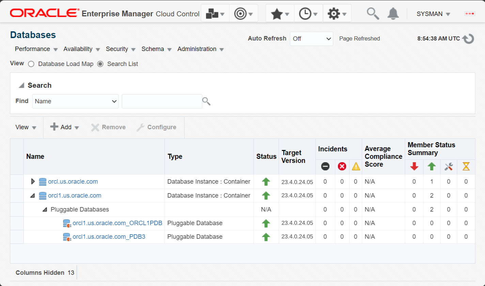
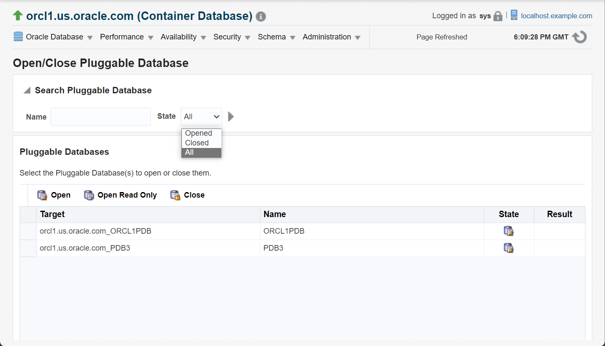
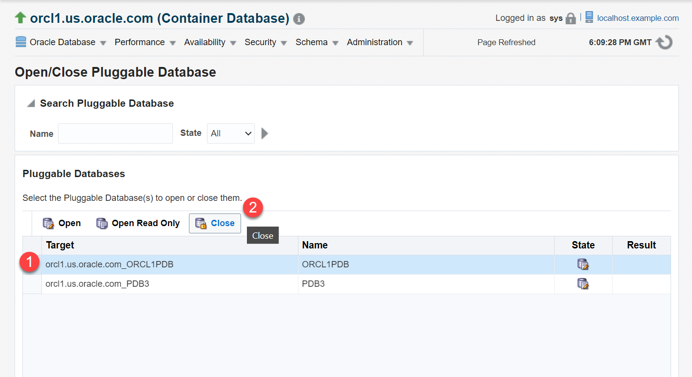
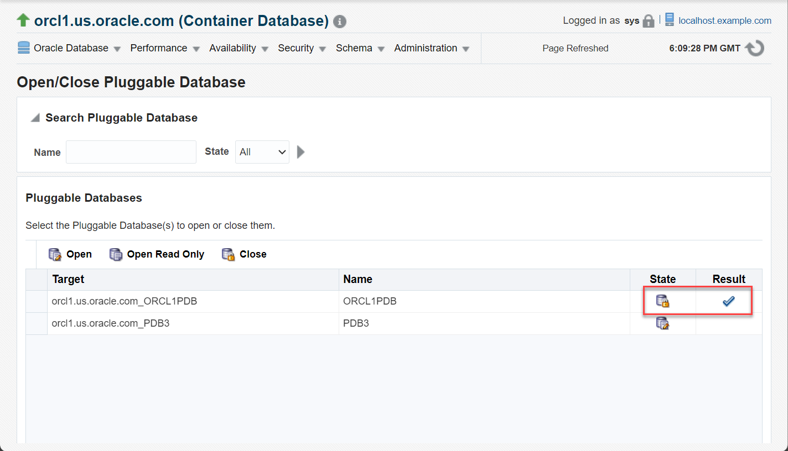
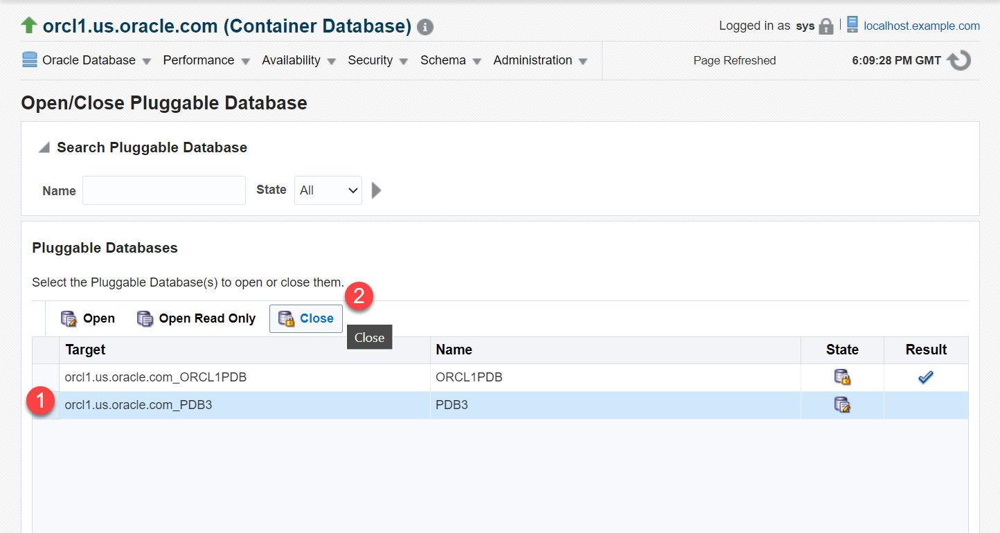
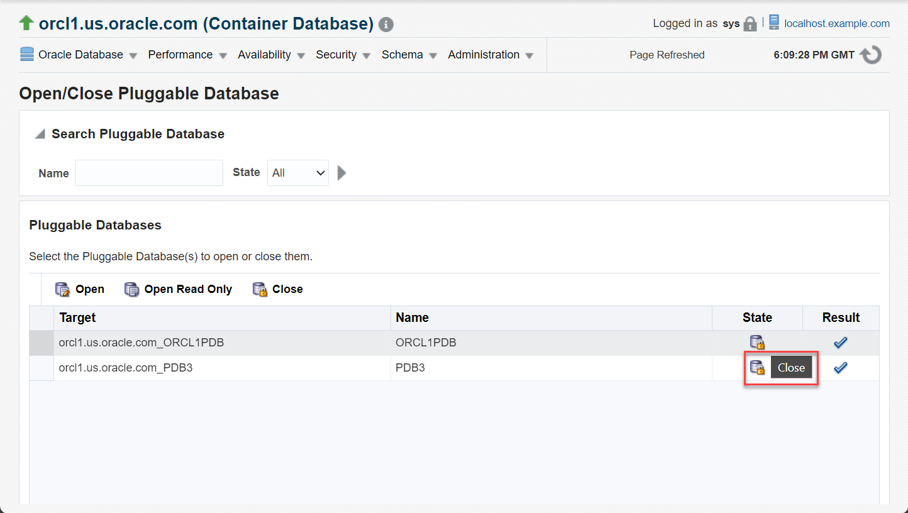
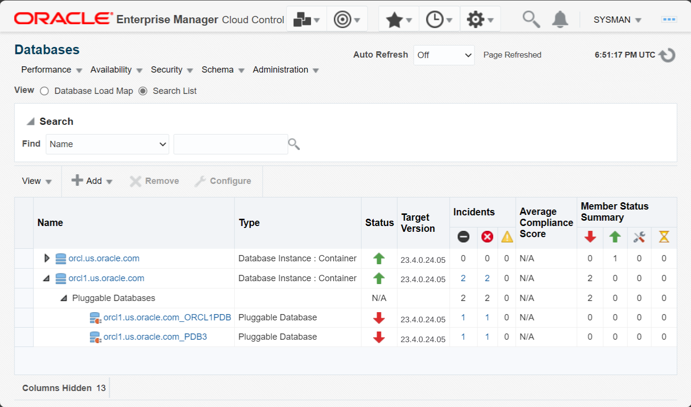
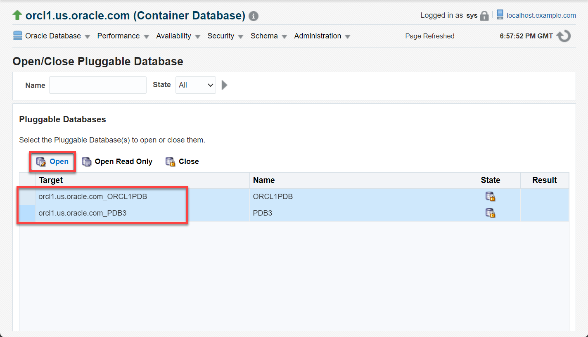

# Close and open PDBs

## Introduction

This lab shows how to administer the Pluggable Databases (PDBs) in a multitenant Container Database (CDB) from Oracle Enterprise Manager Cloud Control (EM). You can close one or more PDBs in the database simultaneously. Similarly, you can open one PDB or all PDBs together in your database.

Estimated time: 10 minutes

### Objectives

Perform these tasks on the PDBs from Oracle Enterprise Manager:
 -   Close PDBs
 -   Open PDBs

### Prerequisites

This lab assumes you have -

 -   An Oracle Cloud account
 -   Completed all previous labs successfully
 -   Logged in to Oracle Enterprise Manager in a web browser as *sysman*

> **Note**: 

## Task 1: Close PDBs in CDB

Closing a PDB may disrupt any ongoing operations on that PDB. You can close one PDB or close all PDBs together in your database in a single step. To close all PDBs in the CDB, at least one PDB must be open.

In this task, you will close the PDBs, namely *ORCL1PDB* and *PDB3*, in the CDB. Before closing a PDB, check its current status.

You can open the Databases page from the menu **Targets** &gt; **Databases**.

1.  On the Database pages, click the database instance name, for example *orcl1.us.oracle.com*, to open the instance home page.

	 

    The green upward arrows in the **Status** field indicate that the database instances and the PDBs are up and running.

	> **Note**: 

1.  From the **Oracle Database** menu on the instance home page, select **Control** &gt; **Open/Close Pluggable Database**.

	 

	 

	 

1.  Oracle Enterprise Manager opens the Open and Close PDB page. Verify that it displays all the PDBs in your container.   
	You can also search for a PDB by its name or use the **State** filter to view PDBs that are *Opened* or *Closed*.

	 

    The table displays the following information for each target PDB:

     -   **Target** - discovered database systems
     -   **Name** - PDB name
     -   **State** - whether the PDB is *Open* (an icon with a pencil) or *Close* (a lock)
     -   **Result** - whether a task succeeded or not

1.  The **State** column displays an icon with a pencil. Mouse over the icon and verify that the PDBs are *Open*.

	 

     > **Note**: With the **Open Read Only** option, users can run queries on a PDB to view information but cannot perform transactions in the database, such as create, insert, update, or delete operations. For this lab, do not use this option.

1.  Click the PDB name, *ORCL1PDB*, to select it and click **Close** to start the close operation.

	 

     > **Note**: The Open and Close PDB page supports multiselect. Use the **Shift** or **Ctrl** button to select more than one PDB. You can also click the PDB table and press **Ctrl** + **A** to select all PDBs.

1.  Oracle Enterprise Manager displays a window to confirm this activity. Click **Yes** to close the PDB.

	 

    Oracle Enterprise Manager processes the operation and closes the PDB instantly. The icon in the **State** column for *ORCL1PDB* changes to a lock and the **Result** column displays a check mark.

	 

    You have closed the PDB *ORCL1PDB* but the other PDB, *PDB3*, is still open.

     > **Note**: If you try closing a PDB which is already in *Close* state, then the **Result** column displays an icon indicating that EM did not perform the task.

1.  Now close the other PDB. Select *PDB3* and click **Close**.

	 

	On the confirmation window, click **Yes** to close the PDB.

	 

    Oracle Enterprise Manager closes this PDB also. The **State** column for *PDB3* displays a lock icon and the **Result** column displays a check mark indicating that the task *Succeeded*. Mouse over the icons in the **State** column to verify that the PDBs are in *Close* state.

	 

You have closed the PDBs, *ORCL1PDB* and *PDB3*, in the CDB. Thus, you can close one or more PDBs in your database. Now, try opening these PDBs again from Oracle Enterprise Manager.

## Task 2: Open PDBs

In this task, you will open the PDBs, namely *ORCL1PDB* and *PDB3*, in the CDB. Before opening a PDB, check its current status.

1.  From the **Targets** menu, select **Databases** to open the Databases page.

	 

1.  Click the expand/collapse triangle next to the instance name, *orcl1.us.oracle.com*, to view the current status of PDBs.

	 

     > **Note**: If you have additional PDBs in your database, then you might have green upward arrows in the **Status** column. However, for the PDBs you closed in the previous task, that is *ORCLPDB* and *PDB3*, **Status** shows red downward arrows indicating that the PDBs are currently *close*.

    Now proceed with opening the PDBs. Click the database instance name, *orcl1.us.oracle.com*, to open the instance home page.

1.  From the **Oracle Database** menu, select **Control** &gt; **Open/Close Pluggable Database**.

	 

	> **Note**: 

	 Oracle Enterprise Manager opens the Open and Close PDB page.

1.  Keep the **Ctrl** button on your keyboard pressed, click each PDB, *ORCL1PDB* and *PDB3*, to select them both, and click **Open**.

	 

    Oracle Enterprise Manager processes the operation and opens the PDBs in read/write mode. The **State** column displays icon with pencil and the **Result** column displays check marks for both PDBs.

1.  Mouse over the icon in the **Result** column to verify that the task *Succeeded*.

	 

     > **Note**: If you try opening a PDB which is already in *Open* state, then the **Result** column displays an icon indicating that EM did not perform the task.

1.  From the **Targets** menu, select **Databases** to open the Databases page.

	 

1. 	Click the expand/collapse triangle next to the instance name, *orcl1.us.oracle.com*, to view the current status of PDBs.

	 

    The green upward arrows in the **Status** field indicate that the PDBs are up and running.

You have opened the PDBs, *ORCLPDB* and *PDB3*. Thus, you can open one or more PDBs in your database.

Congratulations! You have successfully completed this workshop on *PDB management and administration in Oracle Database*.

In this workshop, you learned how to manage PDBs, such as different ways of creating new PDBs in the CDB. You deleted a PDB and unplugged a PDB from the root container and then plugged the unplugged PDB into another container. You also performed PDB administration from Oracle Enterprise Manager, such as closing and opening PDBs in your Oracle Database and checking their status.

## Acknowledgments

 - **Author** - Manish Garodia, Database User Assistance Development
 - **Contributors** - Ashwini R, Jayaprakash Subramanian, Aayushi Arora, Manisha Mati
 - **Last Updated By/Date** - Manish Garodia, October 2024
