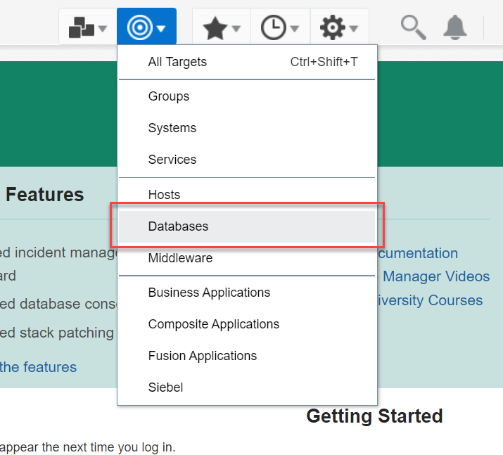
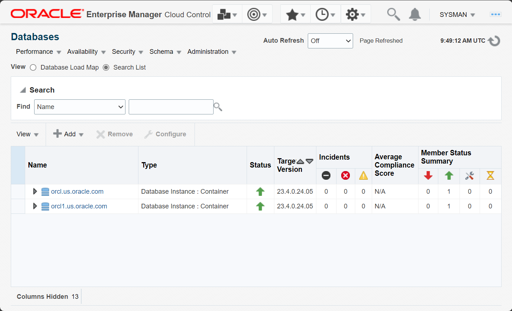
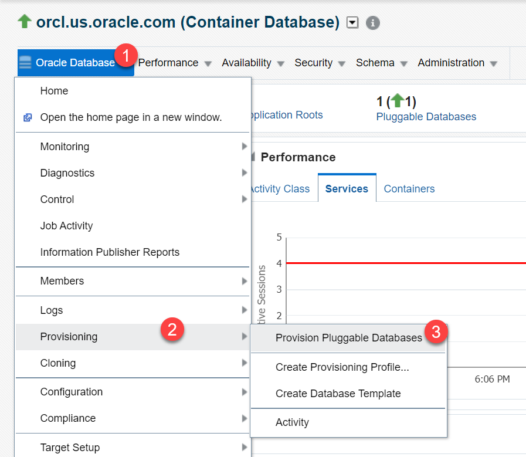
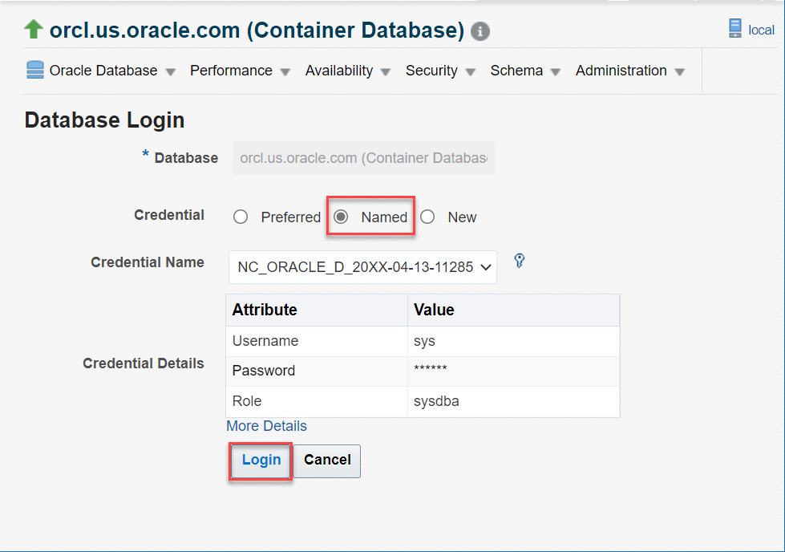
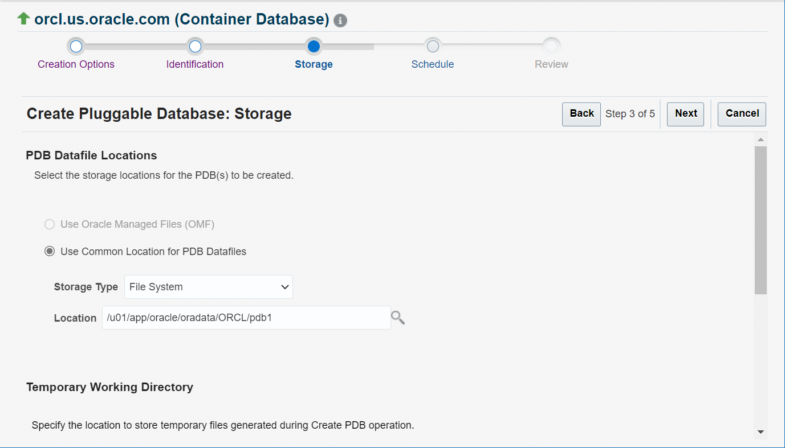
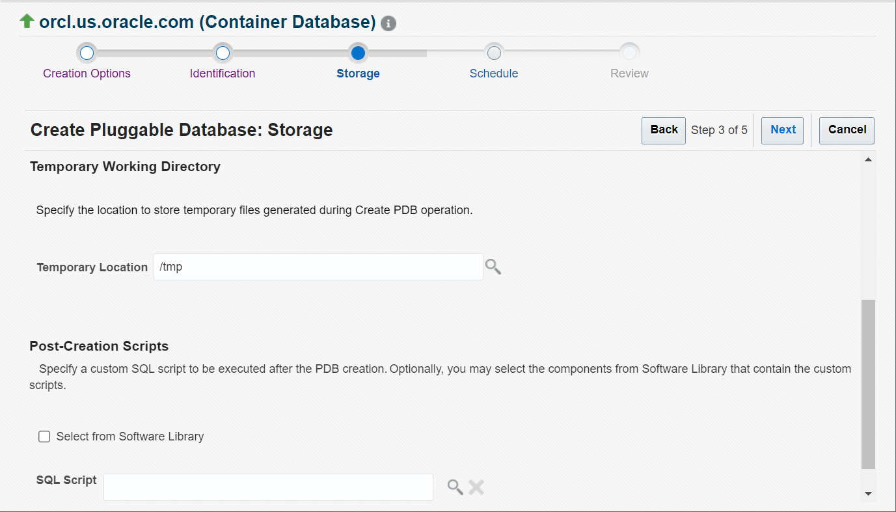
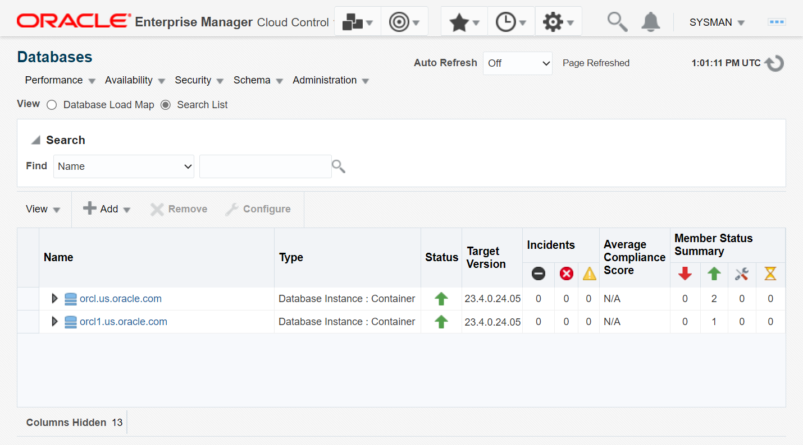
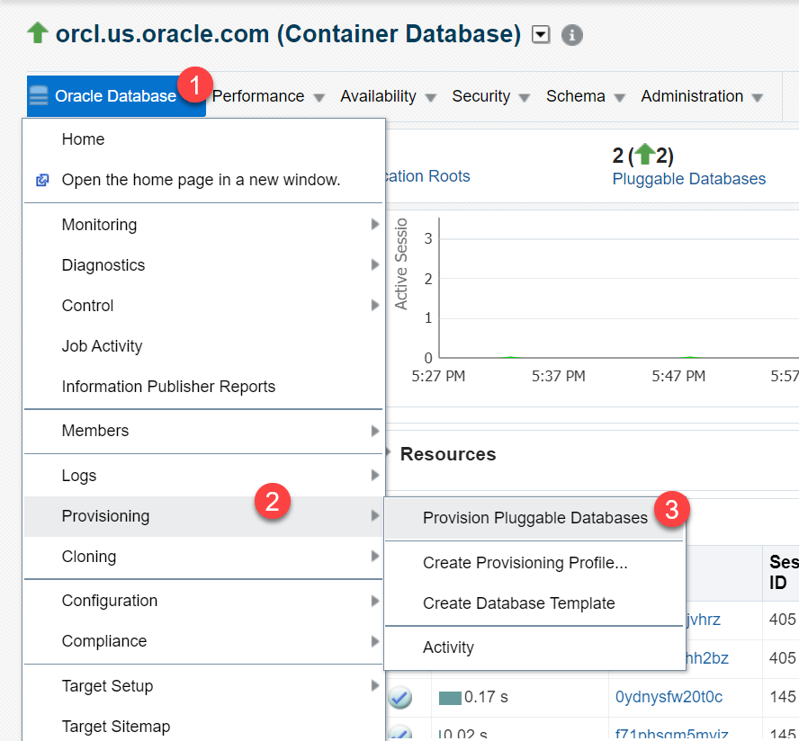
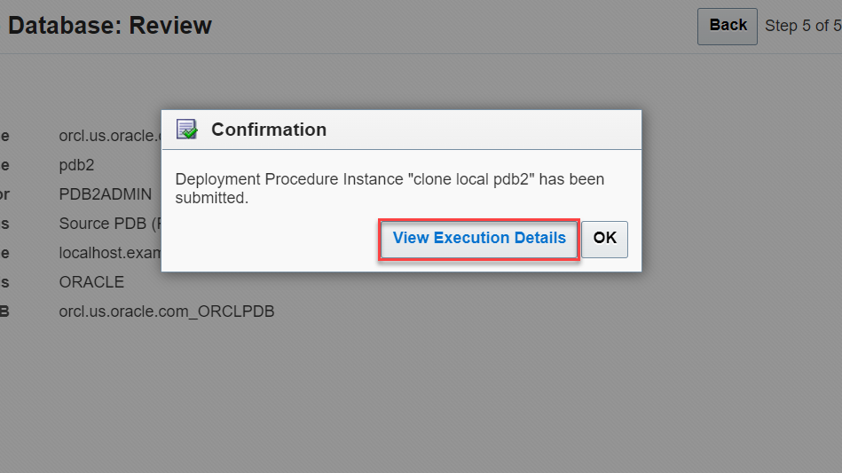
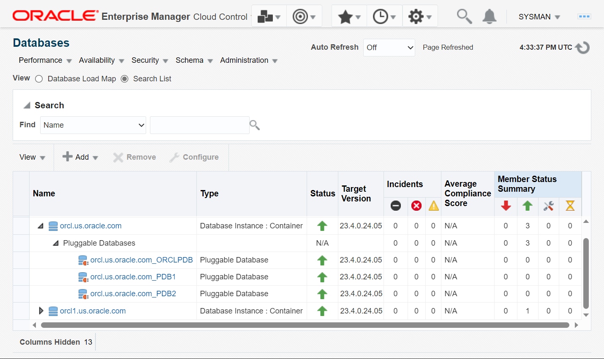

# Provision a Pluggable Database (PDB)

## Introduction

This lab shows how to provision Pluggable Databases (PDBs) in a multitenant Container Database (CDB) using Oracle Enterprise Manager Cloud Control (EM).

Estimated time: 30 minutes

### About creating PDBs in Oracle Database

Oracle Enterprise Manager provides various options to create PDBs in a CDB. For example, you can create PDBs from the seed (*PDB$SEED*) or clone from another PDB. However, the process of creating PDBs and the steps involved are similar no matter which option you select. Oracle Enterprise Manager takes you through a wizard to perform the PDB create operation.

> **Note**: Another way of creating PDBs is by plugging in an unplugged PDB. To plug a PDB into the CDB, you must have a PDB that is unplugged. You will learn more about these tasks in the subsequent labs.

### Objectives

Perform these tasks from Oracle Enterprise Manager:
 -   Create a new PDB in the CDB from the seed
 -   Create a PDB by cloning a local PDB
 -   View the newly created PDBs

### Prerequisites

This lab assumes you have -

 -   An Oracle Cloud account
 -   Completed all previous labs successfully
 -   Logged in to Oracle Enterprise Manager in a web browser as *sysman*

> **Note**: 

## Task 1: Create a new PDB in CDB from seed

Oracle Enterprise Manager provides options to provision PDBs from the database instance home page. These options are not available on the CDB or PDB home page.

In this task, you will create a new PDB, namely *PDB1*, in the CDB from the seed using Oracle Enterprise Manager.

1.  From the **Targets** menu, select **Databases** to open the Databases page.

	 

1. 	The Databases page displays all database systems, that is, the database instances on the host and the PDBs in each instance, added to Oracle Enterprise Manager as managed targets.

	 

    The green upward arrows in the **Status** field indicate that the database instances and the PDBs are up and running.

	> **Note**: 

    Click the database instance name, for example *orcl.us.oracle.com*, to open the instance home page.

1.  From the **Oracle Database** menu on the instance home page, select **Provisioning** &gt; **Provision Pluggable Databases**.

	 

1.  The Provision Pluggable Databases Console opens and displays the options for various PDB operations.   
    Scroll down and select **Create New Pluggable Databases**.

	 

    Click **Launch** to start the PDB create operation.

	

	 

1.  Verify that the PDB Creation page displays the default option, *Create a New PDB*, selected. This option creates a new PDB from the seed.

	 

    The PDB Creation page has other options also for creating PDBs. For this task, ignore the other options.

	> **Note**: 

1.  Scroll down the page. Under **Container Database Host Credentials**, select the *Named* Credential option, if not already selected.

	 

	> **Note**: 

    Click **Next** to proceed.

1.  On the Identification page, note that a PDB name is automatically assigned.

	 

    For this lab, specify the following:
     - **PDB Name** - Delete the default text and enter a unique name for the PDB you are creating. For this task, enter *PDB1*.
		> **Note**: 

     - **Create Multiple Copies** - Do not select this option. For this lab, create only one PDB in the database.   
    You can create up to *252* PDBs in a CDB.

1.  Enter the login credentials for the administrative user.

	 

    Specify the following:
     - **Username** - *PDBADMIN*   
	 This is the default administrative user who will manage the PDB. Though you can modify the user name, for this lab, leave the default value.

     - **Password** - Set a password, for example, *mypassword*   
    Ensure to note the password because you will require it when you log in to the PDB as *PDBADMIN*.

	> **Note**: 

    Click **Next** to proceed.

1.  You can select storage options for the PDB, such as the storage type, location to store data files and temporary files, and so on.

	 

    For this lab, leave the default storage options.

	 

	 

    Click **Next** to proceed.

1.  Oracle Enterprise Manager takes a while to validate and provides options to schedule the create operation.

	 

    Specify the following:

     - **Deployment Instance** - Delete the default text and enter a unique name, *create pdb1 from seed*.   
		 

		> **Note**: If the instance name already exists, then Oracle Enterprise Manager returns a validation error. You cannot create procedures in EM with duplicate names.

     - **Start** - Leave the default, *Immediately*, to run the procedure now. 

	

    Click **Next** to proceed.

1.  The Review page displays a summary of the PDB create operation. For example, the container database name, the PDB name that you entered, the host details, the storage options, and so on.

    Verify that the **PDB Creation Options** field displays *SEED PDB*.

	 

    Review the details and click **Submit** to start creating the PDB.

1.  Oracle Enterprise Manager displays a confirmation message. 

	 

    Click **View Execution Details** to open the Procedure Activity page and view the status of the procedure.

     > **Note:** If you click **OK**, then Oracle Enterprise Manager goes to the Provision Pluggable Databases page. 

	The Procedure Activity page contains detailed steps of the PDB operation. After the PDB is created, the **Status** field changes from *Running* to *Succeeded*.

	 

	

You have created *PDB1* in the CDB from the seed. The PDB is open in `Read/Write` mode.

## Task 2: Create a PDB by cloning an existing PDB

You can create a new PDB using another method, that is, by cloning an existing PDB in the container. 

In this task, you will clone a PDB using the full clone method to create a new PDB, namely *PDB2*, in the same CDB using Oracle Enterprise Manager.

1.  From the **Targets** menu, select **Databases** to open the Databases page.

	 

1.  Click the database instance name, for example *orcl.us.oracle.com*, to open the instance home page. 

	 

1.  From the **Oracle Database** menu, select **Provisioning** &gt; **Provision Pluggable Databases**.

	 

1.  Under PDB Operations select **Create New Pluggable Databases**.

	 

    Click **Launch** to start the PDB clone operation.

	> **Note**: 

1.  For PDB Creation Options, select *Clone an Existing PDB* and then select *Full Clone*.

    For creating a clone, you require a **Source PDB**. Click the magnifier icon next to this field to search and select the source PDB.

	 

     > **Note:** Though you can type the PDB name in this field, Oracle recommends that you use the Search and Select PDB option.

    The PDB Creation page also has other options for creating a PDB. For this task, ignore the other options. 

1.  Oracle Enterprise Manager opens a Search and Select window. It displays all PDBs in your database instances. Select the source PDB that you want to clone.

	 

    The green upward arrows in the **Status** field indicate that the PDBs are up and running. 

	 > **Note**: This window supports single select, which means you can select only one source PDB. 

    For this task, click *ORCLPDB* to select it and click **Select** to proceed. The window goes back to the PDB Creation page.

1.  Verify that the **Source PDB** field displays the PDB name you selected. Leave the **Database Link** field blank. For this task, it is not applicable.   
    Scroll down the page. Under **Container Database Host Credentials**, select the *Named* Credential option, if not already selected.

	 

    Click **Next** to proceed.

1.  On the Identification page, note that a PDB name is automatically assigned.

	 

    For this lab, specify the following:
     - **PDB Name** - Delete the default text and enter a unique name for the PDB you are cloning. For this task, enter *PDB2*.

     - **Create Multiple Copies** - Do not select this option. For this lab, create only one PDB in the database.

1.  Select the **Create PDB Administrator** option to create a new administrative user account for the PDB.

    > If you want to use the administrative user account of the source PDB, then do not select this option.

	 

    Enter the login credentials for the new administrative user.

     - **Username** - *PDB2ADMIN*
     - **Password** - Set a password, for example, *mypassword*   
    Ensure to note the password because you will require it when you log in to the PDB as *PDB2ADMIN*.

	> **Note**: 

	Optionally, Oracle Enterprise Manager may display a section for the Source CDB Login Credentials. If you are cloning the source PDB into the same root container, then EM does not display this section.

    Click **Next** to proceed.

1.  You can select storage options for the PDB, such as the storage type, location to store data files and temporary files, and so on.

	 

    For this lab, leave the default storage options and click **Next** to proceed.

1.  Oracle Enterprise Manager provides options to schedule the clone operation.

	 

    Specify the following:

     - **Deployment Instance** - Delete the default text and enter a unique name, *clone local pdb2*.   
		 
     - **Start** - Leave the default, *Immediately*, to run the procedure now.

    For this lab, do not select the grace period option.   
    Click **Next** to proceed.

1.  The Review page displays a summary of the PDB clone operation. For example, the container database name, the PDB name which you entered, the host details, the storage options, and so on.

	 

    Verify that the **PDB Creation Options** field displays *Source PDB (Full Clone)*.   
    Review the details and click **Submit** to start cloning the PDB.

1.  Oracle Enterprise Manager displays a confirmation message. 

	 

    Click **View Execution Details** to open the Procedure Activity page and view the status of the procedure. 

     > **Note:** If you click **OK**, then Oracle Enterprise Manager goes to the Provision Pluggable Databases page.

    The Procedure Activity page contains the detailed steps of the PDB operation. After the PDB is created, the **Status** field changes from *Running* to *Succeeded*.

	 

You have created *PDB2* in the same container by cloning the existing PDB, *ORCLPDB*. The PDB is open in `Read/Write` mode. 

## Task 3: View the newly created PDBs

After creating the PDBs, you can check that Oracle Database displays the newly created PDBs. 

In this task, you will view the new PDBs, namely *PDB1* and *PDB2*, in your database.

1.  From the **Targets** menu, select **Databases** to open the Databases page.

	 

1.  Click the expand/collapse triangle next to the instance name, for example *orcl.us.oracle.com*, where you created the PDBs.

	 

    The Databases page displays the new PDBs, namely *PDB1* and *PDB2*, along with the existing PDB, *ORCLPDB*. The green upward arrows in the **Status** field indicate that the database instances and the PDBs are up and running. 

In this lab, you learned different ways of creating PDBs, that is, using the seed and cloning another PDB in the root container. After creating the PDBs, you viewed the new PDBs in the database instance. You can also delete PDBs and remove them from the database. 

You may now **proceed to the next lab**.

## Acknowledgments

 - **Author** - Manish Garodia, Database User Assistance Development
 - **Contributors** - Ashwini R, Jayaprakash Subramanian, Aayushi Arora, Manisha Mati
 - **Last Updated By/Date** - Manish Garodia, October 2024
