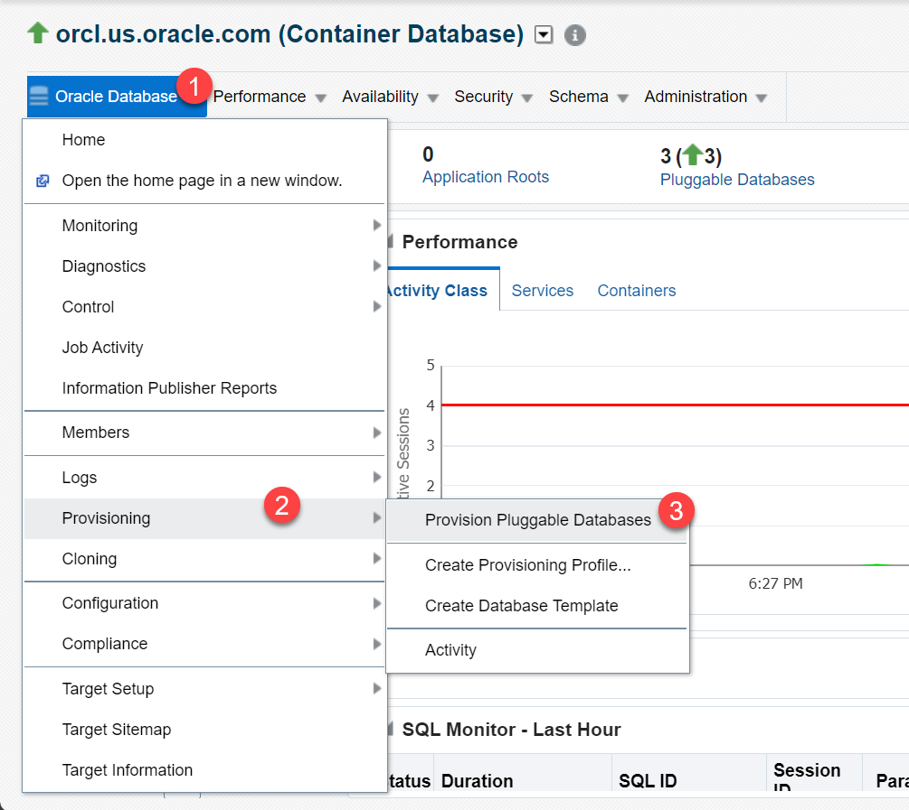
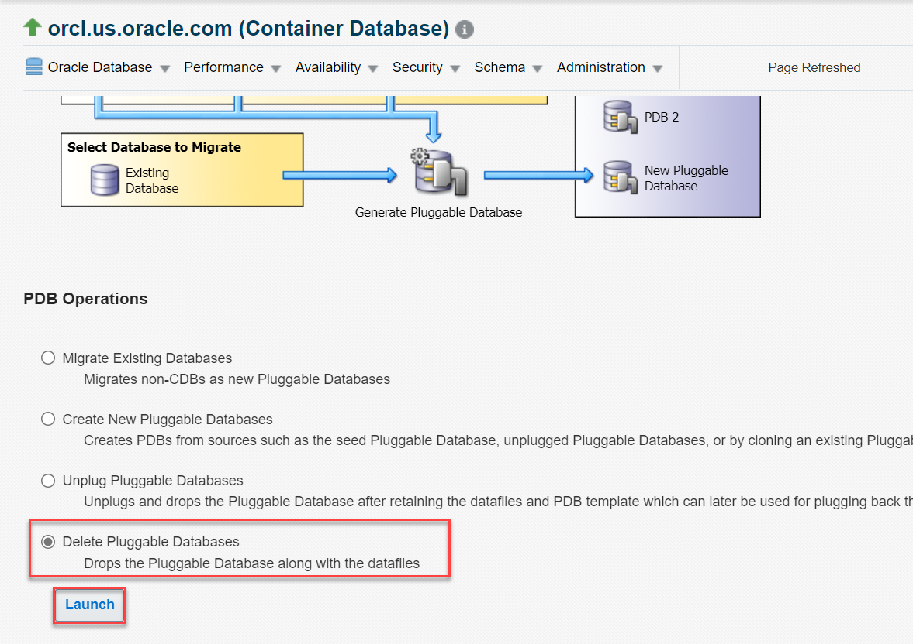
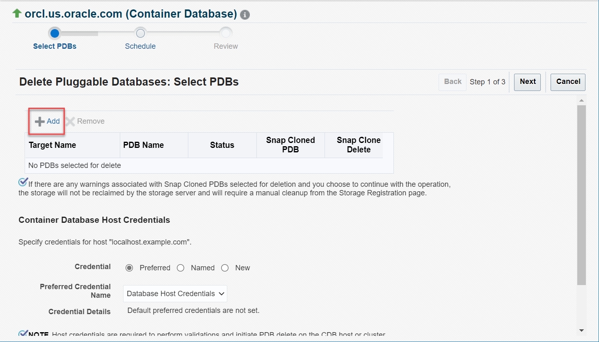
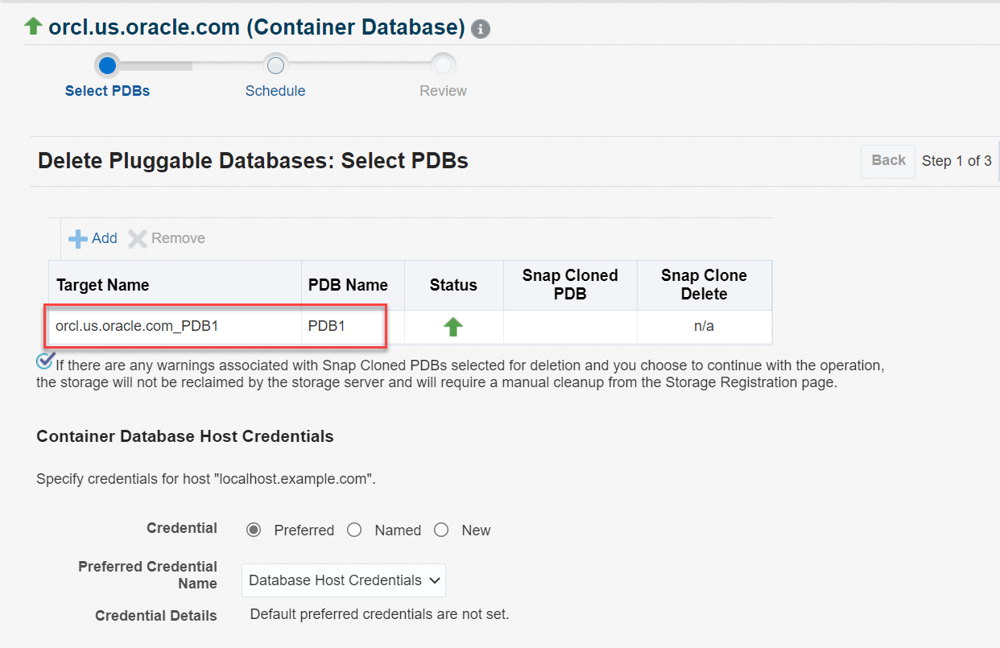
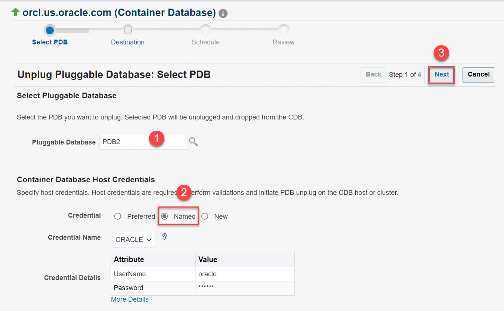
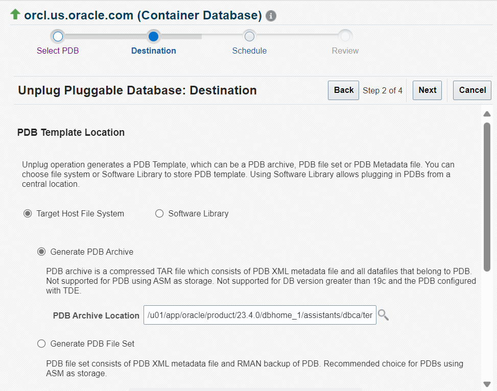
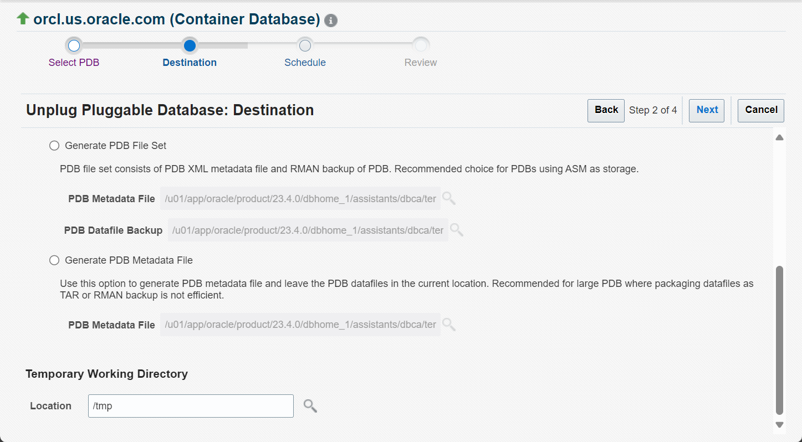
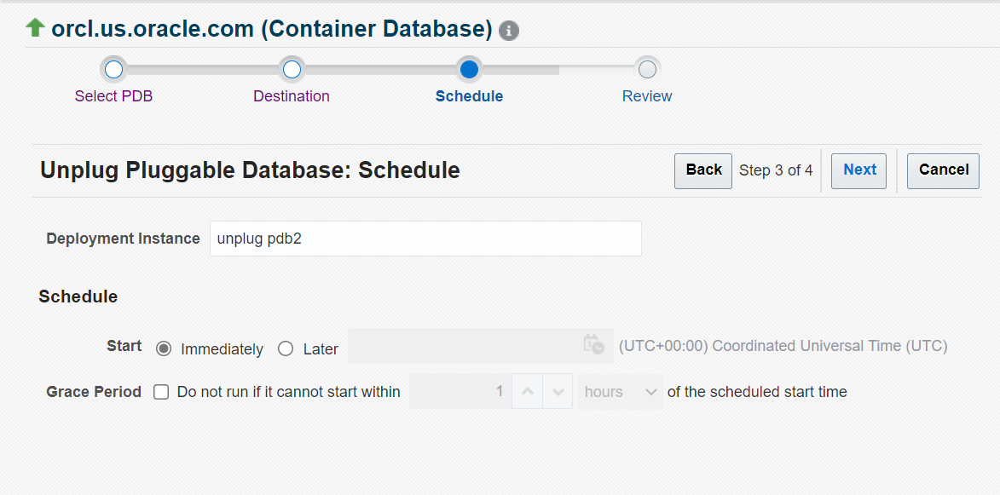
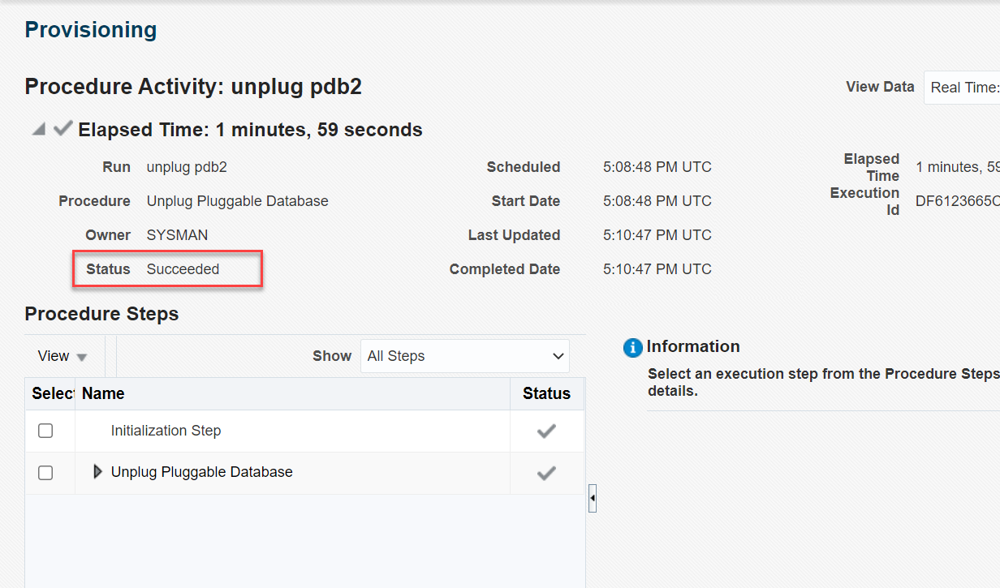
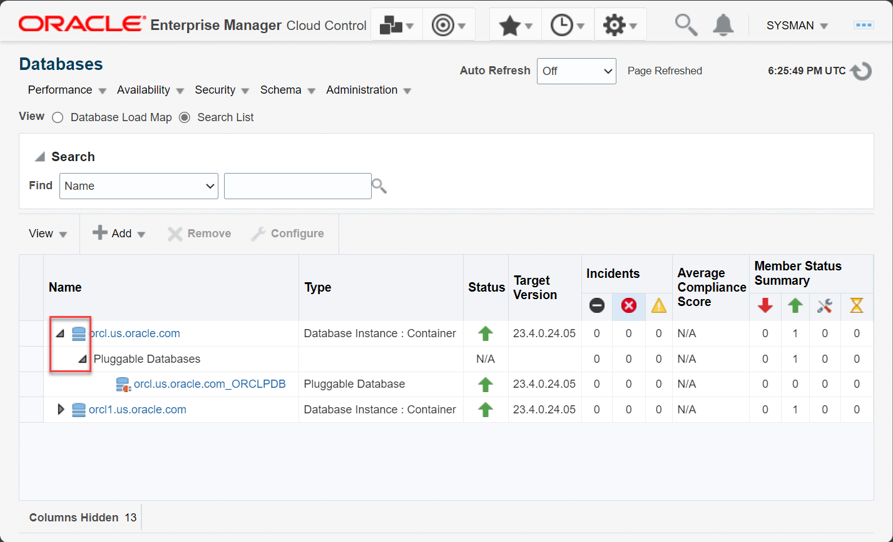

# Remove PDBs from CDB

## Introduction

This lab walks you through the steps for removing Pluggable Databases (PDBs) from a Container Database (CDB) using Oracle Enterprise Manager Cloud Control (EM).

To remove a PDB from a CDB, you have two options:
 -   Delete the PDB
 -   Unplug the PDB

Estimated time: 15 minutes

### Objectives

Perform these tasks from Oracle Enterprise Manager:
 -   Delete a PDB from the root container
 -   Unplug a PDB from the root container
 -   Verify removal of PDBs

### Prerequisites

This lab assumes you have -

 -   An Oracle Cloud account
 -   Completed all previous labs successfully
 -   Logged in to Oracle Enterprise Manager in a web browser as *sysman*

> **Note**: 

## Task 1: Delete a PDB from the root container

When you delete a PDB, Oracle Database also removes its associated data files.

In this task, you will delete the PDB, namely *PDB1*, from the root container using Oracle Enterprise Manager. You can open the Databases page from the menu **Targets** &gt; **Databases**.

1.  On the Database pages, click the database instance name, for example *orcl.us.oracle.com*, to open the instance home page.

	 

    The green upward arrows in the **Status** field indicate that the database instances and the PDBs are up and running.

	> **Note**: 

1.  From the **Oracle Database** menu on the instance home page, select **Provisioning** &gt; **Provision Pluggable Databases**.

	 

1.  The Provision Pluggable Databases Console opens and displays the options for various PDB operations.  
    Scroll down and select **Delete Pluggable Databases**.

	 

    Click **Launch** to start the PDB delete operation.

	

	 

1.  You can select one or more PDBs to delete. Click **Add** to search for the target PDB and add it to the delete list.

	 

	> **Note**: 

1. 	Oracle Enterprise Manager opens a Search and Select window. Select the target PDB that you want to delete.

	 

     This window supports multiselect, which means you can add more than one PDBs to the delete list. The green upward arrows in the **Status** field indicate that the PDBs are up and running.

     > **Note**: To delete multiple PDBs simultaneously, you can either select the PDBs in this window or repeat this step to add each PDB individually.

    For this lab, click *PDB1* in the target PDB list to select it and click **Select** to add the PDB to the delete list. The window goes back to the Select PDBs page.

1.  Verify that **Target Name** and **PDB Name** displays the PDB you selected.  
    The snap clone information may show blank or n/a because it is not applicable for this lab.

	 

     > **Note**: If the PDB you selected for deletion is wrong, then click the PDB target name to select it and click **Remove**. This does not delete the PDB but clears it from the delete list and leaves the PDB intact. Ignore this note if you have selected the correct PDB for deletion.

    You can also click **Add** to select more PDBs for deletion. For this lab, delete only one PDB, *PDB1*.

1.  Scroll down the page. Under **Container Database Host Credentials**, select the *Named* Credential option, if not already selected.

	 

	> **Note**: 

    Leave the default value for **Temporary Working Directory** and click **Next** to proceed.

1.  Oracle Enterprise Manager takes a while to validate and provides options to schedule the delete operation.

	 

    Specify the following:

	 -  **Deployment Instance** - Delete the default text and enter a unique name, *delete pdb1*.  
    The instance name you enter helps you identify and track the progress of this procedure on the Procedure Activity page.

		> **Note**: If the instance name already exists, then Oracle Enterprise Manager returns a validation error. You cannot create procedures in EM with duplicate names.

	 - **Start** - Leave the default, *Immediately*, to run the procedure now.

	

    Click **Next** to proceed.

1.  The Review page displays a summary of the PDB delete operation. For example, the container database name, the PDB name which you entered, the target details, the data files, and so on. This page also displays the data files, which the database deletes along with the PDB.

	 

	Verify that the **PDB for Delete** field displays *PDB1*.   
    Review the details and click **Submit** to start deleting the PDB.

1.  Oracle Enterprise Manager displays a confirmation window.

	 

    Click **Submit** again to start deleting the PDB.

    Oracle Enterprise Manager goes to the Provision Pluggable Databases page and displays the status of the procedure. This page contains the detailed steps of the PDB operation. After the PDB is deleted, the **Status** field changes from *Running* to *Succeeded*.

	 

	

You have deleted *PDB1* from the root container. Now, try unplugging a PDB from the root container.

## Task 2: Unplug a PDB from the root container

Oracle Enterprise Manager provides an option to manage PDBs from the database instance home page. This option is not available on the CDB or PDB home page.

In this task, you will unplug the PDB, namely *PDB2*, from the root container using Oracle Enterprise Manager.

1.  From the **Targets** menu, select **Databases** to open the Databases page.

	 

1.  Click the database instance name, for example *orcl.us.oracle.com*, to open the instance home page.

	 

1.  From the **Oracle Database** menu, select **Provisioning** &gt; **Provision Pluggable Databases**.

	 

1.  Under PDB Operations select **Unplug Pluggable Databases**.

	 

    Click **Launch** to start the PDB unplug operation.

	> **Note**: 

1.  Select the PDB that you want to unplug. Click the magnifier icon next to the **Pluggable Database** field to search for the target PDB.

	 

     > **Note**: Though you can type the PDB name in this field, Oracle recommends that you use the Search and Select PDB option.

1.  Oracle Enterprise Manager opens a window to search and select the PDB that you want to unplug.

	 

    This window supports single select, which means you can select only one target PDB.   
    For this task, click *PDB2* to select it and click **Select** to proceed. The window goes back to the Select PDB page.

1.  Verify that the **Pluggable Database** field displays the PDB name you selected.

	 

    Scroll down the page. Under **Container Database Host Credentials**, select the *Named* Credential option, if not already selected. Click **Next** to proceed.

1.  On the Unplug PDB Destination page, select the type of PDB template you want to generate for unplugging the PDB, and the location where you want to store it. The PDB template consists of all data files and the metadata XML file.

	 

    The page displays the default options *Target Host File System* and *Generate PDB Archive* selected. Oracle recommends selecting these options if both source and target CDBs use File System for storage.

     - **Target Host File System** - stores the PDB template on the CDB host from where you unplug the PDB
     - **Generate PDB Archive** - creates a single archive (*TAR*) file with the data files and the metadata XML file

    For this lab, leave the defaults and click **Next** to proceed.

	 

     > **Note**: The PDB unplug operation generates a PDB template, which can be a PDB archive, a PDB file set, or a PDB metadata file. You can select the location to store the PDB template as File System or Software Library. The Software Library option helps plug in PDBs from a central location.

1.  Oracle Enterprise Manager prompts to schedule the unplug operation.

	 

    Specify the following:

     - **Deployment Instance** - Delete the default text and enter a unique name, *unplug pdb2*.  
    The instance name you enter helps you identify and track the progress of this procedure on the Procedure Activity page.

     - **Start** - Leave the default, *Immediately*, to run the procedure now.

    For this lab, do not select the grace period option.   
    Click **Next** to proceed.

1.  The Review page displays a summary of the PDB unplug operation. For example, the container database name, the PDB name you selected, and the host details.

	 

	Verify that the **PDB Archive** field displays the *full path and location of the file system*.   
    Review the details and click **Submit** to start unplugging the PDB from the root container.

1.  Oracle Enterprise Manager displays a confirmation window.

	 

    Click **View Execution Details** to open the Procedure Activity page and view the status of the procedure.

     > **Note:** If you click **OK**, then Oracle Enterprise Manager goes to the Provision Pluggable Databases page.

    The Procedure Activity page contains the detailed steps of the PDB operation. After the PDB is unplugged, the **Status** field changes from *Running* to *Succeeded*.

	 

You have unplugged *PDB2* from the CDB. Now, verify that the PDBs you removed are no longer available in the database instance.

## Task 3: Verify removal of PDBs

After deleting and unplugging the PDBs, you can check that Oracle Database has removed the PDBs.

In this task, you will verify that you have removed the PDBs, namely *PDB1* and *PDB2*, from the database.

1.  From the **Targets** menu, select **Databases** to open the Databases page.

	 

1.  Click the expand/collapse triangle next to the instance name, for example *orcl.us.oracle.com*, from where you removed the PDBs.

	 

    Note that the database instance, *orcl*, does not display *PDB1* and *PDB2* that you removed. The list now displays only one PDB, *ORCLPDB*.

In this lab, you learned how to remove PDBs from your Oracle Database. You deleted a PDB and unplugged another PDB from the root container. You also verified that you removed these PDBs from the Oracle Database.

You may now **proceed to the next lab**.

## Acknowledgments

 - **Author** - Manish Garodia, Database User Assistance Development
 - **Contributors** - Ashwini R, Jayaprakash Subramanian, Aayushi Arora, Manisha Mati
 - **Last Updated By/Date** - Manish Garodia, October 2024
