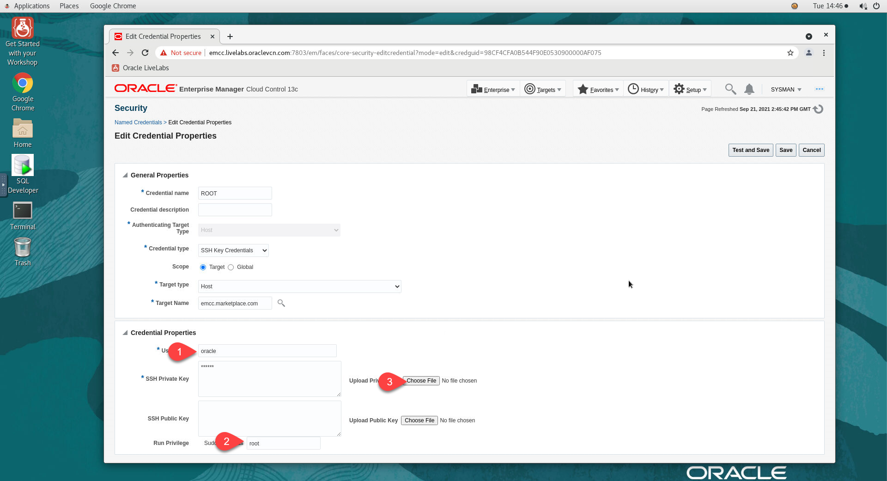

# Initialize Environment

## Introduction
<!-- Condition: EMCC -->
<if type="emcc">
In this lab we will review and startup all components required to successfully run this workshop.
</if>

<!-- Condition: ORDS -->
<if type="db-actions">
This lab helps you start and administer the components and services required for this workshop. 

**Background**   
When you establish a remote desktop session, check the environment and verify that the dependent processes are up and running. After instance provisioning, it takes around 15 minutes for all processes and services to start. If a component is not running, you can start it manually as explained in this lab. 
</if>

Estimated time: 10 minutes

### Objectives
<!-- Condition: EMCC -->
<if type="emcc">
- Initialize the workshop environment.
</if>

<!-- Condition: ORDS -->
<if type="db-actions">
 - Ensure that the following are running:
	- Database Listener - *LISTENER_ORCL*
	- Oracle Database Instance - *orcl*
	- Oracle REST Data Services (ORDS) - *ords*
 - Log in to Oracle Database Actions in a web browser.
</if>

### Prerequisites

This lab assumes you have-

-   An Oracle Cloud account
	<!-- Condition: EMCC, ORDS -->
-   Oracle Database and <if type="emcc">[](var:prod_em)</if> <if type="db-actions">[](var:prod_db_actions)</if> installed

<!-- Condition: EMCC -->
<if type="emcc">

## Task 1: Validate That Required Processes are Up and Running
1. Now with access to your remote desktop session, proceed as indicated below to validate your environment before you start executing the subsequent labs. The following Processes should be up and running:

    - Database Listeners
        - LISTENER
        - LISTENER_1522
    - Database Server Instances
        - emrep
        - db19c
		- orcl
    - Enterprise Manager - Management server (OMS)
    - Enterprise Manager - Management Agent (emagent)

2. On the *Web Browser* window on the right preloaded with *Enterprise Manager*, click on the *Username* field and provide the credentials below to login.

    ```
    User name: <copy>sysman</copy>
    ```
    ```
    Password: <copy>welcome1</copy>
    ```

    


3. Confirm successful login. Please note that it takes up to 15 minutes after instance provisioning for all processes to fully start.

    

    If successful, the page above is displayed and as a result your environment is now ready.  

4. If you are still unable to login or the login page is not functioning after reloading from the desktop icon *Get Started with your Workshop*, open a terminal session and proceed as indicated below to validate the services.

    - Database services (All databases and Standard Listener)

    ```
    <copy>
    systemctl status oracle-database
    </copy>
    ```

    
    

    - Listener Service (Non-Standard)

    ```
    <copy>
    systemctl status oracle-db-listener
    </copy>
    ```

    

    - Enterprise Manager Services (OMS and emagent)

    ```
    <copy>
    systemctl status oracle-emcc
    </copy>
    ```

    

5. If you see questionable output(s), failure or down component(s), restart the corresponding service(s) accordingly

    - Database and Listener

    ```
    <copy>
    sudo systemctl restart oracle-database
    sudo systemctl restart oracle-db-listener
    </copy>
    ```

    - Enterprise Manager Services (OMS and emagent)

    ```
    <copy>
    sudo systemctl restart oracle-emcc
    </copy>
    ```

6. Validate *emcli* connectivity. From the terminal session on your remote desktop, run as user *oracle*

    ```
    <copy>
    . ~/.occ_oms.sh
    emcli login -username=sysman -password=welcome1
    </copy>
    ```

## Task 2: Initialize Enterprise Manager

### **Generate SSH Keys**

1. From your remote desktop session, open a terminal window and run the following to generate the key pair

    ```
    <copy>
    cd ~
    ssh-keygen -b 2048 -t rsa
    </copy>
    ```

2. Accept defaults for file and passphrase by pressing *Enter* three times to create a key with no passphrase.

    

3.  Update *`~/.ssh/authorized_keys`* and copy the *private key* to */tmp*.

    ```
    <copy>
    cd .ssh
    cat id_rsa >/tmp/rsa_priv
    cat id_rsa.pub >>authorized_keys
    </copy>
    ```

    

### **Update the Named Credentials with the new SSH Key**

4. From the EM Console as *SYSMAN*, navigate to ***Setup menu*** > ***Security*** > ***Named Credential*** and Select **ROOT** credential. Click **Edit**.
    


5. Keep the General section unchanged and update the *Credential Properties* as followed:

    - User name: *oracle*
    - Delete any content from *SSH Public Key* Textbox
    - Click *Browse* to select the *Public Key* id_rsa.pub. If you cannot see the **.ssh** directory, you can click **.livelabs** and then go to **oracle** to access the **.ssh** folder.

6. For the *SSH Private Key*, on the file browser, navigate to *+Other Locations* > *tmp* and select the file *rsa_priv*.

    


7. Click *Test and Save*

    
    

8. Setup Oracle Named Credentials using Job System. This will set up the user oracle password on the host and update the Named Credentials used in this workshop.
Navigate to ***Enterprise*** > ***Job*** > ***Library*** and select "SETUP ORACLE CREDENTIALS"; Click **Submit**.

    

9. Click **Submit** again on the Job submission Page.

    

10. The Job will be submitted successfully. Click on SETUP ORACLE CREDENTIALS Job link to view the Job.

    

11. The Job should show Status **Succeeded**.

    

## Appendix 1: Managing Startup Services

1. Database services (All databases and Standard Listener)

    - Start

    ```
    <copy>sudo systemctl start oracle-database</copy>
    ```

    - Stop

    ```
    <copy>sudo systemctl stop oracle-database</copy>
    ```

    - Status

    ```
    <copy>systemctl status oracle-database</copy>
    ```

    - Restart

    ```
    <copy>sudo systemctl restart oracle-database</copy>
    ```

2. Listener Service (Non-Standard)

    - Start

    ```
    <copy>sudo systemctl start oracle-db-listener</copy>
    ```

    - Stop

    ```
    <copy>sudo systemctl stop oracle-db-listener</copy>
    ```

    - Status

    ```
    <copy>systemctl status oracle-db-listener</copy>
    ```

    - Restart

    ```
    <copy>sudo systemctl restart oracle-db-listener</copy>
    ```

3. Enterprise Manager Service (OMS and emagent)

    - Start

    ```
    <copy>sudo systemctl start oracle-emcc</copy>
    ```

    - Stop

    ```
    <copy>sudo systemctl stop oracle-emcc</copy>
    ```

    - Status

    ```
    <copy>systemctl status oracle-emcc</copy>
    ```

    - Restart

    ```
    <copy>sudo systemctl restart oracle-emcc</copy>
    ```

## Appendix 2: External Web Access

If for any reason you want to login from a location that is external to your remote desktop session such as your workstation/laptop, then refer to the details below.

1.  Enterprise Manager 13c Console

    ```
    User name: <copy>sysman</copy>
    ```
    ```
    Password: <copy>welcome1</copy>
    ```
    ```
    URL: <copy>http://<Your Instance public_ip>:7803/em</copy>
    ```

    *Note:* You may see an error on the browser while accessing the Web Console - “*Your connection is not private*” as shown below. Ignore and add the exception to proceed.

    
    

</if>

<!-- Condition: ORDS -->
<if type="db-actions">

## Task 1: Verify that the dependent components are running

In this task, you will verify that the required components, such as Listener, Oracle Database, and ORDS, are running on the host. 

1. 	Verify that the listener service, *oracle-db-listener*, is running.

    ```
    $ <copy>sudo systemctl status oracle-db-listener</copy>
    ```

    

	The status *active* indicates that the listener service is running. If the listener service is not running, you can restart it with the following command. 

    ```
    $ <copy>sudo systemctl restart oracle-db-listener</copy>
    ```

1. 	Verify that the Oracle Database service, *oracle-database*, is running.

    ```
    $ <copy>sudo systemctl status oracle-database</copy>
    ```

    

	The status *active* indicates that the database service is running. If the database service is not running, you can restart it with the following command. 

    ```
    $ <copy>sudo systemctl restart oracle-database</copy>
    ```

1. 	Verify that the ORDS service, *ords*, is running.

    ```
    $ <copy>sudo systemctl status ords</copy>
    ```

    

	> **Note**: You can access the Database Actions login page in a web browser only if ORDS is running. 

	The status *active* indicates that the ords service is running. If the ords service is not running, you can restart it with the following command. 

    ```
    $ <copy>sudo systemctl restart ords</copy>
    ```

	If still unsuccessful, then run the following script to start ORDS. 

    ```
    $ <copy>source ~/run_ords.sh</copy>
    ```

Your environment is now ready. You can access the Oracle Database Actions login page in a web browser.

## Task 2: Log in to Oracle Database Actions

In this task, you will log in to the Oracle Database Actions console using a web browser. 

If you have reserved a Livelabs environment, then the remote desktop session will have a web browser open and display the *Oracle Database Actions* login page. If it does not display the Database Actions login page, you can access it as follows. 

1. Open a web browser and go to the Database Actions login URL.   
	For this lab, the login URL is:

	```
	<copy>http://oms1:8080/ords/sql-developer</copy>
	```

    

1. Specify the user credentials for Oracle Database Actions. For this lab, the credentials are:

	- **Username**: *HR*
	- **Password**: *oracle*

	Click **Sign in** to log in to the Oracle Database Actions console. 

On successful login, you can perform the tasks using Database Actions.

## Appendix 1: Manage startup services

You can manage the startup services using various options, for example, start, stop, restart, and status.

1. Database services (All databases and Standard Listener)

    - Start

		```
		$ <copy>sudo systemctl start oracle-database</copy>
		```

    - Stop

		```
		$ <copy>sudo systemctl stop oracle-database</copy>
		```

    - Restart

		```
		$ <copy>sudo systemctl restart oracle-database</copy>
		```

    - Status

		```
		$ <copy>systemctl status oracle-database</copy>
		```

1. Listener Service (Non-Standard Listener)

    - Start

		```
		$ <copy>sudo systemctl start oracle-db-listener</copy>
		```

    - Stop

		```
		$ <copy>sudo systemctl stop oracle-db-listener</copy>
		```

    - Restart

		```
		$ <copy>sudo systemctl restart oracle-db-listener</copy>
		```

    - Status

		```
		$ <copy>systemctl status oracle-db-listener</copy>
		```

1. Oracle REST Data Services (ORDS)

    - Start

		```
		$ <copy>sudo systemctl start ords</copy>
		```

    - Stop

		```
		$ <copy>sudo systemctl stop ords</copy>
		```

    - Restart

		```
		$ <copy>sudo systemctl restart ords</copy>
		```

    - Status

		```
		$ <copy>systemctl status ords</copy>
		```

## Appendix 2: External web access

You have an option to log in to Database Actions from a location outside your remote desktop session, for example, a workstation or laptop. 

1. Open a web browser and go to the Database Actions login page. A Database Actions login URL contains the following: 

    ```
    http://[Your instance public IP]:8080/ords/sql-developer
    ```

1. Specify the user credentials for Oracle Database Actions. For this lab, the credentials are:

	- **Username**: *HR*
	- **Password**: *oracle*

	Click **Sign in** to log in to the Oracle Database Actions console. 

</if>

You may now **proceed to the next lab**.

## Acknowledgements

<!-- Condition: EMCC -->
<if type="emcc">
  - **Author** - Rene Fontcha, LiveLabs Platform Lead, NA Technology
  - **Contributors** - Ashish Kumar
  - **Last Updated By/Date** - Manish Garodia, September 2024
</if>

<!-- Condition: ORDS -->
<if type="db-actions">
 - **Author**: Manish Garodia, Database User Assistance Development
 - **Contributors**: Aayushi Arora, Manisha Mati
 - **Last Updated By/Date**: Manish Garodia, September 2024
</if>