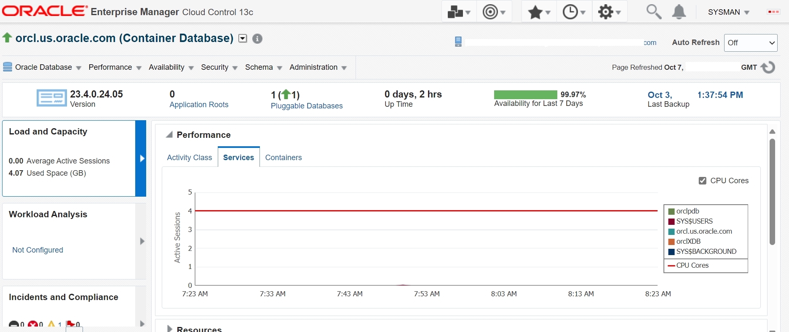
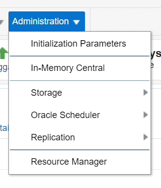
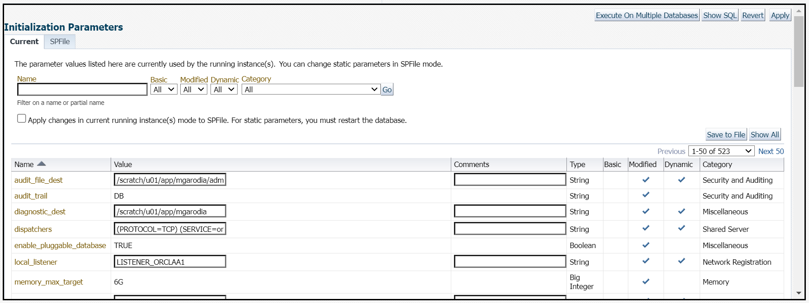
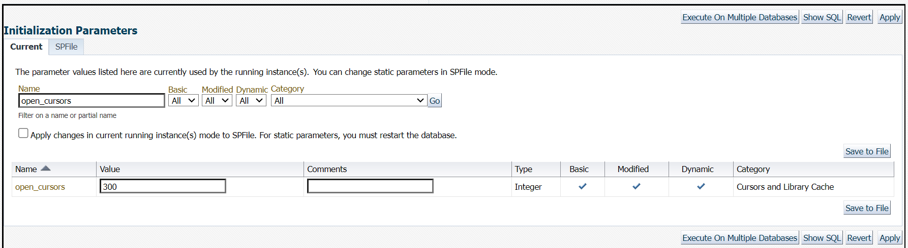
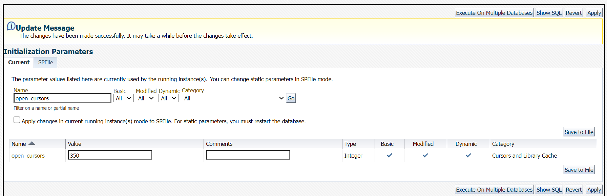
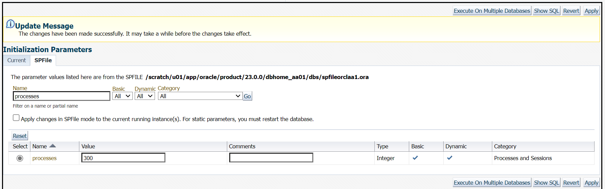

<!-- Condition: EMCC -->

# View <if type="emcc">and manage</if> initialization parameters

## Introduction

<!-- Condition: EMCC, ORDS -->

This lab walks you through the steps for viewing <if type="emcc">and managing</if> the intialization parameters of your Oracle Database using <if type="db-actions"></if> <if type="emcc"> (EM). You can view and modify the initialization parameters to administer the functioning of the database instance</if>.

Estimated time: 15 minutes

### Objectives

<!-- Condition: EMCC, ORDS -->

View <if type="emcc">and modify</if> the initialization parameters of your database instance from <if type="emcc"></if><if type="db-actions">the  console</if>.

> **Note**: This lab contains system-specific values and paths. These details might vary depending on the system you are using.

### Prerequisites

This lab assumes you have -

 -   An Oracle Cloud account
 -   Completed all the previous labs successfully
	<!-- Condition: EMCC -->
<if type="emcc">
 -   Logged in to  in a web browser as *sysman*
</if>
<!-- Condition: ORDS -->
<if type="db-actions">
 -   ORDS installed and configured
 -   *HR* schema enabled to access 
 -   Logged in to the  console in a web browser as PDBDBA
</if>

<!-- Condition: EMCC, ORDS -->

If you cannot log in to <if type="db-actions">the  console or  (ORDS)</if> <if type="emcc"> or EM</if> is not running, refer the [initialize-envionment](?lab=initialize-environment) lab and see the <if type="db-actions"></if><if type="emcc"></if> tab.

<!-- Condition: ORDS -->

<if type="db-actions">

## Task 1: Set environment variables

<!-- Building-Block: ORDS -->

## Task 2: Grant admin role to a user

If a user has administrative privileges, then they can view the details of a database instance using the Instance Viewer in .

In this task, you will grant the admin role, *ROLE_NAME*, to the user, *HR* from the SQL command line. 

<<== ***[MG]: Add a new task about how to grant the admin role to a user***

## Task 3: View initialization parameters
</if>

<!-- Condition: EMCC -->

<if type="emcc">

## Task 1: View and modify initialization parameters
</if>

<!-- Condition: EMCC, ORDS -->

In this task, you will view the initialization parameter *`processes`* <if type="emcc">and modify the values of the parameters *`open_cursors`* and *`processes`* from </if><if type="db-actions">from the  console</if>.

<!-- Building-Block: ORDS -->

<if type="db-actions">

</if>

<!-- Condition: EMCC -->

<if type="emcc">

1.  From the **Targets** menu, select **Databases**.

    

    The Databases page displays a list of Oracle Databases added to  as managed targets.

    

1.  Click the database instance name, *orcl.us.oracle.com*, to open the instance home page.

    

1.  From the **Administration** menu, select **Initialization Parameters**.

    

    The Database login screen appears.

1.  Click Named Credential. This option fills the credential details automatically.

    

    Click **Login** to proceed.

    

    The Initialization Parameters window has two tabs:

     - **Current** — This default tab displays all initialization parameter values that are currently active and in memory for the database instance.
     - **SPFile** — This tab displays initialization parameter settings in the server parameter file (SPFILE). The window displays the SPFile tab if the database instance starts with the SPFile. But if the database instance starts with the PFile, the window does not display this tab.

     > **Note**: If the **Value** field for a parameter is not editable, it means that the parameter is not dynamic. You cannot change that parameter for the current instance.

1.  Click the **SPFile** tab to view parameters in the server parameter file.

    

    The window displays the initialization parameters of the container database.

     > **Note**: The server parameter file is a binary file that can be written to and read by Oracle Database and is the recommended format for the initialization parameter file.

1. On the **SPFile** tab, view the parameter `processes` by performing the following steps.

     - **Name**: *processes*   
	 Enter the full name of the parameter. The **Name** field is case-sensitive.
     - **Basic**: Select **Yes** to limit the display to basic initialization parameters.
     - **Dynamic**: Select **Yes** to limit the display to dynamic initialization parameters. 
     - **Category**: You can select any category of initialization parameters to limit the search to that particular category. For this lab, leave the default. 

  Click **Go**.

  

  The window displays the value of the parameter `processes`. Similarly, you can view the values of other initialization parameters.

1.  Click the **Current** tab. In the **Name** field, enter the full name of the parameter *open_cursors*. Leave the defaults for the other fields and click **Go** to search for the parameter.

    

1.  Set the value for the parameter `open_cursors` to, for example, *350*.

    > **Note**: If you set `open_cursors` too high, the system can run out of memory. The **Comments** field is optional. You may enter a text explaining the reason for the change. Ensure that the **Apply changes in current running instance(s) mode to SPFile** option is not selected. Select this option only to modify the initialization parameter for the currently running instance and record the modifications in the server parameter file before the database restarts.

    Click **Apply**. A confirmation message appears. The **Current** tab displays the updated value of `open_cursors`.

    

1.  Click the **SPFile** tab. In the **Name** field, enter the full name of the parameter *processes*. Leave the defaults for the other fields and click **Go** to search for the parameter.

    

1. Set the value of the parameter `processes` to, for example, *300*.   
   The **Comments** field is optional. You may enter a text explaining the reason for the change.

    > **Note**: Ensure that the **Apply changes in SPFile mode to the current running instance(s)** option is not selected. Select this option only to modify the initialization parameter for the currently running instance and record the modifications in the server parameter file before the database restarts.

    Click **Apply**. A confirmation message appears. The **SPFile** tab displays the updated value of 'processes'.

    

    Similarly, you can view and modify the initialization parameters of the Container Database (CDB) and Pluggable Database (PDB) by switching between containers from the database instance home page.

    

In a PDB, the Initialization Parameters page includes the PDB Modifiable column. Each initialization parameter that can be modified at the PDB level has a check mark in the PDB Modifiable column.

> **Note**: Any initialization parameter in a PDB that does not have a check mark in the PDB Modifiable column can be set and modified only in the root. The value set in the root applies to the individual PDBs in the multitenant CDB.

Initialization parameters exist at both the CDB level and the PDB level. By default, initialization parameters at the PDB level inherit the value from the initialization parameters at the CDB level. 

You may now **proceed to the next lab.**
</if>

<!-- Condition: ORDS -->

<if type="db-actions">

Congratulations! You have successfully completed the workshop on *View Parameters of Oracle Database 23ai* using .

</if>

## Acknowledgments

<!-- Condition: EMCC -->

<if type="emcc">
 -   **Author** - Aayushi Arora, Database User Assistance Development Team
 -   **Contributors** - Manish Garodia, Jayaprakash Subramanian, Ashwini R
 -   **Last Updated By/Date** - Aayushi Arora, October 2024
</if>

<!-- Condition: ORDS -->

<if type="db-actions">
 - **Author** - Aayushi Arora, Database User Assistance Development Team
 - **Contributors** - Jeff Smith, Manish Garodia, Manisha Mati
 - **Last Updated By/Date** - Aayushi Arora, October 2024
</if>

<!--

Legends -

    "prod_em": "Oracle Enterprise Manager",
    "prod_emcc_full": "Oracle Enterprise Manager Cloud Control",
    "prod_db_actions": "Database Actions",
    "prod_db_actions_full": "Oracle Database Actions",
    "prod_ords": "Oracle REST Data Services"

Building Blocks - 

	"em-intro-about": "./../../../../dba-essentials-series-23ai/manage-instance-memory-23ai/intro-instance-memory/building-blocks-em/em-manage-instance-intro-about-this-workshop.txt",
	"em-intro-db-instance": "./../../../../dba-essentials-series-23ai/manage-instance-memory-23ai/intro-instance-memory/building-blocks-em/em-manage-instance-intro-app1-db-instance.txt",
	"em-intro-shutdown-db": "./../../../../dba-essentials-series-23ai/manage-instance-memory-23ai/intro-instance-memory/building-blocks-em/em-manage-instance-intro-app1-shutdown-db-instance.txt",
	"em-intro-start-db": "./../../../../dba-essentials-series-23ai/manage-instance-memory-23ai/intro-instance-memory/building-blocks-em/em-manage-instance-intro-app1-start-db-instance.txt",
	"em-intro-auto-mem-mgmt": "./../../../../dba-essentials-series-23ai/manage-instance-memory-23ai/intro-instance-memory/building-blocks-em/em-manage-instance-intro-app2-auto-mem-mgmt.txt",
	"em-intro-db-mem-mgmt": "./../../../../dba-essentials-series-23ai/manage-instance-memory-23ai/intro-instance-memory/building-blocks-em/em-manage-instance-intro-app2-mem-mgmt-db-instance.txt",
	"ords-intro-about-db-actions": "./../../intro-db-instance/building-blocks-ords/ords-view-params-intro-app2-about-db-actions.txt",
	"ords-view-params-task-set-env-var": "./../../intro-db-instance/building-blocks-ords/ords-view-params-task-set-env-var.txt",
	"ords-task-view-init-params": "./../../intro-db-instance/building-blocks-ords/ords-view-params-task-view-initialization-params.txt"

Conditions - 

	"db-actions":"Database Actions",
	"emcc":"Oracle Enterprise Manager"

-->

