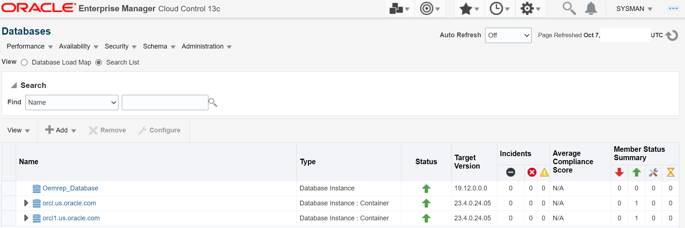
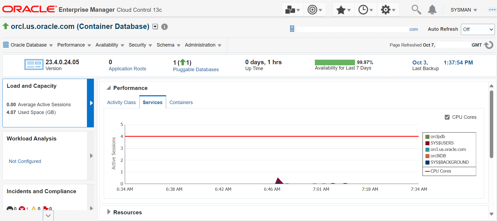
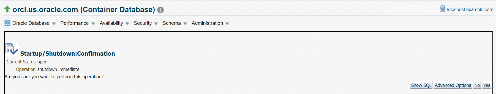
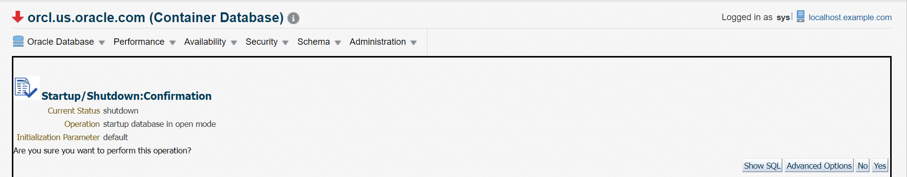
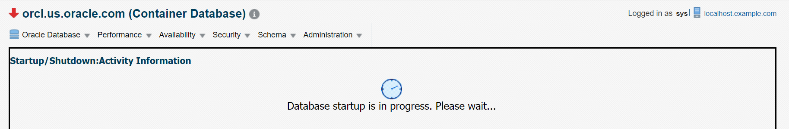

# Shut down and start up database instance

## Introduction

This lab steps you through the procedure to shut down and start up the database instance using SQL commands and Oracle Enterprise Manager Cloud Control (EM).

Estimated time: 15 minutes

### Objectives

-   Set the environment variables
-   Shut down and start up the database instance from SQL command line
-   Shut down and start up the database instance from Oracle Enterprise Manager

### Prerequisites

This lab assumes you have -

-   An Oracle Cloud account
-   Completed all previous labs successfully
-   Oracle Enterprise Manager with Oracle Database and listener added as managed targets

> **Note**: This lab contains system-specific values and paths. These details might vary depending on the system you are using.

## Task 1: Set environment variables

To connect to your Oracle Database from a terminal, set the environment variables if not already set. These variables remain in the terminal until you close the terminal window.

> Note that environment variables set in one terminal do not apply automatically to other terminals you may have. If you open a new terminal or have a terminal window already open, then you must set these variables in that terminal to connect to Oracle Database.

In this task, you will set the following environment variables for your Oracle Database.
 - *`$ORACLE_SID`*
 - *`$ORACLE_HOME`*
 - *`$ORACLE_BASE`*

1. Open a terminal window and go to the `bin` directory in Oracle home. For this lab, the location of the bin directory is as follows.

	```
	$ <copy>cd /u01/app/oracle/product/23.4.0/dbhome_1/bin</copy>
	```

1. Set the environment variables with the script, *oraenv*.

	```
	$ <copy>./oraenv</copy>
	```

1. When prompted for `$ORACLE_SID`, enter *orcl*.

	```
	ORACLE_SID = [oracle] ? <copy>orcl</copy>
	The Oracle base has been set to /u01/app/oracle
	```

	> **Note**: Oracle SID is case-sensitive.

	This command sets the variables *`$ORACLE_SID`* and *`ORACLE_BASE`*. It also sets the *`$ORACLE_HOME`* path to *`/u01/app/oracle/product/23.4.0/dbhome_1`*.

You have set the environment variables for your Oracle Database in the currently active terminal. You can now connect to Oracle Database and run the SQL commands.

**Tip**: If you have reserved a Livelabs sandbox environment, then you can run the script .set-env-db.sh from the home location and enter the corresponding number for the ORACLE_SID. It sets the environment variables automatically.

## Task 2: Shutdown the database instance from SQL Command Line

After setting the environment as instructed in *Task 1* of this lab, you can shut down the database instance from SQL command line.

1.  From `$ORACLE_HOME/bin`, log in to SQL Plus as SYSDBA.
    ```
    $ <copy> ./sqlplus / as sysdba </copy>
    ```
    ```  
    SQL*Plus: Release 23.0.0.0.0 - Production on Mon Oct 7 06:37:16 20XX
    Version 23.4.0.24.05

    Copyright (c) 1982, 2024, Oracle. All rights reserved.

    Connected to:Oracle Database 23ai Enterprise Edition Release 23.0.0.0.0 - Production
    Version 23.4.0.24.05

    SQL>
    ```

2. View the current status of database instance. Verify that the instance is *OPEN*.
    ```
    SQL> <copy> select status from v$instance; </copy>
    ```
    ```
    STATUS
    ------------
    OPEN
    ```

3. Close the Oracle Database and shut down the instance in *IMMEDIATE* mode from the SQL prompt.
    ```
    SQL> <copy> shutdown immediate </copy>
    ```
    ```
    Database closed.

    Database dismounted.

    ORACLE instance shut down.
    ```
    The Oracle Database shuts down immediately.

4. View the current status of the database instance. Verify that the Oracle Database is not open.

    ```
    SQL> <copy> select status from v$instance;</copy>
    ```
    ```
    ERROR at line 1:ORA-01034: The Oracle instance is not available for use. Start the instance.
    ```
  
The output confirms that Oracle Database is in closed state. 

You have now shut down the database instance. 

## Task 3: Start the database instance from SQL Command Line

To run SQL commands, you must start the database instance.

1.  Start the database instance again and open Oracle Database from SQL command line.

    ```
    SQL> <copy> startup </copy>
    ```
    ```
    ORACLE instance started.
    Total System Global Area 9951006048 bytes
    Fixed Size                 10038624 bytes
    Variable Size            1543503872 bytes   
    Database Buffers         8388608000 bytes
    Redo Buffers                8855552 bytes
    Database mounted.
    Database opened.
    ```
The database instance starts in the default mode, *OPEN*.

> **Note:** When you start the CDB, all PDBs remain in the mounted mode. There is no default mechanism to automatically open PDBs when the CDB starts.

2. View the current status of the PDBs.
    ```
    SQL> <copy> show pdbs </copy>
    ```
    ```
    CON_ID        CON_NAME                 OPEN MODE     RESTRICTED
    ----------    -----------------------  ---------     ----------
    2             PDB$SEED                 READ ONLY     NO
    3             ORCLPDB                  MOUNTED
    ```

3. Start all PDBs in your Oracle Database.
    ```
    SQL><copy> alter pluggable database all open;</copy>
    ```
    ```
    Pluggable database altered.
    ```
The database instance opens all PDBs in the container. 

4. View the status of the current database instance. Verify that the Oracle Database is *OPEN*.

    ```
    SQL><copy> select status from v$instance;
    ```
    ```
    STATUS
    ------------
    OPEN
    ```
You have restarted the database instance successfully from the SQL command line.

## Task 4: Shut down the database instance from Oracle Enterprise Manager

In this task, you will learn how to shut down the database instance from the Oracle Enterprise Manager. Log in to EM from a web browser and do the following.

1.  From the **Targets** menu, select **Databases**.
    
    The Databases page displays the list of Oracle Databases added to EM as managed targets.  
    

2.  Click the database instance name, *orcl.us.oracle.com*, to open the instance home page.  
    

3.  From the **Oracle Database** menu, go to **Control** and select **Startup/Shutdown**.
    
    
    The Host and Target Database Credentials page appears.
    

4.  For Host Credentials, specify the following.  

    **Credential**: *Named*  
    Oracle EM fills in the **UserName** and **Password** fields automatically.  
    You can click **More Details** and then click **Test** to verify that the specified host credentials are working. 

5.  For Database Credentials, specify the following.

    **Credential**: *Preferred*. This is the default value selected.  
    **Preferred Credential Name**: *SYSDBA Database Credentials*. This is the credential you assigned during Oracle Database installation.  

    Click **OK** to proceed.

6.  The window prompts you to confirm the operation. Click **Yes** to start the `SHUTDOWN IMMEDIATE` operation on Oracle Database. 
    

    The Startup/Shutdown Activity Information page appears, informing you that the database is being shut down.
    

7.  After a few minutes, click **Refresh** to return to the Database home page.
    

The downward red arrow in the status indicates that Oracle Database is down.

## Task 5: Start the database instance from Oracle Enterprise Manager

After shutting down Oracle Database in EM, you can start the database instance as follows.

1.  On the instance home page from the **Oracle Database** menu, select **Control** and click **Startup/Shutdown**.
    

    The Host and Target Database Credentials page appears.
    

2.  For Host Credentials, specify the following.
    
    **Credential**: *Named*  
    Oracle EM fills in the **UserName** and **Password** fields automatically.

3.  For Database Credentials, specify the following.

    **Credential**: *Preferred*  
    **Preferred Credential Name**: *SYSDBA Database Credentials*. This is the credential you assigned during Oracle Database installation.

    Click **OK** to proceed.

4.  Click **Yes** to start the database in the `OPEN` mode.
    

    The Startup/Shutdown Activity Information page appears, informing you that the database is being started.
    

5.  After a few minutes, click **Refresh** to return to the Database home page.
    
    The upward green arrow in the status indicates that Oracle Database is up and running.

To learn more about the various start up modes, see [Appendix 1: Overview of Oracle database instance and Memory Management](?lab=intro-instance-memory#Appendix1:OverviewofOracleDatabaseInstanceandMemoryManagement) in the *Introduction* lab.

## Acknowledgments

-   **Author** - Aayushi Arora, Database User Assistance Development Team
-   **Contributors** - Manish Garodia, Jayaprakash Subramanian, Ashwini R
-   **Last Updated By/Date** - Aayushi Arora, October 2024


