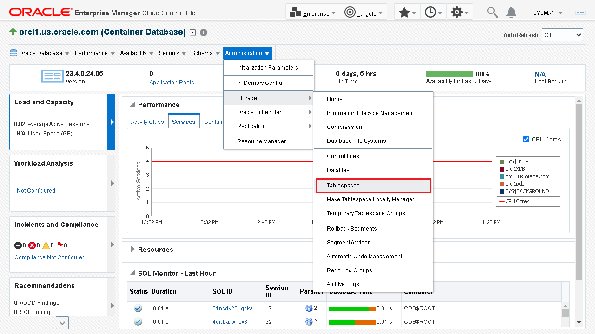

# Manage tablespaces

## Introduction

This lab demonstrates how to view the tablespaces and create a new tablespace in your Oracle Database using Oracle Enterprise Manager Cloud Control.
  
Estimated time: 15 minutes

### Objectives

-   View tablespaces
-   Create tablespaces

> **Note:** This lab contains many system-specific values. Such details might vary depending on the system you are using.

### Prerequisites

This lab assumes you have:

-   An Oracle Cloud account
-   Completed all previous labs successfully
-   Logged in to Oracle Enterprise Manager Cloud Control in a web browser as *sysman*

## Task 1: View the tablespaces

Oracle Enterprise Manager Cloud Control enables you to view information such as the configuration, size, and status of the tablespaces in the Oracle Database.

Perform the following steps to view the tablespaces in your Oracle Database:

1.  In the **Administration** menu, go to the **Storage** option and select **Tablespaces**.

    

2.  View the **Tablespaces** page. It contains the details of the tablespaces in the database, including the default tablespaces, such as `SYSTEM` and `SYSAUX`.

    The **Tablespaces** page displays the following information for each tablespace:

    -   the Container where the tablespace resides
    -   the name of the tablespace
    -   the Available Space in percentage and in size (GB)
    -   the Allocated Space in percentage and in size (GB)
    -   the Allocated Free Space in size (GB)
    -   whether the Autoextend feature is enabled
    -   the Status of the tablespace indicating that it is online, offline, or read-only
    -   the Number of Datafiles
    -   the type of Tablespace
    -   the type of Extent Management
    -   the type of Segment Management.
    
    

## Task 2: Create a new tablespace

You can create new tablespaces to keep your application data separate for backup and recovery. If the application data is kept in a separate tablespace, then you can take that tablespace offline and recover it without affecting the operation of other database applications.

Perform the following steps to create a new tablespace, Tablespace1, in the Container Database (CDB):

1.  On the **Tablespaces** page, click **Create** to begin creating a new tablespace.

    > **Note:** The **Create Like** option from the Actions drop-down list creates a tablespace similar to an existing tablespace. For this lab, do not use this option.

    

2.  On the **Create Tablespace** page in the **General** tab, specify the details for the new tablespace.

    -   **Name:** Enter a name for the tablespace, for example, *Tablespace1*.
    -   **Extent management:** Leave the default option, *Locally Managed*.
    -   **Type:** *Permanent*. This option stores permanent data, such as system data.
    -   **Status:** Leave the default option, *Read Write*. This option allows you to read and write to the tablespace after creating it.

    

3.  In the **Datafiles** section of the **General** tab, click **Add** to add one or more data files to the tablespace.

    > **Note:** The **Use bigfile tablespace** option allows a tablespace to have only one data file with no practical size limit. For this lab, do not select this option.

    

4. On the **Add Datafile** page, specify the following information for the new datafile and click **Continue** to proceed.

    -   **File Name:** Enter a name, for example, *Datafile*.
    -   **File Directory:** It displays a prefilled value. You can click the magnifier icon beside this field to change the current directory. For this lab, do not change the default value.
    -   **Tablespace:** It displays the tablespace name. You cannot modify this value.
    File Size: 100 MB.
    -   **Select Automatically extend data file when full (AUTOEXTEND)**. This sets the tablespace to automatically extend itself by a specified amount when it reaches its size limit.
        
        > **Note:** you can set a tablespace to automatically extend itself by a specified amount when it reaches its size limit. If you do not enable the autoextend option, then the database gives an alert when the tablespace reaches its critical or warning threshold size.

    -   **Increment:** 10 MB. This is the amount of disk space added to the data file when it needs more storage space.
    -   **Maximum File Size:** Unlimited. This option permits the file size to increase without any limits.

    

5. The new datafile gets added to the **Datafiles** section of the **General** tab. Leave the default values for the **Storage** and **In-Memory Column Store** tabs. Review the information and click **OK** to create the tablespace.

    An update message appears confirming that the tablespace has been created.

    

6. Click the database instance **orcl1.us.oracle.com** link to go to the database instance home page.

    

You may now **proceed to the next lab**.

## Acknowledgements

-	**Author:**  Suresh Mohan, Database User Assistance Development Team
-	**Contributors:** Manisha Mati, Suresh Rajan, Manish Garodia
-	**Last Updated By/Date:** Suresh Mohan, October 2024