# Manage undo data

## Introduction

This lab demonstrates how to view and manage the undo tablespace in your Oracle Database using Oracle Enterprise Manager Cloud Control.  

Estimated time: 15 minutes

### Objectives

Perform these tasks in your Oracle Database from Oracle EMCC:

-   View undo data
-   Compute the minimum undo tablespace size
-   Set the undo tablespace size to a fixed size using the Undo Advisor

> **Note:** This lab contains many system-specific values. Such details might vary depending on the system you are using.

### Prerequisites

This lab assumes you have:

-   An Oracle Cloud account
-   Completed all previous labs successfully
-   Logged in to Oracle Enterprise Manager Cloud Control in a web browser as *sysman*

## Task 1: View undo information

1.  In the **Administration** menu, go to the **Storage** option and select **Automatic Undo Management**.

    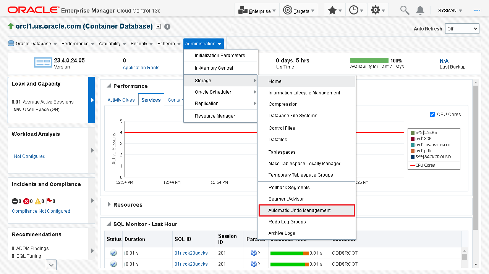

2. View the **Automatic Undo Management** page. It contains details of the undo settings for your database.

    It shows information about the **General** settings, such as:

    - The name and size of the tablespace. The database instance can have multiple undo tablespaces, but only one can be active at a given time.
    - Whether Auto-Extensible is enabled for the tablespace.
    - The Undo Mode information.

    It also shows information about the **Undo Advisor** settings, such as:

    - Analysis Time Period.
    - Required Undo Retention period.
    - Minimum Required Undo Tablespace Size (in MB).
    - Recommended Undo Tablespace Size (in MB).

    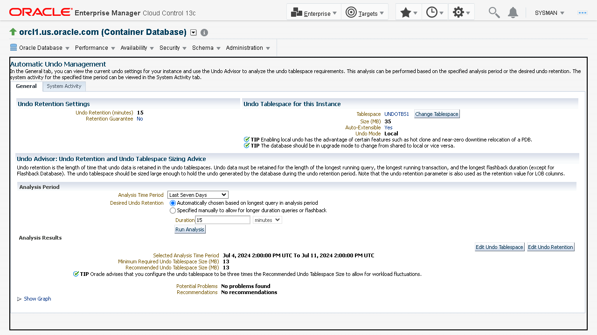

## Task 2: Compute minimum undo tablespace size automatically

Oracle Database automatically manages the undo data and the undo tablespaces. With the Undo Advisor, you can determine the minimum size requirement for the undo tablespace for a particular undo retention time.

You can either compute the minimum size of the undo tablespace automatically or set the undo retention period manually.
The automatically calculated undo retention time is based on the duration of the longest-running query and the undo generation rate. Oracle recommends performing this task if you do not use the Oracle Flashback features. The Undo Advisor analyzes the data collected over specific periods of time.

Perform the following steps to configure Undo Advisor to compute the minimum undo tablespace size automatically:

1. On the **Automatic Undo Management** page, in the **Analysis Period** section, specify the following and click **Run Analysis** to analyze the minimum and recommended Undo Tablespace size.

    -   **Analysis Time Period:** Select the time period for the analysis. Leave the default option, *Last Seven Days*.
    -   **Desired Undo Retention:** Leave the default option, *Automatically chosen based on longest query in analysis period*.

        > **Note:** The undo advisor automatically calculates this value depending on the duration of the longest-running query and the undo generation rate. These values are visible on the **System Activity** tab of this page.

    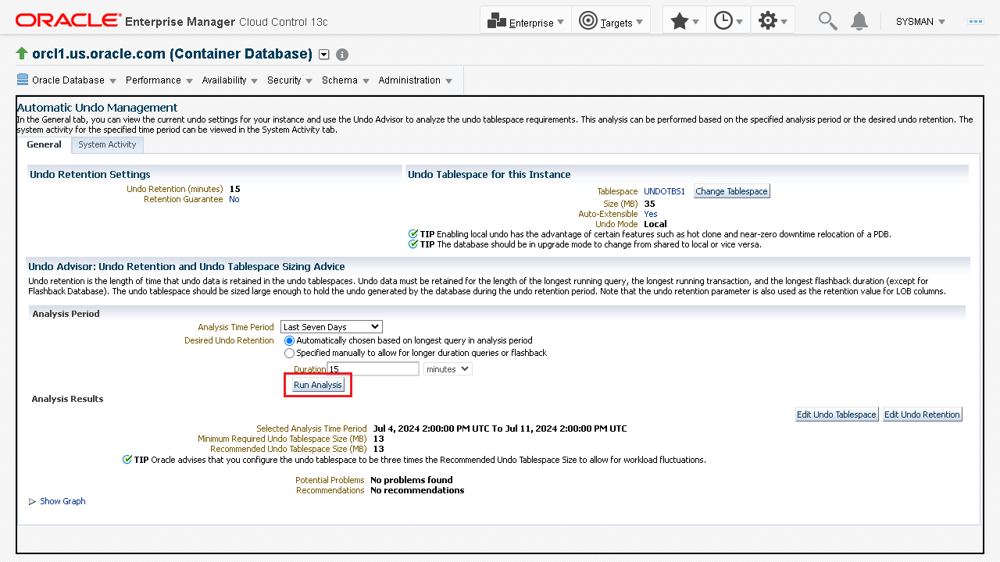

2. The Undo Advisor evaluates and displays the Analysis Results. Click **Show Graph** to view the analysis results in graphical format.

    > **Note:** Running an analysis or setting the minimum undo retention with the Undo Advisor does not change the size of the undo tablespace.

    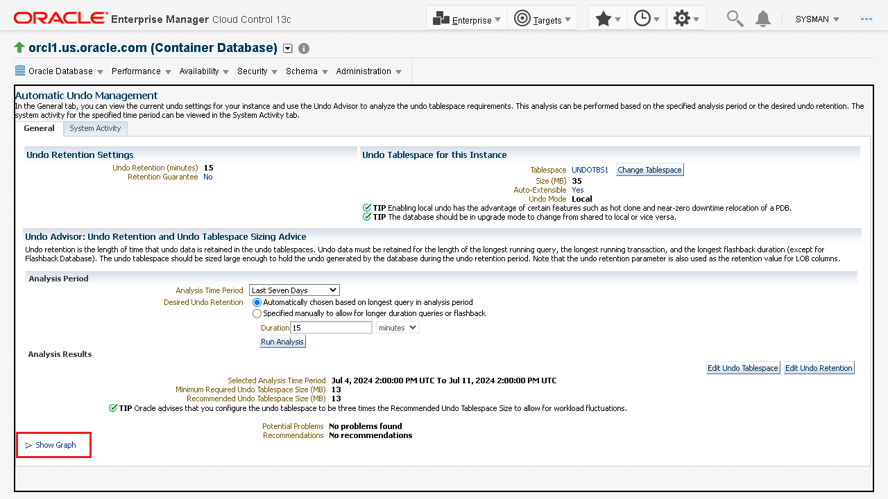

    The analysis graph will be displayed.

    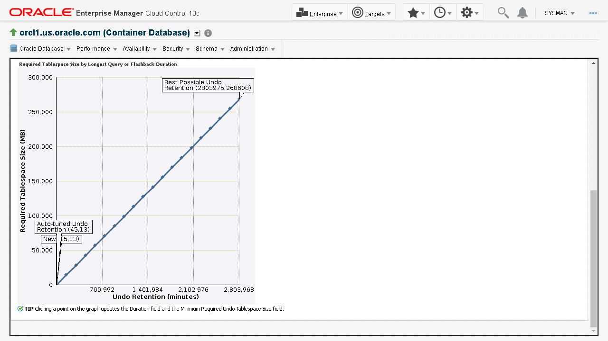

## Task 3: Set the minimum undo retention period manually

You can either compute the minimum size of the undo tablespace automatically as described in the previous task or set the undo retention period manually.

Perform the following steps to configure Undo Advisor and specify the duration of the undo retention period manually:

1.  On the **Automatic Undo Management** page, in the **Analysis Period** section, specify the following, and click **Run Analysis** to analyze the minimum and recommended Undo Tablespace size.

    -   **Analysis Time Period:** Select the time period for the analysis. Leave the default option, Last Seven Days.
    -   **Desired Undo Retention:** Select the option, Specified manually to allow for longer duration queries or flashback.
    -   **Duration:** Provide duration as 2 days. This value must be greater than the longest-running active query. The maximum value for the longest undo retention is 2,147,483,647 seconds. If you enter a value greater than the maximum value, Oracle Database returns an Undo Management error. To determine the duration of your required Undo retention:
        -   Check the longest-running query for your workload. You can check the duration of the **Longest Running Query** from the **System Activity** tab in the **Automatic Undo Management** page.
        -   Determine the longest interval for Oracle Flashback operations.
        -   Determine the maximum of these two values and enter this duration. For this lab, it is *2 days*.

    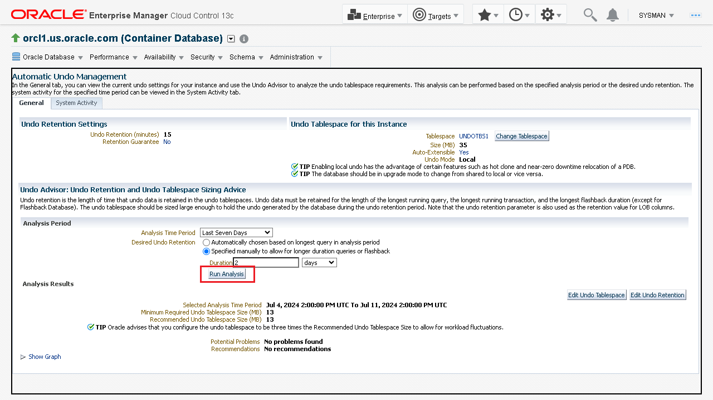

2. The Undo Advisor evaluates and displays the Analysis Results. Click **Show Graph** to view the analysis results in graphical format.

    > **Note:**
    - Running an analysis or setting the minimum undo retention with the Undo Advisor does not change the size of the undo tablespace.
    - By selecting any preferred value of undo retention period at any point on the curve, the **Duration**  field changes to match the selected undo retention period, and the **Minimum Required Undo Tablespace Size**  field changes to reflect the matching required size.

    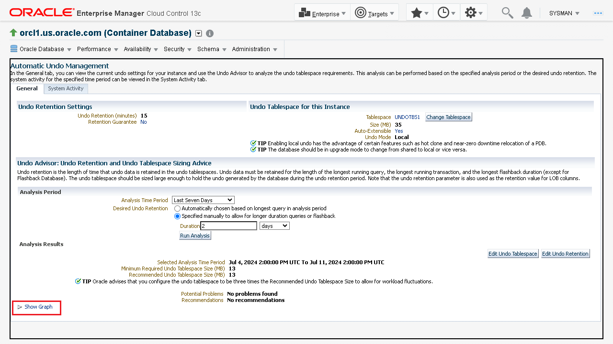

    The analysis graph will be displayed.

    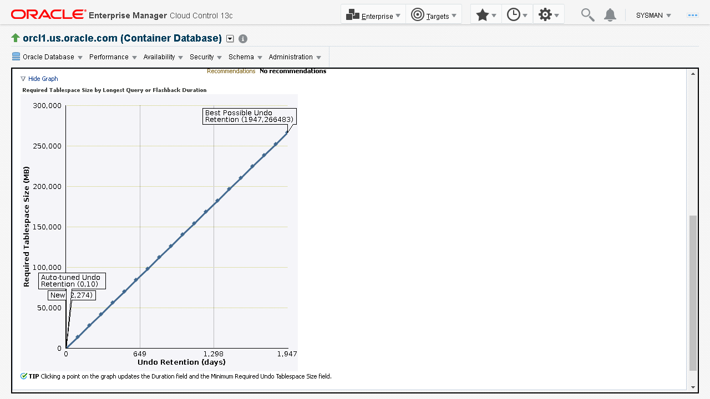

## Task 4: Set the undo tablespace to a fixed size

You can configure the undo tablespace to have a fixed size. You first set the undo tablespace to its minimum required size in order to handle the workload. Then use Undo Advisor to set the undo tablespace to a fixed size for future long-running queries and for Oracle Flashback operations.

Perform the following steps to set the undo tablespace to a fixed size:

1. On the **Automatic Undo Management** page, in the **Analysis Results** section, click **Edit Undo Tablespace**.

    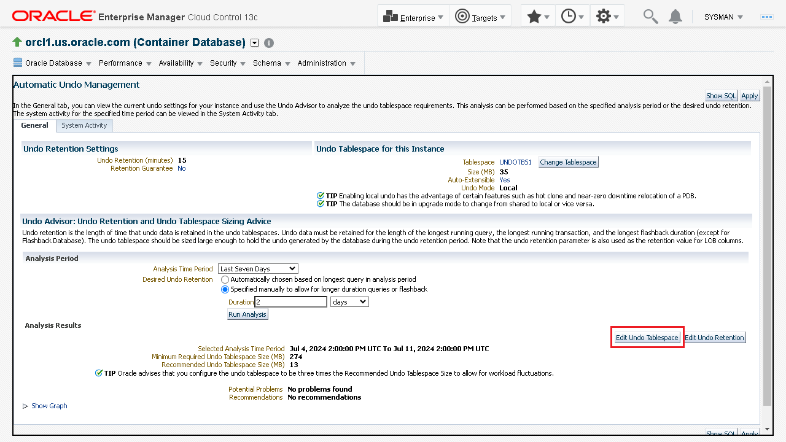

2. On the **Edit Tablespace** page, the **General** tab displays information about the tablespace. In the **Datafiles** section, click **Edit** to edit the datafile.

    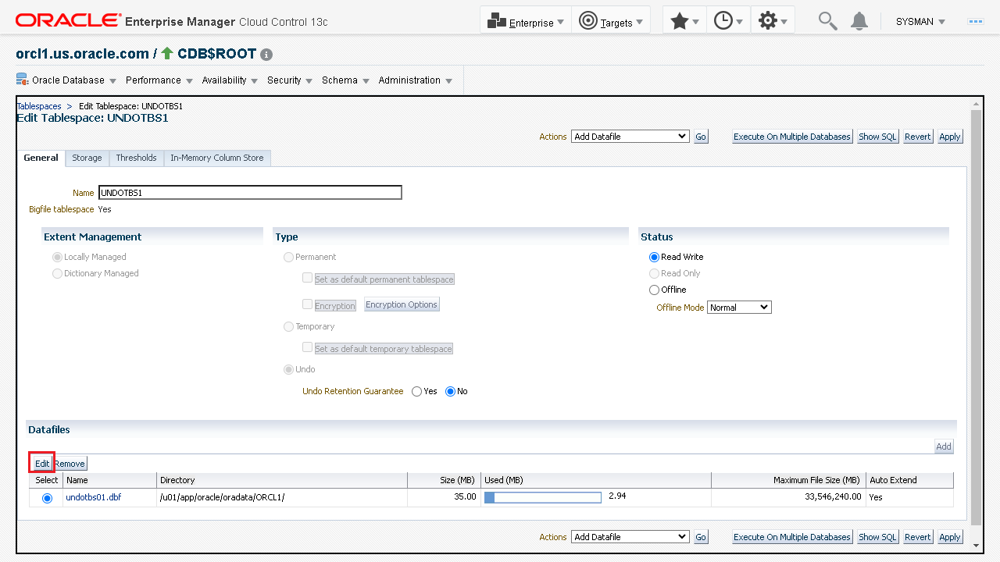

3. On the **Edit Datafile** page, provide the following details and click **Continue** to proceed.

    -   **File Size:** Enter *500 MB*. This is the value of the minimum required undo tablespace size from the previous task.
    -   **Status:** Leave the default option, *Online*. If the status of the Tablespace is *Offline*, then you cannot access it. The Offline status is useful for recovering the data files of the tablespace in the event of a failure.
    -   In the ***Storage*** section, deselect **Automatically extend data file when full (AUTOEXTEND)**.

    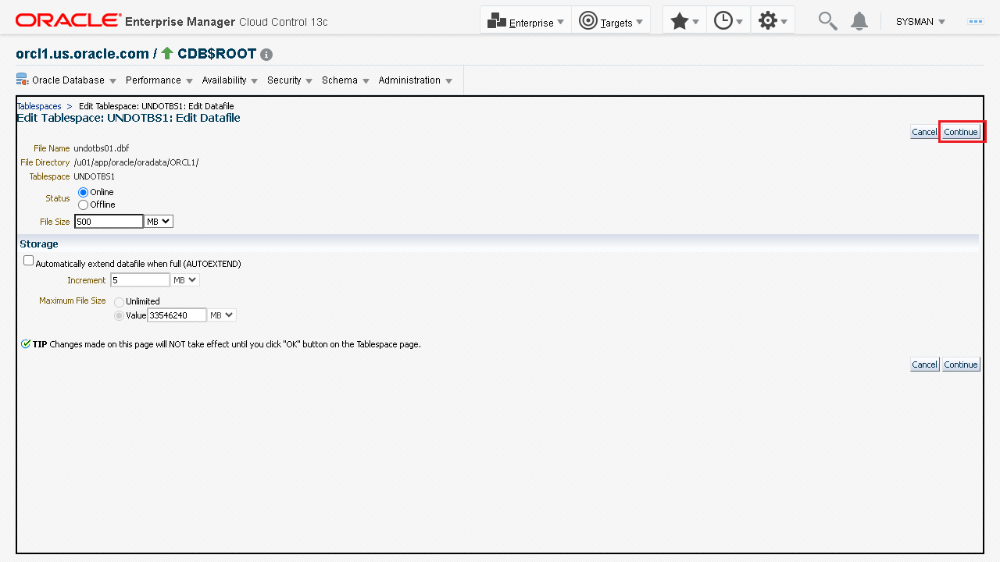

4. The window goes back to the **Edit Tablespace** page and displays a message to apply the changes. Click **Apply** to make the changes.

    An update message appears confirming that the tablespace has been modified. You have now modified the undo tablespace to a fixed size.

    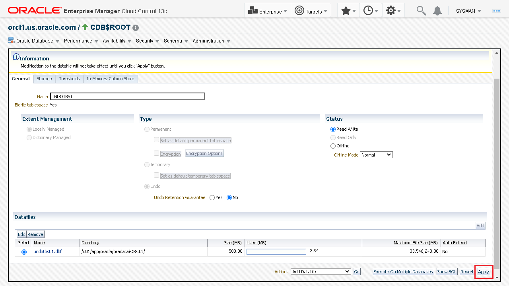

5. From the **Oracle Database** menu, select **Home** to go to the database instance home page.

    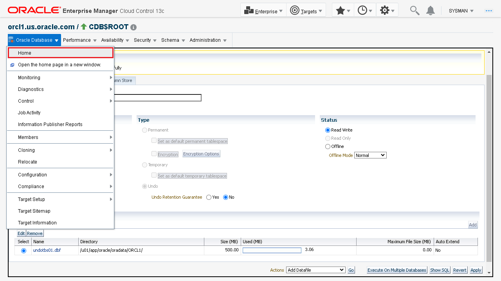

    The database instance home page is displayed.

    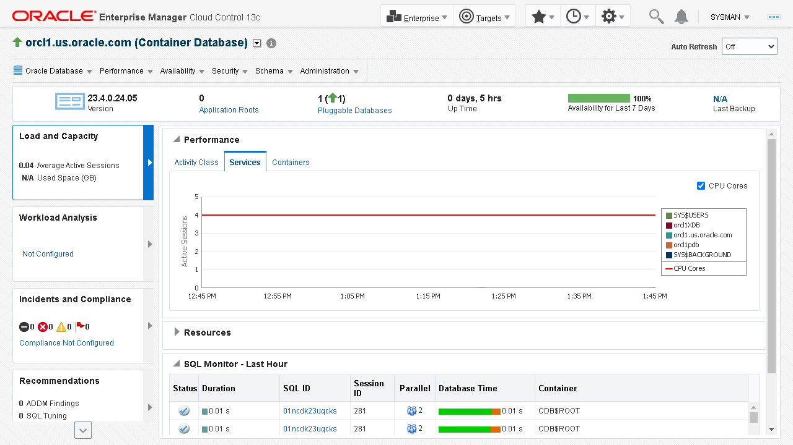

*Congratulations!* You have successfully completed the workshop on *Storage structures for Oracle Database*.

In this workshop you learned how to view control files, online redo log files, archived redo log files and undo data information. You also multiplexed the online redo log files, created a new tablespace and computed the minimum undo tablespace size using Undo Advisor in the Oracle Enterprise Manager Cloud Control.

## Acknowledgements

-	**Author:**  Suresh Mohan, Database User Assistance Development Team
-	**Contributors:** Manisha Mati, Suresh Rajan, Manish Garodia
-	**Last Updated By/Date:** Suresh Mohan, October 2024