# View and multiplex online redo log file information

## Introduction

This lab walks you through the steps to view and multiplex Online Redo Log File information of your Oracle Database.

Estimated time: 15 minutes

### Objectives

-   View online redo log file
-   Multiplex online redo log information

> **Note:** This lab contains many system-specific values. Such details might vary depending on the system you are using.

### Prerequisites

This lab assumes you have:
-   An Oracle Cloud account
-   Completed all previous labs successfully
-   Logged in to Oracle Enterprise Manager Cloud Control in a web browser as *sysman*

## Task 1: View Online Redo Log File

Oracle Database maintains online redo log files to protect it against data loss. Specifically, after an instance fails, the online redo log files help the database recover committed data. An online redo log consists of two or more online redo log files. Oracle Database requires a minimum of two files to confirm that one is always available for writing while the other is in archive mode..

Perform the following steps to view the online redo log file of your Oracle Database:

1.  In the **Administration** menu, go to **Storage** and select **Redo Log Groups**.

    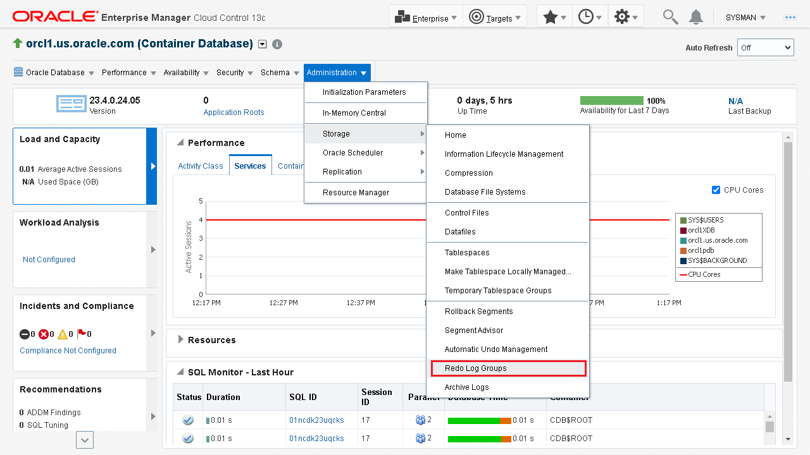

2. View the **Redo Log Groups** page. It contains the details of the groups and displays the following information:

    -   The **Group** of online redo log files. A group consists of an online redo log file and its multiplexed copies. It is a numeric value.
    -   The **Status** attribute of the online redo log group. The online redo log group with the status Current is the one that the log writer is using to write to the disk.
    -   The **Members** of the online redo log group. Each identical copy of the online redo log file is a member of that group.
    -   The **Archived** attribute of the online redo log group. It is set to Yes when you enable the archiving of the online redo logs.
    -   The **Size** of the online redo log group.
    -   The **Sequence** attribute of the online redo log group.
    -   The **First Change** attribute of the online redo log group.

    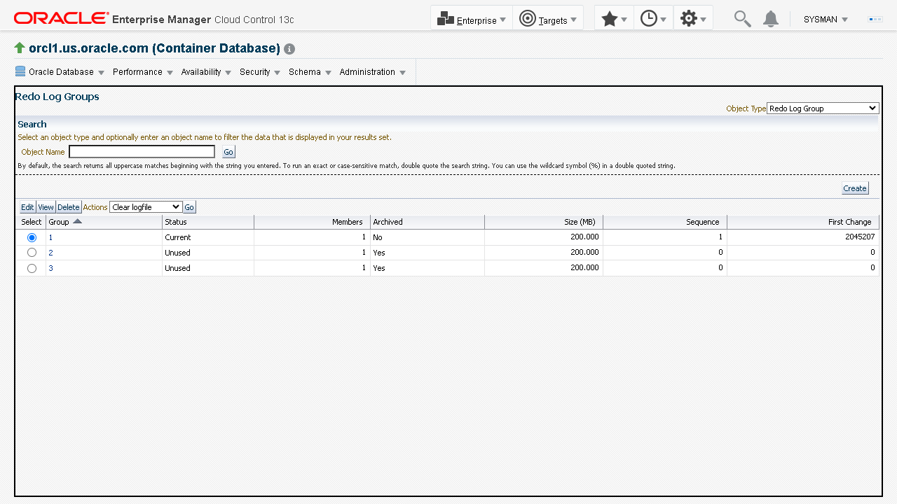

3. Select **Group *1*** in the Select column and click **View** to view the online redo log files present in *Group 1*.

    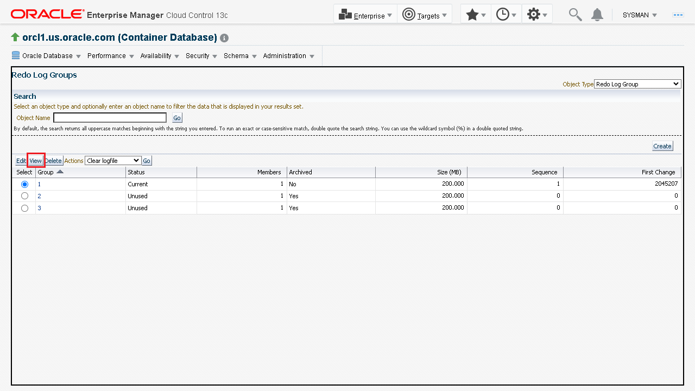

4. View the **View Redo Log Group** page. It displays the number of redo log files present in that group. It also displays the file name and location of the Redo log file. For this lab, there is one Redo Log file present in *Group 1*.

    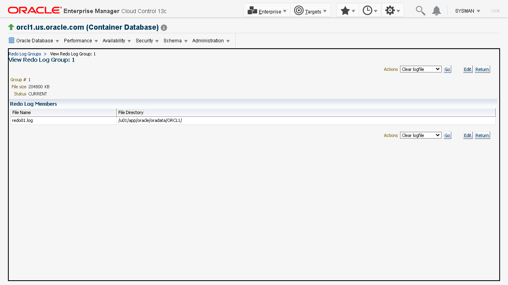

5. Click **Return** to go back to the **Redo Log Groups** page.

    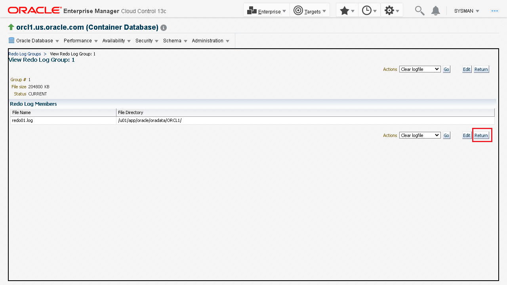

	
## Task 2: Multiplex Online Redo Log information

When you multiplex the online redo log information, you maintaining multiple copies of the online redo log files.

Perform the following steps to multiplex the online redo log file in *Group 1*:

1. On the **Redo Log Groups** page, select a group number, for example, *Group 1*, and click **Edit**.

    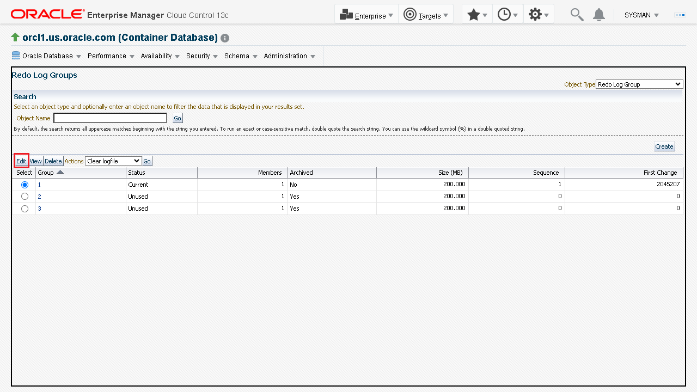

2. In the **Edit Redo Log Group** page, click **Add** to add a new member to the Redo Log Group.

    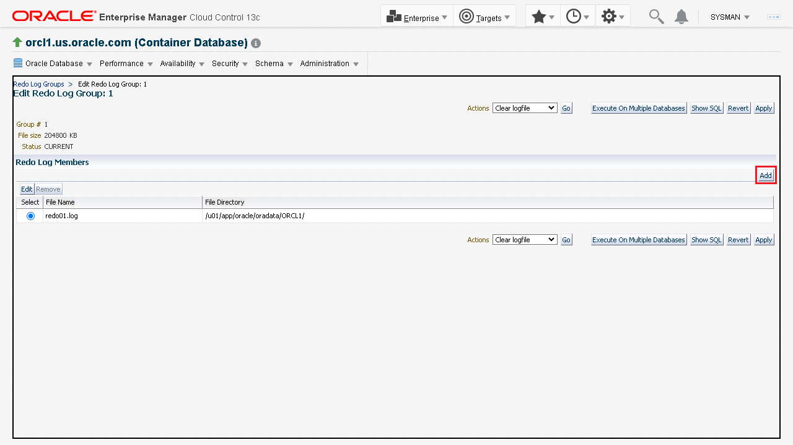

3. In the **Add Redo Log Member** page, provide the following details to add a redo log member and click **Continue** to proceed.

    -   **File Name**: Enter a name for the redo log file, for example, redo01a.log.
    -   **File Directory**: Enter a location for the file.

    > **Note:** To protect against a failure involving the redo log itself, Oracle recommends that you enter a different directory than the other member of the redo log file group. However, even if all copies of the redo log are in the same location, the redundancy can help protect against I/O errors, file corruption, and so on.

    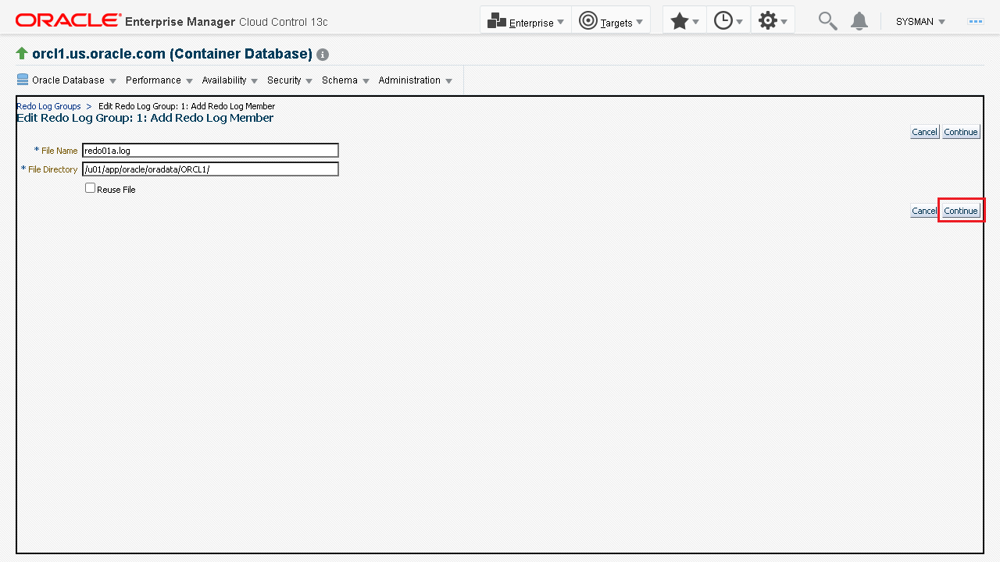

4. The **Edit Redo Log Group** page displays the newly added member of the online redo group. Click **Apply** to multiplex the redo log file.

    An update message appears confirming that the *Redo Log Group 1* has been modified.

    > **Note:** Oracle Database does not require symmetrical multiplexed redo log files. For example, one online redo log group can have only one member, and other groups can have two members. However, an instance redo log must have at least two groups.

    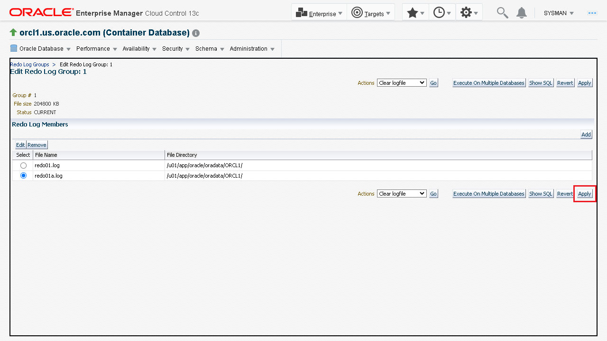

5. Click **Redo Log Groups** to go to Redo Log Groups home page.

    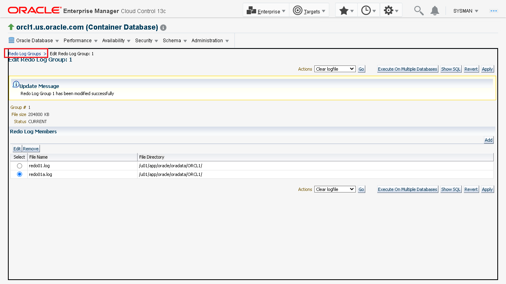

6. From the **Oracle Database** menu, select **Home** to go to the database instance home page.

    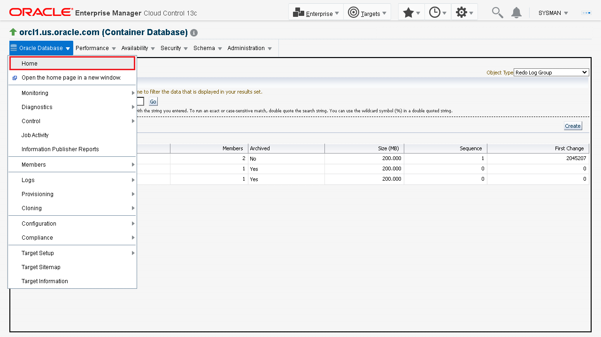

You may now **proceed to the next lab**.

## Acknowledgements

-	**Author:**  Suresh Mohan, Database User Assistance Development Team
-	**Contributors:** Manisha Mati, Suresh Rajan, Manish Garodia
-	**Last Updated By/Date:** Suresh Mohan, October 2024