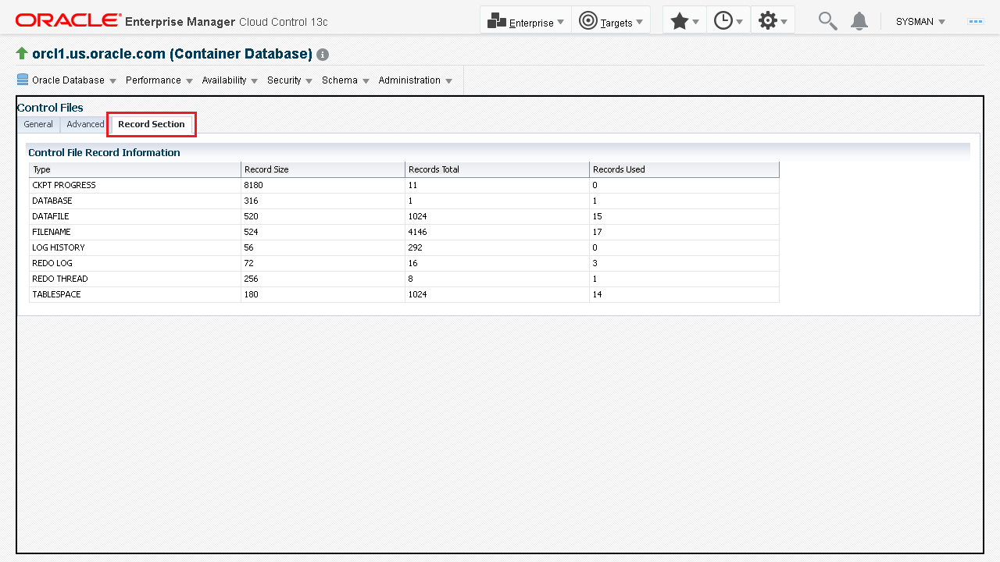

# View the storage structures

## Introduction

This lab demonstrates how to view the storage structures in your Oracle Database using Oracle Enterprise Manager Cloud Control.

Estimated time: 15 minutes

### Objectives

-   View storage administration
-   View control files
-   View archive logs

> **Note:** This lab contains many system-specific values. Such details might vary depending on the system you are using.

### Prerequisites

This lab assumes you have:
-   An Oracle Cloud account
-   Completed all previous labs successfully
-   Logged in to Oracle Enterprise Manager Cloud Control in a web browser as *sysman*

## Task 1: View Storage Administration

Perform the following steps to view the Oracle Database storage administration page in the Oracle Enterprise Manager Cloud Control:

1. On the Oracle Enterprise Manager Cloud Control web page, go to the **Targets** menu and select **Databases**.

    

2. The **Databases** page lists the Oracle Databases as managed targets.

    Select the database instance for which you want to view the details. In this example, the ***orcl1.us.oracle.com*** container database instance is selected.

    

3. View the database instance home page. It displays various details about the selected database.

    

4. On the database instance home page, from the **Administration** menu, go to the **Storage** option and select **Home**.

    

5. View the **Storage Home** page. It displays the storage usage details.

    

6. From the **Oracle Database** menu, select **Home** to go to the database instance home page.

    

## Task 2: View Control Files

Control files track the structural changes to the database. When you add, rename, or delete a data file or an online redo log file, the database updates the control files to reflect this change. You can view this information about the **Control Files** page.

Perform the following steps to view the control file information for the database instance:

1. In the **Administration** menu, go to the **Storage** option and select **Control Files**.

    

2. On the **Control Files** page, the **General** tab displays the control files and their location.
    > **Note:** Oracle recommends that you maintain a copy of the control files on different disk drives.

    

3. Select the **Advanced** tab to view the status of the data stored in the control file.

    The **Advanced** tab displays the following information:
    -   the Database ID
    -   the type of control file
    -   the time-stamp of control file creation
    -   the current log sequence number
    -   the last changed number
    -   the time-stamp of the last modification
    -   whether the control file has AutoBackup enabled.

    

4. Select the **Record Section** tab to view the record information of the control file, including associated data files and redo log files.

    

5. From the **Oracle Database** menu, select **Home** to go to the database instance home page.

    

## Task 3: View Archive Logs

Perform the following steps to view the archive log information of your Oracle Database:

1.  In the **Administration** menu, go to the **Storage** option and select **Archive Logs**.

    

2.  View the **Archive Logs** page. It displays the archived redo log information of the Oracle Database. The database must be in `ARCHIVELOG` mode to view the archive log details.

    

3. From the **Oracle Database** menu, select **Home** to go to the database instance home page.

    

You may now **proceed to the next lab**.

## Acknowledgements

-	**Author:**  Suresh Mohan, Database User Assistance Development Team
-	**Contributors:** Manisha Mati, Suresh Rajan, Manish Garodia
-	**Last Updated By/Date:** Suresh Mohan, October 2024