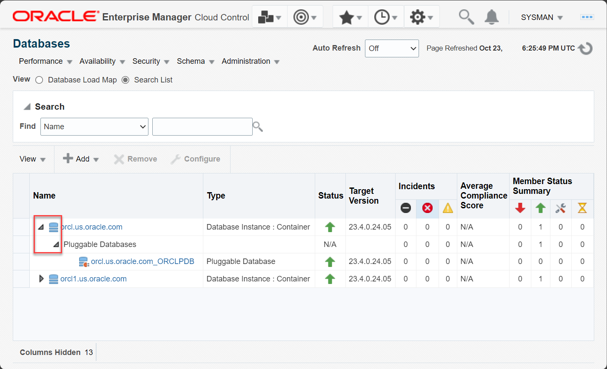
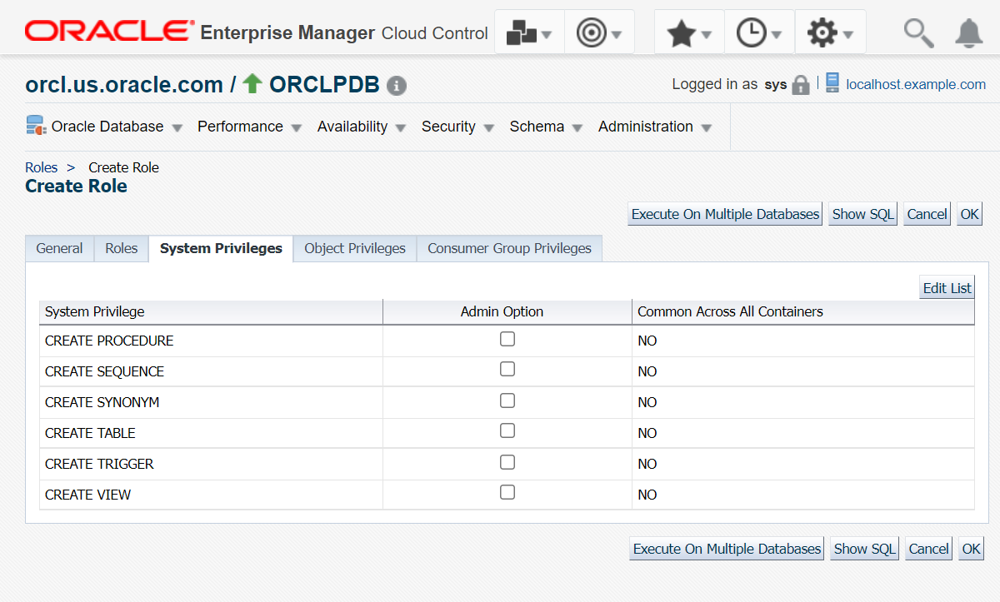

# Manage roles

## Introduction

This lab shows the steps for creating and managing roles in your Oracle Database from Oracle Enterprise Manager Cloud Control (EM). 

Estimated time: 10 minutes

### Objectives

Perform these tasks from Oracle Enterprise Manager:
 -   View existing roles in your Oracle Database
 -   Create a new role in Pluggable Database (PDB)
 -   Modify a role

### Prerequisites

This lab assumes you have -

 -   An Oracle Cloud account
 -   Completed all previous labs successfully
 -   Logged in to Oracle Enterprise Manager in a web browser as *sysman* 

> **Note**: 

## Task 1: View roles in Oracle Database

As the *sysman* user, you have the privileges to view and manage roles in Oracle Database from Oracle Enterprise Manager. You can go to the respective container, CDB or PDB, and view the roles in that container. 

In this task, you will view the details of the role *CONNECT* in the PDB. 

1.  From the **Targets** menu at the top, select **Databases** to open the Databases page.  

      

	The Databases page displays all database systems added to Oracle Enterprise Manager as managed targets.

1.  Click the expand/collapse triangle next to the database instance name, for example *orcl.us.oracle.com*, and then expand Pluggable Databases. The list displays all PDBs under the selected container.

    

	Click the PDB name, *ORCLPDB*, to open the PDB home page.

1.  From the **Security** menu on the PDB home page, select **Roles** to access the roles in the PDB.

    

    Oracle Enterprise Manager redirects to the Database Login page.  

1.  Select the *Named* Credential option, if not already selected, and click **Login** to connect to the database.

    

	> **Tip**: To learn how to set up Named Credentials, see the lab [Initialize environment](?lab=initialize-environment).

    The Roles page opens and displays all roles in the PDB.

      

    The table displays the following information for all roles:  
     - **Role** - the role name
     - **Authentication** - the authentication type for the role, for example, NONE, PASSWORD, etc.
     - **Common Role** - whether the role is common across all containers in the database   

    The table has the first role selected by default.  

1.  Select a role from the given table and view its details. For this task, view the details of the role *CONNECT*.   
    In the **Object Name** field, enter the role name, *connect*, and click **Go** to search for the role.   
	The field is not case-sensitive. The table displays the *CONNECT* role selected.

	Click **View** to see the details of the selected role.

      

    Alternatively, you may scroll down the table and click the role name to view its details.  

1.  The View Role page displays the Authentication type and all the roles and privileges granted to the selected role.

      

    Note that there are no object privileges granted to the *CONNECT* role.   
    Click **Return** to go back to the Roles page.

Similarly, you can view the roles in the CDB from the database instance home page in Oracle Enterprise Manager. 

## Task 2: Create a role in PDB

You can create a role in your Oracle Database from Oracle Enterprise Manager. To create a role in the database, go to the container where you want to create the role. 

> **Note:** 

In this task, you will create a role *appdev* in the PDB for application developers and grant system privileges to the role.

1.  On the Roles page, click **Create** to start creating a role in the PDB.

      

     > **Note:** The **Create Like** option creates a new role in the database by duplicating an existing role. For this lab, do not use this option. 

1.  On the Create Role page in the **General** tab, enter a **Name** for the role.   
    For this lab, enter the role name as *appdev*. The field is not case-sensitive.

      

    Optionally, you may select the **Authentication** type for the role. For this lab, leave the default value, *None*.   

     > **Note:** You cannot modify the name after creating the role.  

1.  Go to the **System Privileges** tab and click **Edit List** to select system privileges.

      

     > **Note:** The system privileges table displays no records because Oracle Database does not grant any default privileges automatically. The other buttons are not relevant for this lab.  

1.  The Modify System Privileges page displays the **Available System Privileges** that you can grant to your role.

     > **Note:** You can double-click an available system privilege to add it to the selected privileges list. Similarly, double-click a system privilege to remove it from the selected privileges list. To select multiple items, press the **ctrl** button on your keyboard and select the privileges.  

      

    For this lab, select these privileges in **Available System Privileges** and then click the **Move** button -   
     - `CREATE PROCEDURE`
     - `CREATE SEQUENCE`
     - `CREATE SYNONYM`
     - `CREATE TABLE`
     - `CREATE TRIGGER`
     - `CREATE VIEW`

    If you erroneously added a privilege to **Selected System Privileges**, then click the selected privilege and click **Remove** to move it back to **Available System Privileges**. 

1.  The **Selected System Privileges** list now displays the privileges you selected for the role in the previous step.

      

    Click **OK** to grant the selected privileges.  

     > **Note:** The set of system privileges that you grant to the role depends on your requirements. Oracle recommends the principle of least privilege where you grant only those privileges required to perform the task. 

1.  Verify that the **System Privileges** tab displays the privileges that you granted to your role.

      

     > **Note:** 

1.  Click **Show SQL** to view the SQL statement for this task.

      

    Click **Return** to go back to the **System Privileges** tab. 

1.  Leave the remaining tabs and fields and click **OK** to create the role in the PDB.  
    Oracle Enterprise Manager displays a confirmation message that you have created the role successfully.  
	The Roles page displays *APPDEV*, the role you created in this task. The values may differ depending on the system you are using.

	   

Similarly, you can create roles in the CDB from the database instance home page. 

## Task 3: Modify a role

Suppose you want to grant more roles to an existing role in a container or edit the system privileges of a role. You can modify the roles in your Oracle Database from Oracle Enterprise Manager. To modify a role in the database, go to the container where the role exists and **Edit** the role. 

> **Note:** 

In this task, you will modify the role *APPDEV* in the PDB that you created in the previous task. 

1.  On the Roles page, select the role *APPDEV* from the table and click **Edit** to go to the Edit Role page.

      

    The Edit Role page opens for the selected role, *APPDEV*.

      

    Note that you cannot modify the name of the role. 

1.  On the Edit Role page, go to the **Roles** tab and click **Edit List** to select the roles.

      

     > **Note:** The roles table displays no records because Oracle Database does not grant any default roles automatically. The other buttons and options are not relevant for this lab.  

1.  The Modify Roles page displays **Available Roles** that you can grant to your role.

     > **Note:** You can double-click an available role to add it to the selected roles list. Similarly, double-click a role to remove it from the selected roles list. To select multiple items, press the **ctrl** button on your keyboard and select the roles.  

      

    For this lab, select these roles in **Available Roles** and then click the **Move** button -  
     - `CONNECT*`
     - `SELECT_CATALOG_ROLE*`

	

1.  The **Selected Roles** list now displays the roles you selected in the previous step.

      

    Click **OK** to grant the selected roles.  

     > **Tip:** The roles with an asterisk (`*`) are common roles. 

1.  The **Roles** tab displays the roles that you granted to your role. Select **Admin Option** for both roles.  
    This option enables the *APPDEV* role to grant roles to other users and roles in the container.   

      

1.  Go to the **System Privileges** tab and select **Admin Option** for all the privileges.   
    This option enables the *APPDEV* role to grant system privileges to other users and roles in the container.

      

     > **Note:** 

1.  Click **Show SQL** to view the SQL statement for this task.

      

    Click **Return** to go back to the Edit Role page. 

1.  Click **Apply** to modify the role.  
    Oracle Enterprise Manager displays an update message that you have modified the role successfully.  

      

From the **Security** menu, you may select **Roles** to go back to the Roles page.  

In this lab, you learned how to view existing roles in the PDB from Oracle Enterprise Manager. You also learned how to create a new role in your Oracle Database and modify the properties of an existing role.

You may now **proceed to the next lab**.

## Acknowledgments

 - **Author** - Manish Garodia, Database User Assistance Development
 - **Contributors** - Ashwini R, Jayaprakash Subramanian, Manisha Mati
 - **Last Updated By/Date** - Manish Garodia, October 2024
