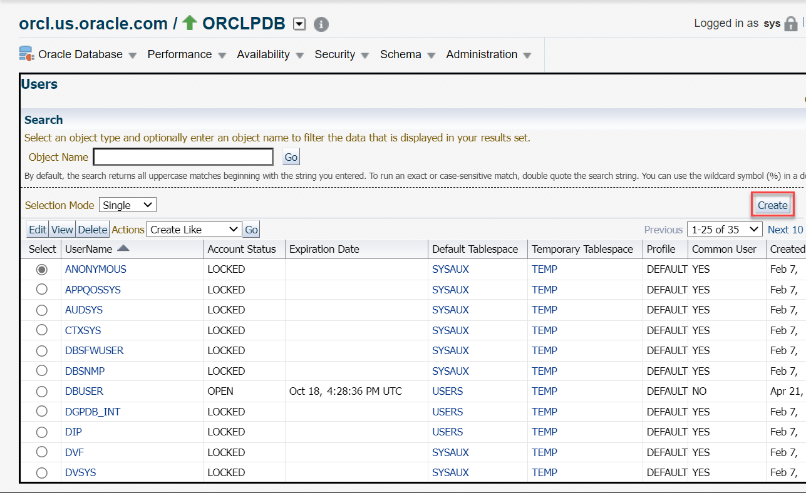
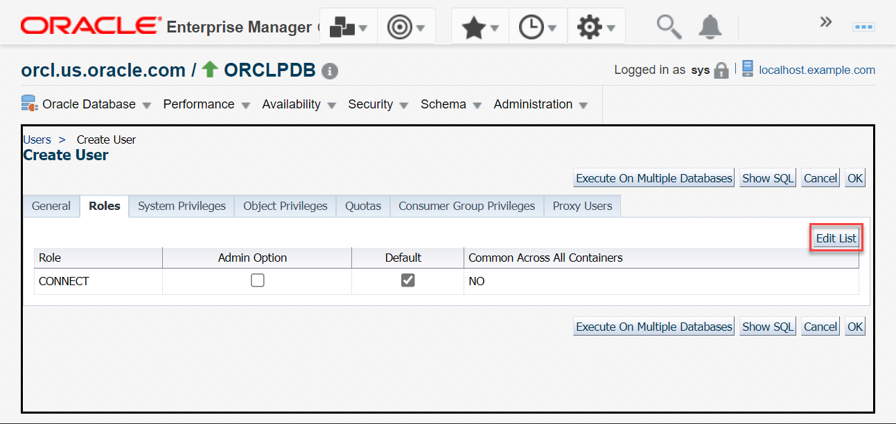
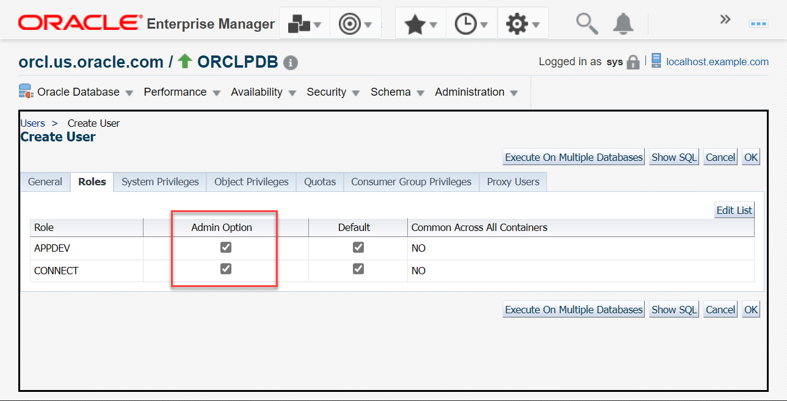
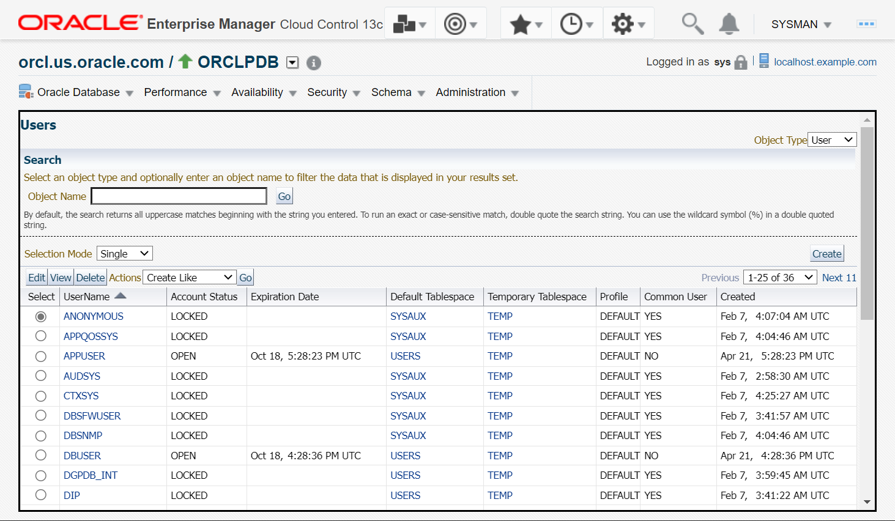
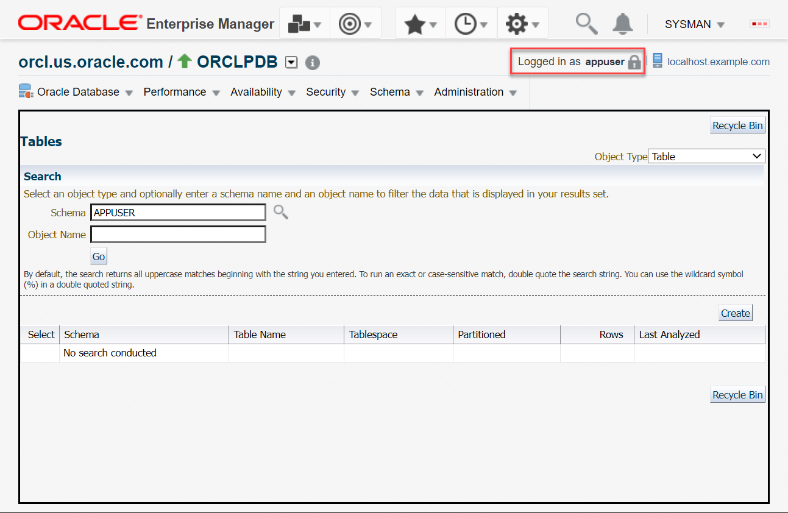

# Manage database user accounts

## Introduction

This lab walks you through the steps for managing user accounts and security for your Oracle Database from Oracle Enterprise Manager Cloud Control (EM). 

Estimated time: 10 minutes

### Objectives

Perform these tasks from Oracle Enterprise Manager:

 -   View existing user accounts in your Oracle Database
 -   Create a new user in Pluggable Database (PDB)
 -   Unlock a database user account
 -   Log in to PDB as the new user

### Prerequisites

This lab assumes you have -

 -   An Oracle Cloud account
 -   Completed all previous labs successfully
 -   Logged in to Oracle Enterprise Manager in a web browser as *sysman* 

> **Note**: 

## Task 1: View user accounts in Oracle Database

As the *sysman* user, you have the privileges to view and manage user accounts in Oracle Database from Oracle Enterprise Manager. You can go to the respective container, CDB or PDB, and view the users in that container. 

In this task, you will view the details of the user account *DBUSER* in the PDB.

1.  From the **Targets** menu, select **Databases** to open the Databases page.  

      

	The Databases page displays all database systems added to Oracle Enterprise Manager as managed targets.

1.  Click the expand/collapse triangle next to the database instance name, for example *orcl.us.oracle.com*, and then expand Pluggable Databases. The list displays all PDBs under the selected container.

      

	Click the PDB name, *ORCLPDB*, to open the PDB home page.

1.  From the **Security** menu on the PDB home page, select **Users** to access the users in the PDB.

      

    Oracle Enterprise Manager may redirect to the Database Login page. Select the *Named* Credential option, if not already selected, and click **Login** to connect to the Oracle Database.

    

	> **Note**: If you are already logged in to the database, then the login page does not appear.

1.	The Users page opens and displays all user accounts in the PDB.

      

    View all users information in the given table:  
     - **UserName** - the user name
     - **Account Status** - whether the user account is *LOCKED* or *OPEN*
     - **Expiration Date** - when the user account expires
     - **Default Tablespace** - the tablespace to use if the user does not explicitly specify
     - **Temporary Tablespace** - the tablespace to use for storing temporary data, for example, when SQL statements perform sort operations
     - **Profile** - the profile where the user account is located, usually *DEFAULT*
     - **Common User** - whether the user is common across all containers in the database
     - **Created** - the creation date of the user account  

    The table has a user account selected by default.  

     > **Tip:** The *DEFAULT* profile assigns the default password policy to a user account. 

1.  Select a user account from the given table and view its details. For this task, view the details of the user account *DBUSER*.  
    In the **Object Name** field, enter *dbuser* and click **Go** to search for the user.   
	The field is not case-sensitive. The table displays the *DBUSER* user account selected.

	Click **View** to see the details of the selected user.

      

    Alternatively, you may scroll down the table and click the user name to view its details.  

1.  The View User page displays the details of the selected user.

      

	The page displays the following information:
     - **General** - information such as profile, authentication type, default and temporary tablespaces, account status, etc.
     - **Roles** - that are granted to the user
     - **System Privileges** - that are granted to the user
     - **Object Privileges** - that are granted to the user
     - **Quotas** - for each tablespace in MBs
     - **Consumer Group Privileges** - that are granted to the user
     - **Proxy Users** - the users who can proxy for this user
     - **Proxied for Users** - the users who this user can proxy for

    Click **Return** to go back to the Users page.  

Similarly, you can view the user accounts in the CDB from the database instance home page in Oracle Enterprise Manager. 

## Task 2: Create a user in PDB 

To create a user in Oracle Database, go to the container where you want to create the user. You can create a new user account altogether or duplicate an existing user account. 

> **Note:** 

In this task, you will create a user account *appuser* in the PDB and grant the *appdev* role to the user.

1.  On the Users page, click **Create** to start creating a user account in the PDB.

      

     > **Note:** The **Create Like** option creates a new user account in the database by duplicating an existing user. For this lab, do not use this option. 

1.  On the Create User page in the **General** tab, enter the details of new user.

      

    For this lab, specify the following.   

     - **Name** - *appuser*   
     The field is not case-sensitive.   

	 Leave **Profile** as *DEFAULT* and **Authentication** as *Password*.   

     - **Password** - Set a password for the user, for example, *mypassword*  
     Ensure to note this password because when you log in to the PDB as *appuser*, you require this password.  

	 For this lab, do not select the **Expire Password now** option.   
	 This option enforces the user to create a new password the first time when the user tries to log in to the database.   

     - **Default Tablespace** - Click the magnifier icon, select a tablespace, for example, *USERS*, and click **Select**.   
     The `USERS` tablespace will store all schema objects that *appuser* will create.  

     - **Temporary Tablespace** - Click the magnifier icon, select a tablespace, for example, *TEMP*, and click **Select**.   

     - **Status** - Select *Locked*   

     > **Note:** You cannot modify the name after creating the user account.   

     See [Oracle Database Security Guide](https://docs.oracle.com/en/database/oracle/oracle-database/23/dbseg/keeping-your-oracle-database-secure.html#GUID-ED169179-BB00-4C1E-9C2D-C7C30CC4E6CA) for more information about secure passwords.  

1.  Go to the **Roles** tab and click **Edit List** to select the roles.

      

     > **Note:** The roles table displays the default role, *CONNECT*. The other buttons are not relevant for this lab.  

1.  The Modify Roles page displays the **Available Roles** that you can grant to your user.

     > **Note:** You can double-click an available role to add it to the selected roles list. Similarly, double-click a role to remove it from the selected roles list. To select multiple items, press the **ctrl** button on your keyboard and select the roles.  

      

    For this lab, select the role *APPDEV* in **Available Roles** and then click the **Move** button.  
	 

1.  The **Selected Roles** list now displays the *APPDEV* role you selected in the previous step.

      

     > **Note:** The roles with an asterisk (`*`) are common roles.

    Click **OK** to grant the selected role.  

1.  The **Roles** tab displays the *APPDEV* role and **Default** column selected.  
    Click **Admin Option** for both *APPDEV* and *CONNECT* roles. This option enables the user to grant roles to other users and roles in the container.   

      

     > **Note:** 

1.  Click **Show SQL** to view the SQL statement for this task.   

      

    Click **Return** to go back to the Create User page. Leave the defaults for the remaining fields.  

1.  Click **OK** to create the user in the PDB.  
    Oracle Enterprise Manager displays a confirmation message that you have created the user successfully.  

	The Users page displays *APPUSER* with an **Expiration Date** and **Account Status** as *LOCKED* along with other details.   

	

Similarly, you can create user accounts in the CDB from the database instance home page. 

## Task 3: Unlock a user account

To deny access temporarily to Oracle Database for a particular user account, you can lock the user instead of deleting it. Deleting a user also deletes all schema objects owned by the user. On locking a user account, when the user attempts to connect, the database denies access with an error message. 

You can unlock the user account from Oracle Enterprise Manager to enable database access again to that user. 

> **Note:** 

In this task, you will unlock the user account *APPUSER* in the PDB that you created in the previous task. 

1.  On the Users page, select the user *APPUSER* from the table and click **Edit** to open the Edit User page.

      

1.  On the Edit User page in the **General** tab, change the **Status** field to *Unlocked*.

      

    Note that you cannot modify the user name.  

1.  Click **Show SQL** to view the SQL statement for this task.

      

    Click **Return** to go back to the Edit User page.   

1.  Click **Apply** to unlock the user account.   
    Oracle Enterprise Manager displays an update message that you have modified the user successfully.

      

1.  From the **Security** menu in PDB, select **Users** to go back to the Users page.

      

    The Users page displays the **Account Status** for *APPUSER* as *OPEN*.

      

     > **Note:** After unlocking a user account, the user can access the database and connect to the container where the user has appropriate privileges. 

You can now log in to the PDB as the newly created user, *appuser*.

## Task 4: Log in to PDB as appuser

You are currently logged in to PDB as the database administrative user, *sys*. 

> **Note:** Each Oracle product has its corresponding administrative user accounts.

 -   For Oracle Database, the administrative user is *sys*.
 -   For Oracle Enterprise Manager, the administrative user is *sysman*.

In this task, you will log out of PDB and log back in as *appuser*, the user that you created in this lab.

1.  Check the current user that is logged in to the PDB. Verify that it is *sys*.

      

1.  On the top-right, click the Oracle Enterprise Manager profile menu *SYSMAN* &gt; and click **Log Out** to open the log out options.

      

    The Logout window opens and displays the current users that are logged in to the PDB and to Oracle Enterprise Manager. The window shows the default log out option, *ORCLPDB*, selected.  

1.  Leave the default log out option as *ORCLPDB* and click **Logout** to log out of PDB.

      

    You are now logged out of PDB as *sys* but still logged in to Oracle Enterprise Manager as *sysman*.   

     > **Caution:** Do not log out of Oracle Enterprise Manager.   

1.  To log in as another user, on the PDB home page go to one of the object's page.   
	For this task, from the **Schema** menu, select **Database Objects** &gt; click **Tables** to access the tables page.

      

    Oracle Enterprise Manager redirects to the Database Login page.  

1.  This time select the *New* Credential option to enter the login credentials.

      

    For this task, enter the following:  
	 - **Username** - *appuser*  
      Enter the user name you created earlier.  
	 - **Password** - *mypassword*  
      Enter the password for the user.
	 - Leave the default **Role** *Normal*.  

     > **Note:** Optionally, you may click **Save As** if you want to save the credentials for future logins. While saving, you can also set this as your preferred credentials.   

    Click **Login** to connect to the PDB.  
    The Tables page appears but contains no data because you have not created any schema.  

1.  Verify the current user that is logged in to the PDB.

      

    You have now logged in to the PDB as *appuser*. Similarly, you can change the current user and log in as another user if you have the credentials.

This brings you at the successful completion of this workshop on *user accounts and security management* for Oracle Database.

In this workshop, you learned how to:
 - view existing roles in the PDB
 - create new roles
 - modify roles
 - view existing users in the PDB
 - create new user accounts
 - modify users
 - unlock  user accounts
 - log in to your Oracle Database as another user

## Acknowledgments

 - **Author** - Manish Garodia, Database User Assistance Development
 - **Contributors** - Ashwini R, Jayaprakash Subramanian, Manisha Mati
 - **Last Updated By/Date** - Manish Garodia, October 2024
