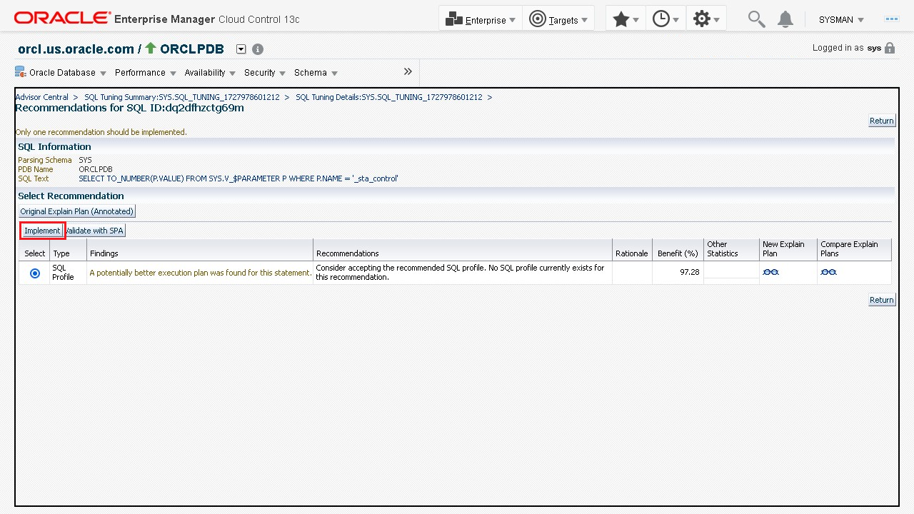

# Diagnose problems and improve performance using SQL Tuning Advisor

## Introduction

This lab shows the steps for diagnosing problems in Oracle Database 23ai and improving performance using the automatic SQL Tuning Advisor from Oracle Enterprise Manager Cloud Control. 

Estimated time: 45 minutes

### Objectives

-   Login to Oracle Database storage administration
-   Configure SQL tuning sets
-   Configure SQL Tuning Advisor

### Prerequisites

This lab assumes you have:
-   An Oracle Cloud account
-   Installed Oracle Database and Oracle Enterprise Manager Cloud Control
-   Completed all previous labs successfully

## Task 1: Login to Oracle Database Storage Administration

1.  On the Oracle Enterprise Manager Cloud Control home page, go to the **Targets** menu and select **Databases**.

      

2.  The **Databases** page lists the Oracle Databases added to Oracle Enterprise Manager Cloud Control as managed targets. Select the database instance for which you want to view the details. In this lab, the `orcl.us.oracle.com_ORCLPDB`, a Pluggable Database instance, is selected.

      

3.  The database instance home page displays various details about the selected database.

      

##  Task 2: Configure SQL Tuning Sets

1.  From the **Performance** menu, go to the **SQL** option and select **SQL Tuning Sets**.

      

2.  Oracle Enterprise Manager Cloud Control redirects to the **Database Login** page. On the **Database Login** page, provide the Oracle Database login credentials and click **Login** to connect to the Oracle Database.
    >   **Note:** Usually the `sys` user is used for login.

      

3.  The existing SQL tuning sets are displayed. You can select any existing tuning set. For this lab, we will create a new tuning set called WSDemo. To create a new SQL tuning set, click **Create**.

      

4.  In the Create SQL Tuning Set wizard, in the Options page, provide a name and click **Next**. For this lab, we use the name WSDemo.

      

5.  In the Create SQL Tuning Set wizard, in the Load Methods page, provide details of the load methods to collect and load SQL statements into the SQL tuning set, and click **Finish**. For this lab, select Incrementally capture active SQL statements over a period of time from the cursor cache option, set duration to 5 minutes, and Frequency to 2 seconds.

      

6.  In the Create SQL Tuning Set wizard, on the Review page, review the provided information and click **Submit**.

    A message confirming that the SQL tuning set `WSDEMO` has been created will be displayed along with the job number.

      

7.  After the time duration we set elapses, click the Refresh button to refresh the page. An updated SQL count will be displayed.

      

##  Task 3: Configure SQL Tuning Advisor

1.  From the **Performance** menu, go to the **SQL** option and select **SQL Tuning Advisor**.

      

2.  Oracle Enterprise Manager Cloud Control redirects you to the **Database Login** page if you are not already logged in. On the **Database Login** page, provide the Oracle Database login credentials and click **Login** to connect to the Oracle Database.
    >   **Note:** Usually the `sys` user is used for login.

      

3.  The Schedule SQL Tuning Advisor wizard appears. Specify the following information and click **Submit** to schedule a job and run the SQL Tuning Advisor.

    -   **Name:** Leave the default value.
    -   **Description:** Enter a brief note about the job.
    -   **SQL Tuning Set:** Click the magnifier icon and select your SQL tuning set. For this lab, the `WSDEMO` created in the previous task is used.
    -   **Total Time Limit (minutes):** `30`
    -   **Scope of Analysis:** `Comprehensive`
    -   **Time Limit per Statement (minutes):** `5`
    -   **Schedule:** Time when this job must be run. Leave the default value. For this lab, select `Immediately`.

      

4.  The SQL Tuning Advisor starts tuning the SQL statements. A processing dialog box appears that displays the status of the tuning task. The SQL tuning set that you select runs the Advisor, which analyzes the individual SQL statements and displays the progress of the analysis.

    -   After the SQL Tuning Advisor finishes the analysis of the SQL statements, the **Status** of the SQL Tuning Advisor task changes to `Completed`.
    -   If the Advisor is unable to analyze all the SQL statements, the task is still complete after it reaches the time limit, however, the status of the task is interrupted. It displays the results of the SQL statements that the Advisor was able to analyze within the given time frame.
    -   You can click **Interrupt** to stop the task.
    -   Clicking **Cancel** or closing the page will not stop the task run by the Advisor.

      

5.  After the Status is complete, the results are displayed on the SQL Tuning Result Summary page. It displays a graphical summary of the Automatic SQL Tuning Advisor activity.

    -   It displays the count of SQL statements the Advisor analyzed in the task.
    -   It also displays the SQL Profile Potential DB Time Benefit chart. The benefit of the SQL profile recommendations in DB time (in seconds) is displayed in bar charts. The bar charts have before and after bars, which denote the actual DB time and improved DB time, respectively.
    -   The SQL Examined Status pie chart displays the status of SQL statements the Advisor examined with findings, without findings, and skipped due to errors. You can click the legends of the pie chart to view the summary of the tuning recommendation for the SQL Statements for the selected type. Close the summary window.
    -   The Breakdown By Finding Type bar chart displays the count of SQL statements on the basis of the SQL Profile, Index, Statistics, Restructure SQL, and Alternative Plan. Click the bar to view a summary of the tuning recommendations for the selected bar. Close the summary window.

      

6.  Click **Show all results** on the previous screen to view the summary of the tuning recommendations for all the SQL statements analyzed. You can view the summary of the tuning recommendations the Advisor provides during the time frame you select.

      

7.  Click **View Recommendations** on the previous screen to view the details of the recommendation provided. It displays an overview of the recommendations. The different types of recommendations are SQL Profile, Alternative Plans, Restructure SQL, Error, and Miscellaneous. The Select Recommendation table lists the following information about the type of recommendation you select:

    -   **Findings:** The analysis of the recommendation.
    -   **Recommendation:** The recommendation advised by the Advisor.
    -   **Rationale:** The justification of the recommendation.
    -   **Benefit (%):** The estimated performance benefit calculated in percentage.
    -   **Other Statistics:** Click the icon to view the statistics for this plan.
    -   **New Explain Plan:** Click the icon to view the steps of execution of the New Plan. 
    -   **Compare Explain Plan:** Click the icon to view the comparison between the Original Explain Plan and New Explain Plan.

      

8.  On the **Recommendations** page, select a recommendation and click **Implement**. For this lab, **SQL Profile** is selected. A confirmation message appears. Select `Yes` to begin with the implementation.

    >   **Note:** The database advises that you can implement only one recommendation. Oracle recommends that you select the recommendation with the maximum benefit.

      

9.  The Recommendations for the SQL ID you select appears, with the confirmation message that the recommended SQL Profile was created successfully.

      

***Congratulations!*** You have successfully complete the workshop on ***monitoring and tuning the Oracle Database***. 

## Acknowledgements

-	**Author:**  Suresh Mohan, Database User Assistance Development Team
-	**Contributors:** Manisha Mati, Suresh Rajan, Manish Garodia
-	**Last Updated By/Date:** Suresh Mohan, October 2024