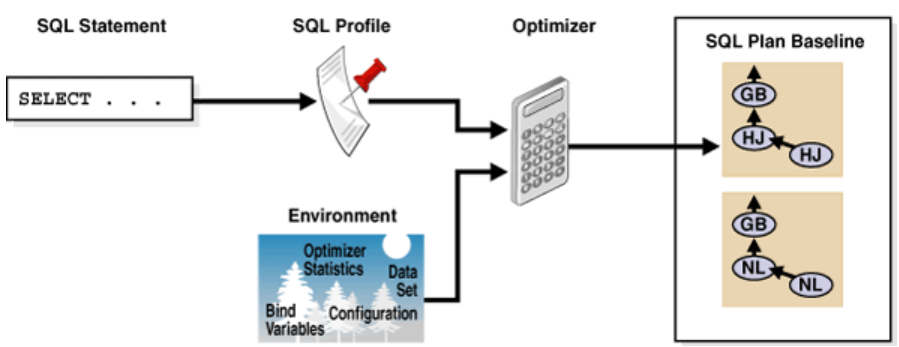

# Introduction to monitoring and tuning Oracle Database

## About this workshop

This workshop introduces you to using Oracle Enterprise Manager Cloud Control for monitoring the performance of your Oracle Database 23ai instance and ensuring that it runs optimally. It analyzes the workload running on the database, identifies issues, and implements corrective actions. This workshop helps you to effectively diagnose performance problems using the automatic SQL Tuning Advisor.

Estimated Workshop Time:  1 hour 30 minutes

### Objectives

-   Monitor the state of Oracle Database
-   Diagnose problems and improve performance using the automatic SQL Tuning Advisor

### Prerequisites

This lab assumes you have:
-   An Oracle Cloud account
-   Installed Oracle Database and Oracle Enterprise Manager Cloud Control

## Appendix 1: Overview of monitoring and tuning the Database

When problems occur in the database, it is important to perform an accurate diagnosis in time. Sometimes you look at the symptoms and immediately start changing the system to fix those symptoms. However, an accurate diagnosis of the problem significantly improves the performance of the database.

Oracle Database consists of a self-diagnostic engine called the Automatic Database Diagnostic Monitor (ADDM). ADDM helps the database to diagnose problems and recommend how to resolve them. The database periodically collects snapshots of its state and workload. These snapshots are stored in the Automatic Workload Repository (AWR).

**Primary functions of ADDM**

-   Analyze the data in AWR on a regular basis.
-   Identify the performance problems and determine their root cause.
-   Provide recommendations for corrective measures.

> **Note:** Since AWR is a repository of historical performance data, ADDM analyzes the performance issues after the diagnosis.

**Benefits of ADDM**

-   Generates an automatic performance diagnostic report by default.
-   Diagnoses problems based on tuning expertise.
-   Identifies the root cause of the problems, not the symptoms.
-   Recommends solutions to improve database performance.

However, it can take multiple tuning cycles to reach acceptable system performance. ADDM provides early warning of performance issues, which can help in the development and testing of the database.

Using ADDM, you can resolve various performance issues, including but not limited to the following:

-   **CPU bottlenecks**   
	ADDM verifies whether or not the rate at which system process progresses is limited by the speed of the CPU.

-   **Undersized memory structures**   
	ADDM checks whether or not the SGA, PGA, and buffer cache are adequately sized.

-   **I/O capacity issues**   
	ADDM checks whether or not the I/O system performs as expected.

-   **High load SQL statements**   
	ADDM verifies if any SQL statements consume excessive system resources.

-   **Database configuration issues**    
	ADDM checks if there is any evidence of incorrect sizing of log files, archiving issues, excessive checkpoints, or sub-optimal parameter settings.

### Automatic performance tuning features

Oracle Database provides different tools that enable you to gather information based on the performance of the database. Using these tools, you can monitor performance, diagnose problems, and tune applications. You can administer and monitor the output of the tuning tools with Oracle Enterprise Manager Cloud Control.

The automatic performance tuning features include:

-   **AWR**  
    AWR collects, processes, and maintains performance statistics for problem detection and self-tuning purposes.

-   **ADDM**  
    ADDM analyzes the information collected by the AWR for possible performance problems with the Oracle Database.

-   **SQL Tuning Advisor**   
    This advisor allows a quick and efficient technique for optimizing SQL statements without modifying any statements.

-   **SQL Access Advisor**   
    This advisor advices on materialized views, indexes, and materialized view logs.

-   **End-to-End application tracing**  
    It identifies excessive workloads on the system from a particular user, service, or application component.

-   **Server-generated alerts**   
    These alerts automatically provide notifications when the database detects impending problems.

-   **Memory Advisors**   
    This advisor optimizes the memory for the database. Oracle Database uses memory advisors when automatic memory management is not enabled.

### Managing SQL Tuning Advisor

SQL Tuning Advisor takes one or more SQL statements and performs tuning on the statements. The Advisor not only provides recommendations along with a rationale but also displays the benefits the database expects. The recommendations include collecting statistics on objects, creating new indexes, restructuring SQL statements, or creating an SQL profile. You can accept the recommendation to complete the tuning of the SQL statements.

### How the tuning works?

Oracle Database automatically runs SQL Tuning Advisor on high-load SQL statements that qualify as tuning candidates from the AWR. You can customize the attributes of the maintenance windows, including start and end times, frequency, and days of the week.

After the automatic SQL tuning begins, Oracle Database performs these steps:

1.  Identifies SQL candidates in the AWR for tuning.

    The database analyzes statistics in AWR and generates a list of potential SQL statements that are eligible for tuning. These statements include high-load SQL statements that have a significant effect on the database.

    The database tunes only SQL statements that have high potential for improvement. It ignores recursive SQL and statements that were tuned recently (in the last month), Data Manipulation Language (DML), Data Definition Language (DDL), and SQL statements with performance problems caused by concurrency.

    The database selects the candidate SQL statements on the basis of their performance. The database calculates the effect by summing the CPU time and the I/O times in AWR for the selected statement in the past week.

2.  Tunes each SQL statement individually by calling the SQL Tuning Advisor.

    During the tuning process, the database considers and reports all recommendation types, but it implements only SQL profiles automatically.

3.  Tests SQL profiles by implementing the SQL statement.

    If the database recommends the SQL profile, it tests the new profile and implements the SQL statement both with and without the profile. If the performance improves at least threefold, then the database accepts the SQL profile, otherwise, automatic SQL tuning reports the recommendation to create an SQL profile.

4.  Implements the SQL profiles based on a threefold performance improvement. This step is optional.

    The database considers other factors when it decides whether to implement the SQL profile. For example, the database does not implement a profile when the objects in the statement no longer represent the latest statistics. Every time the database compiles a SQL statement, the Optimizer uses a search method on the basis of cost to build a best-cost plan. The Optimizer tries to find a matching plan in the SQL plan baseline.
	
	> **Note:** An SQL plan baseline is a set of plans the database accepts for the Optimizer to use.
	
	If it finds a match with the best-cost plan, then the Optimizer proceeds with the plan, otherwise, it evaluates the cost of each plan you accept in the SQL plan baseline and selects the plan with the lowest cost. When the best-cost plan the Optimizer finds does not match any plans in the plan history for the SQL statement, it suggests a new plan.

### What is an SQL profile?

An SQL profile is a set of additional information specific to an SQL statement. Oracle Database uses this information to improve execution plans. It contains corrections for the estimates provided by the Optimizer. The SQL profile discovers these corrections during automatic SQL tuning.

The SQL profile does not contain information about the individual execution plan. While selecting a plan, the Optimizer considers the following information:

-   The environment, which contains the database configuration, bind variable values, optimizer statistics, data set, etc.
-   The supplemental statistics in the SQL profile

If the environment or SQL profile change, then the Optimizer creates a new plan.

The SQL Tuning Advisor calls the Optimizer to generate recommendations. These recommendations to implement SQL profiles appear in the SQL Tuning Advisor report. When you accept a profile, the database creates the profile and stores it in the data dictionary. You can use the SQL profiles with or without SQL plan management.

The following diagram illustrates the SQL tuning process. It shows the SQL profile that each SQL statement has. The Optimizer uses the profile and the environment to generate a query plan. In this example, the plan is in the SQL plan baseline for the SQL statement.

  
> **Note:** An SQL profile does not tie the optimizer to a specific plan. The plan fixes incorrect estimates and gives the optimizer the flexibility to pick the best plan according to the requirements.

Click on the next lab to **Get started**.

## Learn More

-   [Monitoring Performance](https://docs.oracle.com/en/database/oracle/oracle-database/23/admin/monitoring-the-database.html#GUID-901CA77F-A241-45C6-940F-6CA68E6D45CC)

-   [Automatic Database Performance Monitoring](https://docs.oracle.com/en/database/oracle/oracle-database/23/tdppt/automatic-database-performance-monitoring.html#GUID-5D73B7DC-BC9A-4029-A741-2BF9EBB45AE9)

-   [SQL Tuning](https://docs.oracle.com/en/database/oracle/oracle-database/23/tdppt/part-IV-sql-tuning.html#GUID-FED9A6D8-49BB-43BE-9F4D-336E6006D366)

## Acknowledgements

-	**Author:**  Suresh Mohan, Database User Assistance Development Team
-	**Contributors:** Manisha Mati, Suresh Rajan, Manish Garodia
-	**Last Updated By/Date:** Suresh Mohan, October 2024