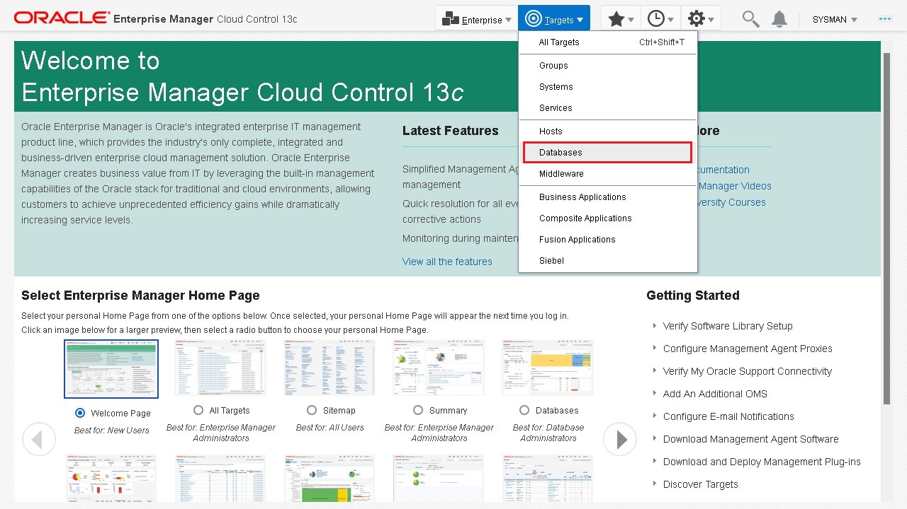
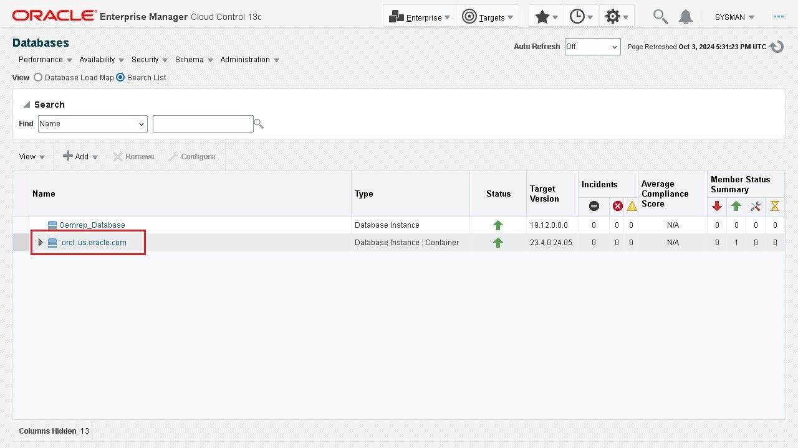
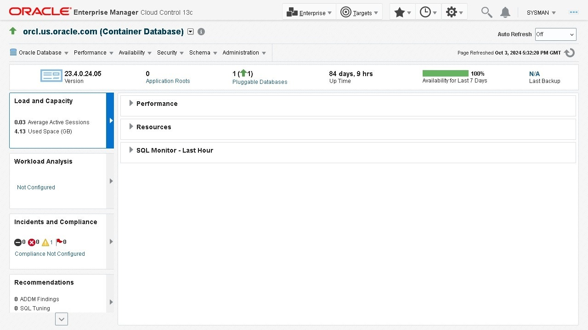
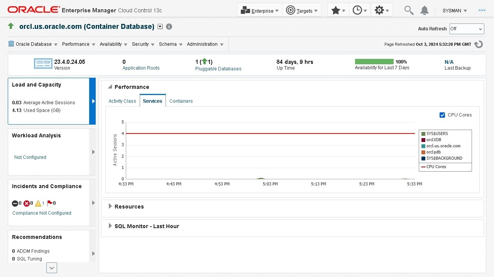
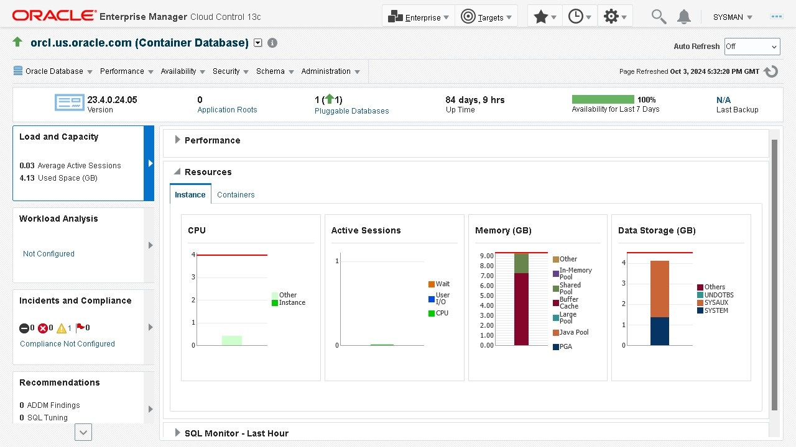
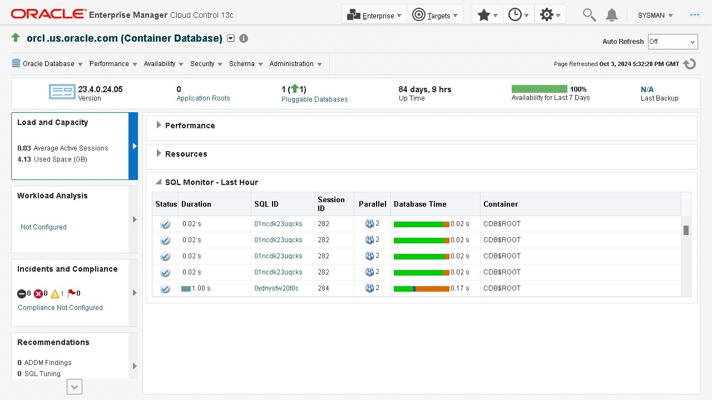
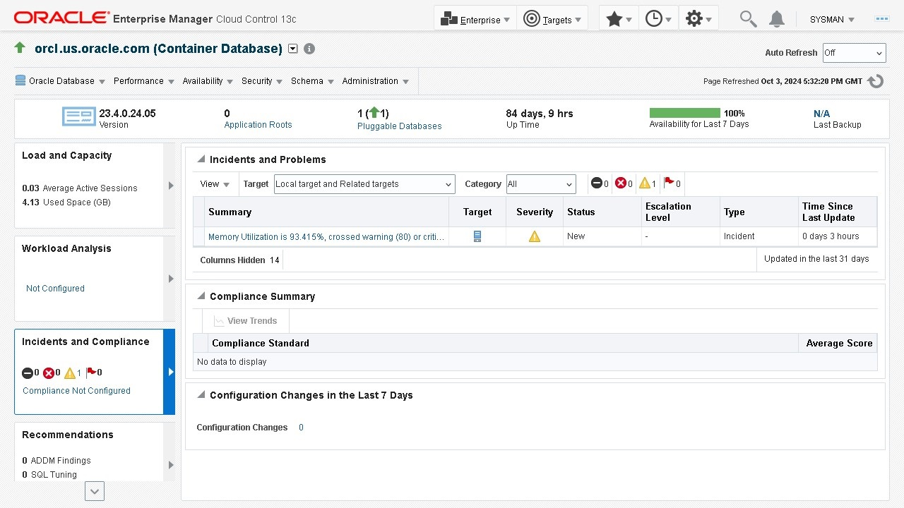
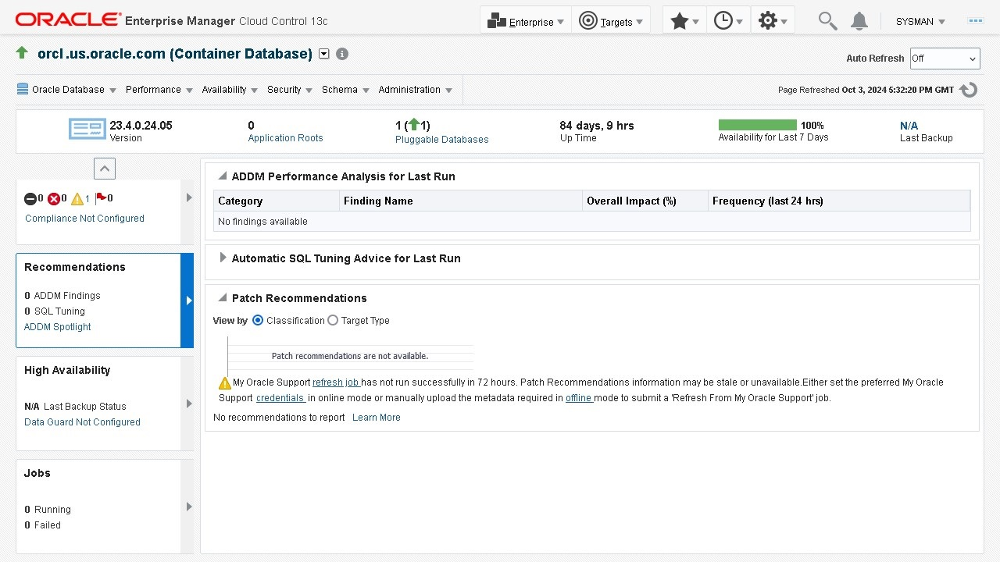
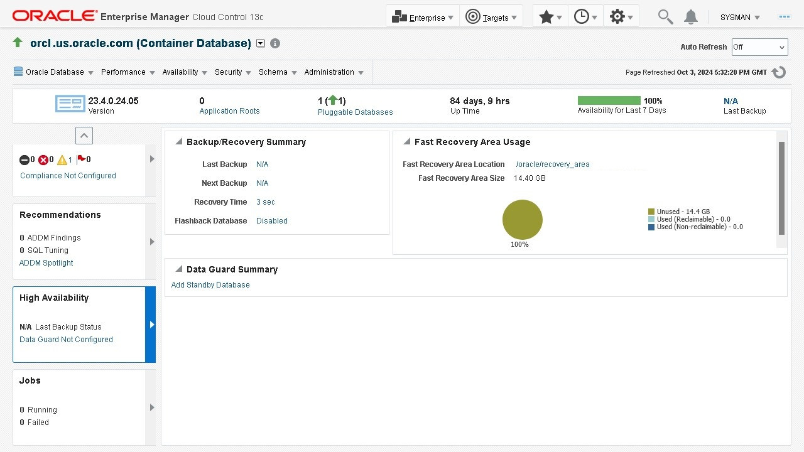
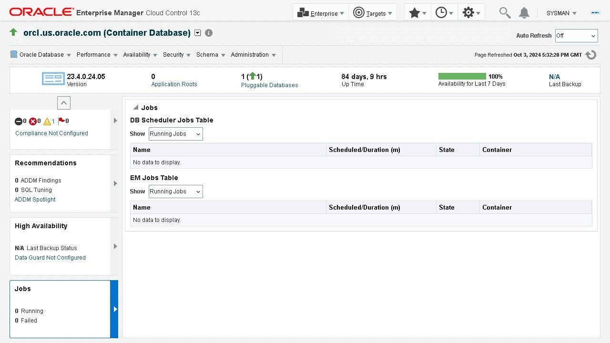

# Monitor general state of Oracle Database

## Introduction

This lab shows you how to monitor the state and workload of your Oracle Database using Oracle Enterprise Manager Cloud Control.
  
Estimated time: 15 minutes

### Objectives

-   Login to Oracle Database storage administration
-   Monitor the state and workload of your database

### Prerequisites

This lab assumes you have:
-   An Oracle Cloud account
-   Installed Oracle Database and Oracle Enterprise Manager Cloud Control
-   Completed all previous labs successfully

## Task 1: Login to Oracle Database Storage Administration

1.  On the Oracle Enterprise Manager Cloud Control home page, go to the Targets menu and select Databases.

    

2.  The Databases page lists the Oracle Databases added to Oracle Enterprise Manager Cloud Control as managed targets. 

    Select the database instance for which you want to view the details. In this example, `orcl.us.oracle.com`, a Container Database instance, is selected.

    

3.  The database instance home page displays various details about the selected database.

    

## Task 2: Monitor the state and workload of your database

1.  The page displays the date and time when it was refreshed last. Click the arrow next to the date and time to refresh the database state.

    The following information about the database is displayed:

    -   **Version:** The version of the Oracle Database
    -   **Application Roots**: It refers to the number of tables, packages and views of the Oracle Database
	-   **Status of the database**: Whether the status is available or not available. The green upward arrow represents that the database is available and a downward arrow means that the database is unavailable
    -   **Up Time**: The time the database was last started
    -   **Availability for Last 7 Days**: The percentage of availability of the database for last 7 days in the form of a progress bar.
	-   **Last Backup**: The time of the last backup

    >   **Note:** The Database home page refreshes automatically every 60 seconds. To prevent the page from refreshing automatically, select Off in the Auto Refresh option.

    

2.  In the **Load and Capacity** section, expand **Performance** to view the active session information. It displays graphical information about the active session for the past hour.

    -   **Activity Class:** Displays the average number of database sessions active for the past hour. It displays the type of activity for each session (CPU, waiting for I/O, or waiting for another resource).
    -   **Services:** Displays the average number of database sessions active for the past hour for database services.
    -   **Containers:** Displays the average number of Container and Pluggable Database sessions active for the past hour.

    

3.  In the **Load and Capacity** section, expand **Resources** to view the resource usage for the latest data point in the last minute.

    -   **CPU:** Displays the percentage of CPU time used by the database instance and other processes during the last minute. The chart legend displays the database instance and Other CPU processes. Place your cursor over the instance data to see the percentage of CPU used by the foreground and background instance processes.
    -   **Active Sessions:** You can investigate the cause of performance problems by viewing this chart. This chart displays whether or not your database takes up most of the CPU time on the server. A bar graph with the following information is displayed:
        -   **Waits:** This is the value for all wait classes combined, excluding user I/O and idle wait events. 
        -   **User I/O:** This is the average number of active sessions waiting for user I/O.
        -   **CPU:** This is the average number of active sessions using CPU.
    -   **Memory (GB):** Displays the current memory usage (as of the latest refresh time) shared among the database shared pool, Java pool, buffer cache, PGA, and other SGA components.
    -   **Data Storage (GB):** Displays the current space usage (as of the latest refresh time) shared among the user data, database log files, undo, temporary, SYSAUX, and SYSTEM tablespaces.

    

4.  In the **Load and Capacity** section, expand **SQL Monitor - Last Hour** to monitor SQL statements. Each row on this page displays an instance of an SQL execution that the database has monitored or is monitoring, in descending order.

    -   **Status:** Displays the status icon of the SQL statement the database is monitoring. The different states of the Status are done, running, and failed. The check mark in the column indicates that the execution of the SQL statement is complete. You can hover over the icon to view the status.
    -   **Duration:** Displays the duration of the execution of the SQL statement. It displays the total runtime of the query.
    -   **SQL ID:** It is an identifier to identify the SQL statement. Click the link to view the Real-time SQL Monitoring page. This page displays real-time as well as historical information about the SQL statement that is monitored. Close the window to return to the instance home page.
    -   **Session ID:** Displays the ID of the session the database is executing.
    -   **Parallel:** Displays the degree of parallelism (DOP) for the query. For example, the DOP of the third query is 2. It means that this particular query is run on two database instances.
    -   **Database Time:** Displays the duration of database time that the SQL execution takes as well as the time taken by other operations.
    -   **Container:** Displays the container in which the database executes the SQL statement.

    

5.  The **Incidents and Compliance** section displays information about the incidents occurring in the database.

    -   **Incidents and Problems:** Displays the active incidents that occurred in the database. An incident is the occurrence of a critical error in the database.
    -   **Compliance Summary:** Compliance evaluation generates a score for the target database on the basis of how much the target is compliant with the standard. A 100% compliance score means that all checks of the compliance standard passed on the target.
    -   **Configuration Changes in the Last 7 Days:** Lists the changes made in the database configuration in the last seven days.

    

6.  The **Recommendations** section displays the result of the performance analysis run by the Automatic Database Diagnostic Monitor (ADDM). The ADDM analyzes data, identifies errors, and lists those errors occurring in the database.

    You can view the ADDM table that lists the ADDM findings, such as ADDM's estimated effect on database performance, a description of the finding, and the number of times the finding occurs in snapshots collected during the last 24 hours.

    For example, a finding with Occurrences listed as 10 of 43 has occurred in 10 of the last 43 snapshots. It also provides recommendations to resolve the errors.

    

7.  The **High Availability** section displays details about the backup and recovery details of the database, the Fast Recovery Area usage statistics, and a summary of the Data Guard association.

    

8.  The **Jobs** section displays a table with the jobs that are currently running in the database. It also displays the number of jobs that were not successful.

    

You may now **proceed to the next lab**.

## Acknowledgements

-	**Author:**  Suresh Mohan, Database User Assistance Development Team
-	**Contributors:** Manisha Mati, Suresh Rajan, Manish Garodia
-	**Last Updated By/Date:** Suresh Mohan, October 2024