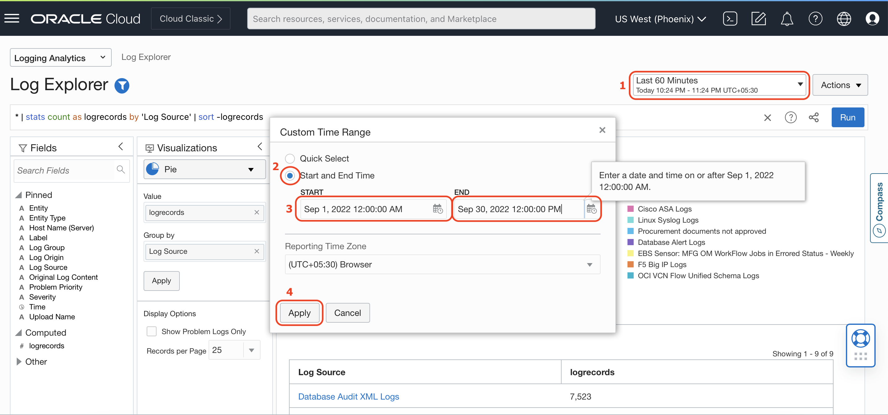
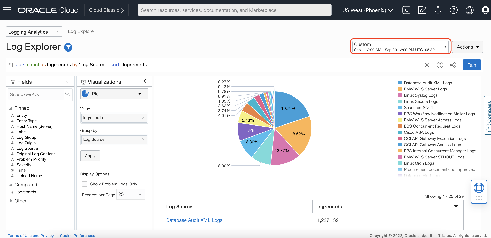
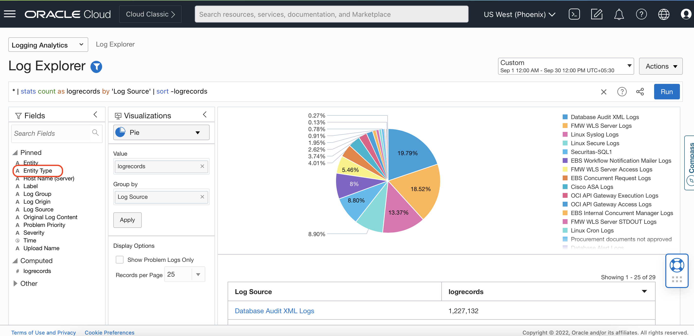
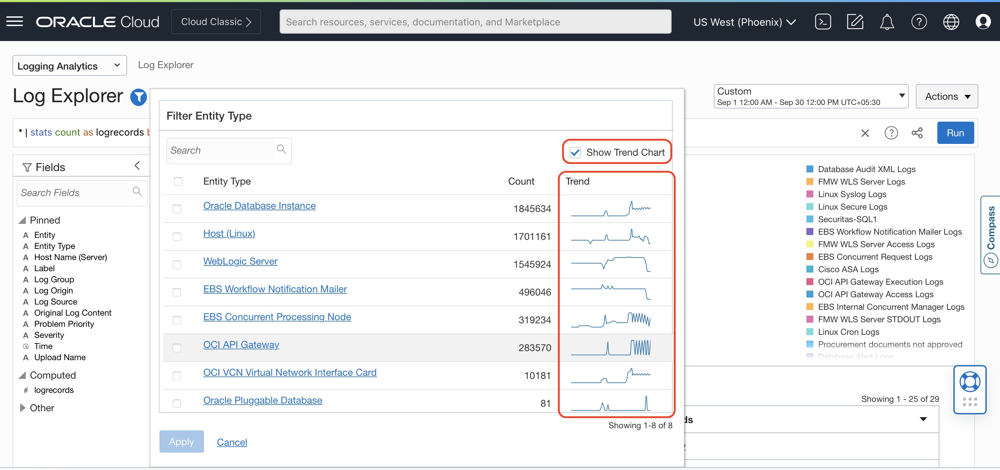
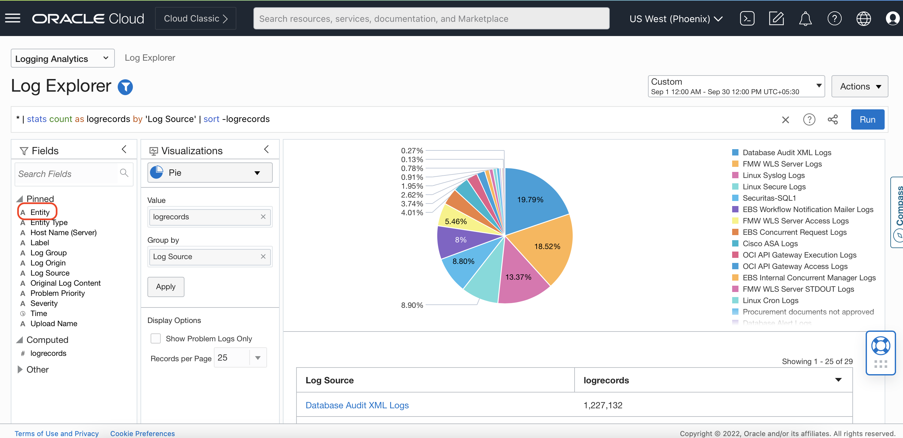
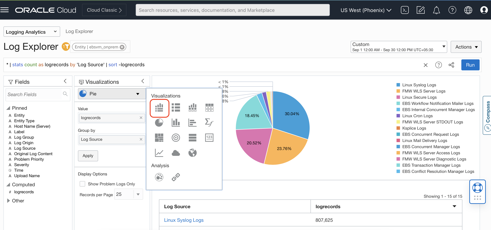
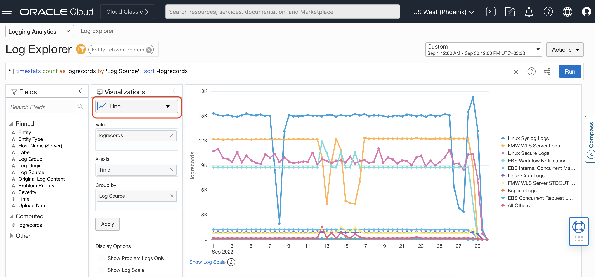
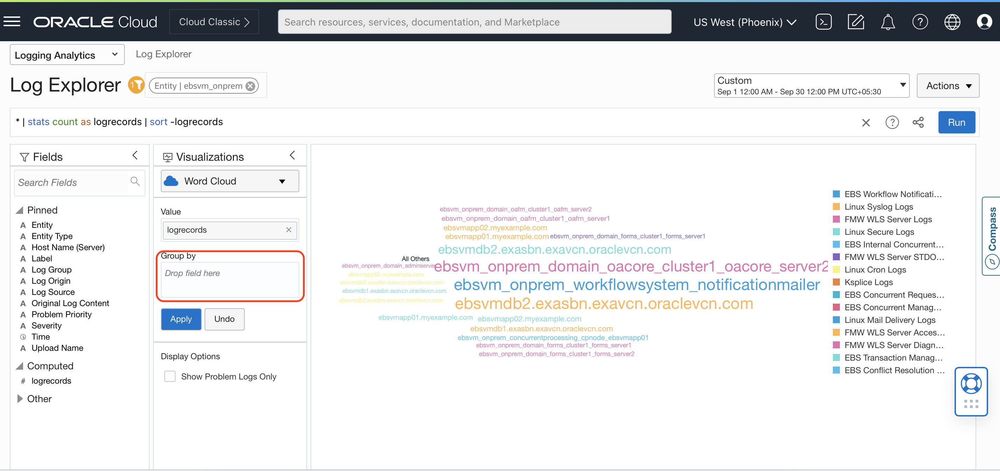
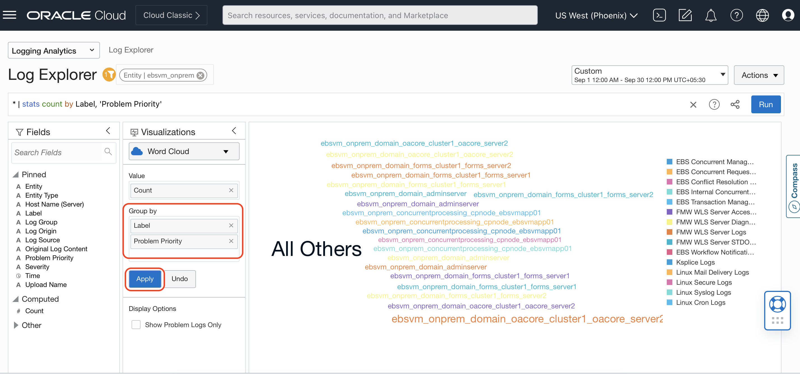
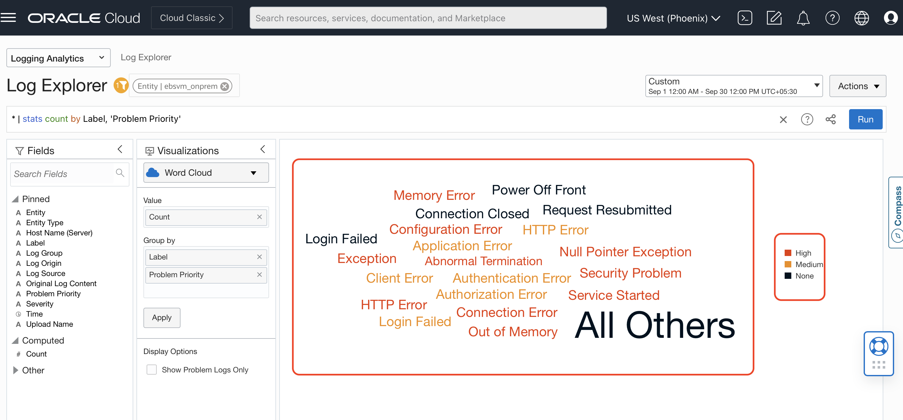

# Log Analytics Basics

## Introduction

In this Lab, you will learn to monitor the health, performance, uptime and availability of an application and its related infrastructure for the time range between **Sep 1, 2022 12:00:00 AM** to **Sep 30, 2022 12:00:00 PM**.

Estimated Lab Time: 15 minutes

### Objectives
In this lab, our goal is to answer the following questions:

* What is the log trend by log types, entity, problem priority etc?
* How many systems are being monitored and their deployment topology?
* What are the current KPIs and their trends?

Now we will walk through logs collected for the application and related infrastructure.

## **Task 1:**  Log trend by Entity Types and Entity
In this task, you will learn to monitor log trend by entity type and entity.

1. Click **Custom** under **Time range** pickerSet, then Click on "Start and End Time" and Select START time as **Sep 1, 2022 12:00:00 AM**, END Time as **Sep 30, 2022 12:00:00 PM** and Click Apply.
   

   You should see a page similar to the one below showing the distribution of different types of logs.
   

2. Click on the field "Entity Type" in the Fields Panel in Log Explorer to bring up a faceted view of all the monitored entities.

   

3. Click on "Show Trend Chart" in Facet view to visualize the logs trend of these entity types.

   

4. Repeat steps 1 & 2 to visualize log trends for the field "Entity". Click on the field "Entity" in the Fields Panel.

   

5. Click on "Show Trend Chart" in Facet view to visualize the logs trend of these entities.

   

   At this point you know different types of logs being ingested, Entity types  and specific entities being monitored.

## **Task 2:**  Application Topology
In this task, you will learn how to visualize the application topology to understand various components and use the topology for filtering logs.

1. Click on the 'Scope Filter' icon in Log Explorer to invoke filter view

   

2. You can visualize the Scope Filter view as below

   

3. Click on the 'Entity' dropdown and search for the keyword "ebsvm\_onprem" in the Entity search box and select ebsvm\_onprem listed under the compartment 'ebs-lab-9522'. "ebsvm_onprem" is the top level entity of Entity Type E-Business Suite.

   

4. Click 'Apply' to set entity 'ebsvm\_onprem' as scope filter.

   

5. Click on the "Topology" icon in the scope filter to visualize the topology of the this EBS deployment. Topology view can be used to filter logs from a specific Entity.

   

6. Here you see the monitoring of EBS systems and its deployment topology
   

   You can select a specific Entity (represented by a node in the topology visualization) and click "Apply" to filter logs from that Entity. Selected Entity is added in the Entity Filter box as a pill. You can undo the selection by removing the pill from Entity filter box and clicking "Apply"

  Click "Close" to close the Scope Filter. Next, let's look at the log trends over time.

## **Task 3:** Application Log Visualizations
In this task, you will learn various Log visualizations of an appilcation with multiple application tiers.

1. Click on the Visualizations dropdown in the Visualization Panel to select **Records with Histogram** visualization.

  

  Here you see the distribution of different logs for time ranges from **Sep 1, 2022 12:00:00 AM** to **Sep 30, 2022 12:00:00 PM**.

  

  Here you see the volume of logs generated by different Log Sources along with the log records. This visualization shows log sources by their log volume. Line charts can give more visibility, Lets change to 'Line Chart' Visualization.

2. Click on the visualization drop-down and select "Line" visualization for more visibility.

  

  Here you see Line chart view of different Log Sources and its trends and volume of logs for time ranges from **Sep 1, 2022 12:00:00 AM** to **Sep 30, 2022 12:00:00 PM**.

  

3. Select "Tree Map" visualization from the visualization drop down, to view various logs generated for E-Business Suite applications.

  

  Drag and drop the field "Entity" and "Log Source" from the Fields Panel into the "Group by" input box in Visualization Panel and change the order of 'Entity' and 'Log Source' by dragging Entity above Log Source. Click 'Apply'

  

4. Click on the visualization drop-down and select "Word Cloud" visualization  to identify problems along with their Problem Priority.
  

  Clear the current Group-by inputs.
  

  Drag and drop the field "Label" and "Problem Priority" from the Fields Panel into the "Group by" and click Apply.
  

  Logging Analytics enriches logs with problem labels and error categories for easy problem identification along with their Problem Priority.

  

  Here you see different actions and problems labels color-coded by their problem priority.

  Let's go back to 'Records with Histogram' visualization in the context of Entity **ebsvm_onprem**. You are working with millions of log records and next we want to use Machine Learning techniques to analyze these records.

  

## Acknowledgements
* **Author** - Gurusamy Poosamalai, Logging Analytics Development Team
* **Contributors** -  Kumar Varun, Logging Analytics Product Management, Jolly Kundu - Logging Analytics Development Team
* **Last Updated By/Date** - Aug 24 2022
