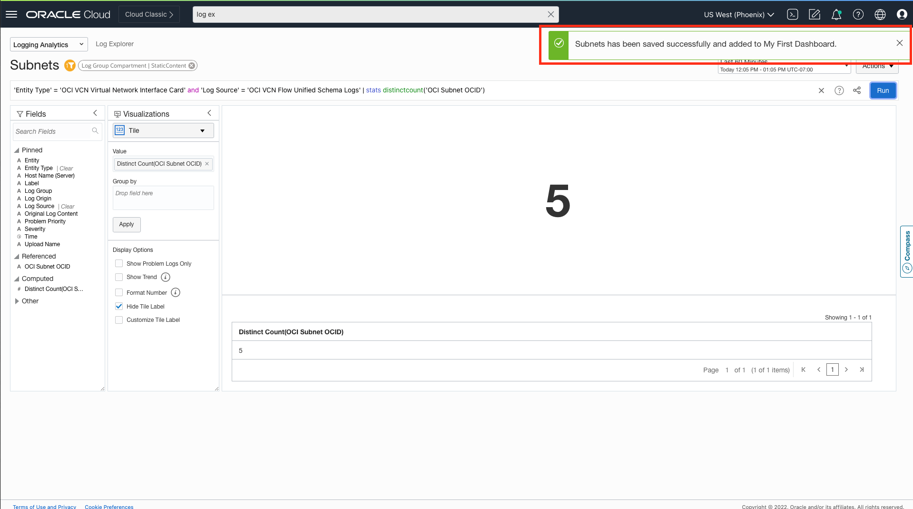
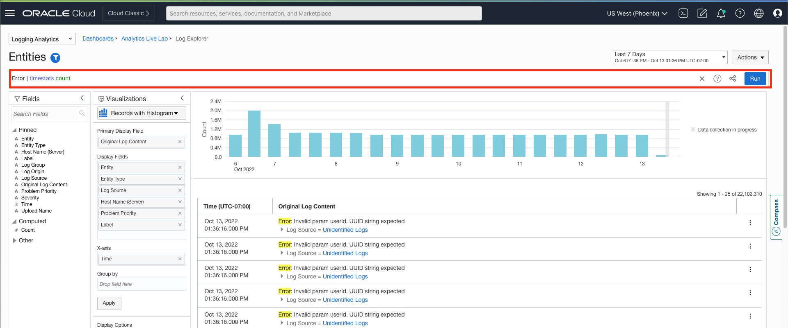
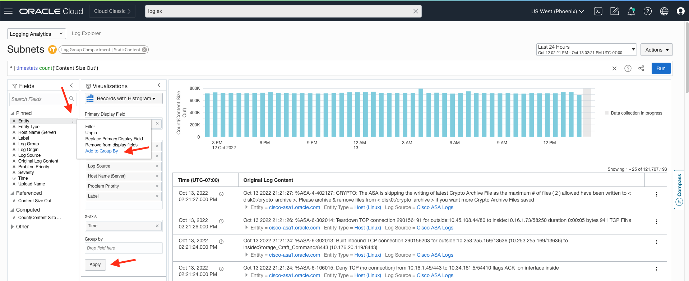
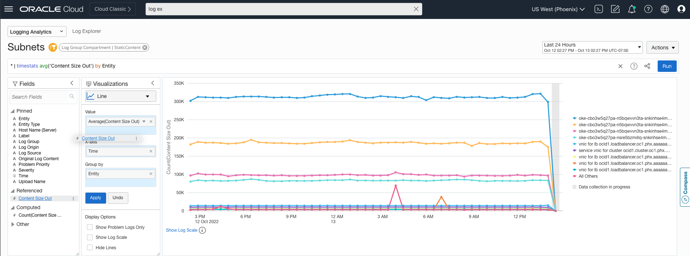
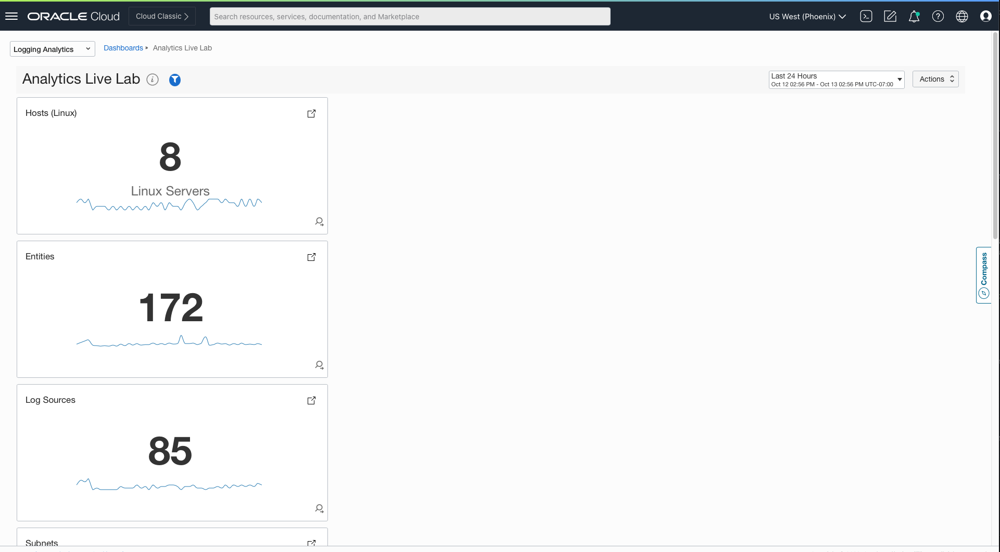

# Building Monitoring Dashboards

## Introduction
In the previous labs your learned about log analytics basics, log data visualizations, logs clustering with cluster command, and logs correlation with link command.

In this lab you'll learn to use these features and methods to build an Enterprise Monitoring Dashboard to continuously monitor your systems.

Estimated Lab Time: 25 minutes

### Objectives

In this lab, you will:
* Learn best practices for dashboard
* Create generic dashboard widgets and add them to your own dashboard
* Show and tell: Build your very own dashboard

Different parts of IT Environment are managed and maintained by separate teams, such as Database Administrators, Infrastructure Administrators, Network Administrators, Security Operations, DevOps.

The lab environment has logs from all of these areas: OCI Infrastructure, Linux Hosts, E-Business Suite Applications, MySQL Database, Oracle Container Engine, and other sources.

You can decide to create dashboard for a specific area e.g. Infrastructure, Host, OR a combination of areas that your team may find useful for monitoring.

  Here is an example of the dashboard for inspiration.

  


   We'll be using this simplified dashboard for this lab.

  

## **Task 1:**  Making the Headline
A great dashboard starts with quick facts to establish the ground and highlight key indicators. In our simplified dashboard
  the first row gives the inventory of systems which are being monitored in this dashboard.
  

  Let's take one example to calculate and visualize a sum or count statistics for the first row of the dashboard using stats command.
  Here is the query used in sample dashboard for calculating number of VCN Subnets being monitored.
1. Navigate to Log Explorer and try this query in the query-box.
    ```
    <copy>
    'Entity Type' = 'OCI VCN Virtual Network Interface Card' and 'Log Source' = 'OCI VCN Flow Unified Schema Logs' | stats distinctcount('OCI Subnet OCID')
    </copy>
    ```
    

  Did you see the right visualization (Hint: Tile)? If not then change to the Tile visualization from Visualization Panel.

  Next, let's save this summary as widget and add it to a new dashboard.

2. Save your widget using the actions menu.

  

  Ensure that you are using your allocated LiveLab Compartment for saving.

  

  Here is a screenshot of a successfully completed actions of this task.

   

   Great! you have created your first Tile widget and also added it to a dashboard.

   Let's create other widgets for our dashboard.

## **Task 2:** Finishing the Headline

  In this task you'll create three other Tile widgets and add those to the dashboard created in previous task.
  Let's find out the number of Linux Servers being monitored.

1. Use the following query in Log Explorer query-box to build a Tile visualizations

    ```
    <copy>
    'Entity Type' = 'Host (Linux)' | stats distinctcount('Host Name (Server)') as 'Linux Servers', trend(distinctcount('Host Name (Server)'))
    </copy>
    ```

2. Save the visualization as a widget and add to existing dashboards

  

  In the Save dialog box, enter name and description for your widget and this time after checking "Add to dashboard" select "Existing Dashboard" to select the dashboard you created in previous step.

  

  Verify the inputs and click "Save"

3. Create other two Tile widgets using the following queries.

  OR you can also create your own Tile widgets for your area specific dashboard.

  Follow the steps from previous step in this task to save each widget to your existing dashboard.

    ```
    <copy>
    * | stats distinctcount(Entity)
    </copy>
    ```
    ```
    <copy>
    * | stats distinctcount('Log Source')
    </copy>
    ```


## **Task 3:** Visualizing Trends and Distribution


The next level of details in a dashboard is visualizing the log data over time and distribution by a specific dimension. Let's start with a simple time-series visualization.

1.  Trend of presence of keyword "Error" in logs. Use the following query in Log Explorer
    ```
    <copy>
    Error | timestats count
    </copy>
    ```
  This query shows how the keyword "Error" shows up in the logs over time.

  Here is an expected result:

  

  Next lets see how these errors are distributed across different systems, and over time.

2. Using group-by.

  Let's find out the network traffic outflow which is captured in the field 'Content Size Out' using the following query.

    ```
    <copy>
    * | timestats count('Content Size Out')
    </copy>
    ```

  

  Using the three dots menu in Fields panel select the "Add to Group By" option for the field Entity and click "Apply"

  

  Here is the resulting output. Did you notice the change in the query box?

  

  You can change to a different visualization such as Line Chart based on your preference.

  

  This visualization is showing the count of field 'Content Size out'. Let's calculate some other statistics which are more meaningful, such as average traffic.

3. More stats

  Use the Value box in Visualizations panel to change count to 'Average'

  

  You can drag 'Content Size Out' from Fields panel into Value box of Visualizations panel and select a different statistics to calculate and visualize in the same chart.

  

  Here is a five-number statistics (Min, first quartile, Median, third quartile, maximum) for 'Content Size Out' over time.

  

  Notice that we are using 'Log Scale' for better visualization.

  Now, you know how to visualize data over time along with grouping it by different dimensions.

4. Add time-series charts to your dashboards

  Create two time-series widgets and save those to the dashboard you created previously.

  Next, let's look at distribution.

5. Using stats command

  Visualizing distribution by a specific dimension is simply removing the time series calculation command (timestats) with starts. For example, to visualize the distribution of incoming Packets to different Subnets:

    ```
    <copy>
    'Entity Type' = 'OCI VCN Virtual Network Interface Card' | stats max('Packets In') by 'OCI Subnet OCID'
    </copy>
    ```
    
    

    Calculate few other distribution charts add those to your dashboard. You can experiment with different visualizations.

## **Task 4:** Curating Your Dashboard

  Now that you have created a number of widgets and added them to your dashboard, let's arrange those in our dashboard.

1. Go to Dashboards listing page and select your Lab allocated compartment Scope

  

  All the widgets that you created and added to your dashboard should be visible now.

  


2. Click 'Edit' from the 'Actions' menu to switch to edit mode

  

  

3. Use your mouse to resize, move, and arrange the widgets in your dashboard.

  

## **Task 5:** Show and Tell!
  Show your dashboard with your co-participants in the room!

  In this lab you learned how to create different widgets, add them to a new dashboard, and curated the dashboard to use for monitoring different IT Systems.


## Acknowledgements
* **Author** - Kumar Varun, Logging Analytics Product Management
* **Last Updated By/Date** - Oct 4, 2022
