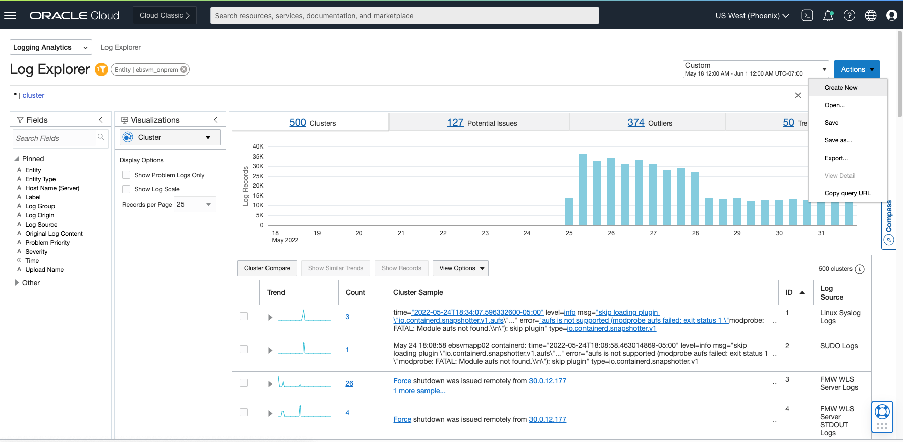
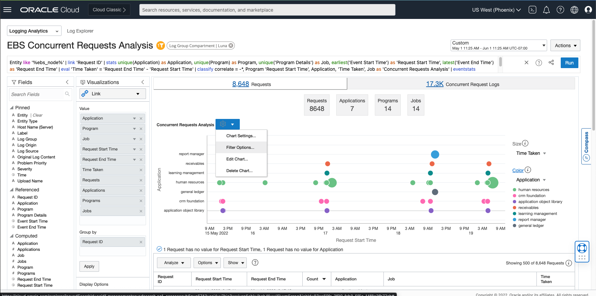

# Advanced Troubleshooting using 'Link' command

## Introduction
Your customers are reporting high response times for EBS application which is affecting customer satisfaction metrics, in addition to negatively impacting the business.

Let's do a walk through on troubleshoot and identify the problematic EBS jobs causing performance degradation and build a query for continuous monitoring.

Estimated Time: 5 minutes

Watch the video below for a quick walk-through of the lab.
[Advanced Troubleshooting using 'Link' command](videohub:1_7jobfsrq)

### Objectives

In this lab, you will:
* Use Advanced Troubleshooting using 'Link' command
* Troubleshoot and identify the problematic EBS jobs causing performance degradation
* Build a query for continuous monitoring

## **Task 1:**  Troubleshoot and identify the problematic EBS jobs using 'Link' command
Here is the analysis view that you'll be using from scratch.

  

1. Click on "Actions" and "Create New" to return to the default Log Explorer view

  

  Default view for reference

  

  Next, you'll open a **Saved Search** by clicking Actions and then Open.  

  

  Select "Luna" in the "Widget Compartment" drop-down and search for keyword "EBS" and select "EBS Concurrent Requests Analysis" card and click 'Open'

  

  

  This visualization shows concurrent request jobs running under different applications such as Receivables, Human Resources and size of the bubbles corresponds to the time-taken by those jobs. Hover on top of any bubble to see more details.

  

  Next, we want to slice-and-dice this data based on Application, Time Taken.

2. Click on the **Gear** icon on the top left of the chart and select **Filter Options** which will launch "Filter Options" a pop-up.

  

  Next, select "Show Search Filters" checkbox in 'Filter Options' pop-up. All other check-boxes should also be in selected state.

  

  Click Close

  

3. Click on "3 mins, 48 sec (1)" which is the job with longest run-time to filter that job.

  

  

  This job with long run-time belongs to 'human resources' application and we want to know whether all HR jobs taking this long indicating application level problem.

4. Deselect "3 mins, 48 sec (1)" to come to the same view as step #2 and click on 'human resources (19)' under the Application section in the chart.

  

  This chart now show the time-taken by all the 'human resources' application job. You can hover on top of the two larger bubbles to identify which jobs were taking relatively longer time to complete.

  

  As shown in the chart the 'data update process status report' job in 'human resources' application is taking long time to complete. You can now drill down into specific jobs to review analyze further by simply clicking on a bubble.

## Acknowledgements
* **Author** - Sachin Mirajkar, Logging Analytics Development Team
* **Contributors** -  Kumar Varun, Logging Analytics Product Management, Jolly Kundu - Logging Analytics Development Team
* **Last Updated By/Date** - Aug 29 2022
