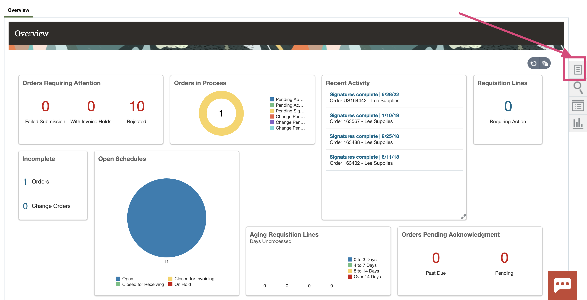
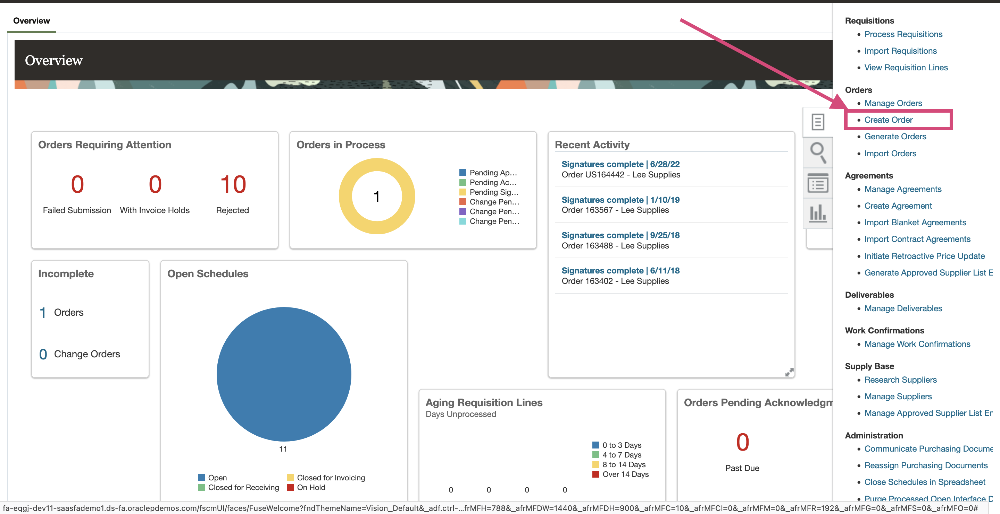
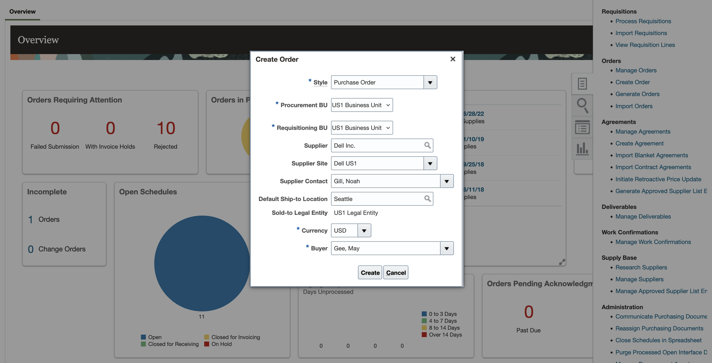
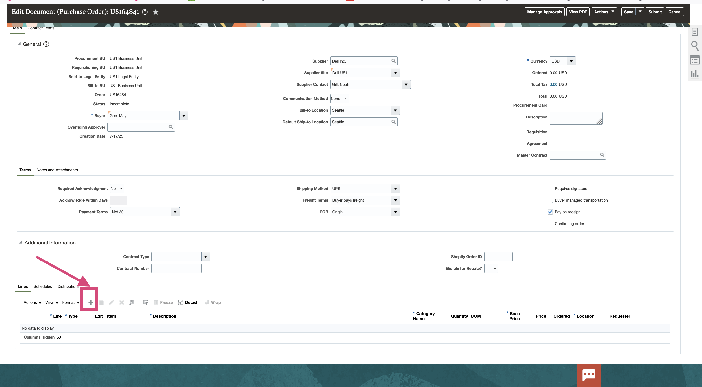
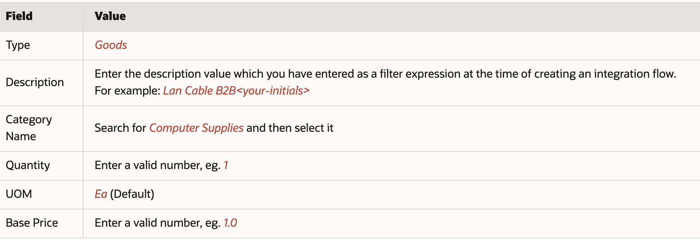

# Lab 3 - Stitching it Together – Monitoring E2E PO Flow

## Introduction

This lab walks you through the steps to create an integration flow which subscribes to a ERP Cloud Purchase Order(PO) business event. The payload of the purchase order is translated to EDI X12 850 document and will be sent over to a Trading Partner. You will also create extended logic to synchronize the PO to a Visual Builder application.

Estimated Time: 20 minutes

### Objectives
In this lab, you will learn to integrate with ERP Cloud and explore several B2B concepts to build the heart of the usecase.

## Task 1: Test the Integration Flow

 1. Access your ERP Cloud environment and login with a user may.gee or equivalent having the correct roles and privileges to create a PO using below URL
    ```
         <copy>
             https://fa-eqgj-dev11-saasfademo1.ds-fa.oraclepdemos.com/fscmUI/faces/FuseWelcome?fndThemeName=Vision_Default
        </copy>   
    ```
    
 2. Navigate to the <em> Procurement </em> Tab.

 3. Click <em> Purchase Orders </em> .

 4. In the **Overview** section, click the <em>Tasks</em> button on the right. 
   
     

    This opens the Tasks menu.

 5. Under the **Orders** section, select <em>Create Order</em>. 
     

    The **Create Order** dialog is displayed. 

 6. Select **Requisitioning BU** and **Procurement BU** as <em>US1 Business Unit</em> and Enter <em>Dell Inc.</em> in the **Supplier** field and select the corresponding supplier in the dropdown. Rest of the fields should be populated automatically.  
           
 
      
      > **Tip:** You can also search for valid suppliers using the **Search** icon.

 7. Click <em>Create</em>. The **Edit Document (Purchase Order)** page is displayed. 

 8. In the **Lines** Tab, click <em>+</em> to add a Purchase Order line row. 
   

 9. Enter values in the below fields (sample values provided) and click on <em>Save</em>
     

 10. Click <em>Submit</em> to initiate the Purchase Order processing. After submitting the Purchase Order, a confirmation message will appear with the PO number. Make a note of the **PO Number**


## Task 2: Validate Purchase Order status

After the PO is submitted, the initial status becomes **Pending Approval**. The PO Create event will occur once the status changes to **Open**.

 1.  In the **Overview** section, click <em>Tasks</em> button on the right. This opens the **Tasks** menu.

 2.  Under the **Orders** section, click on <em>Manage Orders</em>.

 3.  Click <em>Search</em>. You should see the Purchase Orders for the current user OR enter the PO number to search for the purchase order which you have created.

 4.  Look for your Purchase Order in the list with the PO number displayed in the previous task.

    > **Tip:** The last created PO should generally be the top one in the list. 

 5. Validate the PO Status. If it's **Open** then the Business Event has occurred.

    > **Note:** If PO has another Status, such as <em>Pending Approval</em>, then wait a couple of minutes and refresh the page until the status changes to **Open**. 


## Task 3: Validate data in Log Analytics

To Do


**Congratulations!** In this lab, you have successfuly completed the following tasks:
- Monitoring E2E PO Flow

You may now proceed to the [next lab](#next).

## Acknowledgements
* **Author** - Supriya Joshi, OCI Logging Analytics
* **Contributors** -  Supriya Joshi, Jolly Kundu, Kumar Varun, Royce Fu
* **Last Updated By/Date** - Supriya Joshi, Jul, 2025
