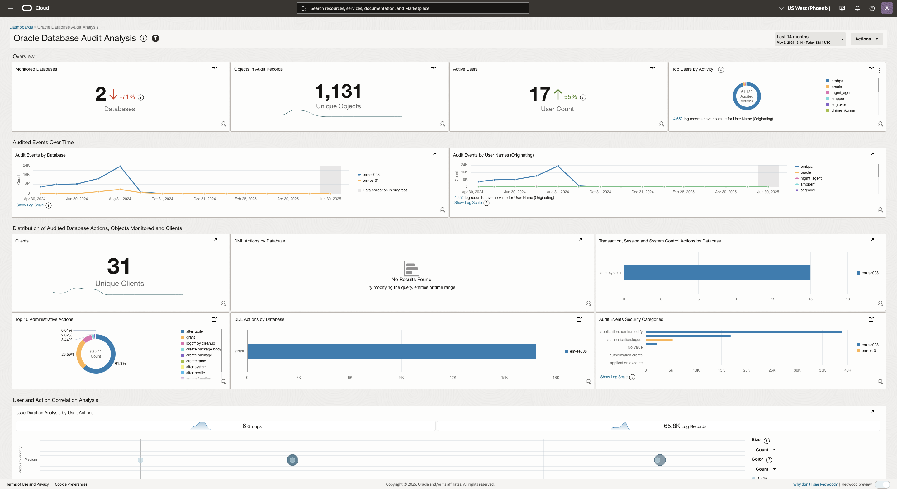

# Lab 2 - Monitor individual components

## Introduction

In this lab, you will explore the various dashboards available in Oracle for monitoring Fusion Applications, Oracle Integration Cloud (OIC), and Oracle Database (DB). These dashboards offer a unified and centralized view of log data, allowing users to efficiently monitor system health, analyze performance, and troubleshoot issues across Fusion Applications, OIC integrations, and database instances.

Estimated Time: 5 minutes

### Objectives
In this lab, you will get an overview of the different dashboards, including their usage and the various widgets provided within each dashboard.

## Task 1: Dashboard Navigation

 1. To navigate to the Dashboards page use one of the following method.
    - From Navigation Menu  > **Observability & Management** > **Management Dashboard** > **Dashboards**.
   
        OR
   
    - You can use the direct link to land on the **Dashboards** page.
    ```
         <copy>
            https://cloud.oracle.com/management-dashboard/dashboards?region=us-phoenix-1
         </copy>   
    ```
  2. Dashboards page will be displayed.
     

    > **Note** : You will see an authorization error. It is expected as current user doesn't have permission to the root compartment.

  3. Switch to the compartment **CW25\_Logging\_Analytics**.
    - From the **Compartment** dropdown select the compartment **CW25\_Logging\_Analytics**.
    - From the **Services** dropdown select the service **Log Analytics**.
    - All the Dashboards in the Compartment **CW25\_Logging\_Analytics** will be displayed.
    

## Task 2: Overview of Oracle Integration Insight  dashboard
  
**Oracle Integration Insight**  dashboard provides real-time business monitoring by linking technical integrations to business processes and KPIs. The dashboard enables business users, analysts, and IT teams to visualize the progress, performance, and bottlenecks in their business operations. It consists of different widgets like Summary widget, Milestone progress widget, Transction Performance widget , Transaction Tracking Fields widget etc. 

In order to view this dashboard one has to search for and click on the **Oracle Integration Insight** dashboard from the  **Dashboard** home page. It will take few seconds for the dashboard widgets to load.
 
      > **Important tip** : Observe the dashboard widgets & values once they are loaded.
      

## Task 3: Overview of Oracle Integration: Health Overview dashboard

**Oracle Integration: Health Overview** dashboard provides an overview of the monitored OIC instances, integrations, and their health based on the metrics and logs. This dashboard is used to gain insights into the current health of your OIC Instances, Integrations, and Flow Instances. Filters can be used to narrow down to a specific OIC Instance, Integration, and Integration Instance. It displays both metrics and log data at the compartment level. 

In order to view this dashboard one has to search for and click on the **Oracle Integration: Health Overview** from the  **Dashboard** home page. It will take few seconds for the dashboard widgets to load. 
      > **Important tip** : Observe the dashboard widgets & values once they are loaded.
      

## Task 4: Overview of Oracle Database Audit Analysis dashboard

**Oracle Database Audit Analysis** dashboard provides analysis of audited actions for Oracle Databases monitored by Log Analytics using Unified Database Audit Logs available in DB v12.2 onwards. This dashboard is used to understand user activity, schema changes etc.

In order to view this dashboard one has to search for and click on the **Oracle Database Audit Analysis** dashboard from the  **Dashboard** home page. It will take few seconds for the dashboard widgets to load. 
      > **Important tip** : Observe the dashboard widgets & values once they are loaded.
      

## Task 5: Overview of Oracle Fusion User Access dashboard

**Oracle Fusion User Access** dashboard 

In order to view this dashboard one has to search for and click on the **Oracle Fusion User Access** dashboard from the  **Dashboard** home page. It will take few seconds for the dashboard widgets to load. 
      > **Important tip** : Observe the dashboard widgets & values once they are loaded.
         

## Task 6: Overview of Oracle Fusion Apps Enterprise Scheduler Service (ESS) Analysis dashboard

**Oracle Fusion Apps Enterprise Scheduler Service (ESS) Analysis** dashboard 

In order to view this dashboard one has to search for and click on the **Oracle Fusion Apps Enterprise Scheduler Service (ESS) Analysis**  dashboard from the  **Dashboard** home page. It will take few seconds for the dashboard widgets to load. 
      > **Important tip** : Observe the dashboard widgets & values once they are loaded.
               


**Congratulations!** In this lab, you have successfuly completed the following tasks:
- Monitoring different dashboards

You may now proceed to the [next lab](#next).

## Acknowledgements
* **Author** - Supriya Joshi, OCI Logging Analytics
* **Contributors** -  Supriya Joshi, Jolly Kundu, Kumar Varun, Royce Fu
* **Last Updated By/Date** - Supriya Joshi, Jul, 2025
