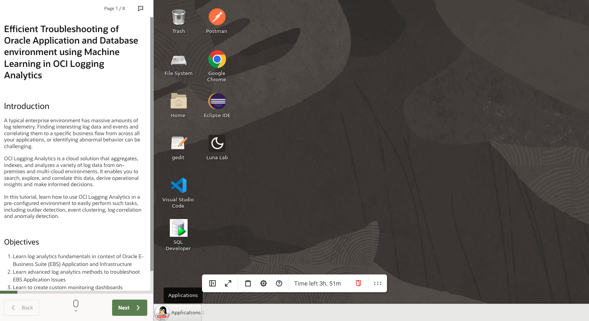
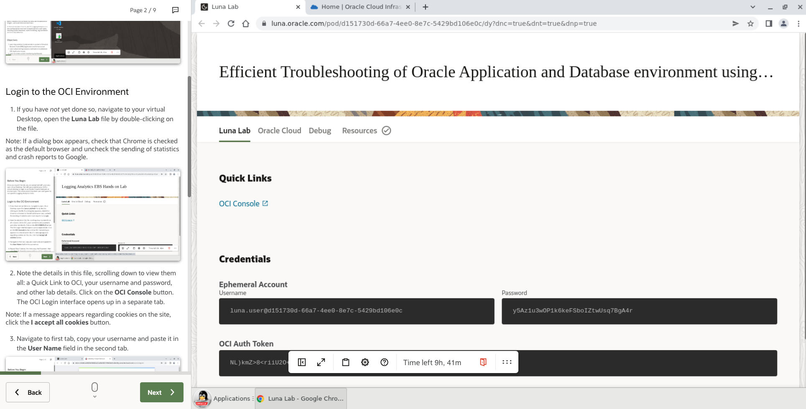
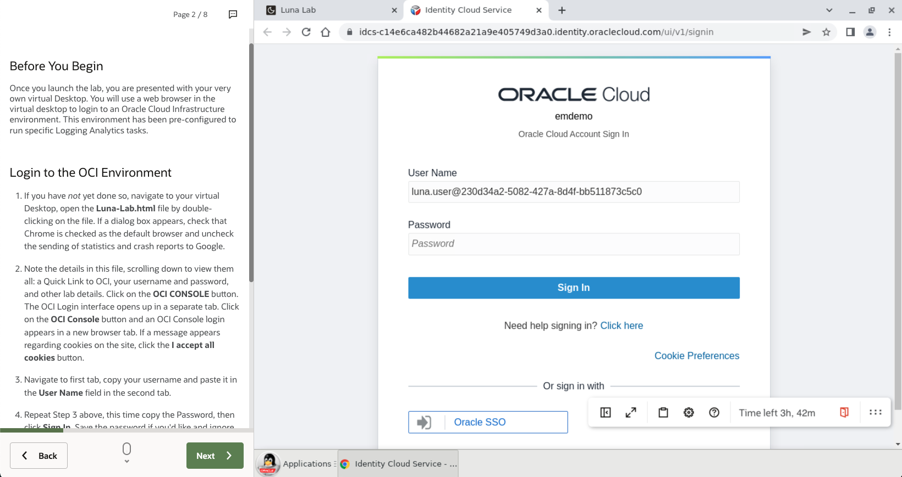
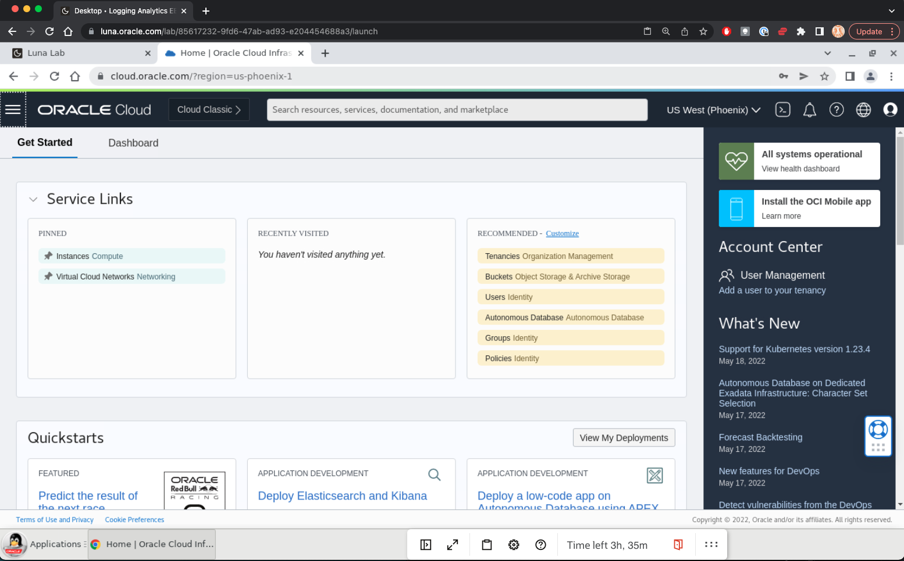
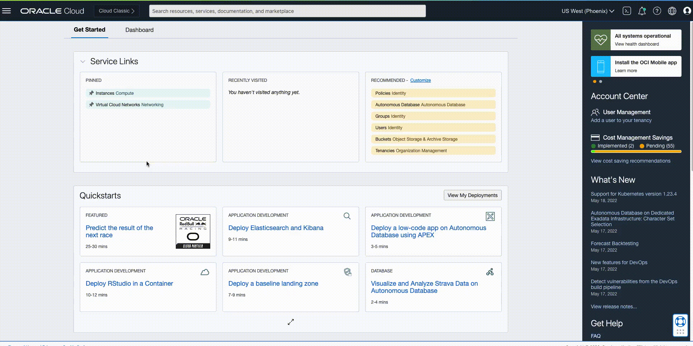

# Introduction

The following steps represents the getting started for Monitoring E-Business Suite with OCI Logging Analytics.

Estimated time: 10 minutes

## Objectives

- Launch the lab.
- Login to the OCI Environment.

## Quick summary
Quick summary of the actions in this section.
    

## Task 1: Launch the lab in virtual Desktop

Launch the lab, you are presented with your very own virtual Desktop. You will use a web browser in the virtual desktop to login to an Oracle Cloud Infrastructure environment. This environment has been pre-configured to run specific Logging Analytics tasks.

   

## Task 2: Login to the OCI Environment

In this step, Quick summary of the actions and Login to the OCI Environment from the OCI Console and navigate to Logging Analytics Explorer page.

1. If you have _not_ yet done so, navigate to your virtual Desktop, open the **Luna Lab** file by double-clicking on the file.

   Note: If a dialog box appears, check that Chrome is checked as the default browser and uncheck the sending of statistics and crash reports to Google.

   

2. Note the details in this file, scrolling down to view them all: a Quick Link to OCI, your username and password, and other lab details. Click on the **OCI Console** button. The OCI Login interface opens up in a separate tab.

   Note: If a message appears regarding cookies on the site, click the **I accept all cookies** button.

3. Navigate to first tab, copy your username and paste it in the **User Name** field in the second tab.

   

4. Repeat Step 3 above, this time copy the Password, then click **Sign In** to login to Oracle Cloud Infrastructure.

  

  *ProTip*: You can use the above credentials to login to OCI Tenancy from your Laptop browser instead of Lab's virtual desktop. To do that click here [OCI Console](https://cloud.oracle.com/?region=us-phoenix-1&tenant=emdemo&provider=OracleIdentityCloudService)

5. In the upper left side of the OCI Console click the navigation icon, click **Observability & Management**, navigate to **Logging Analytics**, then click **Log Explorer**. Depending on the screen resolution of your computer you may have to scroll down to find **Logging Analytics**.

     

  *ProTip*: Pin the Logging Analytics page links to your OCI Home to come back quickly. You can also search for 'Log Explorer' in the OCI Console search bar at the top of the console.

  You are now ready to explore Logging Analytics!

## Acknowledgements

* **Author** - Gurusamy Poosamalai, Logging Analytics Development Team
* **Contributors** -  Kumar Varun, Logging Analytics Product Management, Jolly Kundu - Logging Analytics Development Team
* **Last Updated By/Date** - Aug 12 2022
