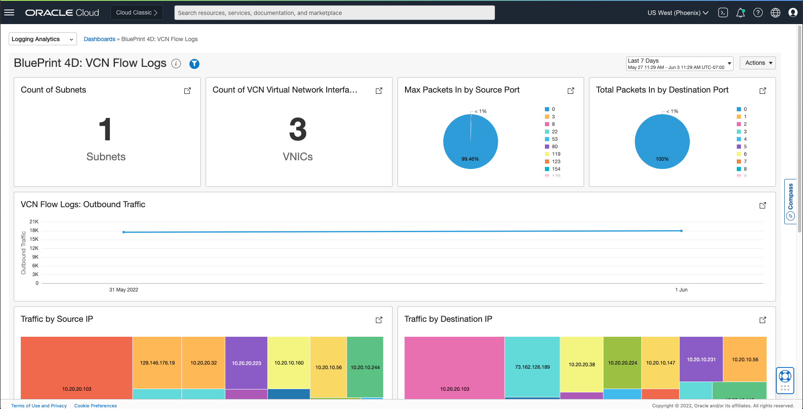
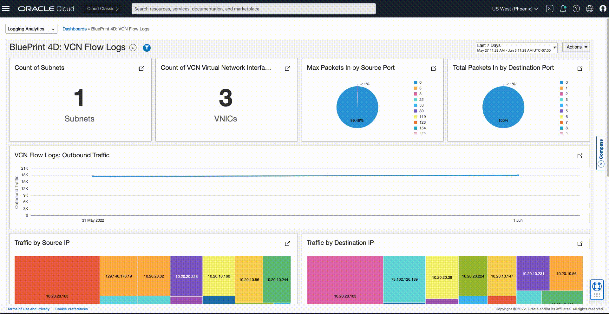
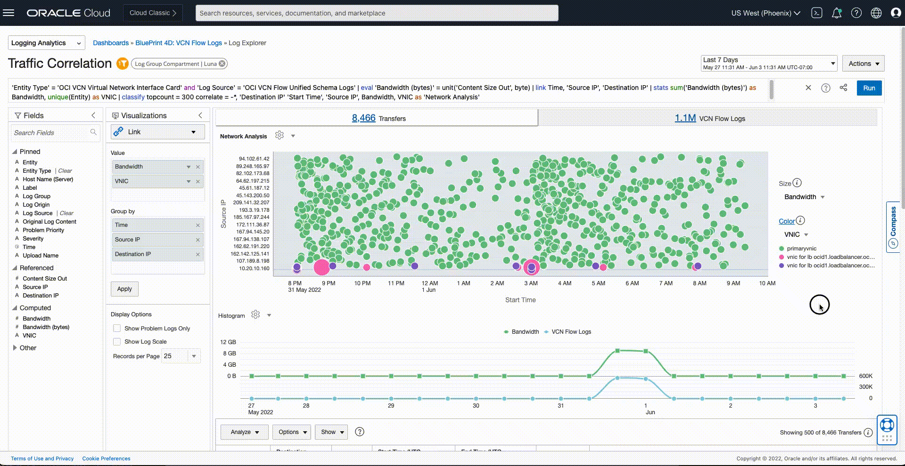

# Continuous Monitoring using Management dashboards

## Introduction

Let's do a walk through on continuous monitoring of E-Business Suite application and related infrastructure for a large enterprise using Management dashboards.

Estimated Lab Time: 5 minutes

### Objectives

In this lab, you will:
* Continuous Monitoring using Management dashboards

## **Task 1:**  Continuous Monitoring using Management dashboards

1. Select 'Dashboards' from the top navigation dropdown in Log explorer to view the 'Dashboards' listing page and select Compartment as 'Luna' in the 'Dashboards Scope' section on the left. Then click on "BluePrint 4D: VCN Flow Logs" dashboard to see the monitoring dashboard for Virtual Cloud Network Flow Logs analysis.

   

   You can click on any widget to drill down further for analysis. Click on "BluePrint 4D: VCN Flow Logs" dashboard to see the monitoring dashboard for Virtual Cloud Network Flow Logs analysis.

   

2. Scroll down to 'Traffic Correlation' widget and click on the punch-out icon of the widget to analyze further.

    

3. Next, you can filter the data based on different parameters to identify a specific IP, Bandwidth bucket or VNIC. Repeat the steps from previous section to select "Show Search Filters" to drill down to a specific Bandwidth range and a VNIC.

    

## Acknowledgements
* **Author** - Gurusamy Poosamalai, Logging Analytics Development Team
* **Contributors** -  Kumar Varun, Logging Analytics Product Management, Jolly Kundu - Logging Analytics Development Team
* **Last Updated By/Date** - Aug 24 2022
