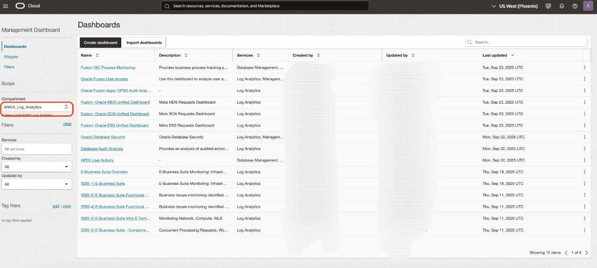
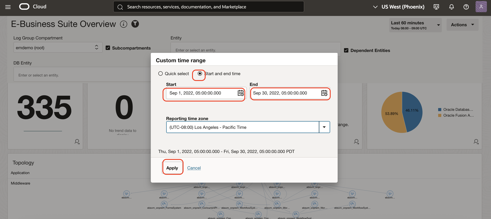

# Continuous Monitoring using Management dashboards

## Introduction

Let's do a walk through on continuous monitoring of E-Business Suite application and related infrastructure for a large enterprise using Management dashboards.

Estimated Lab Time: 20 minutes

### Objectives

In this lab, you will:
* Continuous Monitoring using Management dashboards

## **Task 1:**  Continuous Monitoring using Management dashboards

1. Select 'Dashboards' from the top navigation dropdown in Log explorer to view the 'Dashboards'
   

2. Select Compartment as 'ebs-lab-9522' in the 'Dashboards Scope' section on the left.

   

3. Click on "E-Business Suite Overview" dashboard to see the monitoring dashboard for E-Business Suite and Virtual Cloud Network Flow Logs analysis.
   

4. Click **Custom** under **Time range** pickerSet, then Click on "Start and End Time".
   

5. Select START time as **Sep 1, 2022 12:00:00 AM**, END Time as **Sep 30, 2022 12:00:00 PM** and Click Apply.
   

6. The below widget shows Virtual Cloud Network Flow Logs analysis like 'Max Packets In By Source Port' , 'Total Packets In by Destination Port'
   

7. The below widgets shows 'VCN Flow Logs Outbound Traffic', 'Traffic By Source IP' and 'Traffic By Destination IP'
   

8. Scroll down to 'Functional Issues Overview' to view EBS Functional issues
   

9. Click on the punch-out icon of the widget 'Functional Issues Overview' to analyze further.

   

10. Next, you can analyze further based EBS Functional Issues.

    
    

## Acknowledgements
* **Author** - Gurusamy Poosamalai, Logging Analytics Development Team
* **Contributors** -  Kumar Varun, Logging Analytics Product Management, Jolly Kundu - Logging Analytics Development Team
* **Last Updated By/Date** - Aug 24 2022
