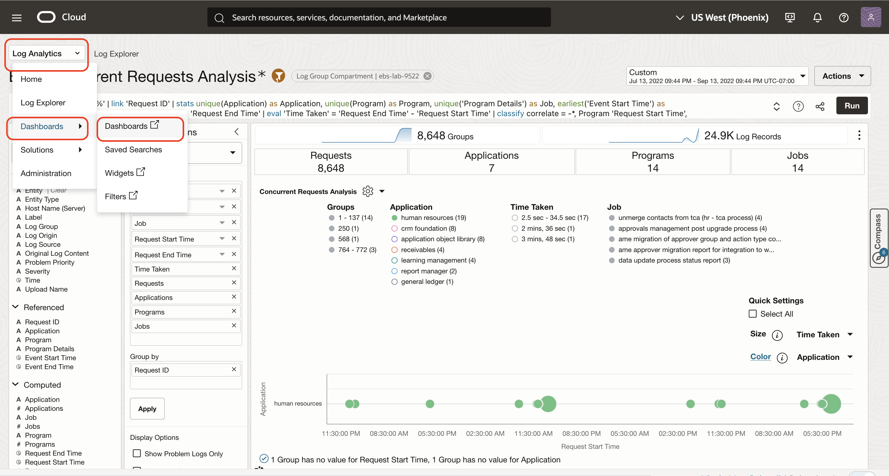
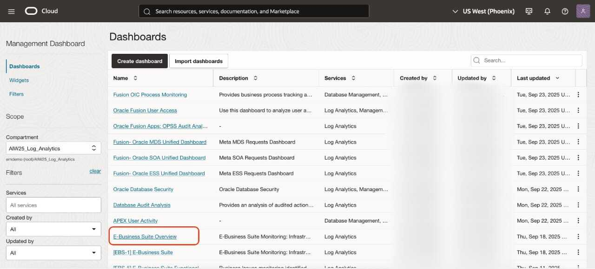
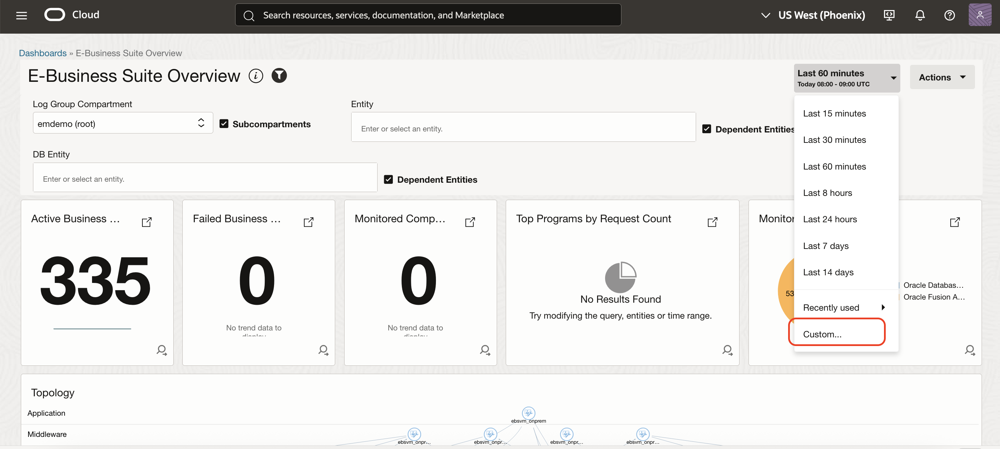
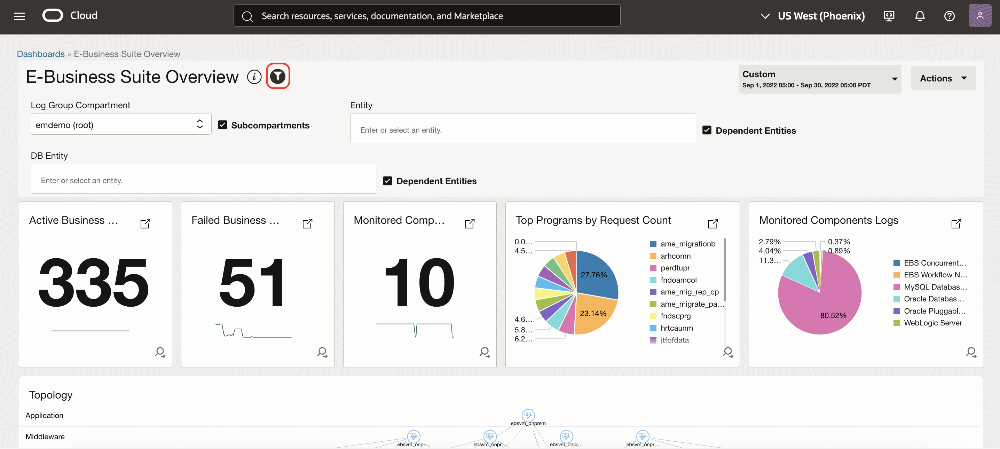
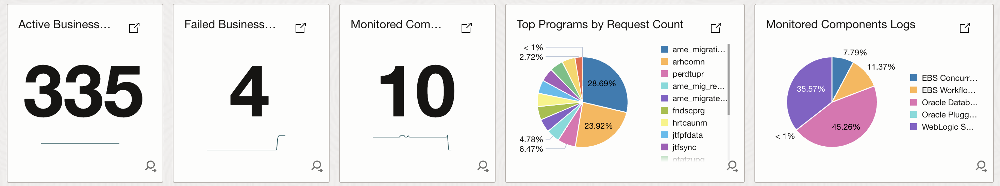
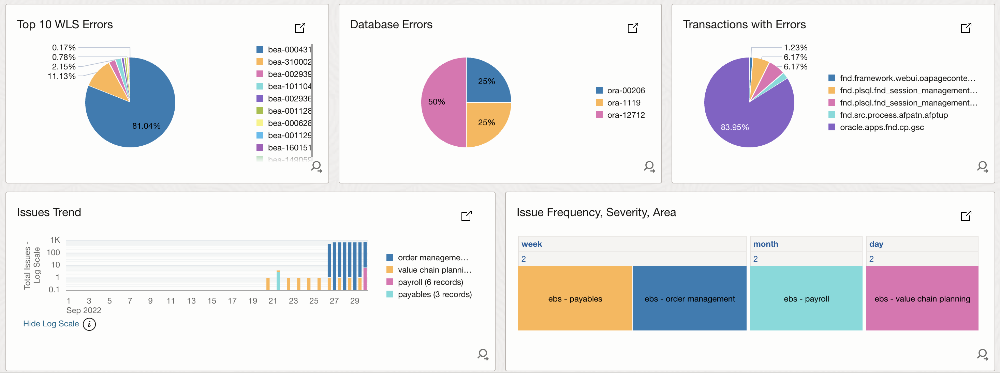
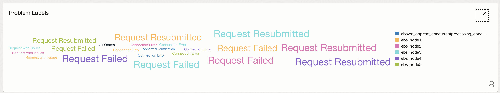
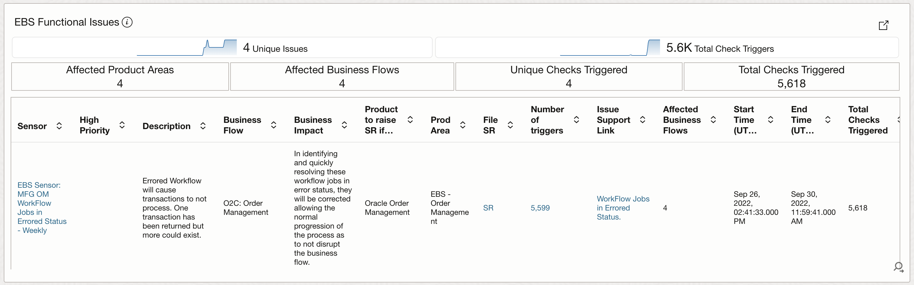
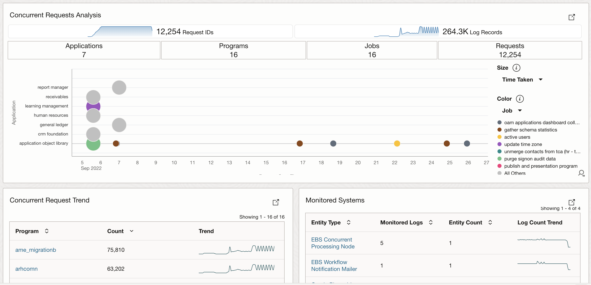

# Continuous Monitoring using Management dashboards

## Introduction

Let's do a walk through on continuous monitoring of E-Business Suite application and related infrastructure for a large enterprise using Management dashboards.

Estimated Lab Time: 20 minutes

Watch the video below for a quick walk-through of the lab.
[Continuous Monitoring using Management dashboards](videohub:1_99o2xtxy)

### Objectives

In this lab, you will:
* Continuous Monitoring using Management dashboards

## **Task 1:**  Continuous Monitoring using Management dashboards

1. Select 'Dashboards' from the top navigation dropdown in Log explorer to view the 'Dashboards'
   

2. Select Compartment as  **AIW25\_Log\_Analytics** in the 'Dashboards Scope' section on the left.

   

3. Click on **E-Business Suite Overview** dashboard to see the monitoring dashboard for E-Business Suite.
   

4. Click **Custom** under **Time range** pickerSet, then Click on "Start and End Time".
   

5. Select START time as **Sep 1, 2022 12:00:00 AM**, END Time as **Sep 30, 2022 12:00:00 PM** and Click Apply.
   

6.  Click on **Open/Close filter panel** to close the filter panel.
      

 
7. A dashboard with multiple widgets is displayed.
 
8. High level view of the E-business application with Active Business Checks, Failed Business Checks and Monitored Components can be seen within below widgets.
   

 
9. Topological view showing the interconnected structure of application, middleware, database and compute components can be seen using below widget.
   

10. Geo map showing the locations from which the applications are accessed, helping to identify hotspots.
   

11. Charts showing distribution of various errors in the application.
   

12. A word cloud of various problem labels in each of the entity.
   

13. Details of the functional issues in the application including product areas, business impact, SR etc.
   

14. Analysis of requests and monitored systems.
   

         
   
## Acknowledgements
* **Author** - Gurusamy Poosamalai, Log Analytics Development Team, Supriya Joshi, Log Analytics Development Team
* **Contributors** -  Kumar Varun, Log Analytics Product Management, Jolly Kundu - Log Analytics Development Team
* **Last Updated By/Date** - Sep 10 2025
