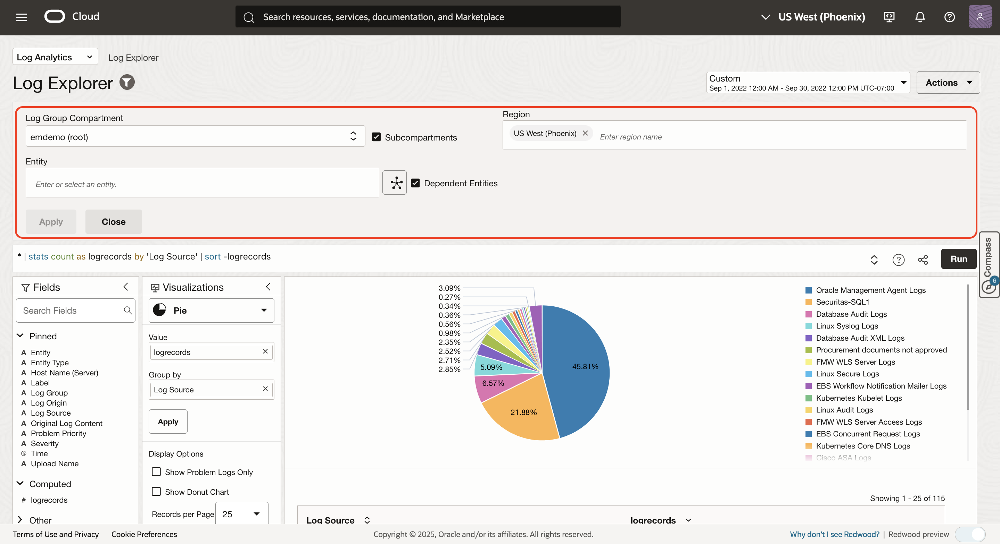
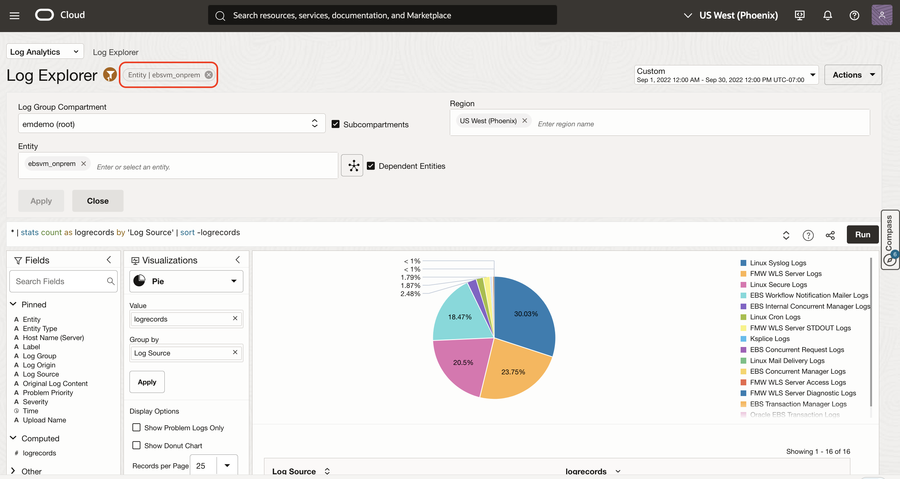
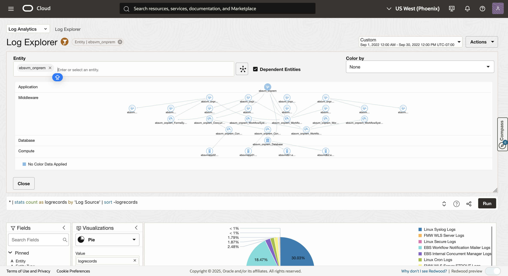
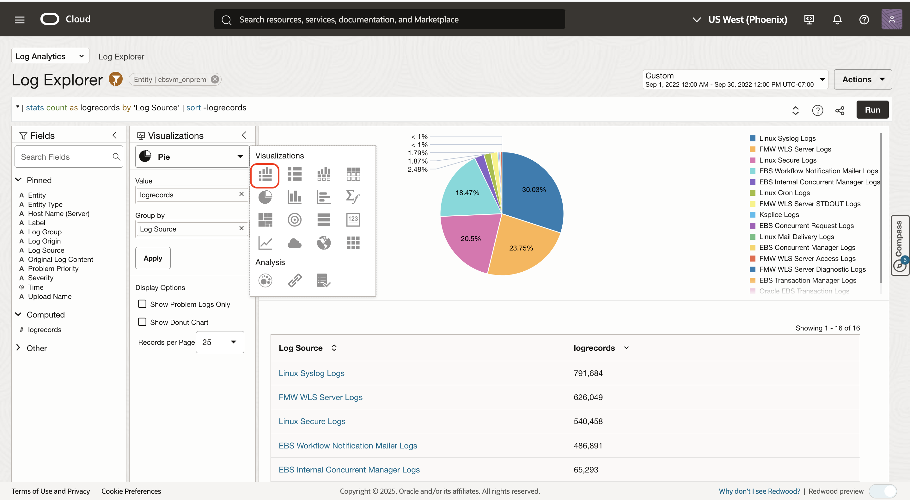
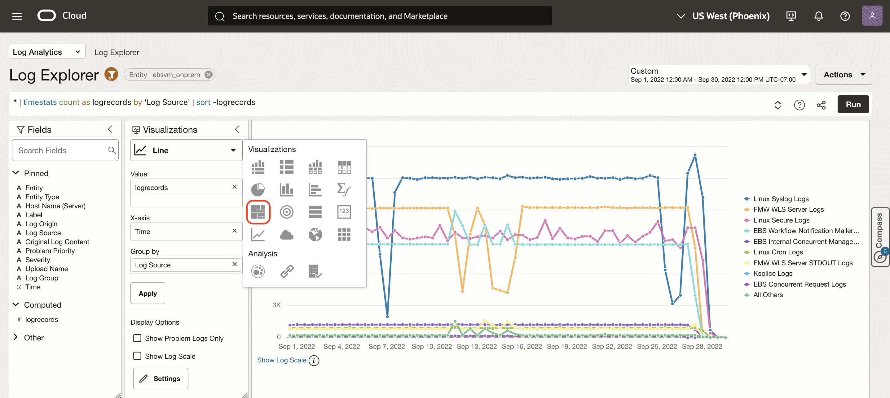
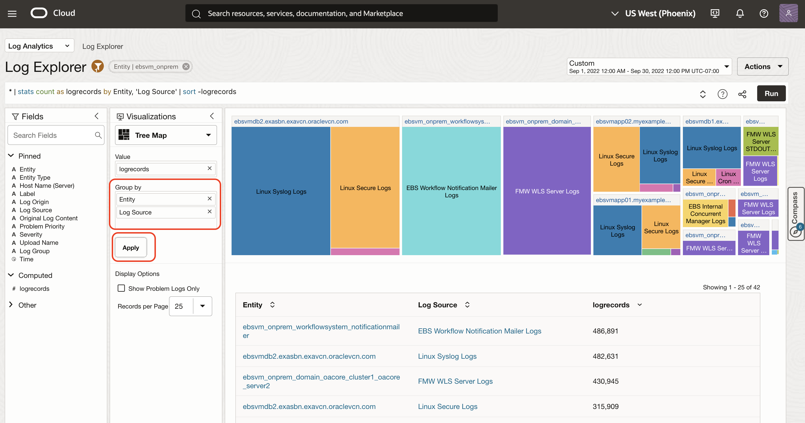
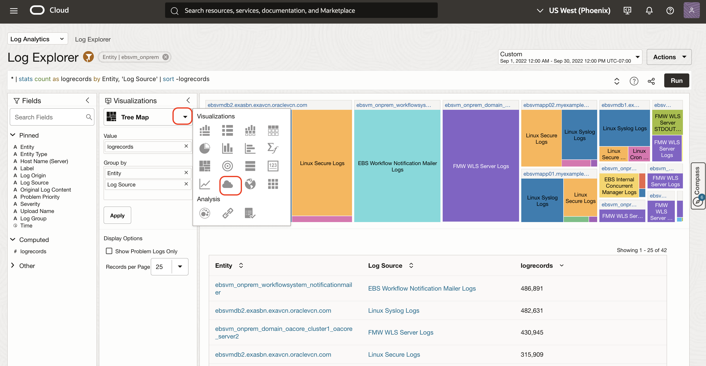
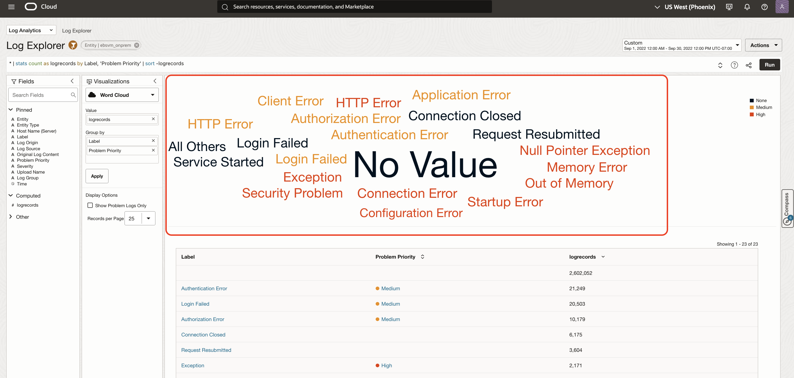
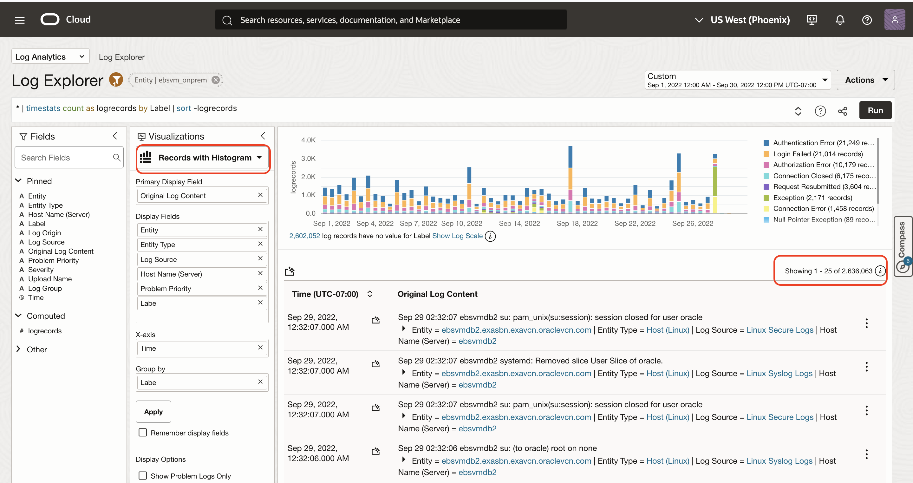

# Logging Analytics Basics

## Introduction

In this Lab, you will learn to monitor the health, performance, uptime and availability of the E-Business Suite application and related infrastructure for a large enterprise application.

Estimated Lab Time: 15 minutes

### Objectives
In this lab, our goal is to answer the following questions:

* What is the log trend by log types, entity, problem priority etc?
* How many systems are being monitored and their deployment topology?
* What are the current KPIs and their trends?

Now we will walk through monitoring of E-Business Suite application and related infrastructure.

Note: If at any point you want to come to the initial screen - you can use your browser back button or "Action" --> "Create New"

## **Task 1:**  Log trend by Entity Types and Entity
In this task, you will learn to monitor log trend by entity type and entity.

1. Click on the field "Entity Type" in the Fields Panel in Log Explorer to bring up a faceted view of all the monitored entities.

   

2. Click on "Show Trend Chart" in Facet view to visualize the logs trend of these entity types.

   

3. Repeat steps 1 & 2 to visualize log trends for the field "Entity"

   

   At this point you know different types of logs being ingested, Entity types  and specific entities being monitored.

## **Task 2:**  Topology of E-Business Suite application and related infrastructure
In this task, you will learn monitoring a complex packaged apps with multiple application tiers so its important and useful to visualize this complex deployment.

1. Click on the 'Scope Filter' icon in Log Explorer to invoke filter view

   

   

2. Search for the keyword "ebsvm\_onprem" in the Entity search box. "ebsvm_onprem" is the top level entity of Entity Type E-Business Suite.

   

3. In the Scope Filter, select "ebsvm\_onprem" entity from the drop-down to set the analysis scope to this ebsvm_onprem entity.

   

4. Click "Apply"

   

  You can also visualize the topology of the this EBS deployment by clicking on the "Topology" icon in the scope filter. Topology view can be used to filter logs from a specific Entity.

   

5. Here you see the monitoring of EBS systems and its deployment topology
   

  Click "Close" to close the Scope Filter. Next, let's look at the log trends over time.

## **Task 3:** E-Business Suite application Log Visualizations
In this task, you will learn various Log visualizations of complex EBS apps with multiple application tiers so its important and useful to visualize this complex deployment.

1. Click on the Visualizations dropdown in the Visualization Panel to select **Records with Histogram** visualization.

  

  

  Here you see the distribution of different logs in last 60 minutes. Next we want to see the trend over last 24 hours.

2. Select 'Last 24 Hours' from the Time Range picker

  

  Here you see the volume of logs generated by different Log Sources along with the log records. This visualization shows log sources by their log volume. Line charts can give more visibility. Lets change to 'Line Chart' Visualization and increase the time-range to Last 14 Days

3. Click on the visualization drop-down and select "Line" visualization and use the "Time Range" picker to select **Last 14 Days**.

  

   Logging Analytics enriches logs with problem labels and error categories for easy problem identification along their severity. Next, we want to find out problem severities across different Log Sources.

4. Select "Tree Map" visualization from the visualization drop down.

  

  Drag and drop the field "Entity" from the Fields Panel into the "Group by" input box in Visualization Panel and change the order of 'Entity' and 'Log Source' by dragging Entity above Log Source. Click 'Apply'

  

5. Next replace the Group-by current inputs with the Field "Label" & "Problem Priority" in that order and select "Word Cloud" visualization.

  

  

  Here you see different actions and problems labels color-coded by their problem priority.

  Let's go back to 'Records with Histogram' visualization in the context of Entity **ebsvm_onprem** and time-range **Last 14 Days**. You are working with millions of log records and next we want to use Machine Learning techniques to analyze these records.

  

## Acknowledgements
* **Author** - Gurusamy Poosamalai, Logging Analytics Development Team
* **Contributors** -  Kumar Varun, Logging Analytics Product Management, Jolly Kundu - Logging Analytics Development Team
* **Last Updated By/Date** - Aug 24 2022
