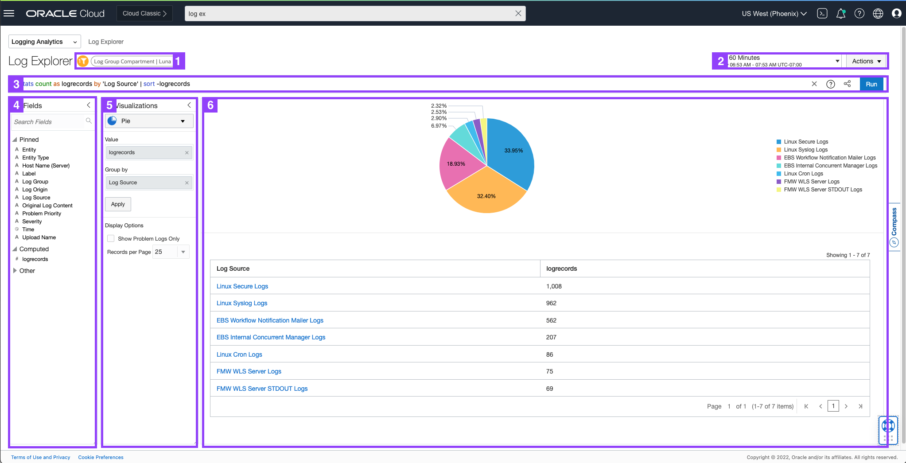

# Getting Familiar with Logging Analytics Explorer GUI

## Introduction

Let's do a walk through of Log Explorer, which should be the current view on your virtual desktop on OCI Console.

Your should see a page similar to the one below showing the distribution of different types of logs currently being collected in this tenancy in the last 60 minutes.

Estimated Lab Time: 5 minutes

### Objectives

In this lab, you will:
* Familiarise user interfaces used in Log Explorer GUI

## **Task 1:**  Familiarise user interface used in Logging Analytics

Here are the main parts of the user interface that will be used throughout this lab.

1. **Scope Filter** for setting Entity and Log Group Compartment scope for exploration.

2. **Time range** picker, and **Actions** menu where you can find actions such as, *Open*, *Save*, and *Save as*.

3. **Query bar**, with **Clear**, **Search Help** and **Run** buttons at the right end of the bar.

4. **Fields panel**, where you can select sources and fields to filter your data.

5. **Visualization panel**, where you can select the way to present search data in a form that helps you.

6. **Main panel**, where the visualization outputs appear above the results of the query.

Around 14 different types of logs (Log Sources) are being collected in Logging Analytics ranging from logs from Oracle Database to Linux OS to Packaged Applications to Cloud Services.

Note: You are working with live logs so it may take a few minutes for logs to show up in your Log Explorer view. Click the **Run** button to re-run the query.

You'll learn log analytics basics and how to use Log Explorer GUI in the next section.

## Acknowledgements
* **Author** - Gurusamy Poosamalai, Logging Analytics Development Team
* **Contributors** -  Kumar Varun, Logging Analytics Product Management, Jolly Kundu - Logging Analytics Development Team
* **Last Updated By/Date** - Aug 24 2022
