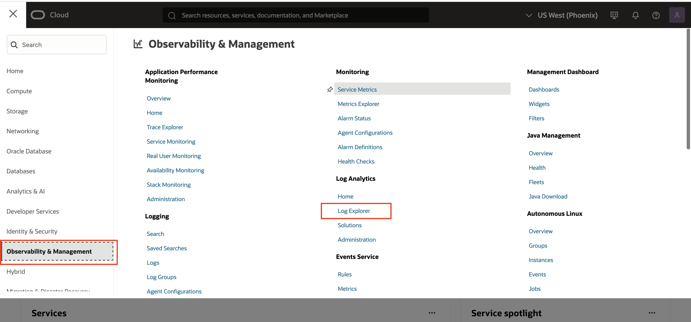
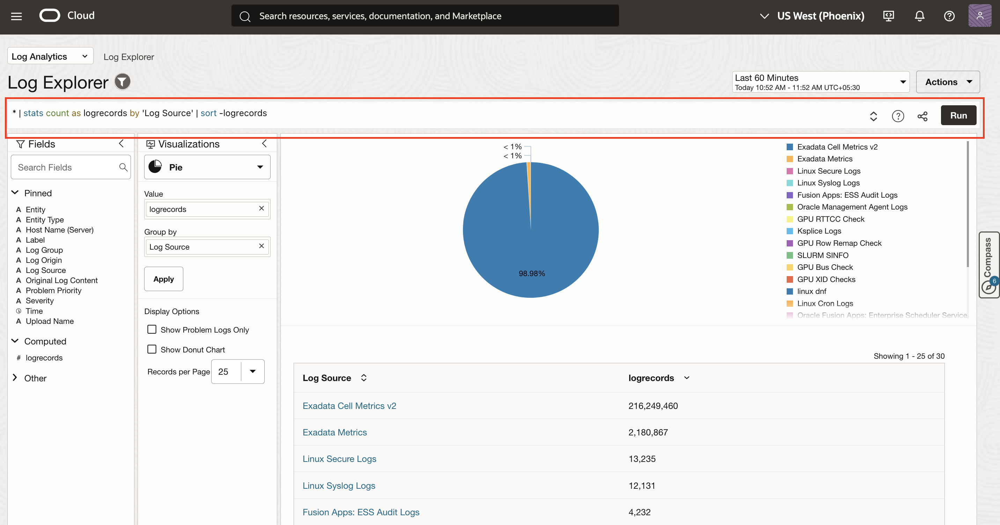

# Get Familiar with Log Analytics Explorer GUI

## Introduction

Let's do a walk through of Log Explorer.

Once you navigate to the Log Explorer GUI (as outlined in the tasks below), a page will appear showing the distribution of various log types collected in this tenancy over the past 60 minutes.

Estimated Lab Time: 10 minutes


### Objectives

In this lab, you will:
* Navigate to Log Explorer
* Familiarize user interfaces used in Log Explorer GUI

## **Task 1:**  Navigate to Log Explorer GUI

1. From Navigation Menu  click **Observability & Management**. Under **Log Analytics** click **Log Explorer**.


  Note : You can also copy-paste the following link in your browser's address bar to navigate to the Log Explorer.
    ```
     <copy>
        https://cloud.oracle.com/loganalytics/explorer?region=us-phoenix-1
     </copy>   
    ```

2. Log Explorer page will be displayed as below.


## **Task 2:**  Familiarize user interface used in Log Analytics

Here are the main parts of the user interface that will be used throughout this lab.


1. **Scope Filter** for setting Log Group Compartment and Entity scope for exploration.


2. **Time range** picker, and **Actions** menu where you can find actions such as, *Open*, *Save*, and *Save as*.


3. **Query bar**, with **Clear**, **Search Help** and **Run** buttons at the right end of the bar.


4. **Fields panel**, where you can select sources and fields to filter your data.


5. **Visualization panel**, where you can select the way to present search data in a form that helps you.


6. **Main panel**, where the visualization outputs appear above the results of the query.


Around 800+ different types of logs (Log Sources) are being collected in Log Analytics ranging from logs from Oracle Database to Linux OS to Packaged Applications to Cloud Services.

Note: You are working with live logs so it may take a few minutes for logs to show up in your Log Explorer view. Click the **Run** button to re-run the query.

You'll learn log analytics basics and how to use Log Explorer GUI in the next section.

## Acknowledgements
* **Author** - Gurusamy Poosamalai, Log Analytics Development Team, Supriya Joshi, Log Analytics Development Team
* **Contributors** -  Kumar Varun, Log Analytics Product Management, Jolly Kundu - Log Analytics Development Team
* **Last Updated By/Date** - Sep 10 2025
