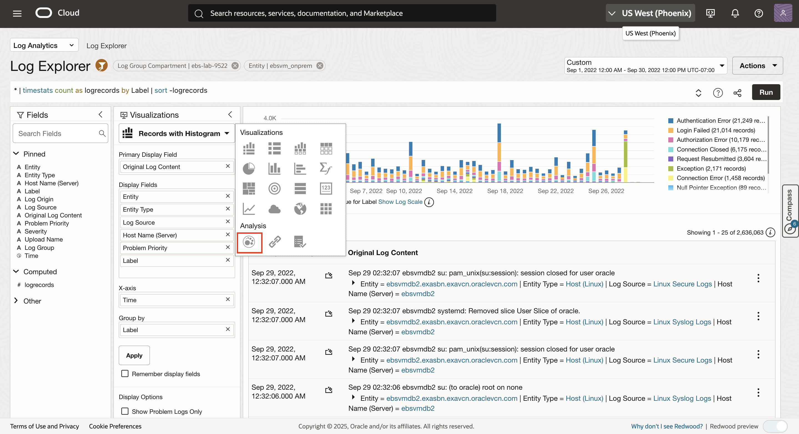
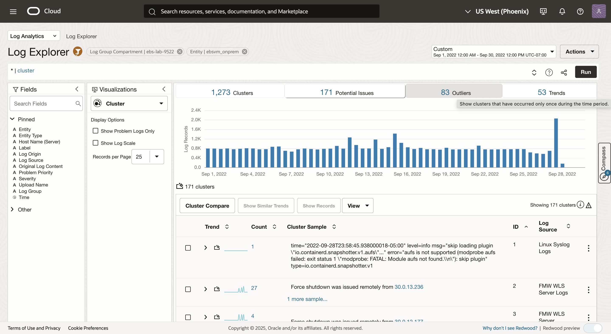
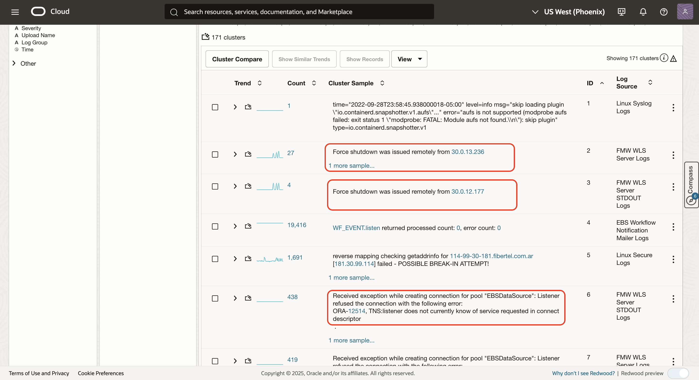
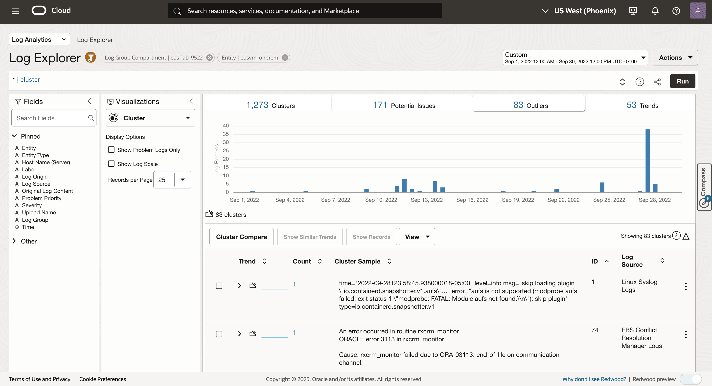
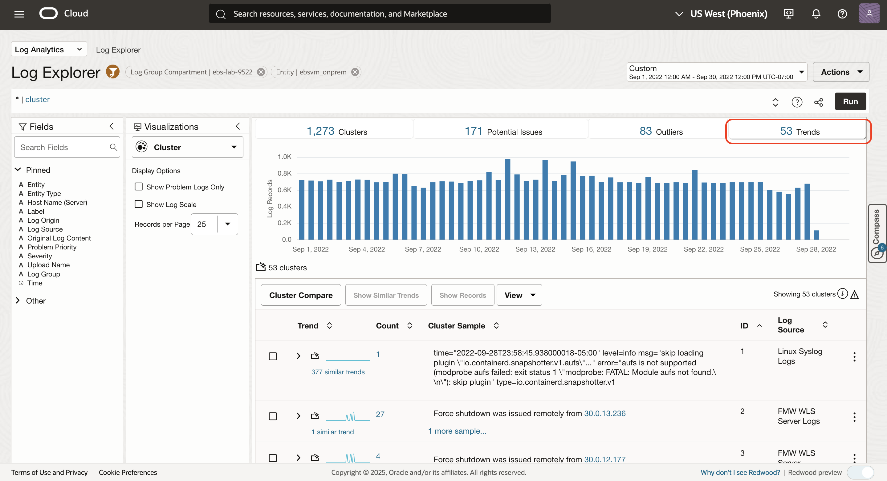
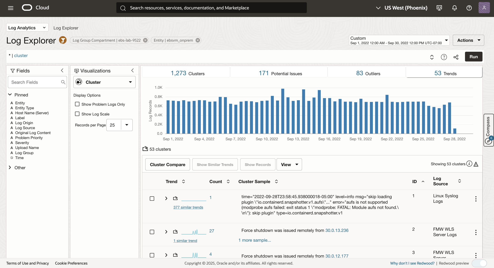
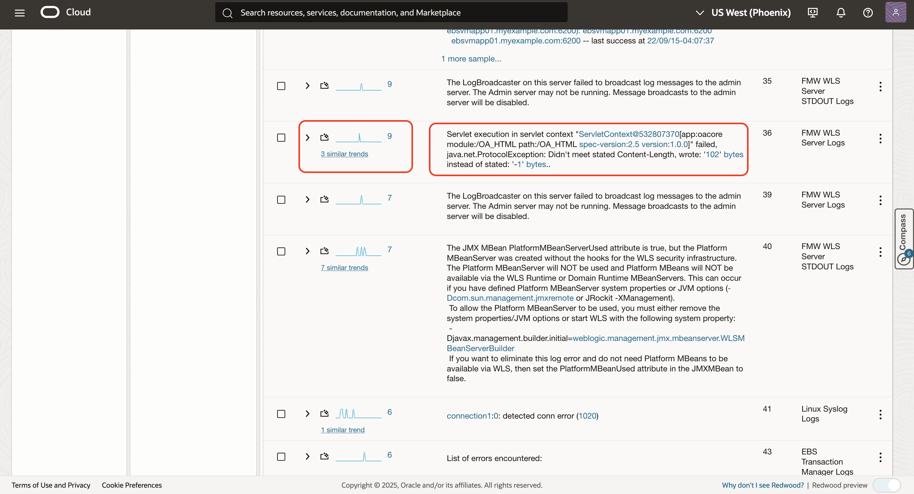

# ML Clustering to analyze large volume of logs

## Introduction
It is easier to visualize large volume of data as related clusters. Log Analytics - Clustering (Unsupervised ML) uses the log data and the enriched domain expertise to find patterns in the data. Clustering works on text as well as numbers, allowing large volume of data to be reduced to fewer patterns for anomaly detection.

Estimated Time: 20 minutes

Watch the video below for a quick walk-through of the lab.
[ML Clustering to analyze large volume of logs](videohub:1_vcjsfdk0)

### Objectives

In this lab, you will:
* Analyze large volume of logs using cluster command

## **Task 1:**  Analyzing large volume of logs using **cluster**

1. Click on Scope Filter then search and select Log Group Compartment "ebs-lab-9522" then Click Apply and Close to set scope filter for Analyzing logs. 
  

     **Note:**  The chosen entity in the scope filter should not be cleared.


2. Click on the 'Cluster' visualization to invoke machine learning

  

  Note: You can also copy-paste the following link to your browser for cluster visualization.

      ```
      <copy>
   https://cloud.oracle.com/loganalytics/explorer?viz=cluster&encodedQuery=KiB8IGNsdXN0ZXI%3D&vizOptions=%7B%22customVizOpt%22%3A%7B%22primaryFieldIname%22%3A%22mbody%22%2C%22primaryFieldDname%22%3A%22Original%20Log%20Content%22%7D%7D&scopeFilters=lg%3Aocid1.compartment.oc1..aaaaaaaaxujlxdn7x745hunya7vhmu3odkxcp4c4vkczi5c2gilbksokvdna%2Ctrue%3Ben%3Aroot%2Ctrue%2Cocid1.loganalyticsentity.oc1.phx.amaaaaaaqgp2kriayzkchiuhdznrq6peshz4pk6gknqk725shpjtyyj2jpta%3Brs%3Aroot%2Ctrue%3Brg%3Aus-phoenix-1&startTime=1662015600000&endTime=1664564400000&tenant=emdemo&region=us-phoenix-1
      </copy>
      ```

3. Drill down into cluster tab.

   Log Analytics uses unsupervised ML to find related clusters in data.  This reduces approximately 2,688,453 log records to 1273 cluster patterns, in real time.

   

  **Note:** The actuals numbers might be different as you are using live log data.

## **Task 2:**  Analyzing logs using **Potential Issues**

   **Potential Issues** are a subset of total clusters that have potential issues based on log records containing words such as error, fatal, exception, and so on. In this task you will learn to analyzing logs using cluster potential issues.

1. Click on the **Potential Issues** tab.
   

2. In this screenshot, we see that out of the 1273 clusters, 171 were automatically identified as Potential Issues.
   

3. You will see the potential issues which helps you to analyze your application.
   

   Note: The actual numbers on your screen may be different because you are using live log data.

## **Task 3:**  Analyzing logs using **Outliers**
   **Outliers:** Number of clusters that have occurred only once during a given time period.

1. Click on **Outliers** tab.

   

2. In this screenshot, we see that 83 were automatically identified as outliers.

   

3. You will see these issues occurred only once, and indicate an anomaly in the system.

   

## **Task 4:**  Correlate logs based on **Trends** tab

   **Trend**: Number of unique trends during the time period. Many clusters may have the same trend. These are log cluster patterns that are correlated in time.

1. Click on the 'Trends' tab in the Cluster visualization,

   

2. In this screenshot, we see that 53 trends were automatically identified.

   

3. Scroll down to find the "3 similar trends" shown in the screenshot below.

   **Note:**  The exact number of displayed trends may vary based on the selected time window and timezone. Hence we can see different number of similar trends.
   


4. Next, click on "3 similar trends" to see a set of related logs from the 'EBS Transaction Manager Logs' and 'FMW WLS Server Logs'. 

   **Note:**  The exact number of displayed trends may vary based on the selected time window and timezone.

   

   These are the clusters that had the same shape (i.e. occuring at the same time) to as the selected cluster pattern in time. In this case these are the messages issued by EBS Transaction Manager Logs for a database connection issue.

## Acknowledgements
* **Author** - Gurusamy Poosamalai, Log Analytics Development Team, Supriya Joshi, Log Analytics Development Team
* **Contributors** -  Kumar Varun, Log Analytics Product Management, Jolly Kundu - Log Analytics Development Team
* **Last Updated By/Date** - Sep 10 2025
