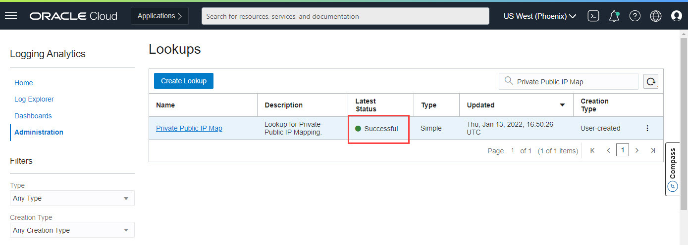
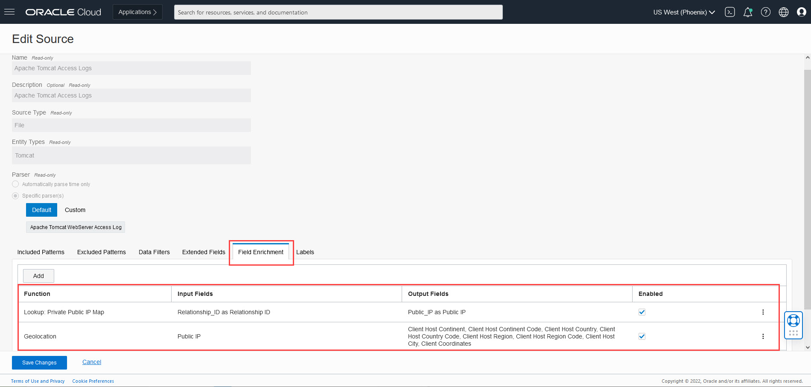

# Geolocation Enrichment for Private IPs

## Introduction

In Lab 1, you saw how to enrich Geolocation data for Public IPs. In this Lab, you will setup and configure a Logging Analytics Source to perform Geolocation Enrichment for both Private and Public addresses.
You can see an example use case published at [Geolocation Blog for Private IPs](https://blogs.oracle.com/observability/post/geolocation-enrichment-for-securing-private-ip-addresses).

Estimated Lab Time: 30 minutes

### Objectives

In this lab, you will:
* Create a Lookup to map Private and Public IPs.
* Configure `Apache Tomcat Access Logs` Log Source to setup Geolocation enrichment.

### Prerequisites

* You must have an [Oracle Cloud Infrastructure](https://cloud.oracle.com/en_US/cloud-infrastructure) enabled account.
* Logging Analytics Service must be onboarded.
* Working knowledge of OCI Logging Analytics and OCI in general.


Now we will walk through creating a Lookup and configuring Source for Geolocation Enrichment.

## **Task 1:**  Understanding Private Public IP mapping for Logging Analytics
Many users connect to business applications or services after they have connected to a Virtual Private Network (VPN). When a user connects to VPN, a Private IP is assigned to their device. From this point on, all communication to and from user’s device is routed through VPN services Public IP address. Which in turn could be the Public IP for 100-1000s of devices.</br>
When a user connects to VPN, the server access log shows the client's Private IP address for API requests. This creates a challenge in Geolocation Enrichment since Geolocation data cannot be extracted from Private IPs. To overcome this, we need information about how these Private IPs are mapped to a single Public IP.
Network Administrators maintain Private and Public IPs map to be used by their VPN service. We can leverage this mapping to enrich Geolocation information in Logging Analytics.

Take an example of Rideshare Inc., an imaginary company for lab demonstration purposes. It has offices around the world and employees can connect to the office network via nearest VPN server.</br>
When its employee connects to VPN, the service assigns a Private IP from a dedicated pool. Say an employee connects to VPN via Freemont, CA server whose Public IP is 162.244.33.211. For this connection, the service assigns Private IP as 172.16.255.28</br>
Rideshare Inc's network administrators maintain the Private Public IP mapping as below:
> **Note:** For actual details, contact your network administrator to get the Private and Public IP address mapping.
| Private IP |  Public IP |
| --- | --- |
| 172.16.\*.\* | 162.244.33.211 |
| 172.17.\*.\* | 52.160.225.16 |
| 172.18.\*.\* | 192.241.211.91 |

Observe that they have used first 2 octets of Private IP to map the given Public IP.

Great, now we know the IP mappings and we can proceed to next step. Here we will use this critical information to generate Logging Analytics Lookup table.

## **Task 2:**  Create Lookup in Logging Analytics
Lookup allows you to match field-value combinations from Source to an external Lookup table, and if matched, the service appends field-value combinations to the log.</br>
For this task, we will be creating a **Simple** Lookup.</br>
Additional details are available in [Lookup documentation](https://docs.oracle.com/en-us/iaas/logging-analytics/doc/manage-lookups.html)

Lookup is created using a Comma Separated Values (csv) file. You will use the mapping table provided by your Network Administrator and create the file.

1. First create a Comma Separated Values (csv) file containing Private-Public IP mappings.</br>
Please save the [sample lookup file](./images/private-public-ip-mapping.csv) which we will upload later.
This is what the csv file looks like.
    > **Note:** We have used only first 2 octets of Private IP as remaining 2 are variables.
    ```
    <copy>
    Relationship_ID,Public_IP
    172.16,162.244.33.211
    172.17,52.160.225.16
    172.18,192.241.211.91
    </copy>
    ```

2. Open the navigation menu and click **Observability & Management**. Under **Logging Analytics** click **Administration**.


3. The administration resources are listed in the left hand navigation pane under **Resources**. Click **Lookups** to open lookups listing page.</br>
Here you will see Lookups for Oracle sources already defined. For this Lab, you are going to create a custom Lookup. Now click the **Create Lookup** button to open the Lookup creation dialog.
     

4. Next, configure your custom Lookup

    a. Enter **Private Public IP Map** into the **Name** field.</br>
    b. Type in **Private-Public IP Mapping** into the optional **Description** field.</br>
    c. For the **Type** field, drop down the menu and select **Simple**.</br>
    d. And choose **csv** as the file extension for the file that you created above.</br>
    e. Once you have finished the configuration of your custom Lookup, click **Create** button and you will be returned to the Lookup listing page where you will see the newly added Lookup `Private Public IP Map`</br>
        
    f. Refresh the Lookups listing page and watch for a **Successful** status to appear under the **Latest Status** heading.</br>
        
    g. Then on the Lookups page, under the Name heading, click on the `Private Public IP Map` entry to be taken to a page with its details and verify in the Lookup Table section that the CSV data was imported under the Relationship\_ID and Public\_IP headings.</br>
        
> **Note:** It may take up to 5 minutes to process the Lookup data.


## **Task 3:**  Configure Log Source
In this task, you will configure a Log Source to add Extended Fields and Field Enrichment.

1. From the upper left of the OCI Console select the navigation icon (looks like 3 bars), drop down the menu and navigate to **Logging Analytics** then to **Administration**, and then **Sources**. On the Sources page, type **Apache Tomcat Access Logs** into the search field and then enter.
     

2. In the Source row, look to the right of **Apache Tomcat Access Logs**, then click the three dots to be brought to the **Edit Source** page for this source.


3. On **Edit Source** page, Click the **Extended Fields** tab to add 2 Fields.</br>
    You will create a **Relationship ID** field and a **Public IP** field from the contents of the Source Field **Host IP Address (Client)**.</br>
    Create **Relationship ID** to contain the first 2 octets from **Host IP Address (Client)**.</br>
      a. Click the **Add** button to a open popup dialog.</br>
      b. In the **Base Field** choose **Host IP Address (Client)** from the drop-down list.</br>
      c. In the **Example Base Field Content**, type in **172.17.38.179** as the IP address.</br>
      d. In the **Extract Expression**, type in **{Relationship ID:\d+.\d+}**</br>
      e. Verify the checkbox is enabled and then click the **Test Definition** button to verify the **Relationship ID** in **Test Results** table displays a green **Success** under the Match Status heading. You can ignore any warnings that may appear.</br>
      f. Click the blue **Add** button to save the entry.
      

4. Now create the **Public IP** field from the **Host IP Address (Client)** field.</br>
      a. Click the **Add** button to open a popup dialog.</br>
      b. In the **Base Field** choose **Host IP Address (Client)** from the drop-down list.</br>
      c. In the **Example Base Field Content**, type in **172.16.138.209** as the IP address.</br>
      d. In the **Extract Expression**, type in **{Public IP:\S+}**</br>
      e. Verify the checkbox is enabled and then click the **Test Definition** button to verify the **Public IP** in **Test Results** table displays a green **Success** under the Match Status heading. You can ignore any warnings that may appear.</br>
      f. Click the blue **Add** button to return to the Extended Fields Tab.
      

5. Observe the 2 new rows that appear under the **Extended Fields** tab
  

6. From the **Edit Source** page, click **Field Enrichment** tab to add  **Lookup** and **Geolocation** entries.</br>
    First, We will add **Lookup** Function.</br>
      a. On the Field Enrichment tab, click the **Add** button (appears under Included Patterns heading) to add the Lookup.</br>
      b. When the **Add Field Enrichment** dialog appears, from the **Function** field, select **Lookup** from the drop-down menu.</br>
      c. For the **Lookup Table Name** field, select **Private Public IP Map** from the drop-down menu.</br>
      d. In the **Input Fields** section for the **Lookup Table Column** field select **Relationship\_ID** from the drop-down menu and for the **Log Source Field** select **Relationship ID** from the drop-down menu.</br>
      e. In the **Output Fields** section for the **Lookup Table Column** field select **Public_IP** from the drop-down menu and for the **Log Source Field** select **Public IP** from the drop-down menu.</br>
      f. Click **Add** button to return to the **Field Enrichment** tab.</br>
      

7. Now we will add the **Geolocation** Function.</br>
      a. From the **Field Enrichment** tab, click the **Add** button.</br>
      b. In the **Add Field Enrichment** dialog, in the **Function** field drop-down, select **Geolocation**.</br>
      c. For the **Input Fields** field, drop-down and select **Public IP**.</br>
      d. Click **Add** button to return to the **Field Enrichment** tab.</br>
      

8. Observe the 2 new rows that appear under the **Extended Fields** tab. Observe **Lookup** in the first row and **Geolocation** after.
      

9. Click the blue **Save Changes** button to save the Source.

> Note: After saving the Source, it takes up to 10 minutes to refresh it on server. Any logs ingested meanwhile will use old version of the Source.

This completes the Administration changes for Geolocation Enrichment.

You may now proceed to the next lab.

## Acknowledgements
* **Author** - Sachin Mirajkar, Logging Analytics Development Team
* **Contributors** -  Kumar Varun, Logging Analytics Product Management, Jolly Kundu - Logging Analytics Development Team
* **Last Updated By/Date** - Jan 12 2022
