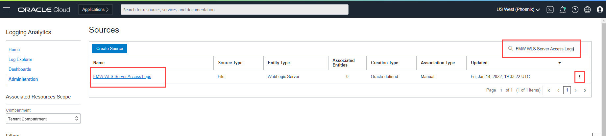
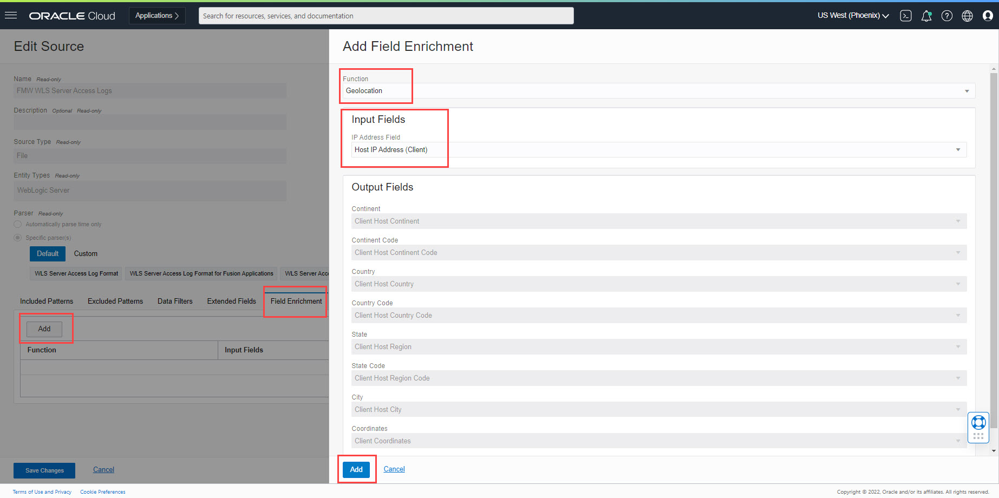

# Geolocation Enrichment for Public IPs

## Introduction

In this Lab, you will set up and configure a Logging Analytics source to perform Geolocation enrichment for Public IP addresses. You can see an example use case published at [Geolocation Blog for Public IPs](https://blogs.oracle.com/observability/post/why-invest-in-geolocation-enrichment-of-logs).

Estimated Lab Time: 30 minutes

### Objectives

In this lab, you will:
* Configure an `FMW WLS Server Access Logs` (Oracle Fusion Middleware Weblogic Server) Log Source to setup Geolocation enrichment.

### Prerequisites

* You must have an [Oracle Cloud Infrastructure](https://cloud.oracle.com/en_US/cloud-infrastructure) enabled account.
* Logging Analytics Service must be onboarded.
* Working knowledge of OCI Logging Analytics and OCI in general.

Now we will walk through creating a Lookup and configuring Source for Geolocation Enrichment.

## **Task 1:**  Configure Log Source
In this task, you will configure a Log Source to add Field Enrichment for Geolocation.

1. Open the navigation menu and click **Observability & Management**. Under **Logging Analytics** click **Administration**.

2. The administration resources are listed in the left hand navigation pane under **Resources**. Click **Sources** to open source listing page. In the **Sources** page in the upper right, type `FMW WLS Server Access Logs` into the search field and enter. You should then see FMW WLS Server Access Logs appear under Name.

3. In the Source row, look to the right of `FMW WLS Server Access Logs`, then click the three dots and select **Edit** menu to be brought to the **Edit Source** page.

4. Click the **Field Enrichment** tab and add Geolocation entry. 
      a. Click **Add** button to open Field Enrichment dialog box. 
      b. Select **Geolocation** as the **Function**. 
      c. In **Input Fields** section, select **IP Address Field** as **Host IP Address (Client)**. 
      d. Click **Add** button to return to the **Field Enrichment** tab. 
      

5. Observe new row that appear under the **Field Enrichment** tab.

6. Click the blue **Save Changes** button to save the Source.

> Note: After saving the Source, it takes up to 10 minutes to refresh it on server. Any logs ingested meanwhile will use old version of the Source.

This completes the Administration changes for Geolocation Enrichment.

You may now proceed to the next lab.

## Acknowledgements
* **Author** - Sachin Mirajkar, Logging Analytics Development Team
* **Contributors** -  Kumar Varun, Logging Analytics Product Management, Jolly Kundu - Logging Analytics Development Team
* **Last Updated By/Date** - Jan 12 2022
