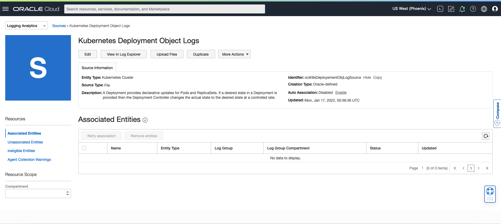
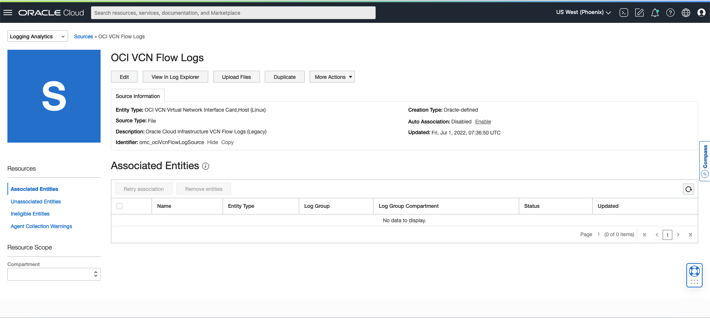
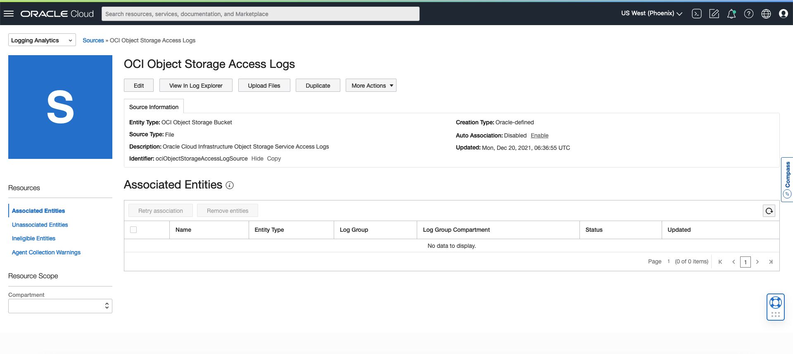
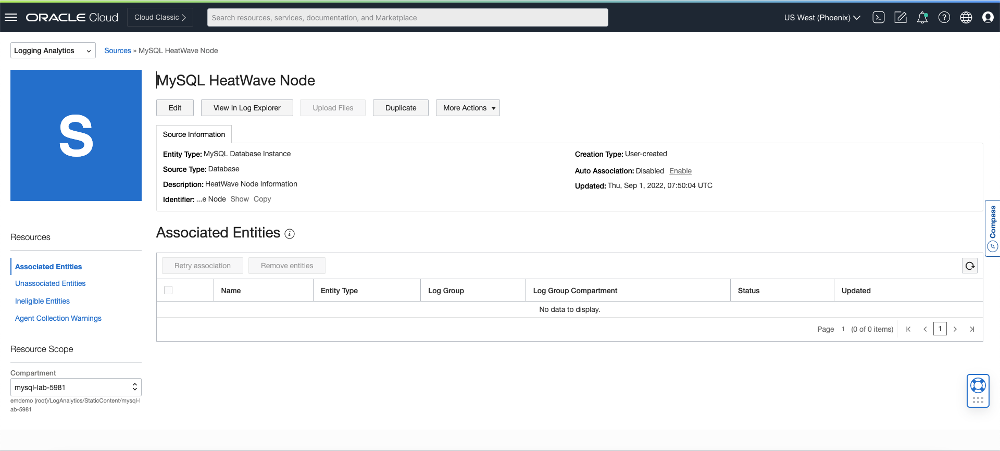

# Getting Familiar with Types of Logs Collected

## Introduction

The Flight recommendation Application is hosted on top of multiple OCI Resources including OKE Pods and Cluster, VNC, Object Storage, MySQL DB for database, etc. We are going to monitor, analyze, and troubleshoot the complete architecture by ingesting the logs from various sources in Logging Analytics.

Estimated Time: 5 min

### Objectives

In this lab, you will:
* Get familiar with types of logs collected as part of MySQL Database Monitoring and Troubleshooting

## **Task 1:** Get familiarized with the different Log Sources used in this Lab

Here is the list of Log Sources we will be using to ingest the logs from Application architecture into Logging Analytics

1. **Kubernetes Deployment Object Logs** - A Deployment provides declarative updates for Pods and ReplicaSets. If a desired state in a Deployment is provided then the Deployment Controller changes the actual state to the desired state at a controlled rate. This Log Source will collect the Kubernetes Deployment Logs and ingest them into OCI Logging Analytics for further processing and monitoring.

  

2. **OCI VCN Flow Logs** - VCN Flow logs record details about traffic that has been accepted or rejected based on the security list rules. This Log Source will ingest the flow logs from specified VCN into OCI Logging Analytics.

  

3. **OCI Object Storage Access Logs** - This Log Source will ingest the Service Access Logs for OCI Object Storage into OCI Logging Analytics.

  

4. **MySQL HeatWave Node** - This Log Source will collect and ingest the MySQL HeatWave Node Information Logs into OCI Logging Analytics.

  

Next Labs will take you through the analysis, monitoring, and troubleshooting aspects using logs ingested in OCI Logging Analytics.

## Acknowledgements

* **Author** - Tanishq Patil, Logging Analytics Development Team
* **Contributors** -  Kumar Varun, Logging Analytics Product Management, Jolly Kundu - Logging Analytics Development Team
* **Last Updated By/Date** - Sep 1, 2022
