# Advanced Dashboard

## Introduction

```
  TO BE UPDATED
```

Watch the video below for a quick walk-through of the lab.

### Objectives

In this lab, we will build two queries. One to get an inventory of the Cluster Services with Load Balancers, and another to monitor the Load Balancers. We will then link the second query from the first query, to be able to view the Load Balancer errors in the context of a cluster.

We will use these commands and features:
- Query Search
- Link Visualization
- stats command
- eventstats command
- addfields command
- eval replace and url commands
- Link Tiles feature


Estimated Time: 30 minutes

[comment]: <> (Inventory of Services with Load Balancers)

## Task 1: Reset previous selections

Click on **Actions** > **Create New** to reset the view.


## Task 2: Select the compartment

1. Click the scope filter .

2. Select the **oke-lab-9501** compartment.

3. Click on **Apply** button to apply the filter. 

4. Click on **Close** button to close the filter window.


## Task 3: Select the log group

1. Click on the **Log Group** field.

2. Select **kubernetes_logs** log group checkbox.

3. Click on **Apply**.


## Task 4: Switch to the Link Visualization

Under Visualizations, Click on the dropdown and select **Link** under Analysis section.

You should now see around 30 log sources that fetch information about various parts of your Kubernetes Infrastructure.


## Task 5: Link by the required fields

1. In the Search Fields searchbar, search **Namespace**, **Service** and **Load Balancer IP** fields and drag and drop these fields into the **Group By** area.

2. Remove the **Log Source** field from the Group By.

3. Click on **Apply** button.


## Task 6: Link includenulls = True

The link query will bring in only those Log Sources that have all of the fields specified in the Group By. In this case, we want to bring in the records, even if at least one of those fields are non-null. This is achieved by adding **includenulls = True** to the link command. This can be done by the following two methods.

1. Click on the **Options** dropdown and click on **Search Options**.

    Click the checkbox **Show log records with no Link By field**.

    Click on **Save Changes** button.

2. Change the query from:
    ```
        <copy>
            'Log Group' = kubernetes_logs | link Namespace, Service, 'Load Balancer IP'
        </copy>   
    ```
    To:
    ```
        <copy>
            'Log Group' = kubernetes_logs | link includenulls = True Namespace, Service, 'Load Balancer IP'
        </copy>   
    ```


## Task 7: Extract additional fields using the stats command

The link table has one row per unique combination of the selected Group By fields. Each of these rows has underlying log records, as shown in the Count field.

The stats command is similar to a foreach command, that goes through each row in this table. For each row, the stats command is applied to all the underlying log records, and the value is added as an additional column to the table.

We want to fetch the **Kubernetes Cluster Name** and the **Load Balancer Type** into the main table. The **unique()** function can be used fetch the unique value from each of these fields.

Append the following to your query:
    ```
         <copy>
            | stats unique('Kubernetes Cluster Name') as Cluster, unique(Type) as 'LB Type'
         </copy>   
    ```

The modified query looks like this:
    ```
         <copy>
            'Log Group' = kubernetes_logs
| link includenulls = true
   Namespace,
   Service,
 'Load Balancer IP'
| stats
   unique('Kubernetes Cluster Name')
      as Cluster,                                        
   unique(Type) as 'LB Type'
         </copy>   
    ```

You should now see the **Cluster** and the **LB Type** columns. If there is more than one value, then you would see a comma separated list.


## Task 8: Identify Load Balancer Errors using addfields

OCI Load Balancer Access Logs and OCI Load Balancer Error Logs capture details about the Load Balancers.

addfields is a command that can be used to apply stats commands to select logs. In this case, we want to look at all the logs that have a Load Balancer IP field and see if the Problem Priority field is non-null, and compute the count.

Append the following to your query:
    ```
         <copy>
            | addfields [ 'Load Balancer IP' != null and 'Problem Priority' != null | stats count as Errors ]
         </copy>   
    ```

You should now see an Errors column in the table.
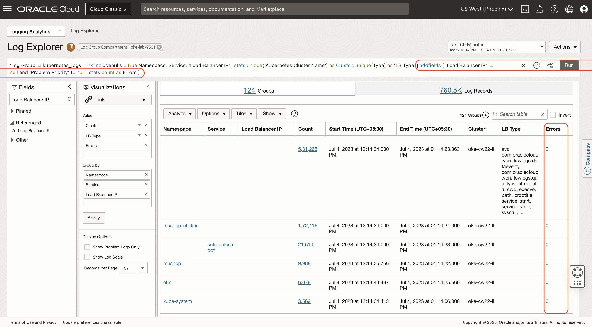


## Task 9: Rollup the Load Balancer Errors using the eventstats command

Use the **eventstats** command to aggregate the Load Balancer Errors by each Load Balancer.

Append the following to your query:
    ```
         <copy>
            | eventstats sum(Errors) as 'LB Errors' by 'Load Balancer IP'
         </copy>   
    ```

The LB Errors column would now report the number of errors against each Load Balancer IP
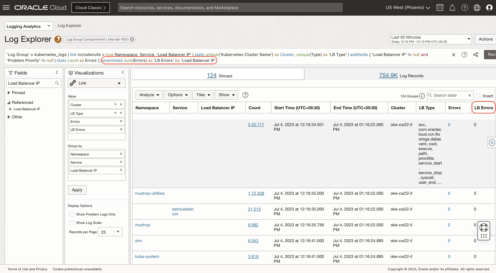


## Task 10: Summarize using the eventstats Command

We will use the eventstats command to aggregate the fields we have generated so far.

Append the following to your query:
    ```
         <copy>
            | eventstats distinctcount(Namespace) as Namespaces, distinctcount(Service) as Services, distinctcount('Load Balancer IP') as 'Load Balancers'
         </copy>   
    ```

The modified query looks like this:
    ```
         <copy>
            'Log Group' = kubernetes_logs
| link includenulls = true
      Namespace,
      Service,
     'Load Balancer IP'
| stats
  unique('Kubernetes Cluster Name') as Cluster,                                            
  unique(Type) as 'LB Type'
| addfields
  [ 'Load Balancer IP' != null and
    'Problem Priority' != null
        | stats count as Errors
  ]
| eventstats sum(Errors) as 'LB Errors'
              by 'Load Balancer IP'
| eventstats
   distinctcount(Namespace) as Namespaces,
   distinctcount(Service)   as Services,
   distinctcount('Load Balancer IP')
                   as 'Load Balancers'
         </copy>   
    ```

**eventstats** would add the results to ALL the rows of the table, unless there is a **by** clause. If there is a **by** clause, then all the rows for that unique by field will have the same values.


## Task 11: Filter the Table using Type = loadbalancer using the where command

There are multiple types of Load Balancers in the cluster. We will limit our analysis to only the type loadbalancer

Append the following command to your query to filter the table:
    ```
         <copy>
            | where 'LB Type' = loadbalancer
         </copy>   
    ```

The modified query looks like this:
    ```
         <copy>
            'Log Group' = kubernetes_logs
| link includenulls = true
      Namespace,
      Service,
     'Load Balancer IP'
| stats
  unique('Kubernetes Cluster Name') as Cluster,                                            
  unique(Type) as 'LB Type'
| addfields
  [ 'Load Balancer IP' != null and
    'Problem Priority' != null
        | stats count as Errors
  ]
| eventstats sum(Errors) as 'LB Errors'
              by 'Load Balancer IP'
| eventstats
   distinctcount(Namespace) as Namespaces,
   distinctcount(Service)   as Services,
   distinctcount('Load Balancer IP')
                   as 'Load Balancers'
| where 'LB Type' = loadbalancer
         </copy>   
    ```


## Task 12: Hide unnecessary columns in the UI

We have several fields that we would only use in the Tiles.

Click on the **Options** dropdown and click on **Hide/Show Columns** and uncheck the following to hide these columns:
- Count
- Start Time
- End Time
- Cluster
- Errors
- Namespaces
- Services
- Load Balancers
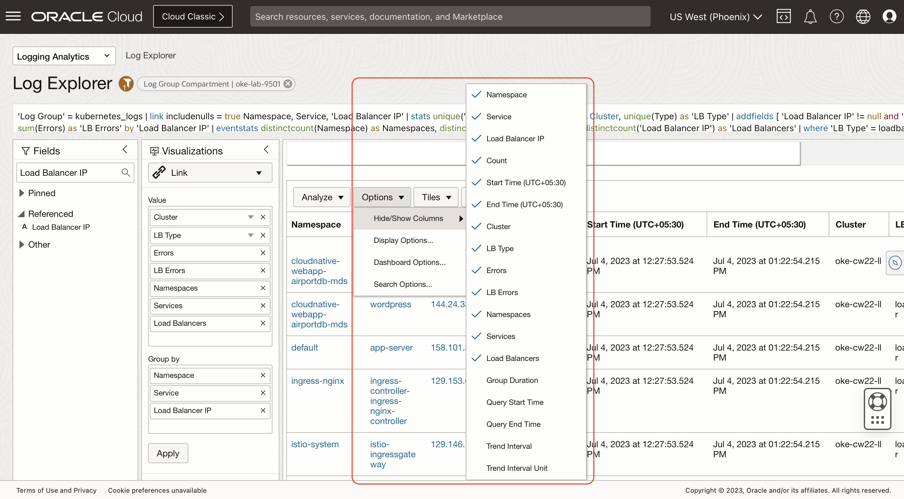


## Task 13: Summarize using Link Tiles

The values in the first row of the link table can be used to create Tiles.

Click on the **Tiles** dropdown and click on **New** to open the Tile editor.

Remove the existing Tile definition from the editor.

Copy/paste the following Tile definition into the editor and click on **Save Changes** to save:
    ```
         <copy>
            <summary>
                <container display="none">
                    <table>
                        <row>
                            <column>
                                <tiles>
                                    <title>
                                        <title-text>Summary for Cluster </title-text>
                                        <title-text field="Cluster"/>
                                    </title>
                                    <tile field="Namespaces"/>
                                    <tile type="separator"/>
                                    <tile field="Services"/>
                                    <tile type="separator"/>
                                    <tile field="Load Balancers"/>
                                </tiles>
                            </column>
                        </row>
                    </table>
                </container>
            </summary>
         </copy>   
    ```


## Task 14: Filter the Table using Type = loadbalancer using the where command

You should now be able to view the summary tiles.

The final query looks like this:
    ```
         <copy>
            'Log Group' = kubernetes_logs
| link includenulls = true
     Namespace,
     Service,
    'Load Balancer IP'
| stats
    unique('Kubernetes Cluster Name')
        as Cluster,                     
    unique(Type) as 'LB Type'
| addfields
    [ 'Load Balancer IP' != null and
      'Problem Priority' != null
        | stats count as Errors
    ]
| eventstats
   sum(Errors) as 'LB Errors'
     by 'Load Balancer IP'
| eventstats
   distinctcount(Namespace) as Namespaces,
   distinctcount(Service)   as Services,
   distinctcount('Load Balancer IP')
      as 'Load Balancers'
| where 'LB Type' = loadbalancer
         </copy>   
    ```

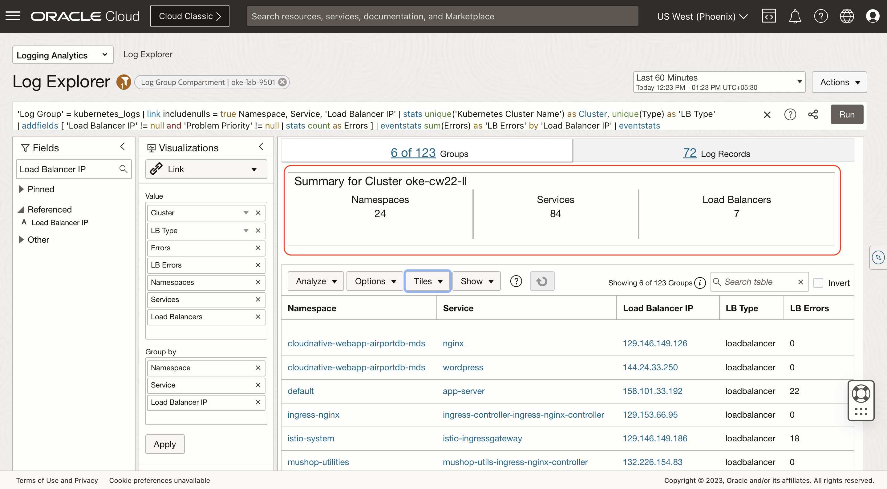


## Task 15: Save the search

Click on the **Actions** dropdown and click on **Save As**.

Enter the name in the **Search Name** field and click on the **Save** button to save the search.

> **Note:** If you get an error about not having permissions, choose a compartment you have access to.
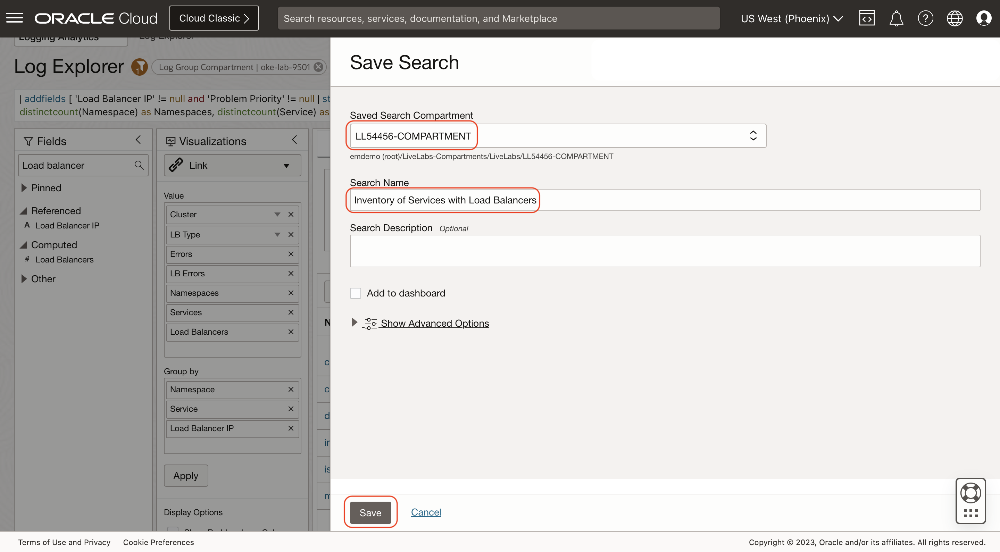


[comment]: <> (Query to Monitor Load Balancers)

## Task 1: Open new tab and navigate to Log Explorer

1. Open a new browser and login to the Oracle cloud.

2. From Navigation Menu  > Observability & Management > Logging Analytics > Log Explorer.

2. Click on **Actions** > **Create New** to reset the view.


## Task 2: Choose a Load Balancer IP

1. In the Search Fields searchbar, search **Load Balancer IP** field.

2. Load Balancer IP field will appear in the **Other** section.

3. Click on the **Load Balancer IP** field and in the pop up click on any Load Balancer IP checkbox.

4. Click on **Apply** button.
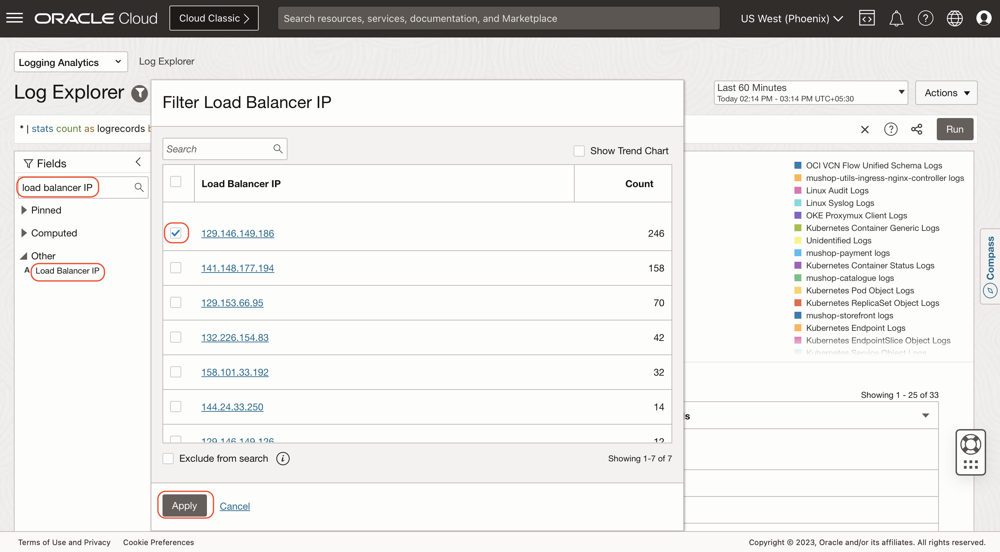


## Task 3: Switch to Records with Histogram view

Under Visualizations, Click on the dropdown and select **Records with Histogram**.
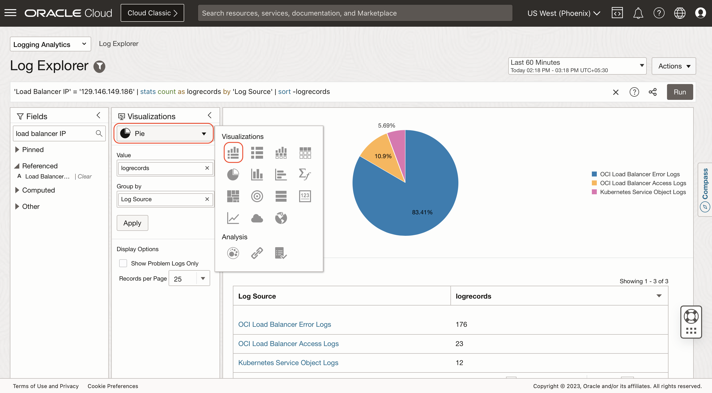


## Task 4: Show Issues

1. Under **Display Options**, Click on the **Show Problem Logs Only** checkbox.

2. The query is automatically updated. You should see a similar query like this:
    ```
        'Load Balancer IP' = '158.101.33.192' and 'Problem Priority' != null
| timestats count as logrecords by 'Log Source'
| sort -logrecords  
    ```

You can now see all the issues in the selected Load Balancer for the chosen time period.
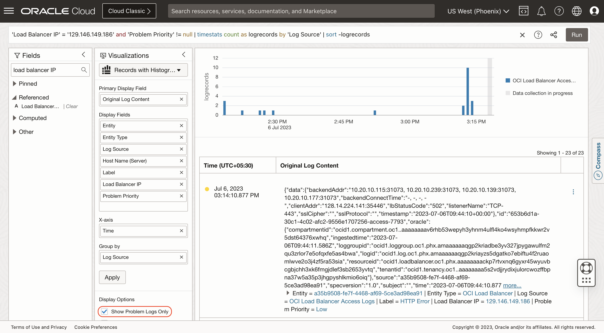


## Task 5: Group by Destination IP

Let us now group the issues by the backend server IPs.

1. In the Search Fields searchbar, search **Destination IP** field and drag and drop these fields into the **Group By** area.

2. The query is automatically updated. You should see a similar query like this:
    ```
        'Load Balancer IP' = '158.101.33.192' and 'Problem Priority' != null | timestats count as logrecords by 'Destination IP' | sort -logrecords 
    ```

You can now view the Load Balancer issues grouped by backend IPs.
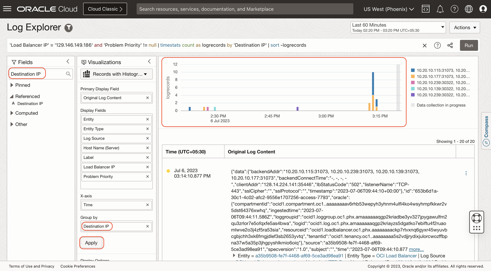


## Task 6: Add a Time between clause to the query

This query now shows the Load Balancer issues for the selected time period. We will edit the query and add another criteria so that the time selection happens in the query instead of the UI.

We will copy this modified query and link this from the first query we built.

1. Append the following command to the beginning of your query. The actual time does not matter, since we will replace this in the first query:
    ```
         <copy>
            Time between '2023-06-29T00:00:00.000Z' and '2023-06-30T00:00:00.000Z' and
         </copy>   
    ```

2. The modified query looks like this:
    ```
         <copy>
            Time between '2023-06-29T00:00:00.000Z' and '2023-06-30T00:00:00.000Z' and 'Load Balancer IP' = '158.101.33.192' and 'Problem Priority' != null
| timestats count as logrecords by 'Destination IP'
| sort -logrecords
         </copy>   
    ```

3. Click on the **Run** button.    
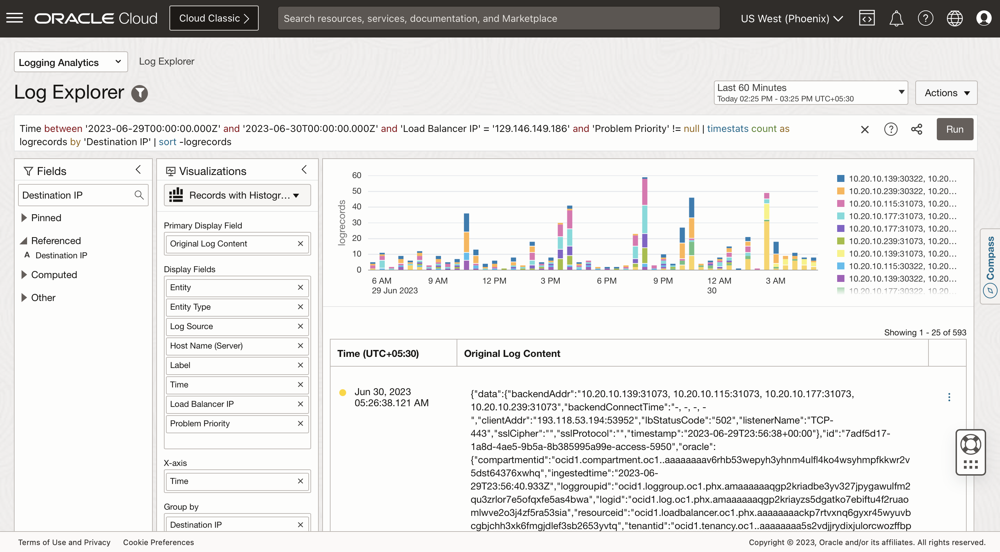 


## Task 7: Copy query URL

We will Copy this query URL and modify our first query, so that you can move between these two reports.

1. Click on **Actions** > **Copy query URL** to copy the query URL.
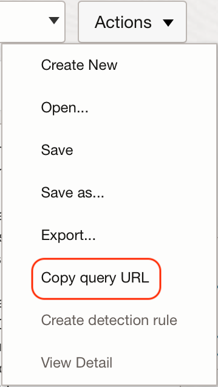 


[comment]: <> (Updating the First query to add a link to the Second Query)

## Task 1: Open the previous query

Navigate back to the previous tab where you had the query for **Inventory of Services with Load Balancers**.

If you do not have the tab open, then you can retrieve the saved search which you had done in Task 15.
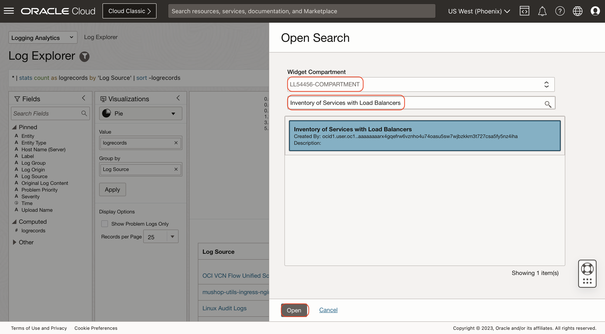


## Task 2: Create a new field using the eval command to store the URL

1. Append the following to the query. In place of <URL>, paste the URL you had copied in the earlier step.
    ```
         <copy>
            | eval URL1 = '<URL>'
         </copy>   
    ```
    > **Note:** Make sure the URL is inside single quotes. 
    
2. Click on the **Run** button to run the query.

3. Place the curson on the query bar and press **Ctrl+I** to indent the query.
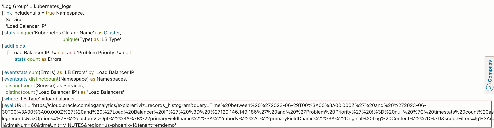


## Task 3: Set the URL Parameters using the eval  replace() command

Our copied URL has a query, and the query contains these three parameters:
- **Start Time** as part of the *Time between* command
- **End Time** as part of the *Time between* command
- **Load Balancer IP**

1. Replace **Start Time** and **End Time** with the values from the fields *Query Start Time* and *Query End Time* respectively. These fields hold the current time selection.

2. Replace the hard-coded Load Balancer IP with the value of the Load Balancer IP in each row. This way the query will be dynamic.

3. Append the following to the query. Make sure to replace the Start and End Time with the values you had in your query. Similarly, use the Load Balancer IP you had in your query. These are the values we want to replace.
    ```
         <copy>
            | eval URL2 =
     replace(replace(replace(URL1,
         '2023-06-29T00:00:00.000Z',                                
           formatDate('Query Start Time')),
         '2023-06-30T00:00:00.000Z',
           formatDate('Query End Time')),
          '158.101.33.192',
            'Load Balancer IP')
         </copy>   
    ```

Following is a sample query after the updates. Your query may look different if you had different values in your URL:
    ```
         <copy>
            'Log Group' = kubernetes_logs
| link includenulls = true Namespace, Service, 'Load Balancer IP'
| stats unique('Kubernetes Cluster Name') as Cluster, unique(Type) as 'LB Type'
| addfields [ 'Load Balancer IP' != null and 'Problem Priority' != null | stats count as Errors ]
| eventstats sum(Errors) as 'LB Errors' by 'Load Balancer IP'
| eventstats distinctcount(Namespace) as Namespaces, distinctcount(Service) as Services, distinctcount('Load Balancer IP') as 'Load Balancers'
| where 'LB Type' = loadbalancer
| eval URL1 = 'https://cloud.oracle.com/loganalytics/explorer?viz=records_histogram&query=Time%20between%20%272023-06-29T00%3A00%3A00.000Z%27%20and%20%272023-06-30T00%3A00%3A00.000Z%27%20and%20%27Load%20Balancer%20IP%27%20%3D%20%27158.101.33.192%27%20and%20%27Problem%20Priority%27%20!%3D%20null%20%7C%20timestats%20count%20as%20logrecords%20by%20%27Destination%20IP%27%20%7C%20sort%20-logrecords&vizOptions=%7B%22customVizOpt%22%3A%7B%22primaryFieldIname%22%3A%22mbody%22%2C%22primaryFieldDname%22%3A%22Original%20Log%20Content%22%7D%7D&scopeFilters=lg%3Aocid1.compartment.oc1..aaaaaaaav6rhb53wepyh3yhnm4ulfl4ko4wsyhmpfkkwr2v5dst64376xwhq%2Ctrue%3Brs%3Aocid1.compartment.oc1..aaaaaaaauxh6chgelqkqzrxmwdsydbnvodf4hhceqbsltkv63islsduvanga%2Ctrue%3Brg%3Aus-phoenix-1&timeNum=60&timeUnit=MINUTES&region=us-phoenix-1&tenant=emdemo'
| eval URL2 = replace(replace(replace(URL1, '2023-06-29T00:00:00.000Z', formatDate('Query Start Time')), '2023-06-30T00:00:00.000Z', formatDate('Query End Time')), '158.101.33.192', 'Load Balancer IP')

         </copy>   
    ```

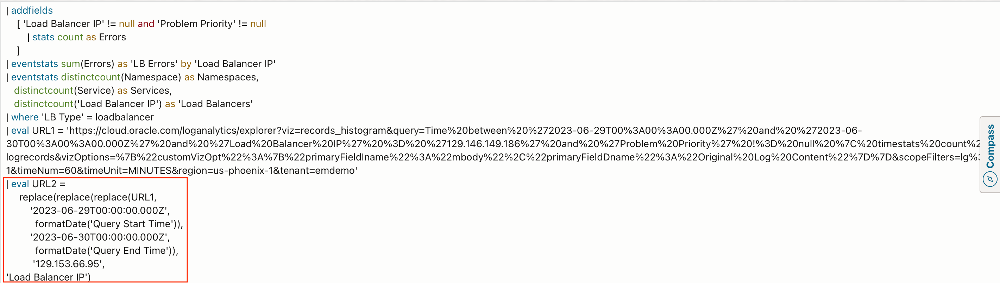


## Task 4: Create a clickable field using the eval url() function

The **URL2** field we created in the previous step contains a custom URL for each row of our table. But it is too long.

1. Create a clickable field using the **url()** function. In this example, the first argument is the URL, and the second argument is the name we want to appear for the URL. *LB Errors* is a numeric field that contains the number of errors. We will convert that to a string and use that as the name.

2. Append the following to the query:
    ```
         <copy>
            | eval 'Load Balancer Errors' = url(URL2, toString('LB Errors'))
         </copy>   
    ```

You should now see a new clickable field **Load Balancer Errors**.


## Task 5: Hide unnecessary columns using the fields command

We created few temporary fields that are not required in the final report.

1. Append the following to the query to hide the unwanted fields. These fields will not be returned by the query backend.
    ```
         <copy>
            | fields -'LB Type', -'LB Errors', -URL1, -URL2
         </copy>   
    ```

2. The final query looks similar to this:
    ```
         <copy>
            'Log Group' = kubernetes_logs
| link includenulls = true
   Namespace,
   Service,
   'Load Balancer IP'
| stats
   unique('Kubernetes Cluster Name') as Cluster,
   unique(Type) as 'LB Type'
| addfields
    [ 'Load Balancer IP' != null and 'Problem Priority' != null
        | stats count as Errors
    ]
| eventstats sum(Errors) as 'LB Errors' by 'Load Balancer IP'
| eventstats
   distinctcount(Namespace) as Namespaces,
   distinctcount(Service)   as Services,
   distinctcount('Load Balancer IP') as 'Load Balancers'
| where 'LB Type' = loadbalancer
| eval URL1 = 'https://cloud.oracle.com/loganalytics/explorer?viz=records_histogram&query=Time%20between%20%272023-06-29T00%3A00%3A00.000Z%27%20and%20%272023-06-30T00%3A00%3A00.000Z%27%20and%20%27Load%20Balancer%20IP%27%20%3D%20%27158.101.33.192%27%20and%20%27Problem%20Priority%27%20!%3D%20null%20%7C%20timestats%20count%20as%20logrecords%20by%20%27Destination%20IP%27%20%7C%20sort%20-logrecords&vizOptions=%7B%22customVizOpt%22%3A%7B%22primaryFieldIname%22%3A%22mbody%22%2C%22primaryFieldDname%22%3A%22Original%20Log%20Content%22%7D%7D&scopeFilters=lg%3Aocid1.compartment.oc1..aaaaaaaav6rhb53wepyh3yhnm4ulfl4ko4wsyhmpfkkwr2v5dst64376xwhq%2Ctrue%3Brs%3Aocid1.compartment.oc1..aaaaaaaauxh6chgelqkqzrxmwdsydbnvodf4hhceqbsltkv63islsduvanga%2Ctrue%3Brg%3Aus-phoenix-1&timeNum=60&timeUnit=MINUTES&region=us-phoenix-1&tenant=emdemo'
| eval URL2 = replace(replace(replace(URL1,
                                      '2023-06-29T00:00:00.000Z',
                                      formatDate('Query Start Time')),
                              '2023-06-30T00:00:00.000Z',
                              formatDate('Query End Time')),
                      '158.101.33.192',
                      'Load Balancer IP')
| eval 'Load Balancer Errors' = url(URL2, toString('LB Errors'))
| fields -'LB Type', -'LB Errors', -URL1, -URL2
         </copy>   
    ```


## Task 5: Report is complete

Congratulations ! You have successfully built a cluster monitoring query with dynamic drill downs.

Click on any non-zero value for the Load Balancer Errors column to drill down and view the second report.

Change the time period in the UI or click on the Load Balancer Errors for different Load Balancers to confirm the IP changes in each report.
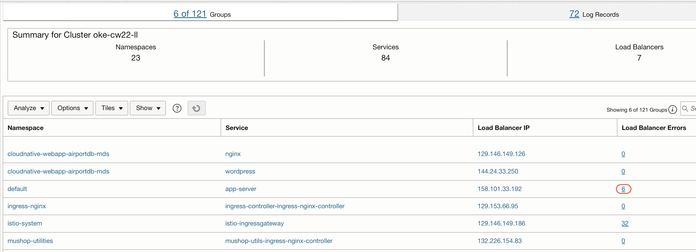


**Congratulations!** In this lab, you have successfuly completed the following tasks:
- TO BE UPDATED

  You may now proceed to the [next lab](#next).

## Acknowledgements
* **Author** - Vikram Reddy , OCI Logging Analytics
* **Contributors** -  Vikram Reddy, Santhosh Kumar Vuda , OCI Logging Analytics, Madhavan Arnisethangaraj, OCI Management Agent
* **Last Updated By/Date** - Vikram Reddy, Sep, 2022
