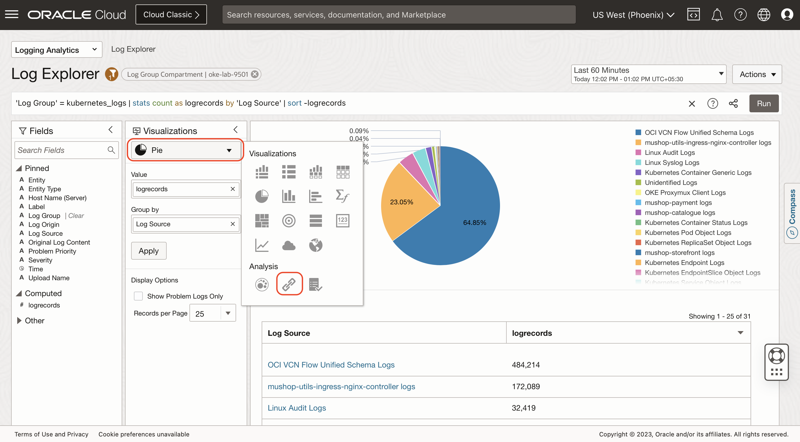
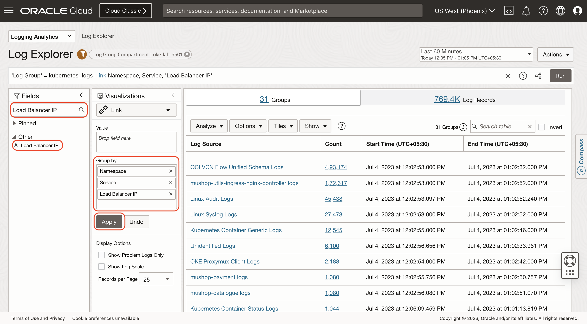
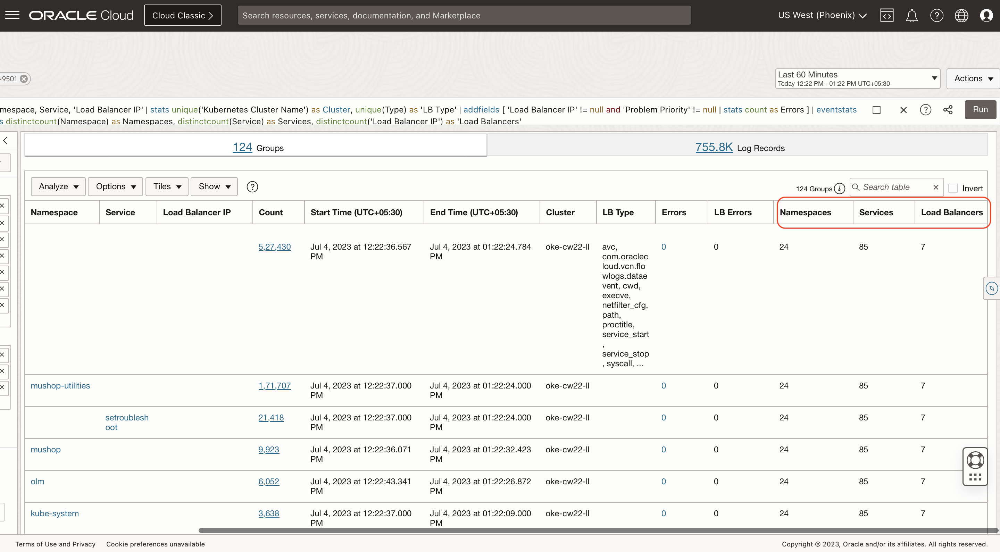

# Advanced Dashboard

## Introduction

```
  TO BE UPDATED
```

Watch the video below for a quick walk-through of the lab.

### Objectives

```
  TO BE UPDATED
```


Estimated Time: 30 minutes

## Task 1: Reset previous selections

Click on **Actions** > **Create New** to reset the view.


## Task 2: Select the compartment

1. Click the scope filter .

2. Select the **oke-lab-9501** compartment.

3. Click on **Apply** button to apply the filter. 

4. Click on **Close** button to close the filter window.


## Task 3: Select the log group

1. Click on the **Log Group** field.

2. Select **kubernetes_logs** log group checkbox..

3. Click on **Apply**.


## Task 4: Select the Kubernetes Cluster Name

1. In the Search Fields searchbar, enter **Kubernetes Cluster Name** and click on Search.

2. In the **other** region, you will find the **Kubernetes Cluster Name** field, click on the field.

3. Select the **oke-cw22-ll** cluster checkbox.

4. Click on **Apply**.


## Task 5: Switch to the Link Visualization

Under Visualizations, Click on the dropdown and select **Link** under Analysis section.


## Task 6: Link by the required fields

1. Remove the **Log Source** field from the Group By region.

2. In the Search Fields searchbar, search **Namespace**, **Node**, **Pod** and **Service** fields and drag and drop these fields into the **Group By** region.

3. Click on **Apply** button.


## Task 7: Link includenulls = True

The link query will bring in only those Log Sources that have all of the fields specified in the Group By. In this case, we want to bring in the records, even if at least one of those fields are non-null. This is achieved by adding **includenulls = True** to the link command. This can be achieved by the following two methods.

1. Click on the **Options** dropdown and click on **Search Options**.

    Click the checkbox **Show log records with no Link By field**.

    Click on **Save Changes** button.

2. Change the query from:
    ```
        <copy>
            'Log Group' = kubernetes_logs and 'Kubernetes Cluster Name' = 'oke-cw22-ll' | link Namespace, Node, Pod, Service
        </copy>   
    ```
    To:
    ```
        <copy>
            'Log Group' = kubernetes_logs and 'Kubernetes Cluster Name' = 'oke-cw22-ll' | link includenulls = True Namespace, Node, Pod, Service
        </copy>   
    ```


## Task 8: Extract additional fields using the stats command

The link table has one row per unique combination of the selected Group By fields. Each of these rows has underlying log records, as shown in the Count field.

The stats command is similar to a foreach command, that goes through each row in this table. For each row, the stats command is applied to all the underlying log records, and the value is added as an additional column to the table.

We want to fetch the **Kubernetes Cluster Name**, **Load Balancer IP** and the **Load Balancer Type** into the main table. The **unique()** function can be used fetch the unique value from each of these fields.

Append the following to your query:
    ```
         <copy>
            | stats unique('Kubernetes Cluster Name') as Cluster, unique('Load Balancer IP') as 'Load Balancer', unique(Type) as 'LB Type'
         </copy>   
    ```

The modified query looks like this:
    ```
         <copy>
            'Log Group' = kubernetes_logs and 'Kubernetes Cluster Name' = 'oke-cw22-ll'
| link includenulls = true Namespace, Node, Pod, Service
| stats 
  unique('Kubernetes Cluster Name') as Cluster,
  unique('Load Balancer IP') as 'Load Balancer',  
  unique(Type) as 'LB Type'
         </copy>   
    ```

You should now see the **Cluster**, **Load Balancer** and **LB Type** columns. If there is more than one value, then you would see a comma separated list.


## Task 9: Summarize using the eventstats Command

We will use the eventstats command to count the distinct values for various fields and to create a summary.

Append the following to your query:
    ```
         <copy>
            | eventstats distinctcount(Namespace) as Namespaces, distinctcount(Service) as Services, distinctcount(Node) as Nodes, distinctcount(Pod) as Pods
         </copy>   
    ```

The modified query looks like this:
    ```
         <copy>
            'Log Group' = kubernetes_logs and 'Kubernetes Cluster Name' = 'oke-cw22-ll'
| link includenulls = true
   Namespace, Node, Pod, Service
| stats
    unique('Kubernetes Cluster Name')
        as Cluster,                                               
    unique('Load Balancer IP')
        as 'Load Balancer',                                     
    unique(Type) as 'LB Type'
| eventstats
   distinctcount(Namespace) as Namespaces,
   distinctcount(Service)   as Services,
   distinctcount(Node)      as Nodes,
   distinctcount(Pod)       as Pods
         </copy>   
    ```

**eventstats** would add the results to ALL the rows of the table, unless there is a by clause. If there is a by clause, then all the rows for that unique by field will have the same values.


**Congratulations!** In this lab, you have successfuly completed the following tasks:
- TO BE UPDATED

  You may now proceed to the [next lab](#next).

## Acknowledgements
* **Author** - Vikram Reddy , OCI Logging Analytics
* **Contributors** -  Vikram Reddy, Santhosh Kumar Vuda , OCI Logging Analytics, Madhavan Arnisethangaraj, OCI Management Agent
* **Last Updated By/Date** - Vikram Reddy, Sep, 2022
