# Analyzing Logs

## Introduction

  In this lab, you'll explore the logs collected by Kubernetes Monitoring Solution you deployed in [previous lab](#prev). You'll also do basic analysis of the logs collected and learn types of logs are collected.

Estimated Time: 30 minutes  

### Objectives

- Understand the data model of telemetry collected by kubernetes monitoring solution
- Gather information about the monitored OKE Cluster interactively in Log Explorer


## Task 1: View the Logs in Log Explorer
1. From Navigation Menu  > **Observability & Management** > **Logging Analytics** > **Log Explorer**.
    > **Note** : For a quick refresher on Log Explorer GUI [review Lab 1](?lab=log-explorer-gui).

2. Once you land on the **Log Explorer** page the Log Explorer GUI will be shown in the Context of the Container Logs widget. To reset the context, click on the **Actions** button and in the menu item select **Create New**. 
   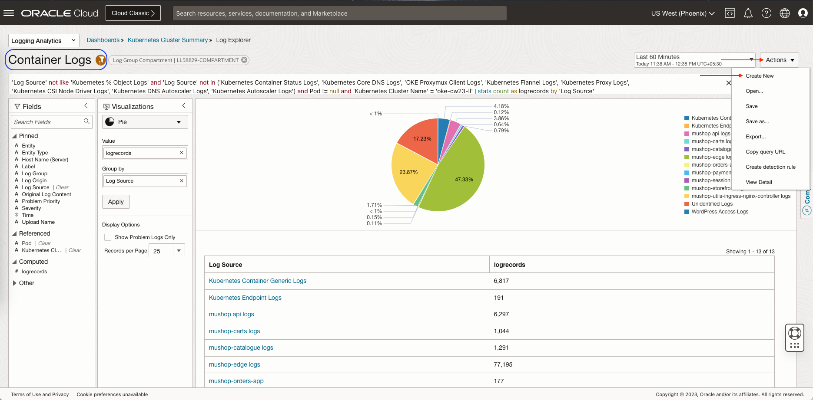


3. In the **Log Explorer** page if the scope filter has pre-selected **Log Group Compartment**, then you can reset it by clicking on the `x` icon.
   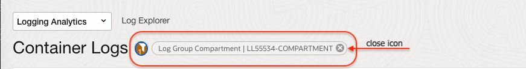
    
    > **Note**: If you have followed this step you can skip the below step.
   
   **OR**

   In the following steps we will select the **emdemo(root)** **Compartment** to view the various logs.
   
    - Click on the **Scope** filter, select the **emdemo(root)** **Compartment** into **Log Group Compartment** dropdown textbox and click **Apply** button.
    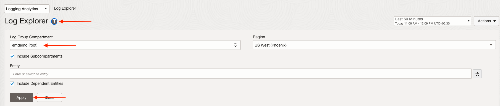

    - Click on **Close** button

4. Add Log Group Field to Group By. 


    - In the Fields panel, in the Search Fields textbox, search for the field **Log Group**.
    - In the resultant field, click on the three vertical dots menu icon.
    - Click on the **Add to Group By** menu option.
       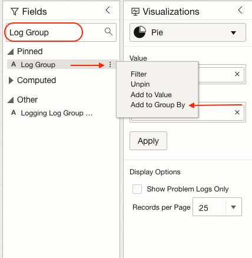
    - The **Log Group** field will be added in the **Group by** textbox under Visualization Panel. Click **Apply** button to apply the changes.
       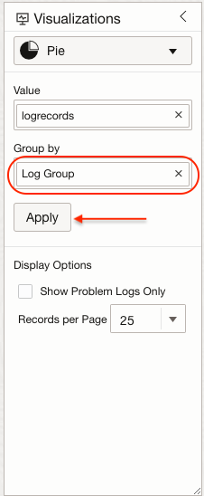   


5. The **Pie** chart view in the context of **Log Group** will be displayed along with logrecords count for each **Log Group**.
      > **Note** : The **Log Group** <em>kubernetes_logs</em> is precreated and it has VCN, LBaaS logs and it also has a copy of Kubernetes Logs ingested through Kubernetes Cluster **oke-cw23-II**.
   
   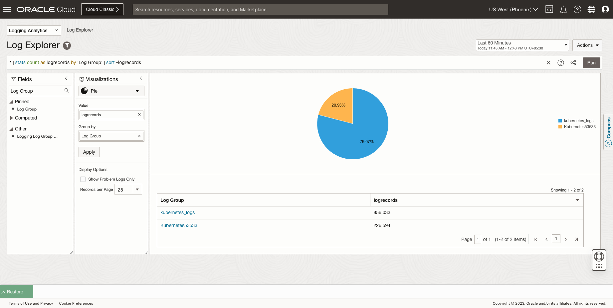 

**OR**

5. (Optional) You can also use the following query in the **Query Bar** to get the **Pie Chart** view in the context of **Log Group**.

     ```
      <copy>
        * | stats count as logrecords by 'Log Group' | sort -logrecords
      </copy>
     ```

6. **End Notes** : Keep the same set up and perform the following actions.

    - Select the Visualization **Sunburst** from the Visualization drop-down.
       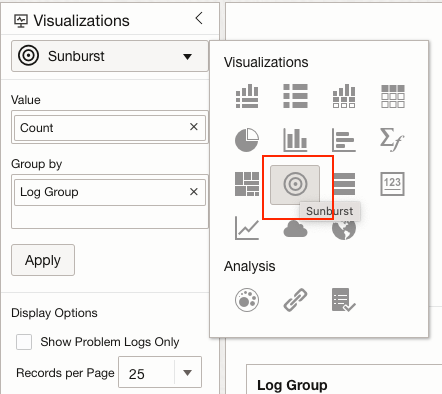

    - Add the field **Log Source** to the **Group by** by following the instructions in step 4. For convenience you can also paste the following query to view the data.

      ```
         <copy>
           * | stats count as logrecords by 'Log Group', 'Log Source' | sort -logrecords
         </copy>
      ```

       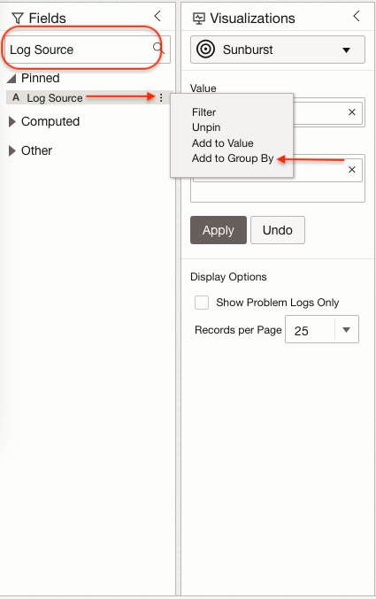  
      
         > **Note :** Do Not Remove **Log Group** field from the **Group by**.
   
    - The **Group By** section should look like the following. 

       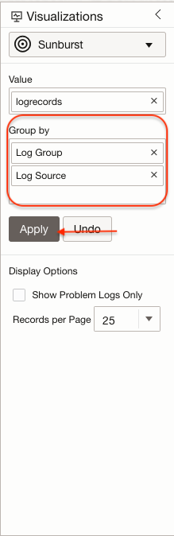    
    
    - The **Sunburst** chart view in the context of **Log Group** and **Log Source** along with log record **Count** for each **Log Source** is displayed.
       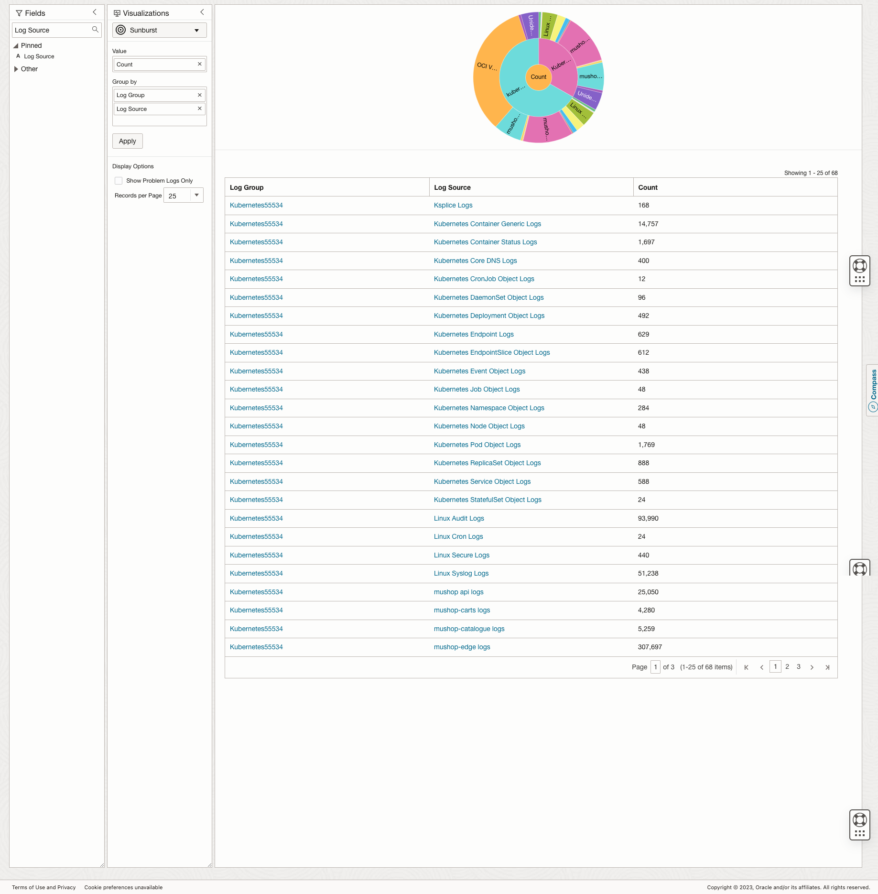

    - You can also hover over different colors of **Sunburst** chart to view the stats of the **Log Source**.

7. Before proceeding to **Task 2** perform the following step. 
    - Click on **Actions** button and in the menu item select **Create New**.
      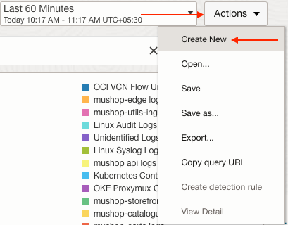


## Task 2 : Get inventory of namespace, pods, services, nodes for your cluster

   In this task we will find out all the pods in each Node of the OKE cluster filtered based on the **Namespace**.

1. In the Fields panel, in the Search Fields textbox, search for the field **Kubernetes Cluster Name**. Click on the resultant field **Kubernetes Cluster Name**.
    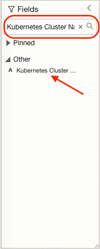 
2. **Filter Kubernetes Cluster Name** pop-window will be displayed showing the OKE Cluster **oke-cw23-ll**.
    Click on the checkbox of **oke-cw23-ll** and click **Apply**.
    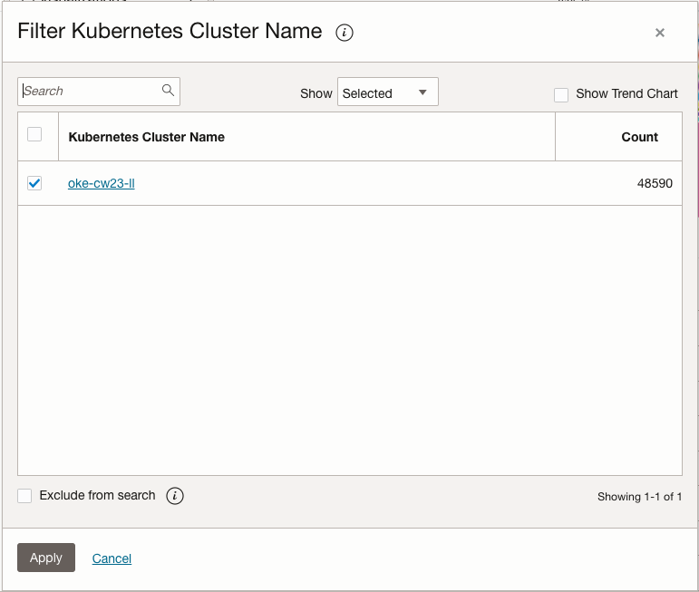
    The Log Explorer will show the Pie-Chart Visualization of all the various logs that are being collected from the OKE cluster.
    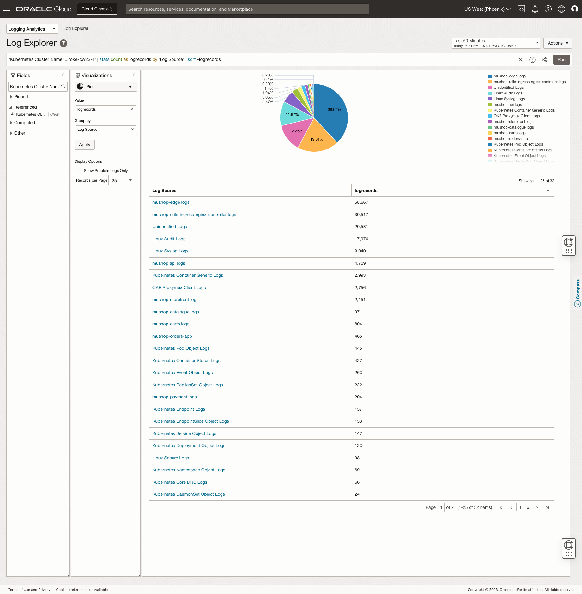
3. Filtering all the pods from a specific Namespace.
      - In the Fields panel, in the Search Fields textbox, search for the field **Pod**. Click on the resultant field **Pod**. 
         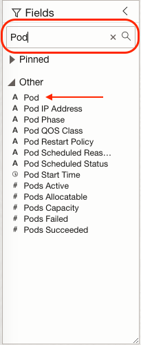
      - **Filter Pod** pop-window will be displayed. Around 100+ are running in the OKE Cluster. The popup-window shows results upto 100 pods.
         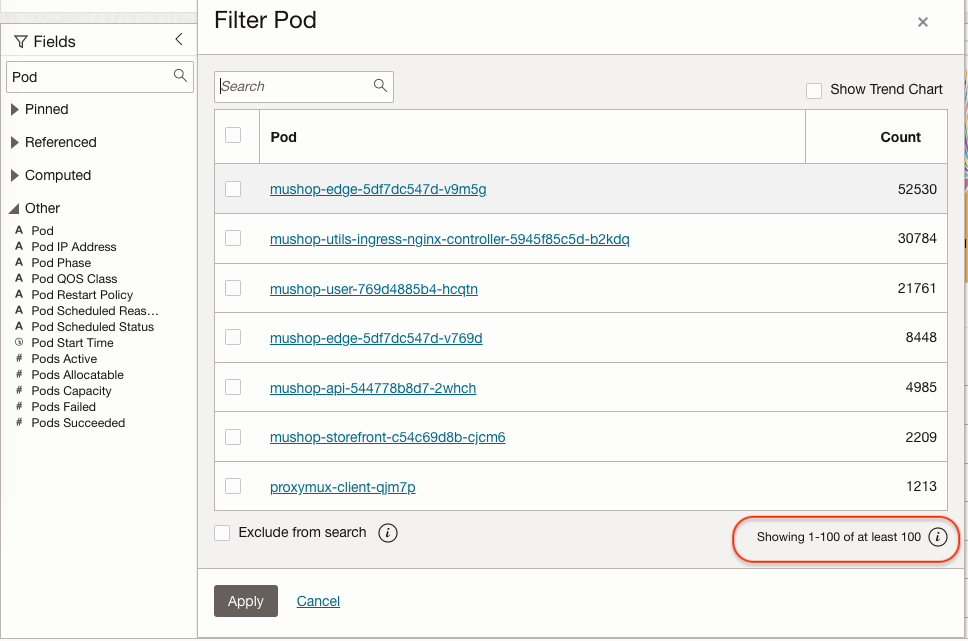
      -  Now in the Fields Panel, in the Search Fields textbox, search for the field **Namespace**. Click on the resultant field **Namespace**.
      The popup-window display all the available **Namespace(s)** in the Kubernetes Cluster. 
         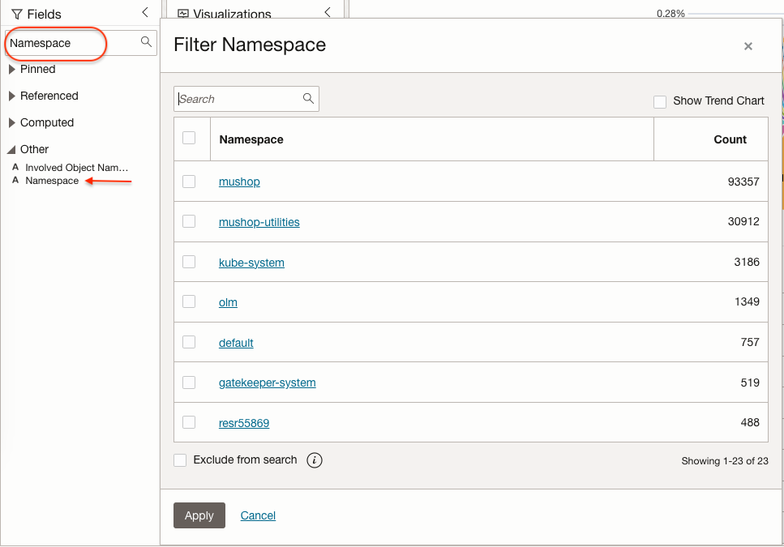
      - Select the namespace **mushop** and click **Apply**.
         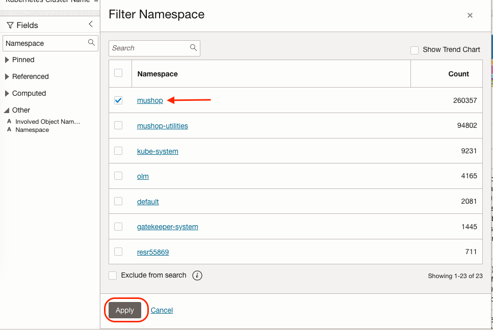
         
      - Now in the Fields Panel, in the Search Fields textbox, search for the field **Pod**. Click on the resultant field **Pod**.
        In the popup-window you should now see all the Pods in the namespace **mushop**. If observed closely we can see fewer pods than earlier because we have filtered results by the specific namespace **mushop**. 
         > **Note :** The number of pods in **mushop** namespace may differ.
            
         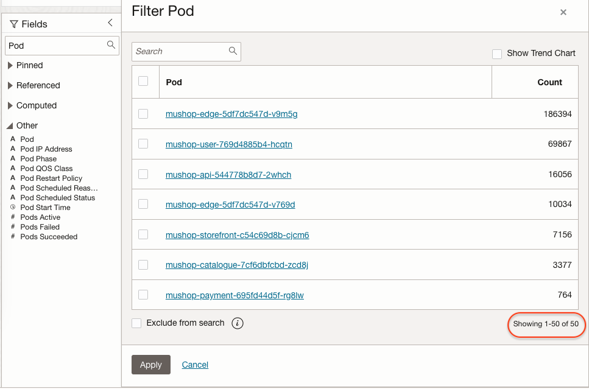


4. Selecting the **Kubernetes Pod Object Logs** Log Source
      - In the Fields Panel, in the Search Fields textbox, search for the field **Log Source**. Click on the resultant field **Log Source**.
      - In the popup-window, in the Search textbox, search for Log Source **Kubernetes Pod Object Logs**. 
      - Click on the checkbox of **Kubernetes Pod Object Logs** Log Source.
      - Click **Apply**. 
        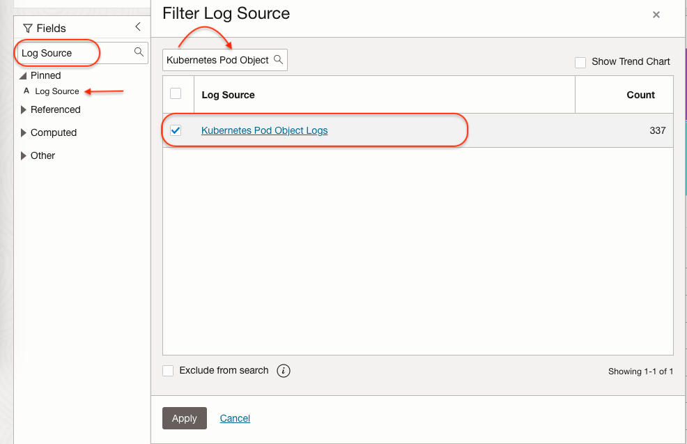

5. Select the visualization **Tree Map**.
      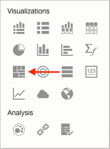
6. Add **Node** Field to the Group By textbox. 
      - In the Fields panel, in the Search Fields textbox, search for the field **Node**.
      - In the resultant field, click on the three vertical dots menu icon.
      - Click on the **Add to Group By** menu option.
         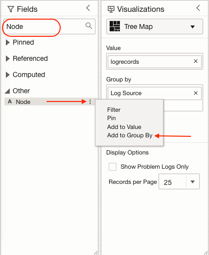
      - Repeat the steps to add **Pod Phase** Field to the Group By textbox.
      - Remove any other field in the Group By apart from **Node** and **Pod Phase**. For convienence you can also paste the following 
      query in the **Query Bar**.
         ```
            <copy>
               'Kubernetes Cluster Name' = 'oke-cw23-ll' and Namespace = mushop and 'Log Source' = 'Kubernetes Pod Object Logs' | stats count as logrecords by Node, 'Pod Phase' | sort -logrecords
            </copy>
         ```

      - The Group By textbox will look like the following. 
            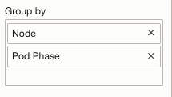 

7. Add Pod field to the **Value** textbox.
      - In the Fields panel, in the Search Fields textbox, search for the field **Pod**.
      - In the resultant field, click on the three vertical dots menu icon.
      - Click on the **Add to Value** menu option. 
         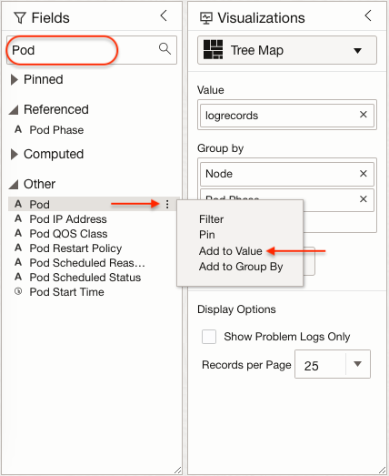
      - For convienence you can also paste the following query in the **Query Bar**. 
        
         ```
            <copy> 
                'Kubernetes Cluster Name' = 'oke-cw23-ll' and Namespace = mushop and 'Log Source' = 'Kubernetes Pod Object Logs' | stats count(Pod) by Node, 'Pod Phase'
            </copy>
         ```       
      - The Value textbox will look like the following.
         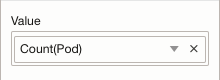
8. Determining the Pods running on each Node of the OKE Cluster.
      - Click on the Drop Down icon in the Value textbox. Select the **Distinct Count** menu item.
         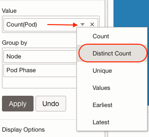
      - Verify that the Value textbox & Group By textbox looks like the following. Click **Apply**.
         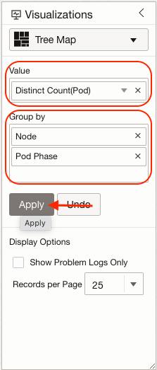
      - For convienence you can also paste the following query in the **Query Bar**. 

         ```
            <copy>  
              'Kubernetes Cluster Name' = 'oke-cw23-ll' and Namespace = mushop and 'Log Source' = 'Kubernetes Pod Object Logs' | stats distinctcount(Pod) by Node, 'Pod Phase'
            </copy>
         ```  
      - All the Pods running on each **Node** of the OKE Cluster will be displayed.
          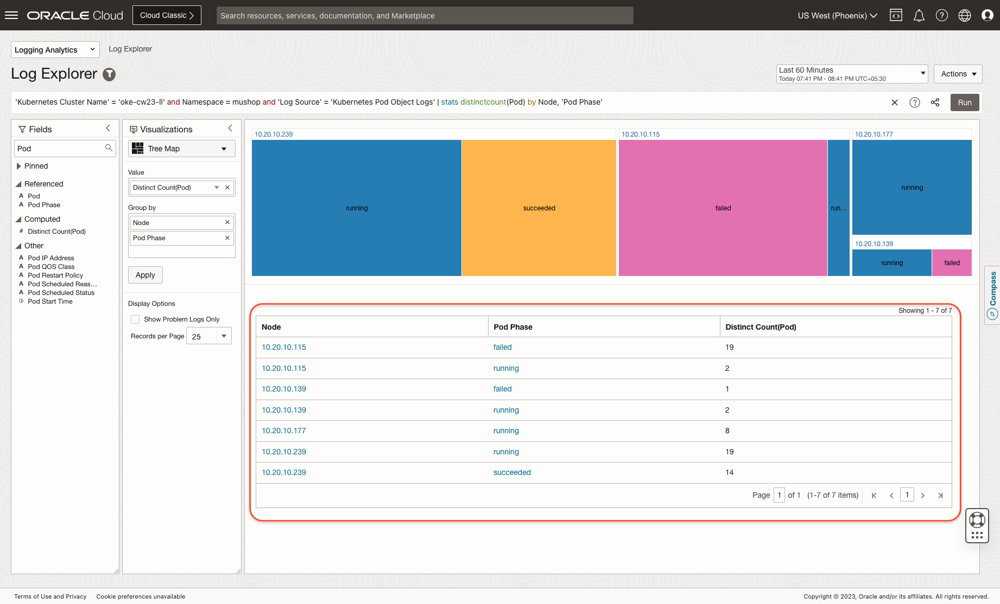
      
9. **End Notes :** 
      - We have performed this excerise to show the capabilities of the **Logging Analytics** and ease of building the queries.
      - We have already created a widget in the out-of-the-box Dashboard for viewing all the Pods on each Node of the OKE Cluster.
      - You can view it under the widget **Failed/Pending Pods per Node** in the Kubernetes Nodes Dashboard. To view Kubernetes Nodes Dashboard you can navigate to the [Dashboards > Kubernetes Nodes] (https://cloud.oracle.com/loganalytics/dashboards?region=us-phoenix-1)


## Task 3 : Creating Interactive Dashboard
In this task we will create the Dashboard with the results of the Task 2.

1. Click on the **Actions** button.
   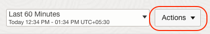

2. Click on the **Save as** option.
   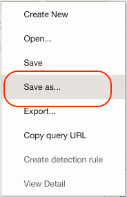

3. A **Save search** pop up will be displayed. By default your user's **Compartment** is selected in **Save Search Compartment** dropdown.
   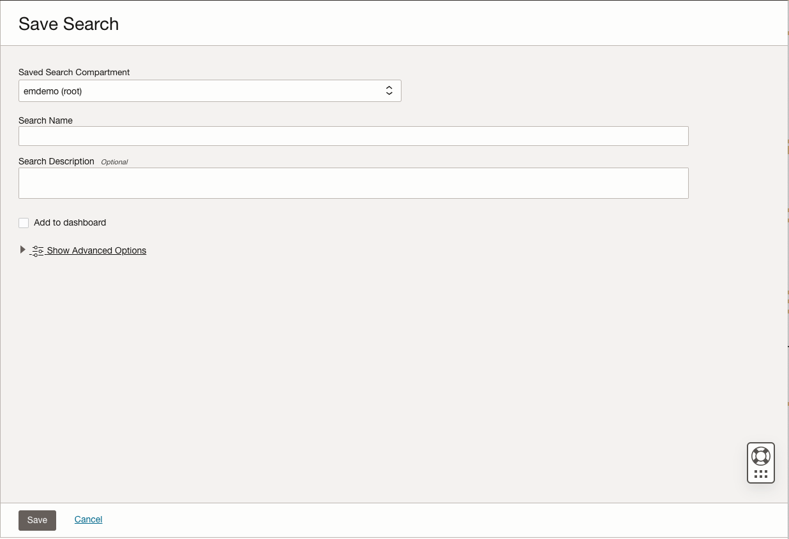
    > **Note** : You will see the Authorization error if any other **Compartment** is selected in **Save Search Compartment** dropdown.

4. In the  **Save search** pop up perform the following actions.
   
    - (Optional) Type the **Compartment** name in the **Saved Search Compartment** for your user the **Compartment** name will be **LLresrvationid-COMPARTMENT**.  You can always find the **Compartment** name from the View Login Info page.
        > **Note** : This step is optional if you have not changed the **Compartment** in step 3.
        

    - Enter the **Search Name**.
    - Check the **Add to dashboard** checkbox.
    - Select the **New Dashboard** radio button.
    - Select the **Dashboard Compartment** name. Make sure that you select the same **Compartment** for Dashboard and Save Search.
    - Enter the **Dashboard Name**. 
    - Click on **Save** button.
    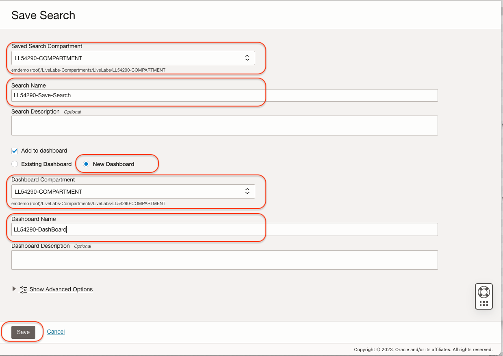
    - A saved search will be created and added to the Dashboard.
    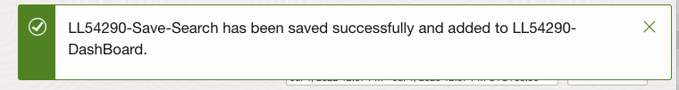  

5. Click on the drop-down on top left side of the Log Explorer Page and select **Dashboards**.
    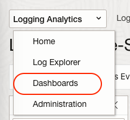

 **OR**

   Copy-paste the following link in your browser's address bar to navigate to the **Dashboards**.
      ```
         <copy>
           https://cloud.oracle.com/loganalytics/dashboards?region=us-phoenix-1
         </copy>
     
      ```

6. A Dashboards Page will be displayed. Click on the Dashboard Name that you have created in the Step 4.
    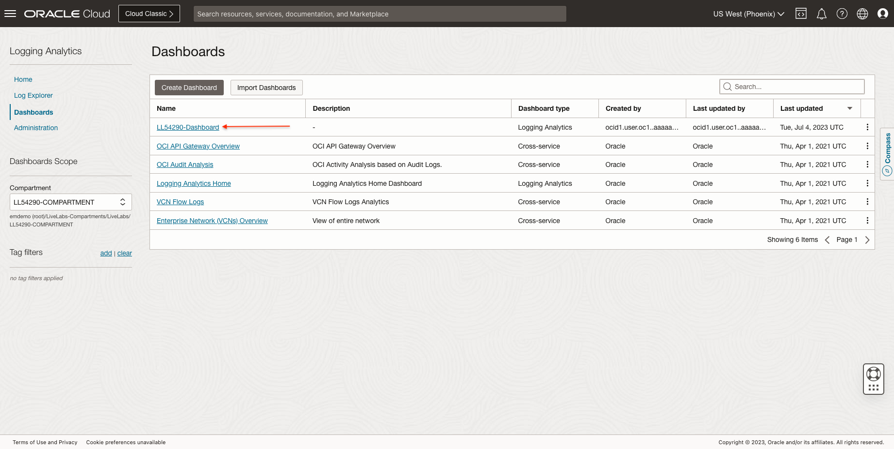 
7. A widget showing the saved search data will be displayed.
    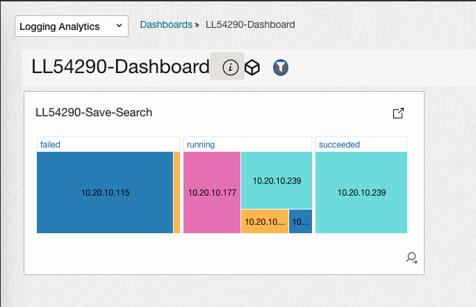       


## Task 4 : Updating  the widget to show data from different namespaces
 In the previous two tasks i.e Task 2 and Task 3, we have filtered the results based on the specific namespace **mushop**. In this task
 we will extend our saved search query to support any namespace value.

 1. Clearing the **Namespace** field from the Widget query.

    - Click on the Punch Out icon of the widget. 
      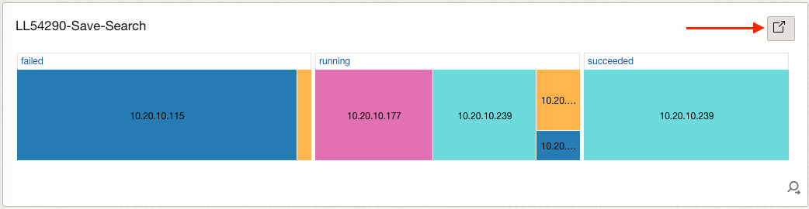 

    - Previous step will take you to the Log Explorer view in the context of saved search. In the Fields panel, if you see any previous field name search. Clear the field search by clicking on `x` icon.

    - In the Fields panel, under the Referenced section click on the _Clear_ text next to the field **Namespace**.
      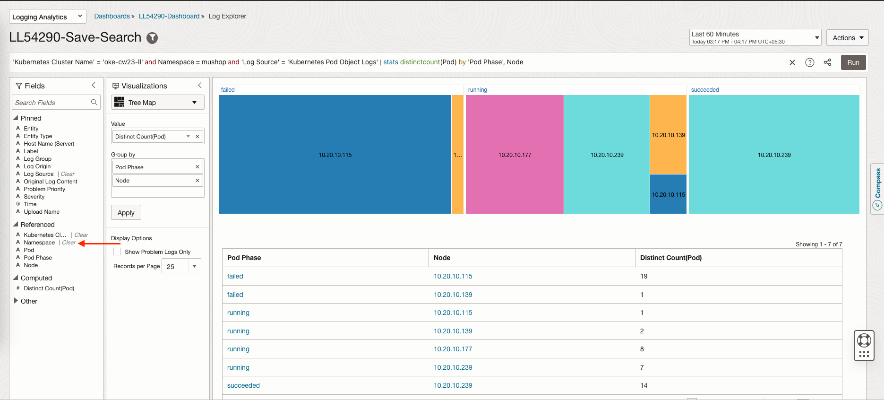 

    - Save the Dashboard again by clicking on the **Actions** > **Save**.
      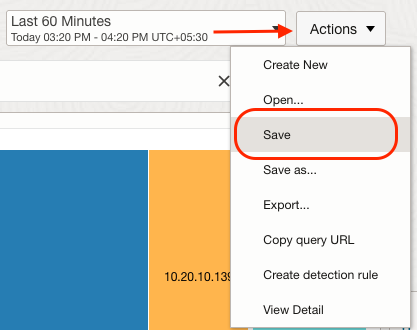  

    - Navigate back to the Dashboard by clicking on Dashboard Name at the top.
      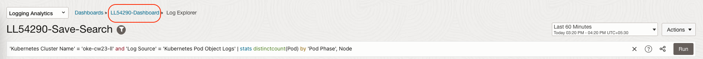  

      
 2. Navigating to the Filter tab .
    - Click on the Actions > Edit.
      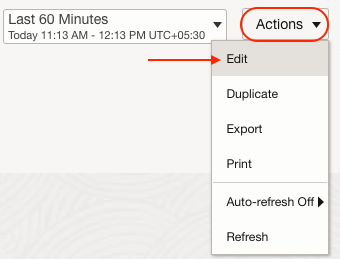 

    - The Dashboard page will open in the edit mode.
      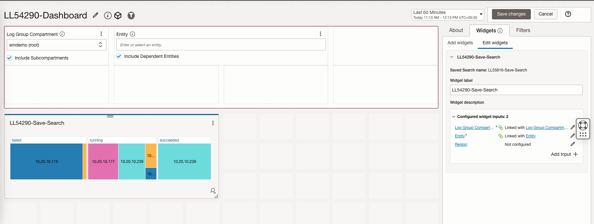 

    - In the Dashboard Editor on the far right side, click on the Filter tab. A filter section showing different filter items will be displayed.
       

 3. Searching the **Log Field** filter item to create **Namespace** Log Field.
    - In the search box under the  Filter tab search for the **Log Field** filter item.
       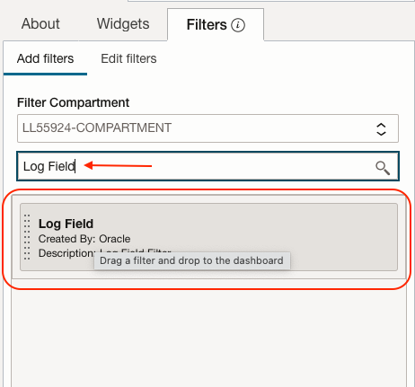 

    - Click on the **Log Field** filter item. A popup-window will be displayed to Configure Log Group Compartment input for Log Field.

    - Select the option Link the **Log Group Compartment** input with an existing filter. Click **Save Changes**.
       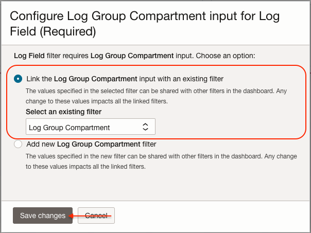 

    - A new popup-window will be displayed to Configure **Log Field** Name input for Log Field.

    - Select the option Specify the **Log Field** Name input. And in **Enter a value** dropdown enter the text **Namespace**.
       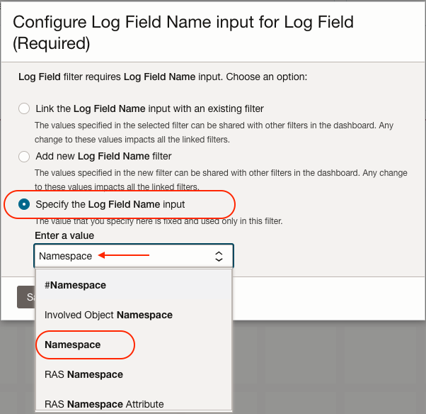 

    - Select the resultant **Namespace** field. Click Save Changes.
       

    - Under the Log Field Filter click on the pencil icon to select the value for the **Region** field.
       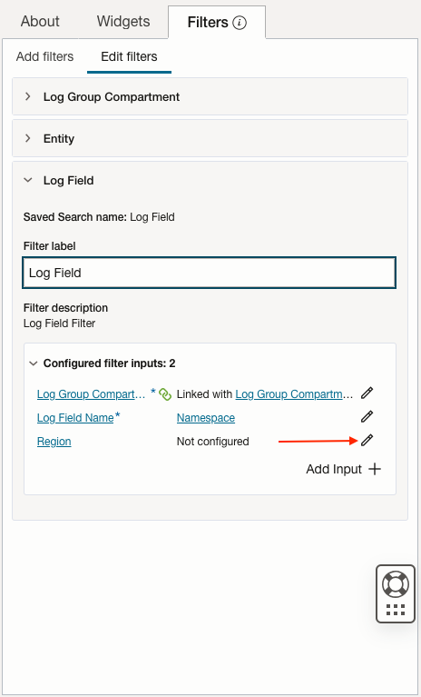

    - A popup-window will be displayed to Configure **Region** input for Log Field.
    - Select the option Specify the **Region** input. And in **Enter a value** dropdown enter the text **US West (Phoenix)** and select the resultant field.
    - Click **Save Changes**.
       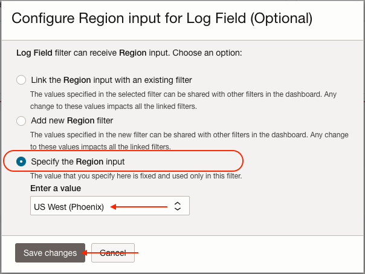
    
    - At this point the Filter Label will be **Log Field**. We have to change the Log Field filter Label to **Namespace**. 
      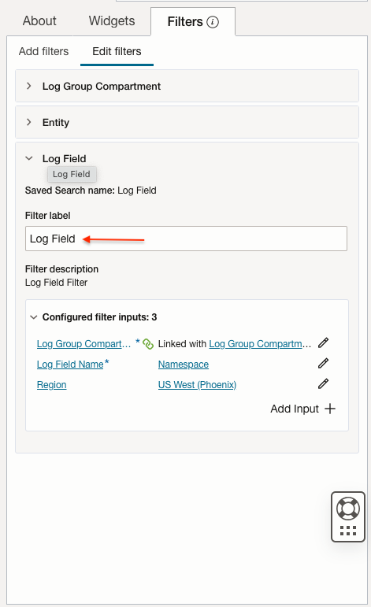

    - Enter the text **Namespace** in the Filter Label textbox. 
      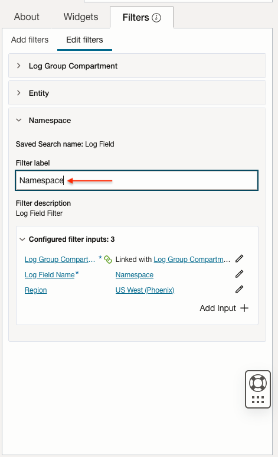

    - Click **Save Changes**.
      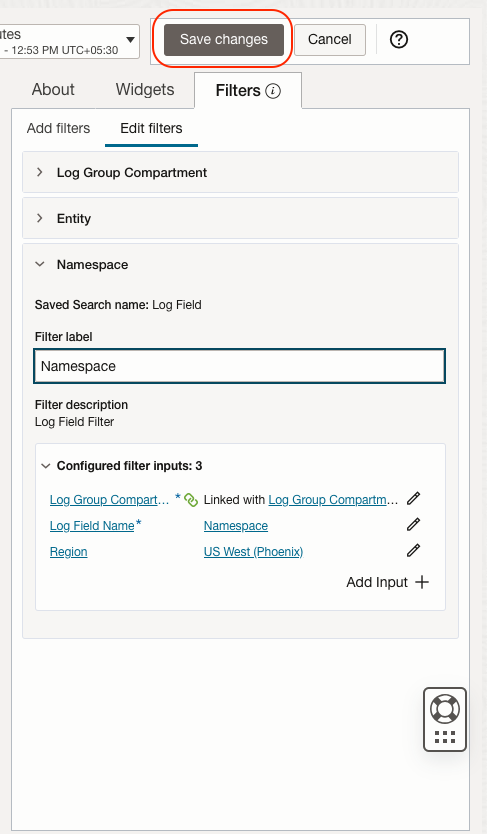

    - A new **Namespace** field is added to the Dashboard.
      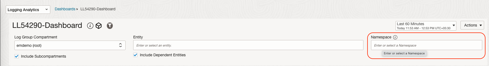

     At this point, we have added the field Namespace to the Dashboard, however it is still not linked with the Widget thus results won't be 
     rendered. In the next steps we will add this Namespace filter to the Widget.

4. Add Filter to widget
    - Click on the **Actions** > **Edit**.
       

    - In the Dashboard Editor click on the **Widgets** tab. Then in the **Widgets** tab select **Edit Widgets** tab.
      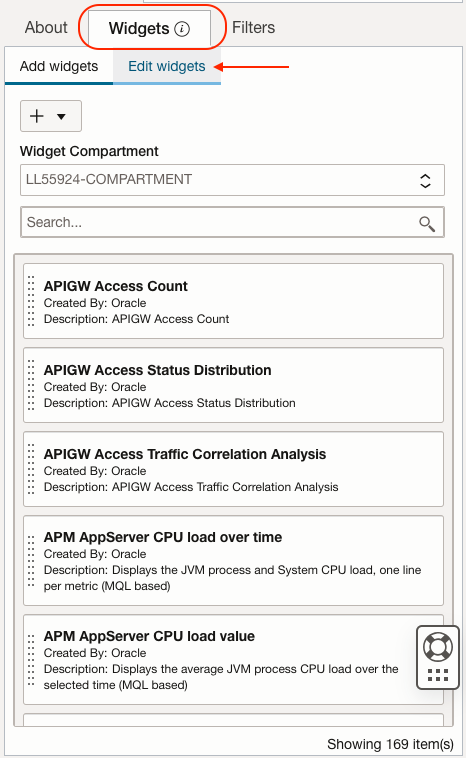 

    - A saved search name created in the Task 3 will be displayed. Click on the expand icon.
      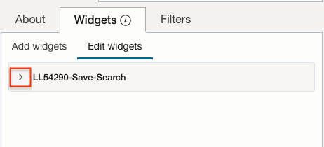 

    - Information about the widget will be displayed. Click on Add Input button.
      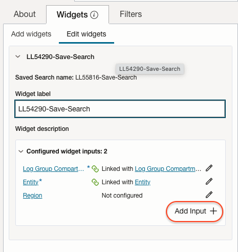 

    - A popup-window will be displayed to Configure input for your saved search.

    - Select the option Link the input with an existing filter. 

    - In Select an existing filter dropdown enter the text **Namespace** and select the resultant field. 

    - Parameter Name will be automatically populated upon selecting the filter. 

    - Click **Save Changes**.
      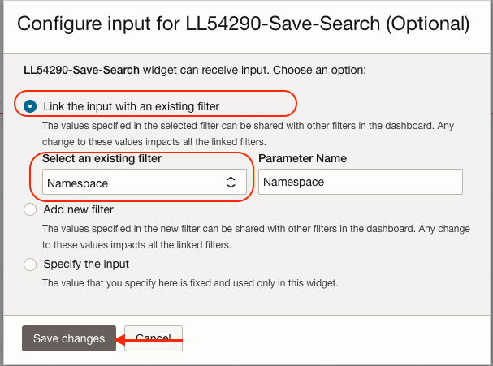

    - Click **Save Changes** to save changes of the Dashboard.
      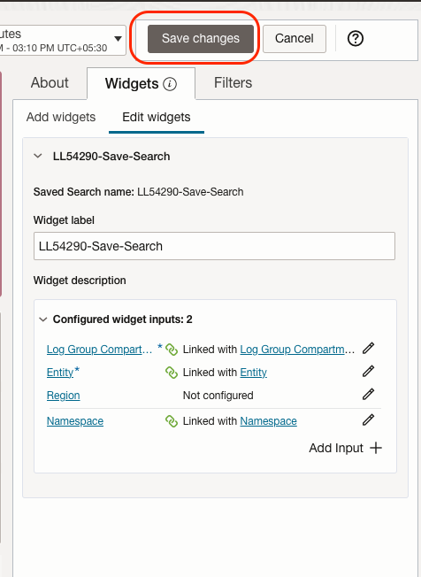

    - The saved search widget will be refreshed.
     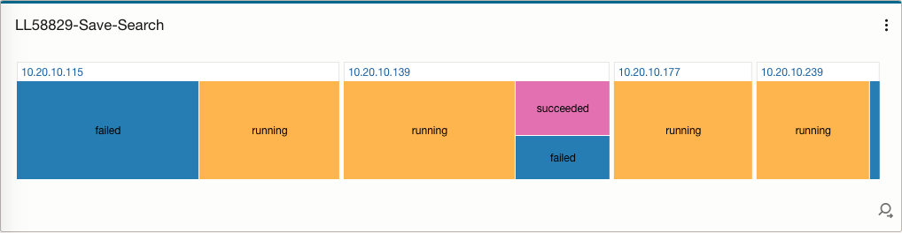
      

    - In the Namespace field enter the namespace value as **oci-onm**.
      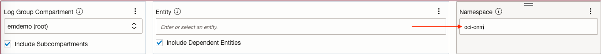 

    - Validate that the data in the widget is refreshed to display the pods in the oci-onm namespace.  
      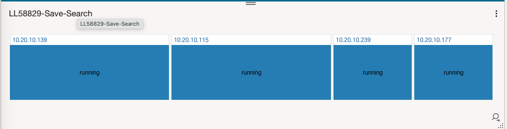 


## Task 5 : Collecting Application Logs (Custom Log Sources)

1. From Navigation Menu  > **Observability & Management** > **Logging Analytics** > **Log Explorer**.

   **OR**

  You can also copy-paste the following link in your browser's address bar to navigate to the Log Explorer.
    ```
         <copy>
            https://cloud.oracle.com/loganalytics/explorer?region=us-phoenix-1
         </copy>   
    ```

   To reset the context of Log Explorer, click on the **Actions** button and in the menu item select **Create New**. 
   

2. Run the following query in the **Query Bar**.

    ```  
      <copy>
       'Log Source' = 'mushop-orders-app' | timestats sum('Sales Amount') as Revenue
      </copy>
    ``` 

3. The previous step takes you to the **Records with Histogram** view in context of **mushop-orders-app** Log Source.
   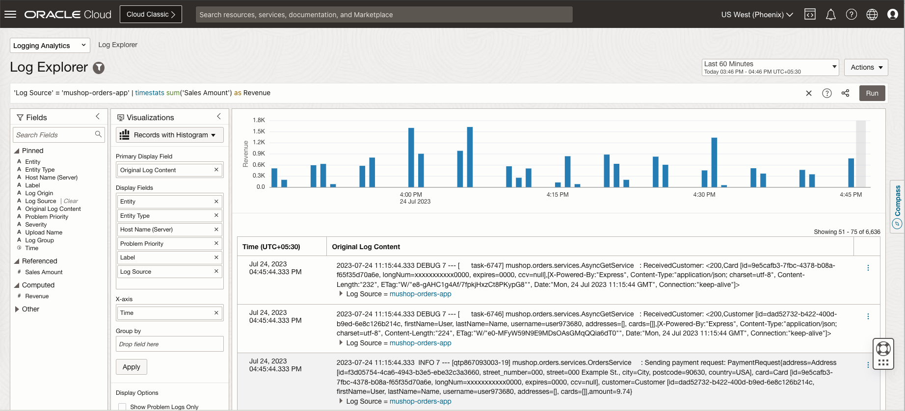

4. Click on the expand field button to view all the extracted fields of a log entry of **mushop-orders-app** Log Source.
    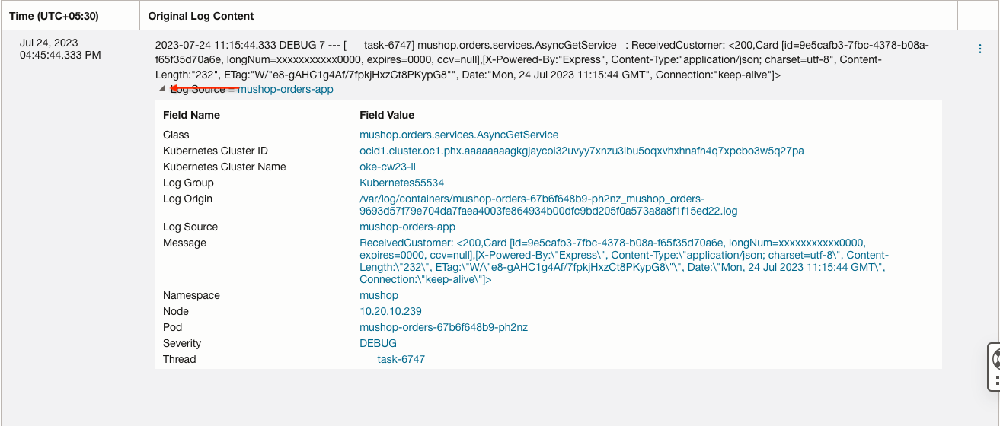

5. Select the visualization **Line**.
  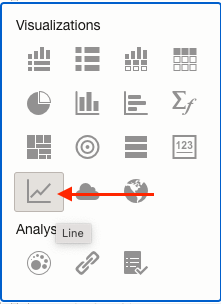

6. The previous step takes you to the **Line** chart view in context of **mushop-orders-app** Log Source displaying the **Time** in the X-axis and **Revenue** in the Y-axis for last 60 Minutes.
  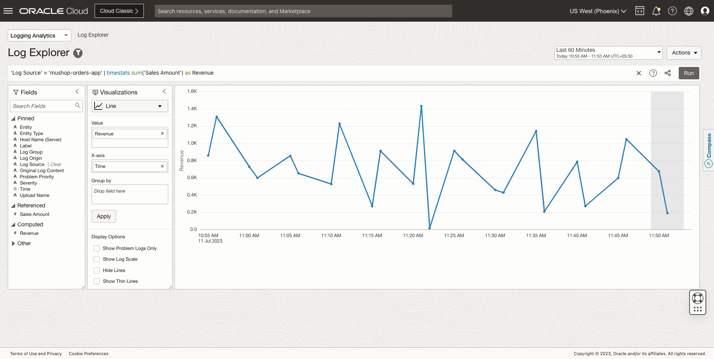

7. End Note : Change the values in the Time Picker to **Last 24 Hours**, **Last 14 Days** etc and check whether the line chart changes.  


## Task 6 : Find average daily  sales amount

   We looked at the trend of revenue in previous task. In this task we want to find out average **Sales Amount** that is processed.  

1. To reset the context of Log Explorer, click on the **Actions** button and in the menu item select **Create New**. 
         

2. Select the visualization **Pie Chart**.
   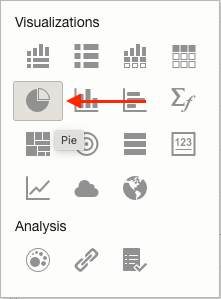


3. Run the following query in the **Query Bar**.

    ```  
      <copy>
        'Log Source' = 'mushop-orders-app' | stats count as logrecords by 'Log Source'
      </copy>
    ```

4. Add the field **Sales Amount** to the Value textbox.
      - In the Fields panel, in the Search Fields textbox, search for the field  **Sales Amount**.
      - In the resultant field, click on the three vertical dots menu icon. 
      - Click on **Add to Value** menu icon.
         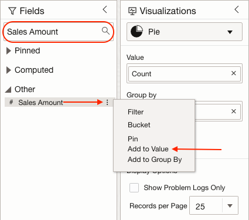
      - The **Value** textbox will look like the following.
         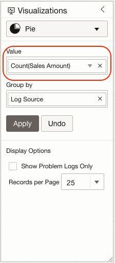


5. Click on the Drop Down icon in the **Value** textbox. Select the **Average** menu item. Click **Apply** button.
     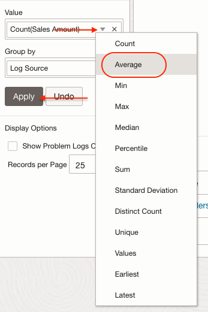    

6. The daily average sales values will be dispalyed.
     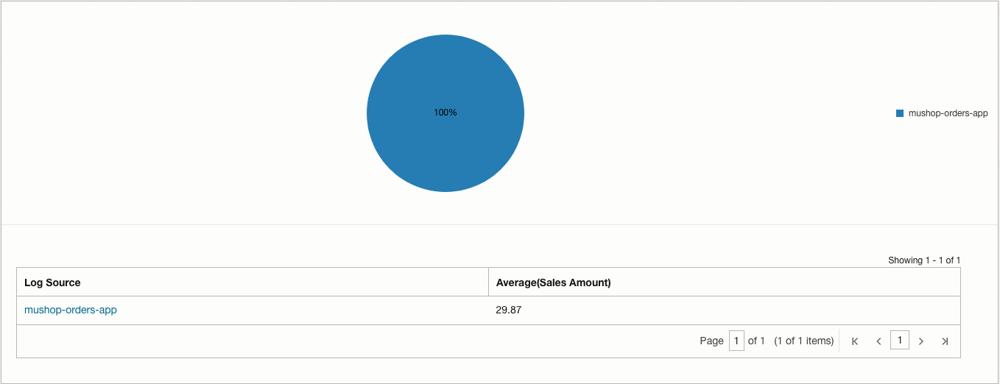

7. Food For Thought - Do you think this value is correct? 
    
    
      > **Hint** : In the begining of this Lab we selected root compartment which has two **Log Group** and we learnt that the **Log Group** <em>kubernetes_logs</em> has the copy of the Kubernetes Logs ingested through Kubernetes Cluster **oke-cw23-II**. Refer **Task 1** > **Step 5** > **Note** to ascertain this.

8. Retrieveing the correct value of the daily average sales.
  - Clear the field **Sales Amount** in the Fields panel's Search Fields textbox by clicking `x` button.
  - Click on the field **Log Group**  in the Fields panel.
     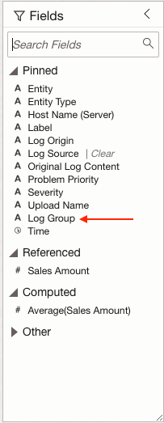
  -  **Filter Log Group** pop-window will be displayed.
  - Select your user's **Log Group**. 
  - Click on **Apply** button.
  - Now you will be able to see the correct value of the daily average sales.


## (Excercise) Task 7 : Building Interactive Visualization for Deployments

 In this task we will find what type of workloads are running in different namespaces and the names of those workloads.

1. To reset the context of Log Explorer, click on the **Actions** button and in the menu item select **Create New**. 
    

2. Select the visualization **Distinct**.
  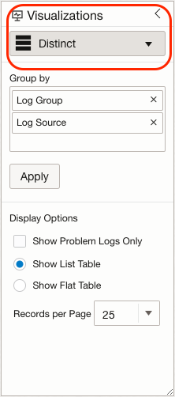

3. Add Namespace Field to Group By. 


    - In the Fields panel, in the Search Fields textbox, search for the field **Namespace**.
    - In the resultant field, click on the three vertical dots menu icon.
    - Click on the **Add to Group By** menu option.
       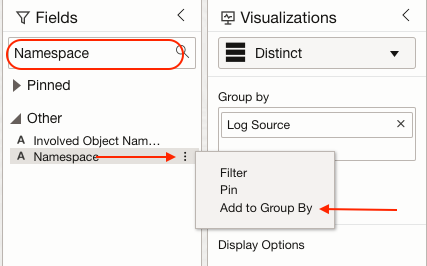
    - The **Namespace** field will be added in the **Group by** textbox under Visualization Panel. 
       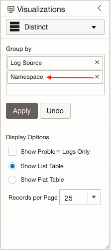 
      > **Note :** The Group By textbox allows a maximum of 4 fields in the Distinct Visualization. Hence remove all the other fields apart from **Namespace**   

       

4. Repeat the instructions in the step 2 to add fields **Controller** and  **Controller Kind**.
     > **Note :** Remove all the other fields apart from **Namespace** , **Controller** and  **Controller Kind** from the Group by textbox. 

5.  For convenience you can also paste the following query to view the data
      ```
       <copy>
          * | distinct Namespace, Controller, 'Controller Kind'
       </copy>
      ```

6. The **Group by** section should look like the following. Click on the **Apply** button to apply the changes. 
   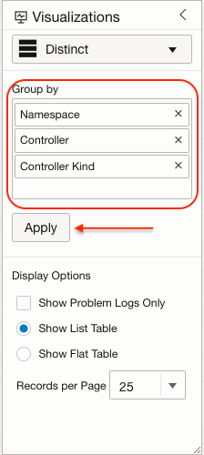   

      > **Note :** Do not change the order in the **Group by** section it should be in the order **Namespace** , **Controller** and  **Controller Kind**.


7. The results will be grouped by **Namespace** , **Controller** and **Controller Kind**. 
   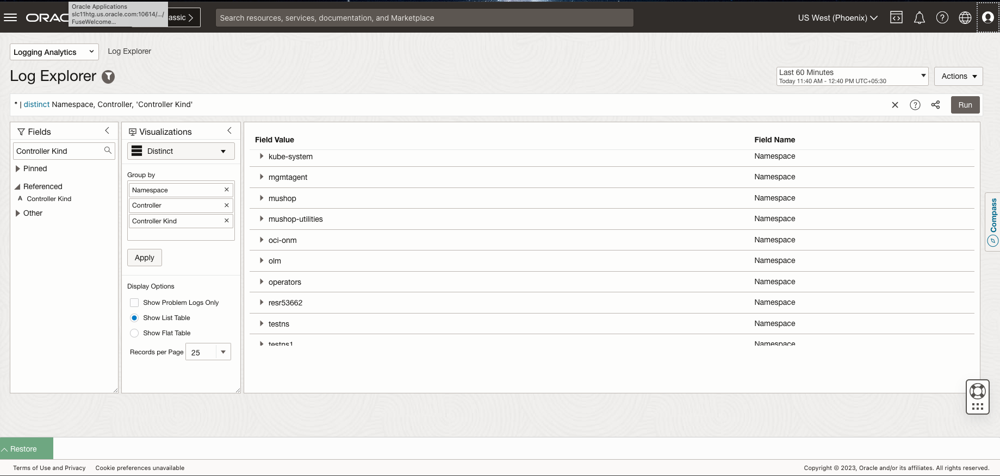 

8. In the results look for your user's **Namespace** by scrolling in the **Field Value** column . The **Namespace** can be found from the **View Login Info** page with the field name **Kubernetes Namespace**.
         
      > **Note :** The **Namespace** will  be in the format **resr{reservationid}**, for e.g resr58829.  


    i. Click on expand icon to view the different resources (Controller) created in your user's Namespace. 
     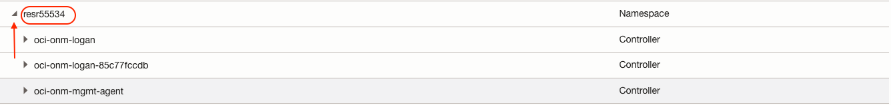 


   ii. Click on expand icon of **oci-onm-logan** resource to see kind (Controller Kind) of the resource. It displays Daemonset & Deployment created as part of Kubernetes Solution installation performed in the [previous lab](#prev). 
     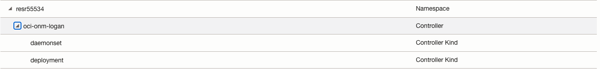 


   iii. Repeat the step ii to view the Controller Kind of other resources which are created as part of the Kubernetes Solution installation. 

## (Excercise) Task 8 : Viewing Kubernetes Events

1. To reset the context of Log Explorer, click on the **Actions** button and in the menu item select **Create New**. 
    

2. Run the following query in the Query Bar.
        ```  
            <copy>
                'Log Source' = 'Kubernetes Event Object Logs' | timestats count as logrecords by 'Log Source'
            </copy>
        ``` 
        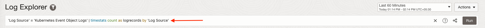 

3. Select the visualization **Table**.
  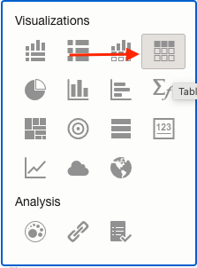

4. Add fields to the Display Fields.
    - In the Fields panel, in the Search Fields textbox, search for the field  **Involved Object Kind**.
         > **Note** : Kubernetes objects are persistent entities in the Kubernetes system and are used to represent the state of your cluster.  Read more about Kubernetes Objects [here](https://kubernetes.io/docs/concepts/overview/working-with-objects/).  

    - In the resultant field, click on the three vertical dots menu icon. 
    - Click on **Add to Display Fields** menu icon.
       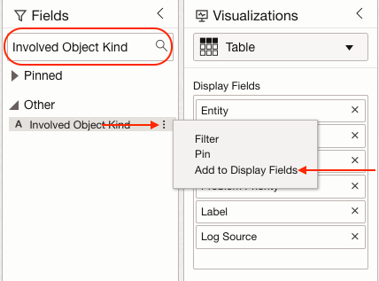

5. Repeat the step 3 for the fields **Involved Object Name** & **Event Type**.
      > **Note** : Remove all the other fields apart from **Involved Object Kind** , **Involved Object Name** & **Event Type**  from the **Display Fields** textbox.

6. For convenience you can also paste the following query to view the data
      ```
       <copy>
          'Log Source' = 'Kubernetes Event Object Logs' | fields 'Involved Object Kind', 'Involved Object Name', 'Event Type', -Entity, -'Entity Type', -'Host Name (Server)', -'Problem Priority', -Label, -'Log Source' 
       </copy>
      ```
  
6. The Display fields textbox will look like the following after adding the fields **Involved Object Kind** , **Involved Object Name** & **Event Type**. 

      Click on the **Apply** button.
      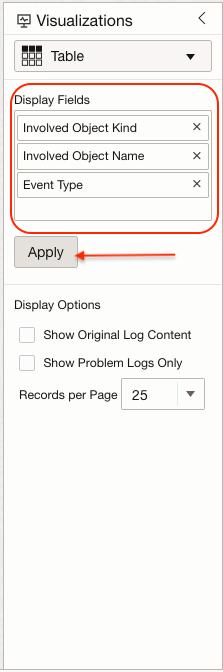

7. The **Table** view in context of **Kubernetes Event Object Logs** Log Source will be displayed.
   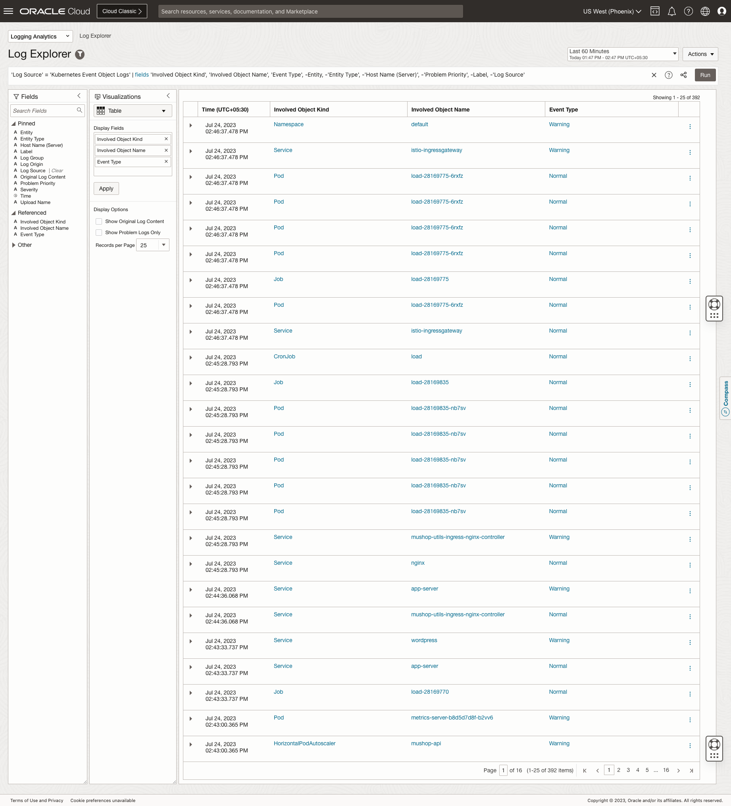

8. Click on the expand field button to view all the extracted fields of a log entry. You can now see that various important information from the log entry has been extracted into different fields which can be further used for filtering and various analytics. 

    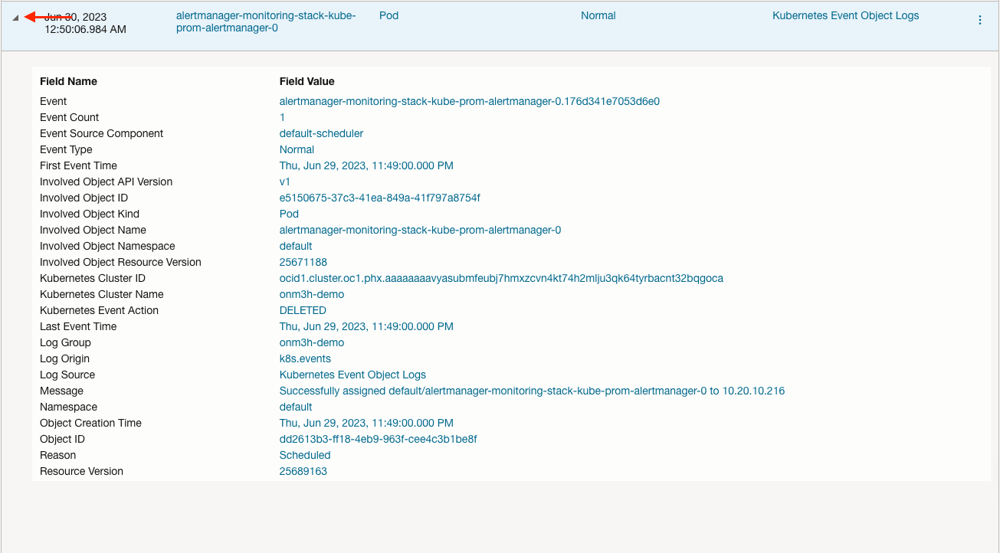

> **Note** : We will use this set up to create the Dashboard in the next step.      


## (Excercise) Task 9 : Add Visualization to the Dashboard

1. Select the visualization **Bar**.
   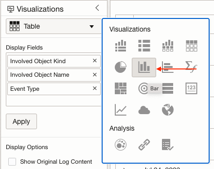

2. The **Bar** chart view in context of **Kubernetes Event Object Logs** Log Source will be displayed.
   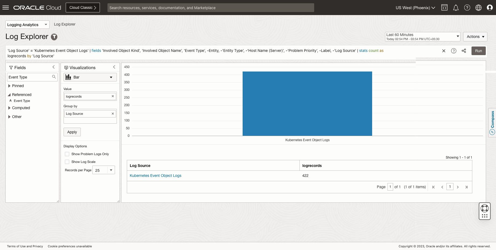

3. Click on the **Actions** button.
   

4. Click on the **Save as** option.
   

5. A **Save search** pop up will be displayed. By default your user's **Compartment** is selected in **Save Search Compartment** dropdown.
   
    > **Note** : You will see the Authorization error if any other **Compartment** is selected in **Save Search Compartment** dropdown.

6. In the  **Save search** pop up perform the following actions.
   
    - (Optional) Type the **Compartment** name in the **Saved Search Compartment** for your user the **Compartment** name will be **LLresrvationid-COMPARTMENT**.  You can always find the **Compartment** name from the View Login Info page.
        > **Note** : This step is optional if you have not changed the **Compartment** in step 5.
        

    - Enter the **Search Name**.
    - Check the **Add to dashboard** checkbox.
    - Select the **New Dashboard** radio button.
    - Select the **Dashboard Compartment** name. Make sure that you select the same **Compartment** for Dashboard and Save Search.
    - Enter the **Dashboard Name**. 
    - Click on **Save** button.
    
    - A saved search will be created and added to the Dashboard.
      

7. Click on the drop-down on top left side of the Log Explorer Page and select **Dashboards**.
    

    **OR**

   Copy-paste the following link in your browser's address bar to navigate to the **Dashboards**.
      ```
         <copy>
           https://cloud.oracle.com/loganalytics/dashboards?region=us-phoenix-1
         </copy>
     
      ```

8. A Dashboards Page will be displayed. Click on the Dashboard Name that you have created in the Step 6.
    

9. A widget showing the saved search data will be displayed.
    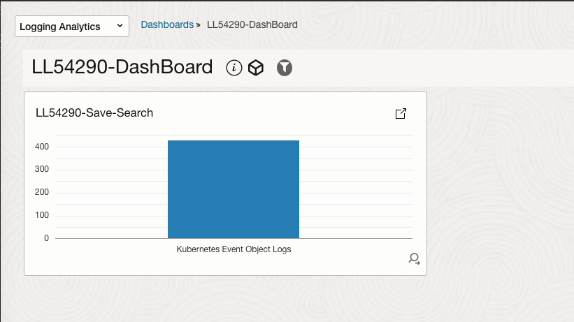

              
## Task 10 : Workshop Show and Tell

You'll get the opportunity to showcase your dashboard at the end of the lab. You can add any visualization that you like to your dashboard - here are few examples.
  - Find average number of orders per day, per hour ?
  - Which day had maximum number of orders ?
  - Which product was ordered most ?
  - Which city or region is at the top from total orders ?
  - What about sales amount perspective ?

**Congratulations!** In this lab, you have successfuly completed the following tasks:
- Understood the data model of telemetry collected by Kubernetes Monitoring Solution
- Gathered information about the monitored OKE Cluster interactively in Log Explorer
  
  You may now proceed to the [next lab](#next).

## Acknowledgements
* **Author** - Vikram Reddy , OCI Logging Analytics
* **Contributors** -  Vikram Reddy, Santhosh Kumar Vuda , OCI Logging Analytics
* **Last Updated By/Date** - Vikram Reddy, Aug, 2023
