# Analyzing Logs

## Introduction

```
  TO BE UPDATED
```

Watch the video below for a quick walk-through of the lab.

### Objectives

```
  TO BE UPDATED
```


Estimated Time: 30 minutes

## Task 1: View the Logs in Log Explorer
1. From Navigation Menu  > **Observability & Management** > **Logging Analytics** > **Log Explorer**.

2. In the following steps we will select the **Compartment** to view the various logs.
    > **Note:** By default root **Compartmemnt** (in this case emdemo(root)) will always be selected. Do not change the **Compartment** throughout this livelab session.

    - Click on the **Scope** filter, select the **emdemo(root)** **Compartment** into **Log Group Compartment** dropdown textbox and click **Apply** button.
    

    - Click on **Close** button

3. In the Fields panel, in the Search Fields textbox, search for the field **Log Group**.
    
    

4. Drag and Drop the **Log Group** field in the **Group by** textbox under Visualization Panel and click **Apply**.
    

5. The **Pie** chart view in context of **Log Group** will be displayed along with logrecords count for each **Log Group**.
      

6. You can also use the following query in the **Query Bar** to get the **Pie Chart** view.

     ```
      <copy>
        * | stats count as logrecords by 'Log Group' | sort -logrecords
      </copy>
     ```


## Task 2: Review Logs in Log Groups

1. Select the visualization **Horizontal Bar**. This will take you to the **Horizontal Bar** view in context of **Log Group** along with logrecords count for each **Log Group**.
    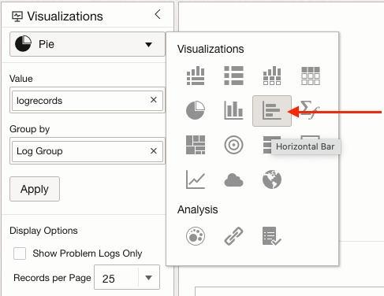
    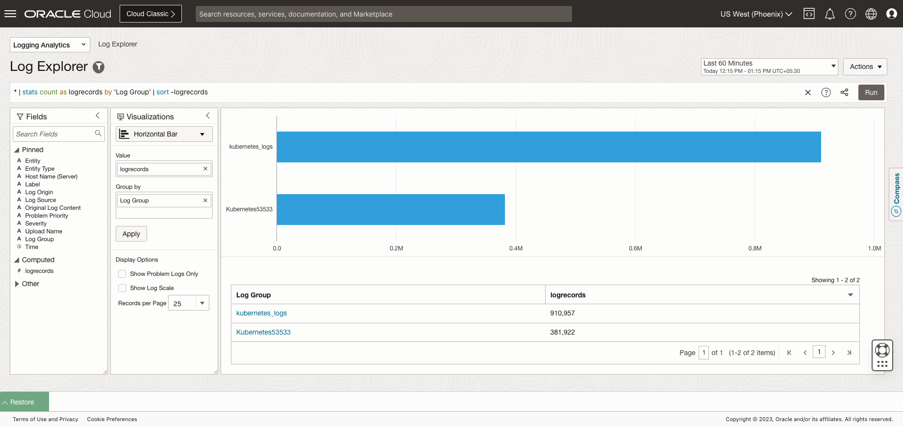
    

2. In the Fields panel, in the Search Fields textbox, search for the field **Log Source**.
    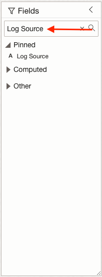


3. Drag and Drop the **Log Source** field in the **Group by** textbox under Visualization Panel and click **Apply**.
      

4. The results will be grouped by **Log Source** and **Log Group**.
    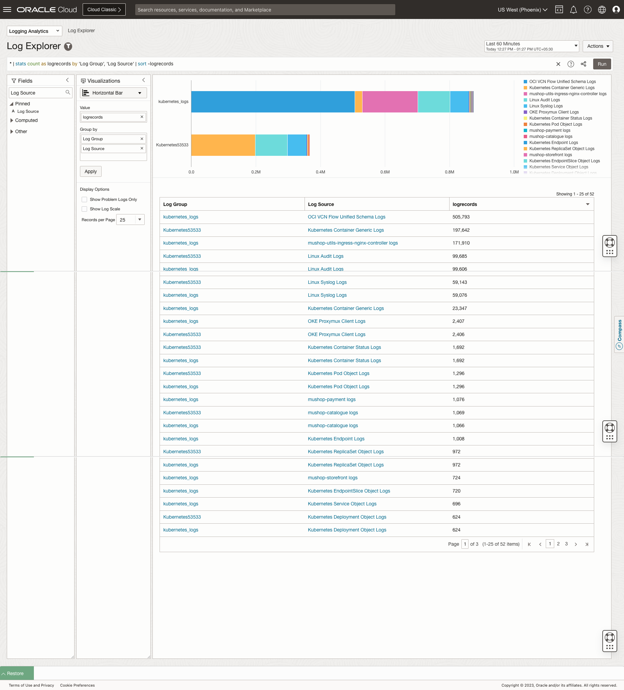  


5. You can also use the following query in the **Query Bar** to get the view the results.
    > **Note:** Run this query only after step 1 is finished.

      ```
         <copy>
           * | stats count as logrecords by 'Log Group', 'Log Source' | sort -logrecords
          </copy>
       ``` 

6. (Optional) You can select any other visualization (e.g Sunburst, TreeMap etc) from the  **Visualizations** panel to view the data.  

## Task 3: Get inventory of namespace, pods, services, nodes for your cluster

### **Review Cluster**

1. Select the visualization **Distinct**.
      

2. In the Fields panel, in the Search Fields textbox, search for the field **Kubernetes Cluster Name**. Click on the resultant field **Kubernetes Cluster Name**.
      

3. **Filter Kubernetes Cluster Name** pop-window will be displayed. All the Kubernetes Cluster Names will be displayed.

    

4. Click on **Cancel** Button.

5. Clear the field **Kubernetes Cluster Name** in the Fields panel's Search Fields textbox by clicking `x` button.


### **Review Namespace**

1. In the Fields panel, in the Search Fields textbox, search for the field **Namespace**. Click on the resultant field **Namespace**.
   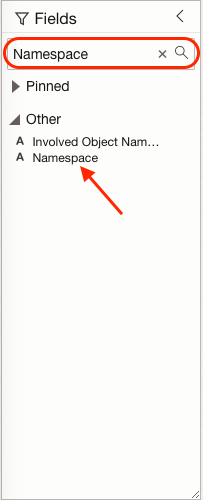 

2. **Filter Namespace** pop-window will be displayed. All the Kubernetes Namespaces will be displayed. 
   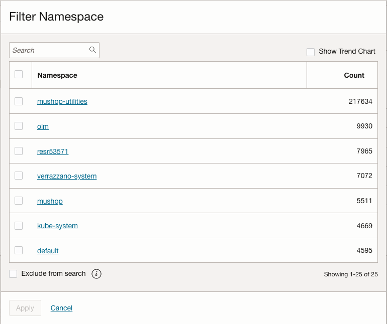 

3. Click on **Cancel** Button.

4. Clear the text **Namespace** in the Fields panel's Search Fields textbox by clicking `x` button.    


### **Review Pods**

1. In the Fields panel, in the Search Fields textbox, search for the field **Pod**. Click on the resultant field **Pod**.
    

2. **Filter Pod** pop-window will be displayed. All the Pods will be displayed. 
   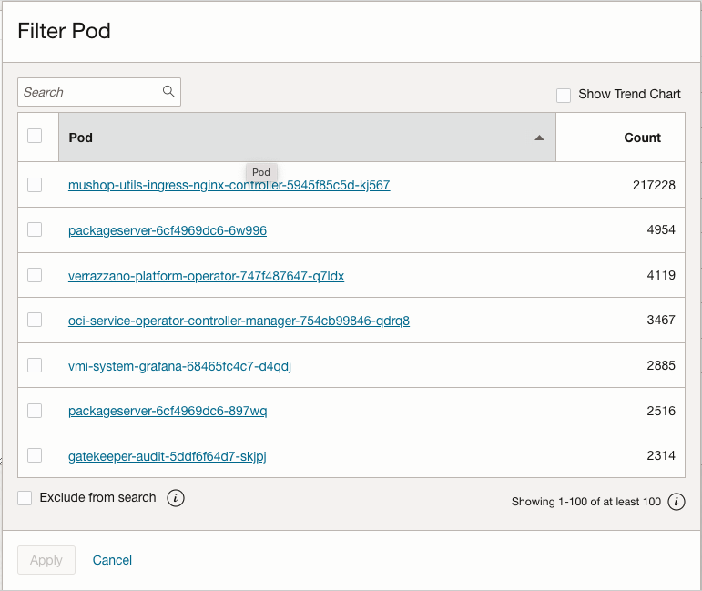 

3. Click on **Cancel** Button.

4. Clear the field **Pod** in the Fields panel's Search Fields textbox by clicking `x` button.   
  

### **Review Nodes**

1. In the Fields panel, in the Search Fields textbox, search for the field **Node**. Click on the resultant field **Node**.
   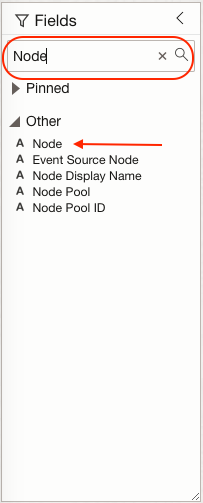 

2. **Filter Node** pop-window will be displayed. All the Nodes will be displayed. Click on the checkbox of `Show Trend Chart`.
   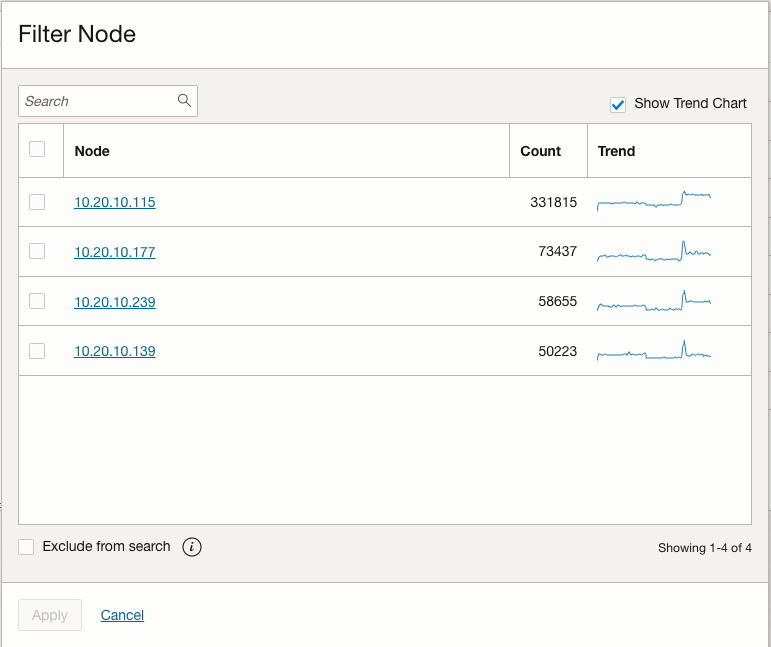 

3. Click on **Cancel** Button.

4. Clear the field **Node** in the Fields panel's Search Fields textbox by clicking `x` button.


## Task 4 : Building Interactive Visualization for Deployments

 

1. Select the visualization **Distinct**.
  

2. In the Fields panel, in the Search Fields textbox, search for the field **Namespace**. Drag and Drop the **Namespace** field in the **Group by** textbox under Visualization Panel.  

    > **Note** : Remove **Log Source** and **Log Group** field from Group by section.
  
3. In the Fields panel, in the Search Fields textbox, search for the field **Controller**. Drag and Drop the **Controller** field in the **Group by** textbox under Visualization Panel.     

4. In the Fields panel, in the Search Fields textbox, search for the field **Controller Kind**. Drag and Drop the **Controller Kind** field in the **Group by** textbox under Visualization Panel.  

5. The **Group by** section should look like the following. Click on the **Apply** button. 
   

6.  The results will be grouped by **Namespace** , **Controller** and **Controller Kind**. 
   

7. Screenshot to be updated with user namespace and controllers. The below screenshot is not final
   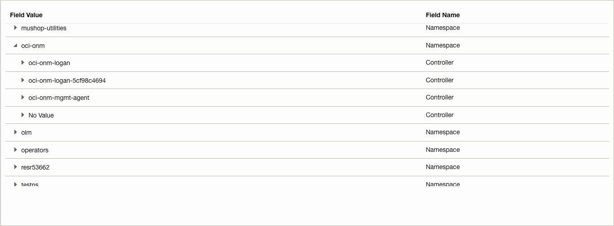


## Task 5 : Find number of total pods, running pods in a namespace

  > **Note** : Before moving on to the next steps. Clear the query bar and click on **Run**.

1. Select the visualization **Pie Chart**.
  

2. In the Fields panel, in the Search Fields textbox, search for the field **Namespace**. Click on the resultant field **Namespace**.
    

3. **Filter Namespace** pop-window will be displayed. All the Kubernetes Namespaces will be displayed. 
   

4. You can select any namespace value from the list - for e.g **default**. Click on the **Apply**.
   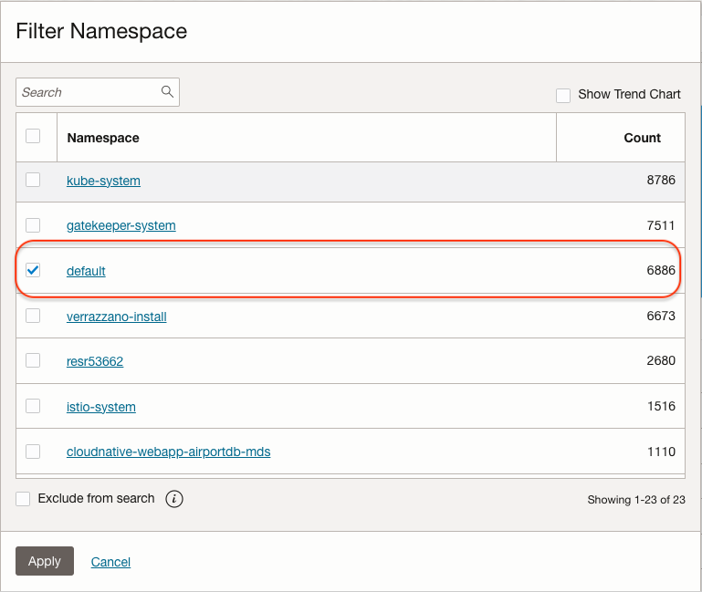

5. Clear the field **Namespace** in the Fields panel's Search Fields textbox by clicking `x` button.   

6. In the Fields panel, in the Search Fields textbox, search for the field **Status**. Click on the resultant field **Status**.
   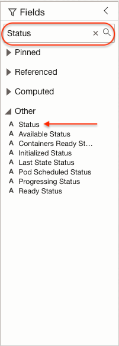 

7. **Filter Status** pop-window will be displayed. All the pods status' will be displayed. 
   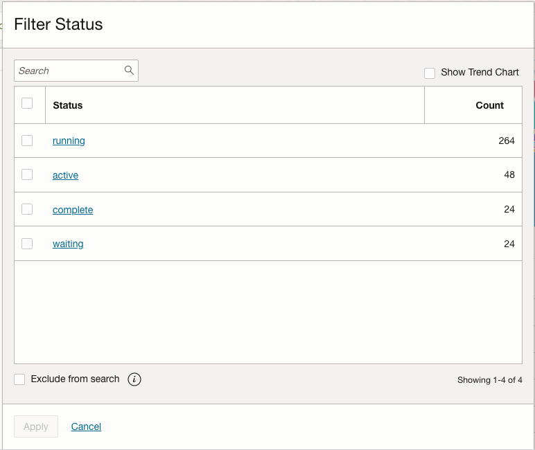 

8. Select the status value **running** . Click on the **Apply**.
   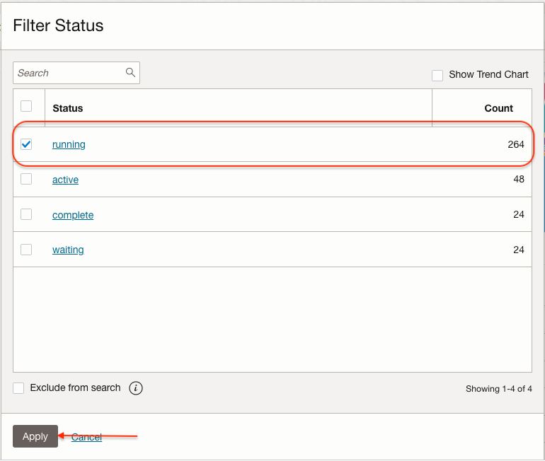

9. Clear the field **Status** in the Fields panel's Search Fields textbox by clicking `x` button.   

10. In the Fields panel, in the Search Fields textbox, search for the field **Namespace**.
    

11. Drag and Drop the **Namespace** field in the **Group by** textbox under Visualization Panel and click **Apply**.
    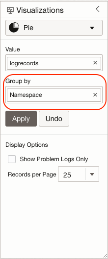

12. Clear the field **Namespace** in the Fields panel's Search Fields textbox by clicking `x` button. 

13. In the Fields panel, in the Search Fields textbox, search for the field **Pod**.
    

14. Drag and Drop the **Pod** field in the **Value** textbox under Visualization Panel.
    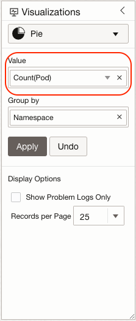   

15. Click on the Drop Down icon in the **Value** textbox. Select the **Distinct Count** menu item.
    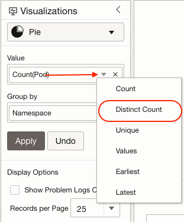   

16. Click on the **Apply** button.

17. The count of all the distinct running Pods in the selected Namespace will be displayed.
    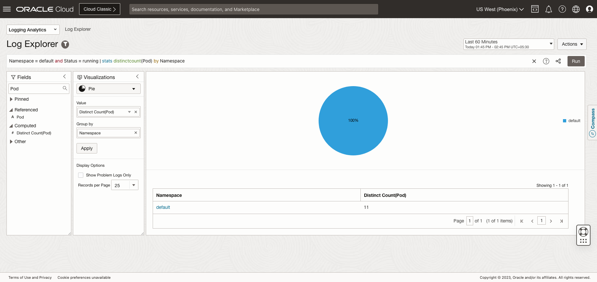 

18. The query in the query bar will be following.
    ```
      <copy>
        Namespace = default and Status = running | stats distinctcount(Pod) by Namespace
      </copy>

    ```  

19. Edit the query and provide the Name to the `distinctcount(Pod)` using the **as** operator. 
     - In the following query we used as operator and provided the Name `'Running Pods'` to the `distinctcount(Pod)`. 
     - You can copy and paste the following query in the **Query Bar**.

        ```
          <copy>
             Namespace = default and Status = running | stats distinctcount(Pod) as 'Running Pods' by Namespace
          </copy>

        ``` 
      - The column name will be changed to **Running Pods**.
      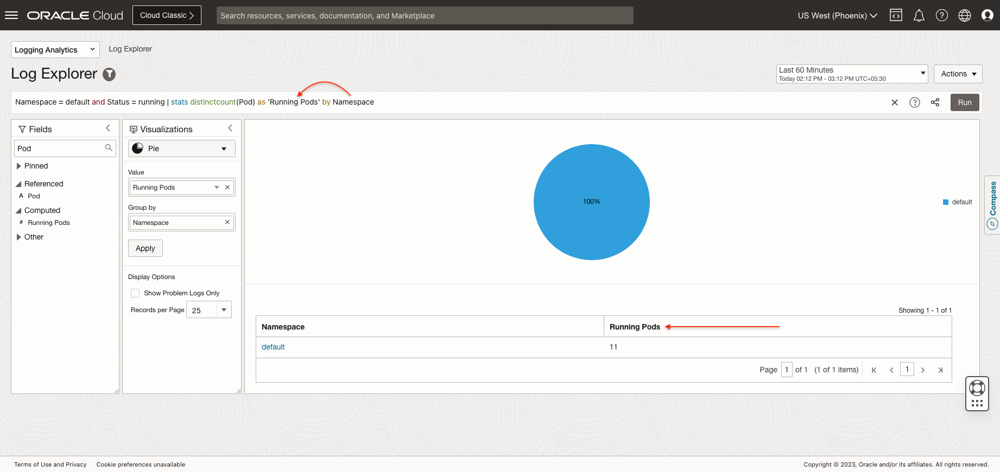 

   > **Note** : Click the **x** icon in the query bar and click on the **Run** button before  moving to next Task.   

      

    


## Task 6 : Viewing Events 

1. Select the visualization **Table**.
  

2. Run the following query in the Query Bar.
        ```  
            <copy>
                'Log Source' = 'Kubernetes Event Object Logs' | timestats count as logrecords by 'Log Source'
            </copy>
        ```  

3. In the Fields panel, in the Search Fields textbox, search for the field **Involved Object Kind**.
   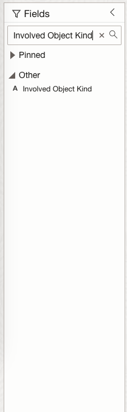 


4. Drag and Drop the **Involved Object Kind** field in the **Display Fields** textbox under Visualization Panel.
   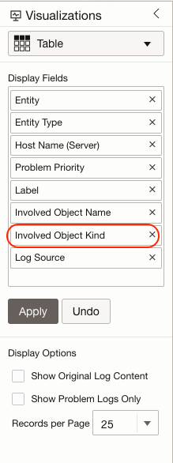   

5. In the Fields panel, in the Search Fields textbox, search for the field **Involved Object Name**.
   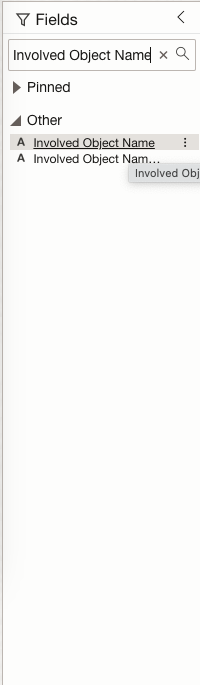 


6. Drag and Drop the **Involved Object Name** field in the **Display Fields** textbox under Visualization Panel.
   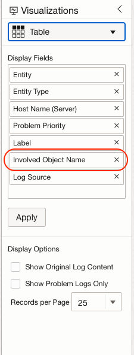


7. In the Fields panel, in the Search Fields textbox, search for the field **Event Type**.
   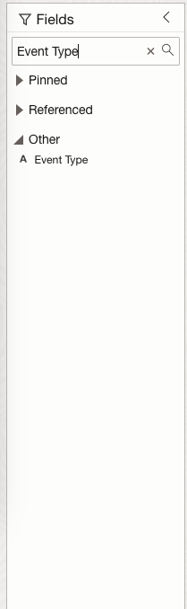 


8. Drag and Drop the **Event Type** field in the **Display Fields** textbox under Visualization Panel.
   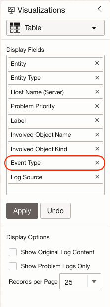

  > **Note** : Remove the fields **Entity** , **Entity Type** , **Host Name (Server)**, **Problem Priority**, **Label** from the **Display Fields** textbox.

9. Click on the **Apply** button.
   


10. The **Table** view in context of **Kubernetes Event Object Logs** Log Source will be displayed.
   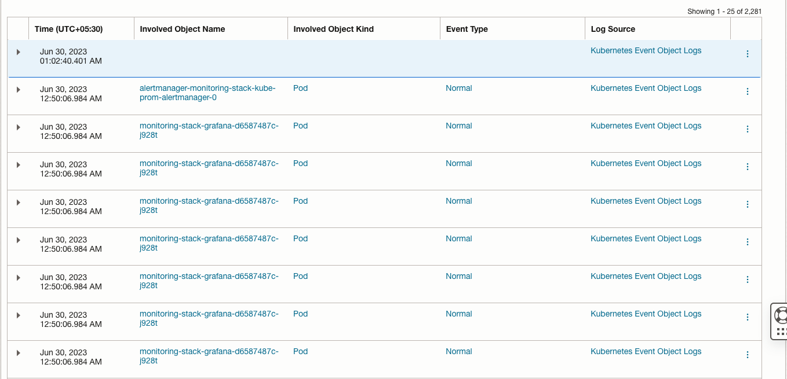

11. Click on the expand field button to view all the extracted fields of a log entry. You can now see that various important information from the log entry has been extracted into different fields which can be further used for filtering and various analytics. 

    

> **Note** : We will use this set up to create the Dashboard in the next step.    


## Task 7 : Add Visualization to the Dashboard

1. Click on the **Actions** button.
   

2. Click on the **Save as** option.
   

3. A **Save search** pop up will be displayed.
   
    > Note : Getting AuthZ error, needs the fix.

4. In the  **Save search** pop up perform the following actions.
    - Type the **Compartment** name in the **Saved Search Compartment** for your user the **Compartment** name will be **LLresrvationid**
        > Note : You can always find the **Compartment** name from the View Login Info page.

    - Enter the **Search Name**.
    - Check the **Add to dashboard** checkbox.
    - Select the **New Dashboard** radio button.
    - Select the **Dashboard Compartment** name same as step 1.
    - Enter the **Dashboard Name**.
    - Click on **Save** button.
    
    - A saved search will be created and added to the Dashboard.
      

5. Click on the drop-down of top left side of the Log Explorer Page and select **Dashboards** 
    

    **OR**

   Copy-paste the following link in your browser's address bar to navigate to the Dashboards.
      ```
         <copy>
           https://cloud.oracle.com/loganalytics/dashboards?region=us-phoenix-1
         </copy>
     
      ```

6. A Dashboards Page will be displayed. Click on the Dashboard Name that you have created in the Step 5.
    

7. A widget showing the saved search data will be displayed.
    


 


    
 


## Task 8 : Review Custom Log Source

1. Run the following query in the **Query Bar**.

    ```  
      <copy>
        'Log Source' = 'mushop-orders-app' and 'ReceivedCustomer' | timestats count as logrecords by 'Log Source'
      </copy>
    ``` 

2. The previous step takes you to the **Records with Histogram** view in context of **mushop-orders-app** Log Source.

3. Select the visualization **Cluster**.
  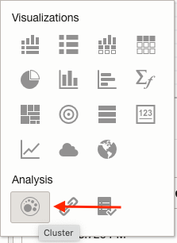

4. The previous step takes you to the **Cluster** view in context of **mushop-orders-app** Log Source.
  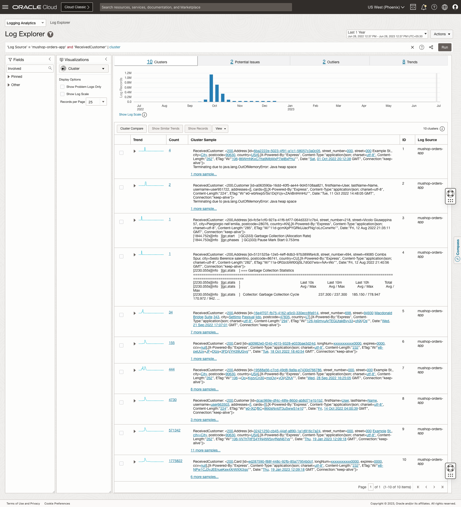

5. Next Steps to be updated.  


## Task 9 : Find average daily  sales amount

1. Select the visualization **Pie Chart**.

2. Run the following query in the **Query Bar**.

    ```  
      <copy>
        'Log Source' = 'mushop-orders-app' | timestats count as logrecords by 'Log Source'
      </copy>
    ```


3. In the Fields panel, in the Search Fields textbox, search for the field **Sales Amount**.
   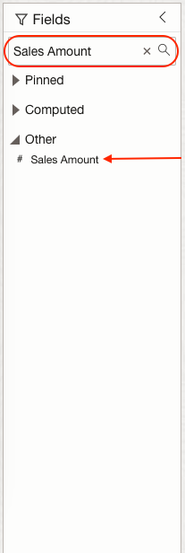 


4. Drag and Drop the **Sales Amount** field in the **Value** textbox under Visualization Panel.
   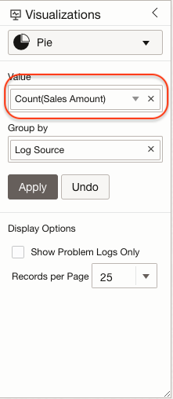 

5. Click on the Drop Down icon in the **Value** textbox. Select the **Average Count** menu item. Click **Apply** button.
    

6. The daily average sales values will be dispalyed.
   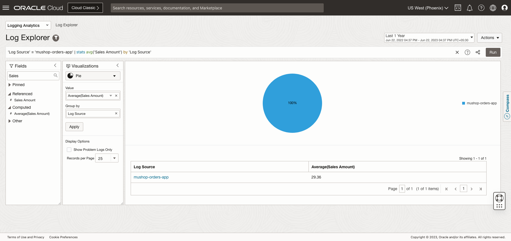
                 
## Task 10 : Workshop Show and Tell

You'll get the opportunity to showcase your dashboard at the end of the lab. You can add any visualization that you like to your dashboard - here are few examples.
  - Find average number of orders per day, per hour ?
  - Which day had maximum number of orders ?
  - Which product was ordered most ?
  - Which city or region is at the top from total orders ?
  - What about sales amount perspective ?


## Task 2: Get list of events for cluster, namespace, pods, services
    
    

## Task 3: Find number of pods by namespace

  

## Task 4: Get different type of events → Group-by different objects → Remove informational events


## Task 5: Get health status of pods, services 


## Task 6: Find pods running on a node


## Task 7: Review fields extracted by custom parser for Mishap Orders App Logs


## Task 8: Find trend of orders


## Task 9: Find total order value 


**Congratulations!** In this lab, you have successfuly completed the following tasks:
- TO BE UPDATED

  You may now proceed to the [next lab](#next).

## Acknowledgements
* **Author** - Vikram Reddy , OCI Logging Analytics
* **Contributors** -  Vikram Reddy, Santhosh Kumar Vuda , OCI Logging Analytics, Madhavan Arnisethangaraj, OCI Management Agent
* **Last Updated By/Date** - Vikram Reddy, Sep, 2022
