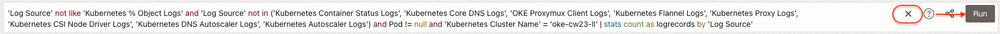

# Analyzing Logs

## Introduction

  In this lab, you'll explore the logs collected by Kubernetes Monitoring Solution you deployed in [previous lab](#prev). You'll also do basic analysis of the logs collected and learn types of logs are collected.

### Objectives

- Understand the data model of telemetry collected by kubernetes monitoring solution
- Gather information about the monitored OKE Cluster interactively in Log Explorer


Estimated Time: 30 minutes

## Task 1: View the Logs in Log Explorer
1. From Navigation Menu  > **Observability & Management** > **Logging Analytics** > **Log Explorer**.
    > Note : For a quick refresher on Log Explorer GUI [review Lab 1](?lab=log-explorer-gui).

2. Once you land on the **Log Explorer** page if the scope has pre-selected **Log Group Compartment**, then you can reset it by clicking on the `x` icon.
   
    
    > Note: If you have followed this step you can skip the below step.
   
   **OR**

   In the following steps we will select the **emdemo(root)** **Compartment** to view the various logs.
   
    - Click on the **Scope** filter, select the **emdemo(root)** **Compartment** into **Log Group Compartment** dropdown textbox and click **Apply** button.
    

    - Click on **Close** button

3. Clear the **Query** bar if it has any query present in it by clicking on the `x` icon and click on **Run** button.
    


4. Add Log Group Field to Group By. 


    - In the Fields panel, in the Search Fields textbox, search for the field **Log Group**.
    - In the resultant field, click on the three vertical dots menu icon.
    - Click on the **Add to Group By** menu option.
       
    - The **Log Group** field will be added in the **Group by** textbox under Visualization Panel. Click **Apply** button to apply the changes.
          


5. The **Pie** chart view in the context of **Log Group** will be displayed along with logrecords count for each **Log Group**.
      > Note : The **Log Group** <em>kubernetes_logs</em> is precreated and it has VCN, LBaaS logs and it also has a copy of Kubernetes Logs ingested through Kubernetes Cluster **oke-cw23-II**.
   
    

**OR**

5. (Optional) You can also use the following query in the **Query Bar** to get the **Pie Chart** view in the context of **Log Group**.

     ```
      <copy>
        * | stats count as logrecords by 'Log Group' | sort -logrecords
      </copy>
     ```

6. **End Notes** : Keep the same set up and perform the following actions.

  - Select the Visualization **Sunburst** from the Visualization drop-down.
      

  - Add the field **Log Source** to the **Group by** by following the instructions in step 4.
      
      > **Note :** Do Not Remove **Log Group** field from the **Group by**.

  - The **Sunburst** chart view in the context of **Log Group** and **Log Source** along with log record **Count** for each **Log Source** is displayed.
      

  - You can also hover over different colors of **Sunburst** chart to view the stats of the **Log Source**.
         


## Task 2 (To Be Removed as Task 1 End Notes Cover This): Review Logs in Log Groups

1. Select the visualization **Horizontal Bar**. This will take you to the **Horizontal Bar** view in context of **Log Group** along with logrecords count for each **Log Group**.
    
    
    

2. In the Fields panel, in the Search Fields textbox, search for the field **Log Source**.
    


3. Drag and Drop the **Log Source** field in the **Group by** textbox under Visualization Panel and click **Apply**.
      

4. The results will be grouped by **Log Source** and **Log Group**.
      


5. You can also use the following query in the **Query Bar** to get the view the results.
    > **Note:** Run this query only after step 1 is finished.

      ```
         <copy>
           * | stats count as logrecords by 'Log Group', 'Log Source' | sort -logrecords
          </copy>
       ``` 

6. (Optional) You can select any other visualization (e.g Sunburst, TreeMap etc) from the  **Visualizations** panel to view the data.  


## Task 3 (To Be Updated and Task 5 will be removed): Get inventory of namespace, pods, services, nodes for your cluster

### **Review Cluster**

1. Select the visualization **Distinct**.
      

2. In the Fields panel, in the Search Fields textbox, search for the field **Kubernetes Cluster Name**. Click on the resultant field **Kubernetes Cluster Name**.
      

3. **Filter Kubernetes Cluster Name** pop-window will be displayed. All the Kubernetes Cluster Names will be displayed.

    

4. Click on **Cancel** Button.

5. Clear the field **Kubernetes Cluster Name** in the Fields panel's Search Fields textbox by clicking `x` button.


### **Review Namespace**

1. In the Fields panel, in the Search Fields textbox, search for the field **Namespace**. Click on the resultant field **Namespace**.
    

2. **Filter Namespace** pop-window will be displayed. All the Kubernetes Namespaces will be displayed. 
    

3. Click on **Cancel** Button.

4. Clear the text **Namespace** in the Fields panel's Search Fields textbox by clicking `x` button.    


### **Review Pods**

1. In the Fields panel, in the Search Fields textbox, search for the field **Pod**. Click on the resultant field **Pod**.
    

2. **Filter Pod** pop-window will be displayed. All the Pods will be displayed. 
    

3. Click on **Cancel** Button.

4. Clear the field **Pod** in the Fields panel's Search Fields textbox by clicking `x` button.   
  

### **Review Nodes**

1. In the Fields panel, in the Search Fields textbox, search for the field **Node**. Click on the resultant field **Node**.
    

2. **Filter Node** pop-window will be displayed. All the Nodes will be displayed. Click on the checkbox of `Show Trend Chart`.
    

3. Click on **Cancel** Button.

4. Clear the field **Node** in the Fields panel's Search Fields textbox by clicking `x` button.


## Task 4 : Building Interactive Visualization for Deployments

 In this task we will find what type of workloads are running in different namespaces and the names of those workloads.

1. Select the visualization **Distinct**.
  

2. Add Namespace Field to Group By. 


    - In the Fields panel, in the Search Fields textbox, search for the field **Namespace**.
    - In the resultant field, click on the three vertical dots menu icon.
    - Click on the **Add to Group By** menu option.
       
    - The **Namespace** field will be added in the **Group by** textbox under Visualization Panel. 
        
      > **Note :** The Group By textbox allows a maximum of 4 fields in the Distinct Visualization. Hence remove all the other fields apart from **Namespace**   

       

3. Repeat the instructions in the step 2 to add fields **Controller** and  **Controller Kind**.
     > **Note :** Remove all the other fields apart from **Namespace** , **Controller** and  **Controller Kind** from the Group by textbox. 

4. The **Group by** section should look like the following. Click on the **Apply** button to apply the changes. 
      

5. The results will be grouped by **Namespace** , **Controller** and **Controller Kind**. 
    

6. In the results look for your user's **Namespace** by scrolling in the **Field Value** column . The **Namespace** can be found from the **View Login Info** page with the field name **Kubernetes Namespace**.
         
      > **Note :** The **Namespace** will  be in the format **resrReservationId**.  


    i. Click on expand icon to view the different resources (Controller) created in your user's Namespace. 
      


   ii. Click on expand icon of **oci-onm-logan** resource to see kind (Controller Kind) of the resource. It displays Daemonset & Deployment created as part of Kubernetes Solution installation performed in the [previous lab](#prev). 
      


   iii. Repeat the step ii to view the Controller Kind of other resources which are created as part of the Kubernetes Solution installation.

   > Note : Upon expanding the Namespace icon we can also see No Value, need to check with Santhosh.
     

## Task 5 (To Be Removed) : Find number of total pods, running pods in a namespace

  > **Note** : Before moving on to the next steps. Clear the query bar and click on **Run**.

1. Select the visualization **Pie Chart**.
  

2. In the Fields panel, in the Search Fields textbox, search for the field **Namespace**. Click on the resultant field **Namespace**.
    

3. **Filter Namespace** pop-window will be displayed. All the Kubernetes Namespaces will be displayed. 
   

4. You can select any namespace value from the list - for e.g **default**. Click on the **Apply**.
   

5. Clear the field **Namespace** in the Fields panel's Search Fields textbox by clicking `x` button.   

6. In the Fields panel, in the Search Fields textbox, search for the field **Status**. Click on the resultant field **Status**.
    

7. **Filter Status** pop-window will be displayed. All the pods status' will be displayed. 
    

8. Select the status value **running** . Click on the **Apply**.
   

9. Clear the field **Status** in the Fields panel's Search Fields textbox by clicking `x` button.   

10. In the Fields panel, in the Search Fields textbox, search for the field **Namespace**.
    

11. Drag and Drop the **Namespace** field in the **Group by** textbox under Visualization Panel and click **Apply**.
    

12. Clear the field **Namespace** in the Fields panel's Search Fields textbox by clicking `x` button. 

13. In the Fields panel, in the Search Fields textbox, search for the field **Pod**.
    

14. Drag and Drop the **Pod** field in the **Value** textbox under Visualization Panel.
       

15. Click on the Drop Down icon in the **Value** textbox. Select the **Distinct Count** menu item.
       

16. Click on the **Apply** button.

17. The count of all the distinct running Pods in the selected Namespace will be displayed.
     

18. The query in the query bar will be following.
    ```
      <copy>
        Namespace = default and Status = running | stats distinctcount(Pod) by Namespace
      </copy>

    ```  

19. Edit the query and provide the Name to the `distinctcount(Pod)` using the **as** operator. 
     - In the following query we used as operator and provided the Name `'Running Pods'` to the `distinctcount(Pod)`. 
     - You can copy and paste the following query in the **Query Bar**.

        ```
          <copy>
             Namespace = default and Status = running | stats distinctcount(Pod) as 'Running Pods' by Namespace
          </copy>

        ``` 
      - The column name will be changed to **Running Pods**.
       

   > **Note** : Click the **x** icon in the query bar and click on the **Run** button before  moving to next Task.   

      

    


## Task 6 : Viewing Kubernetes Events

1. Run the following query in the Query Bar.
        ```  
            <copy>
                'Log Source' = 'Kubernetes Event Object Logs' | timestats count as logrecords by 'Log Source'
            </copy>
        ``` 
         

2. Select the visualization **Table**.
  

3. Add fields to the Display Fields.
    - In the Fields panel, in the Search Fields textbox, search for the field  **Involved Object Kind**.
         > **Note** : Kubernetes objects are persistent entities in the Kubernetes system and are used to represent the state of your cluster.  Read more about Kubernetes Objects [here](https://kubernetes.io/docs/concepts/overview/working-with-objects/).  

    - In the resultant field, click on the three vertical dots menu icon. 
    - Click on **Add to Display Fields** menu icon.
       

4. Repeat the step 3 for the fields **Involved Object Name** & **Event Type**.
      > **Note** : Remove all the other fields apart from **Involved Object Kind** , **Involved Object Name** & **Event Type**  from the **Display Fields** textbox.

5. The Display fields textbox will look like the following after adding the fields **Involved Object Kind** , **Involved Object Name** & **Event Type**. 

      Click on the **Apply** button.
      

6. The **Table** view in context of **Kubernetes Event Object Logs** Log Source will be displayed.
   

7. Click on the expand field button to view all the extracted fields of a log entry. You can now see that various important information from the log entry has been extracted into different fields which can be further used for filtering and various analytics. 

    

> **Note** : We will use this set up to create the Dashboard in the next step.      


## Task 7 : Add Visualization to the Dashboard

1. Select the visualization **Bar**.
   

2. The **Bar** chart view in context of **Kubernetes Event Object Logs** Log Source will be displayed.
   

3. Click on the **Actions** button.
   

4. Click on the **Save as** option.
   

5. A **Save search** pop up will be displayed. By default your user's **Compartment** in selected in **Save Search Compartment** dropdown.
   
    > Note : You will see the Authorization error if any other **Compartment** is selected in **Save Search Compartment** dropdown.

6. In the  **Save search** pop up perform the following actions.
   
    - (Optional) Type the **Compartment** name in the **Saved Search Compartment** for your user the **Compartment** name will be **LLresrvationid-COMPARTMENT**.  You can always find the **Compartment** name from the View Login Info page.
        > Note : This step is optional if you have not changed the **Compartment** in step 5.
        

    - Enter the **Search Name**.
    - Check the **Add to dashboard** checkbox.
    - Select the **New Dashboard** radio button.
    - Select the **Dashboard Compartment** name. Make sure that you select the same **Compartment** for Dashboard and Save Search.
    - Enter the **Dashboard Name**. 
    - Click on **Save** button.
    
    - A saved search will be created and added to the Dashboard.
      

7. Click on the drop-down on top left side of the Log Explorer Page and select **Dashboards**.
    

    **OR**

   Copy-paste the following link in your browser's address bar to navigate to the **Dashboards**.
      ```
         <copy>
           https://cloud.oracle.com/loganalytics/dashboards?region=us-phoenix-1
         </copy>
     
      ```

8. A Dashboards Page will be displayed. Click on the Dashboard Name that you have created in the Step 5.
    

9. A widget showing the saved search data will be displayed.
    


## Task 8 : Collecting Application Logs (Custom Log Sources)

1. From Navigation Menu  > **Observability & Management** > **Logging Analytics** > **Log Explorer**.

   **OR**

  You can also copy-paste the following link in your browser's address bar to navigate to the Log Explorer.
    ```
         <copy>
            https://cloud.oracle.com/loganalytics/explorer?region=us-phoenix-1
         </copy>   
    ```

2. Run the following query in the **Query Bar**.

    ```  
      <copy>
       'Log Source' = 'mushop-orders-app' | timestats sum('Sales Amount') as Revenue
      </copy>
    ``` 

3. The previous step takes you to the **Records with Histogram** view in context of **mushop-orders-app** Log Source.
   

4. Click on the expand field button to view all the extracted fields of a log entry of **mushop-orders-app** Log Source.
    

5. Select the visualization **Line**.
  

6. The previous step takes you to the **Line** chart view in context of **mushop-orders-app** Log Source displaying the **Time** in the X-axis and **Revenue** in the Y-axis for last 60 Minutes.
  

7. End Note : Change the values in the Time Picker to **Last 24 Hours**, **Last 14 Days** etc and check whether the line chart changes.  


## Task 9 : Find average daily  sales amount

   We looked at the trend of revenue in previous task. In this task we want to find out average **Sales Amount** that is processed.    

1. Select the visualization **Pie Chart**.
   


2. Run the following query in the **Query Bar**.

    ```  
      <copy>
        'Log Source' = 'mushop-orders-app' | stats count as logrecords by 'Log Source'
      </copy>
    ```

3. Add the field **Sales Amount** to the Value textbox.
      - In the Fields panel, in the Search Fields textbox, search for the field  **Sales Amount**.
      - In the resultant field, click on the three vertical dots menu icon. 
      - Click on **Add to Value** menu icon.
         
      - The **Value** textbox will look like the following.
         


4. Click on the Drop Down icon in the **Value** textbox. Select the **Average** menu item. Click **Apply** button.
         

5. The daily average sales values will be dispalyed.
     

 6. Food For Thought - Do you think this value is correct? 
    
    
      > **Hint** : In the begining of this Lab we selected root compartment which has two **Log Group** and we learnt that the **Log Group** <em>kubernetes_logs</em> has the copy of the Kubernetes Logs ingested through Kubernetes Cluster **oke-cw23-II**. Refer **Task 1** > **Step 5** > **Note** to ascertain this.

7. Retrieveing the correct value of the daily average sales.
  - Clear the field **Sales Amount** in the Fields panel's Search Fields textbox by clicking `x` button.
  - Click on the field **Log Group**  in the Fields panel.
     
  -  **Filter Log Group** pop-window will be displayed.
  - Select your user's **Log Group**. 
  - Click on **Apply** button.
  - Now you will be able to see the correct value of the daily average sales.

         
                 
## Task 10 : Workshop Show and Tell

You'll get the opportunity to showcase your dashboard at the end of the lab. You can add any visualization that you like to your dashboard - here are few examples.
  - Find average number of orders per day, per hour ?
  - Which day had maximum number of orders ?
  - Which product was ordered most ?
  - Which city or region is at the top from total orders ?
  - What about sales amount perspective ?

**Congratulations!** In this lab, you have successfuly completed the following tasks:
- TO BE UPDATED

  You may now proceed to the [next lab](#next).

## Acknowledgements
* **Author** - Vikram Reddy , OCI Logging Analytics
* **Contributors** -  Vikram Reddy, Santhosh Kumar Vuda , OCI Logging Analytics
* **Last Updated By/Date** - Vikram Reddy, Jul, 2023
