# Custom Application Log Collection

## Introduction

This lab will walk you through the steps to update the helm configuration of **Ingestion Flow Setup Lab** to collect the custom application container logs.

Estimated Time: 15 minutes
 
### Objectives

In this lab, you will:
* Modify helm configuration to collect custom application container logs.
* Verify the log data flowing to the OCI Logging Analytics. 


### Prerequisites

* **Ingestion Flow Setup** lab should be completed


## Task 1: Validate in the Log Explorer

1. From Navigation Menu  > **Observability & Management** > **Logging Analytics** > **Log Explorer**


2. By default, the Log Explorer will show the Pie-Chart Visualization of all the logs received from the OKE cluster. 
    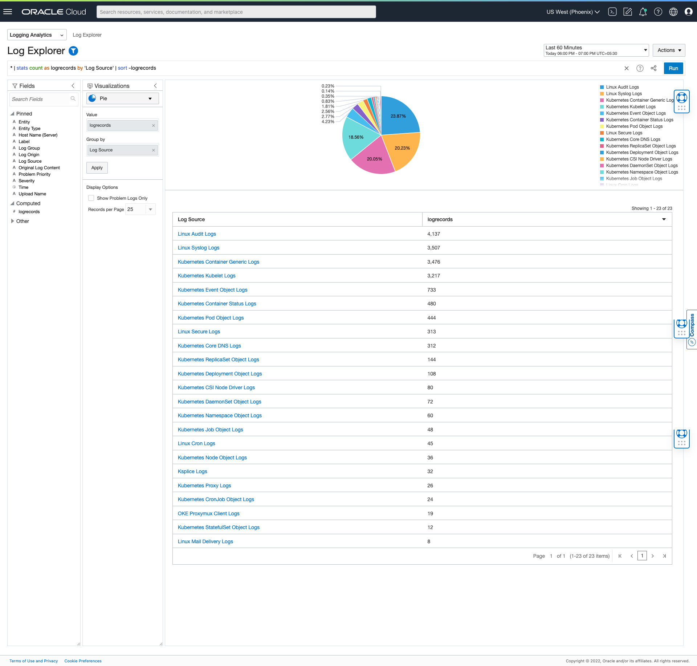

3. Drill Down to Log Source
    - Click on the Kubernetes Container Generic Logs from the list of Log Source and click Drill Down
        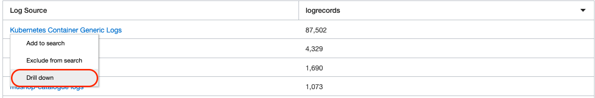 

    - The OKE System logs and Objects logs are handled/collected by the respective Log Source(s). 
    - All the remaining (custom) container logs from the cluster are processed using a generic Log Source called **Kubernetes Container Generic Logs**. 
    
    

4. This will take to the "Records with Histogram view" in context of **Kubernetes Container Generic Logs** Log Source
    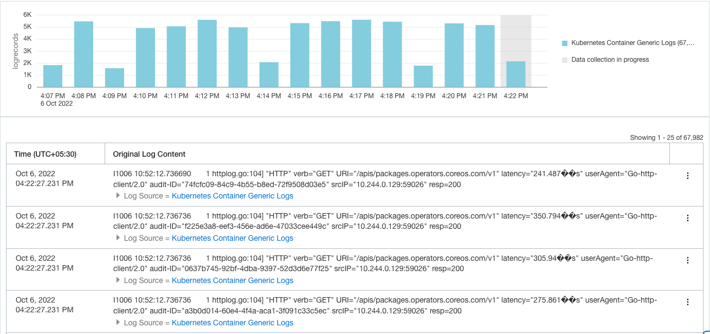 

5. Click on the **Log Origin** field from the Fields Panel.
    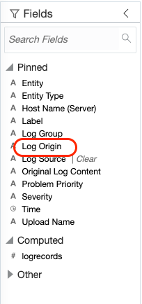 

6. **Filter Log Origin** pop-window will be displayed. Filter the results with the keyword **mushop** and hit enter. All the logs pertaining to the mushop app will be displayed. We have highlighted two log files, whose logs will be rerouted to be processed with existing mushop Log Sources.
    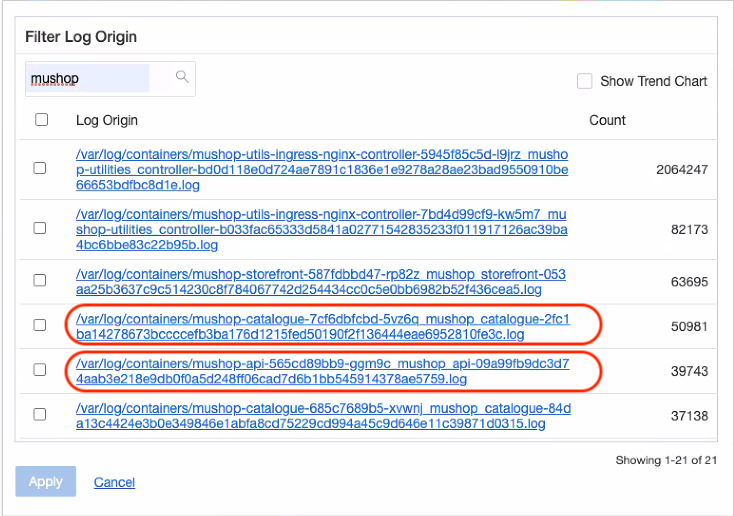    


## Task 2 (Optional): MuShop Log Sources
1. Click on the drop-down of top left side of the Log Explorer Page and select **Administration**
    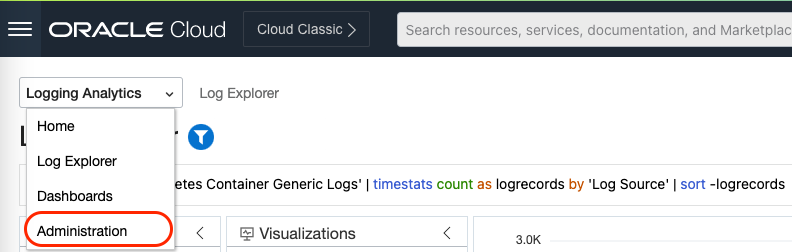 

   Administration Overview Page will be displayed.
    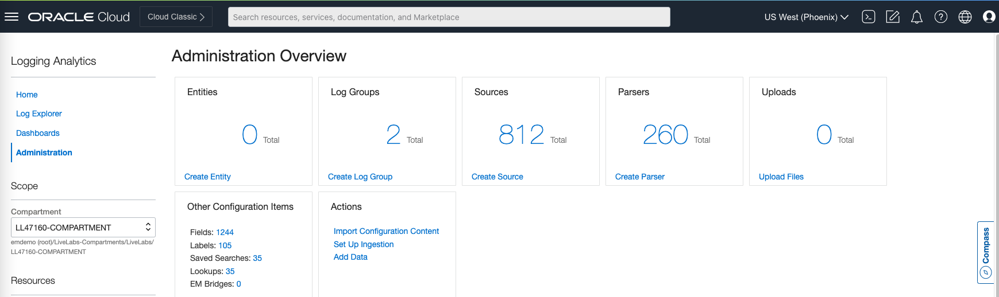 

2. Click on Sources from the Resources Section.
    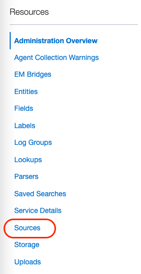 

   Sources page will be displayed. Filter the results with the keyword **mushop** and hit enter. The list of all **mushop** sources will be displayed.
    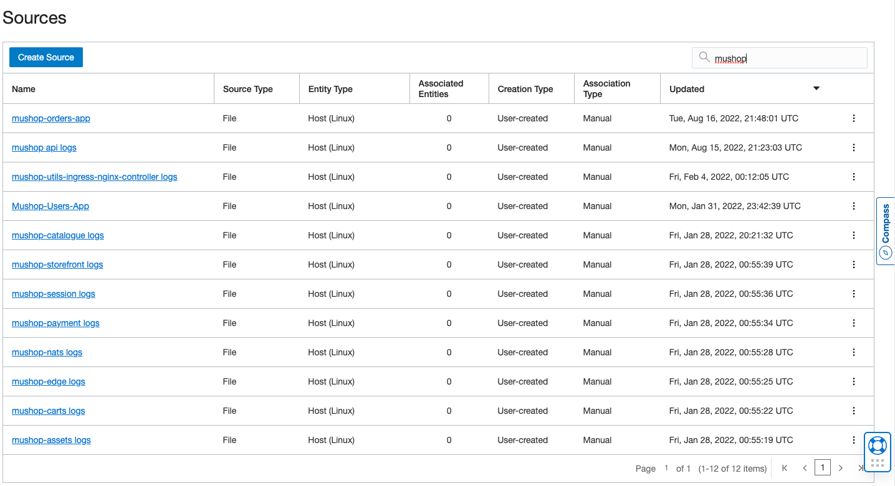


## Task 3: Inserting the mushop application specific configuration in values.yaml.

1. In the next few steps we will update the values.yaml to collect the logs for some of the **mushop application containers**.
    - Open the vaules.yaml file created in the external-values folder and enable paste mode, so that vi/vim will not auto-indent any text that you paste
      
      ```
        <copy>
            :set paste
        </copy>
      ``` 

    - Append the below **customLogs** configuration at the end of the file in the fluentd section.
     ```
     <copy>
    # Custom Configuration for mushop application logs 
        customLogs:
           mushop-orders:
                path: /var/log/containers/mushop-orders-*.log
                ociLALogSourceName: "mushop-orders-app"
                multilineStartRegExp: /^\d{4}-\d{2}-\d{2}\s*\d{2}:\d{2}:\d{2}.\d{3}/
                isContainerLog: true
           mushop-api:
                path: /var/log/containers/mushop-api-*.log
                ociLALogSourceName: "mushop api logs"
                multilineStartRegExp: /^::\w{4}:\d{2}.\d{3}.\d{1}.\d{1}\s*-\s*-\s*\[\d{2}\/\w{3}\/\d{4}:\d{2}:\d{2}:\d{2}\s*\+\d{4}\]/
                isContainerLog: true
           mushop-edge:
                path: /var/log/containers/mushop-edge-*.log
                ociLALogSourceName: "mushop-edge logs"
                isContainerLog: true  
           mushop-catalogue:
                path: /var/log/containers/mushop-catalogue-*.log
                ociLALogSourceName: "mushop-catalogue logs"
                isContainerLog: true
     </copy>
     ```
    
    - After appending the **customLogs** configuration, the final values.yaml file will look like below
      
      ```
        <copy>

                namespace: <Kubernetes Namespace>
                image:
                url: <Container Image URL>
                imagePullPolicy: Always

                ociLANamespace: <Logging Analytics Namespace>
                ociLALogGroupID: <Logging Analytics LogGroup Id>
                kubernetesClusterID: <Kubernetes Cluster Id>
                kubernetesClusterName:  <Kubernetes Cluster Name>
                createServiceAccount:  false
                serviceAccount: <Kubernetes Service Account>
                fluentd:
                baseDir: /var/log/<Kubernetes Namespace>
                tailPlugin:
                        readFromHead:  false
                    # Custom Configuration for mushop application logs 
                        customLogs:
                                mushop-orders:
                                        path: /var/log/containers/mushop-orders-*.log
                                        ociLALogSourceName: "mushop-orders-app"
                                        multilineStartRegExp: /^\d{4}-\d{2}-\d{2}\s*\d{2}:\d{2}:\d{2}.\d{3}/
                                        isContainerLog: true
                                mushop-api:
                                        path: /var/log/containers/mushop-api-*.log
                                        ociLALogSourceName: "mushop api logs"
                                        multilineStartRegExp: /^::\w{4}:\d{2}.\d{3}.\d{1}.\d{1}\s*-\s*-\s*\[\d{2}\/\w{3}\/\d{4}:\d{2}:\d{2}:\d{2}\s*\+\d{4}\]/
                                        isContainerLog: true
                                mushop-edge:
                                        path: /var/log/containers/mushop-edge-*.log
                                        ociLALogSourceName: "mushop-edge logs"
                                        isContainerLog: true  
                                mushop-catalogue:
                                        path: /var/log/containers/mushop-catalogue-*.log
                                        ociLALogSourceName: "mushop-catalogue logs"
                                        isContainerLog: true
        </copy>
     ```   

    - We have now added configuration to send logs for four mushop application to be processed by their specific Log Sources.
    
    - Each configuration has following important information.

         i. path - log origin path from which application logs needs to be read.

         ii. ociLALogSourceName - OCI Log Source Name to be used to process these logs 

         iii. multilineStartRegExp - When the individual log entry in the file spans across multiple lines, multilineStartRegExp is used to uniquely identify  the starting point of the log entry like **mushop-orders** and **mushop-api** in the above configuration . 

        
2. Apply the above helm chart using the same release name specified in the **Ingestion Flow Setup Lab** using the below command.

    ```
     <copy>
        helm upgrade --values ~/oke-livelab/external-values/values.yaml <release-name> ~/oke-livelab/helm-chart/ -n=<namespace>
     </copy>
       
     ```

## Task 4: Verification of mushop logs in Log Explorer

1. Navigate to the Log Explorer by following the steps provided in Task 1.

2. In the Pie Chart view now you should be able to see the Log Sources pertaining to the mushop applications along with the other OKE System and Objects logs.
    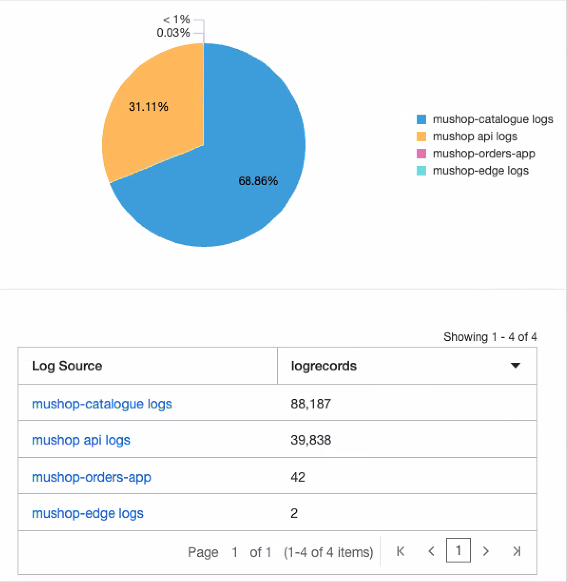

3. Drill Down to the Log Source **mushop api logs**
    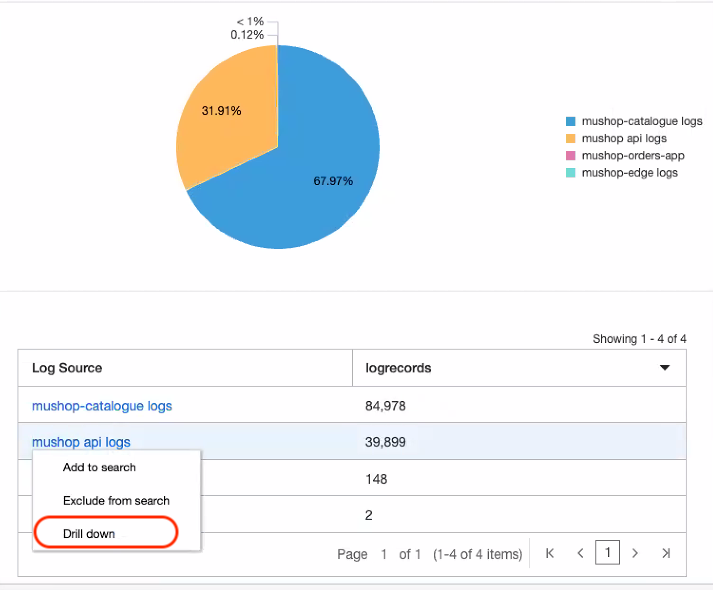

4. Click on the expand field button to view all the extracted fields of a log entry.
    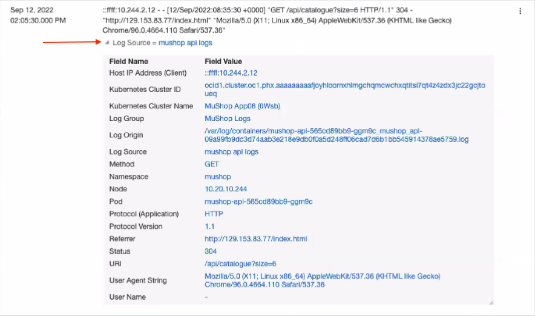


**Congratulations!**, you have successfully modified the helm configuration to collect custom application container logs. Please, proceed to next lab.

## References
For further reading please refer to the resources.

[Configure Sources] (https://docs.oracle.com/en-us/iaas/logging-analytics/doc/configure-sources.html)

[Create Parser] (https://docs.oracle.com/en-us/iaas/logging-analytics/doc/create-parser.html)

[Custom Configuration] (https://github.com/oracle-quickstart/oci-kubernetes-monitoring#custom-configuration)

## Acknowledgements
* **Author** - Vikram Reddy , OCI Logging Analytics
* **Contributors** -  Vikram Reddy, Santhosh Kumar Vuda , OCI Logging Analytics
* **Last Updated By/Date** - Vikram Reddy, Sep, 2022