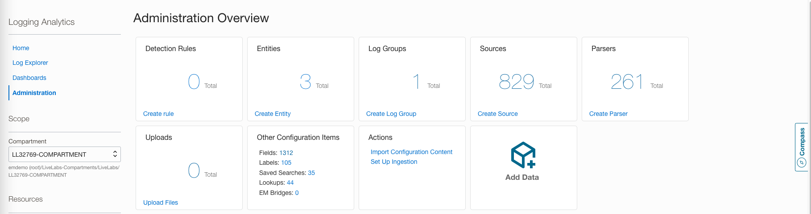

# Customizing Application Logs Configuration

## Introduction

The prebuilt OKE Cluster being used for this workshop already has MuShop (a cloud-native reference application of several Oracle Cloud services) deployed. Mushop has various services running on different containers generating their own application logs which goes to /var/log/containers. All these Mushop service logs are being processed using the generic source **Kubernetes Container Generic Logs** as explained in the previous lab.

This lab will walk you through the steps required to customize pre-defined fluentd configuration in specific to MuShop container logs.  
 
### Objectives

In this lab, you will:
* Modify configuration to collect and process some MuShop container logs using their specific Log Sources.
* Verify the log data of those MuShop logs in the Log Explorer.


### Prerequisites

* **Ingestion Flow Setup** lab should have been completed


Estimated Time: 15 minutes


## Task 1: Determining the Logs for Customization

1. Navigate to the Log Explorer.

2. Run the following query in the Query Bar.
        ```  
            <copy>
                'Log Source' = 'Kubernetes Container Generic Logs' | timestats count as logrecords by 'Log Source'
            </copy>
        ``` 

3. The previous step takes you to the "Records with Histogram view" in context of **Kubernetes Container Generic Logs** Log Source
     

4. Click on the **Log Origin** field from the Fields Panel.
     

5. **Filter Log Origin** pop-window will be displayed. Filter the results with the keyword **mushop** and hit enter. All the logs pertaining to the mushop app will be displayed. We have highlighted two log files, whose logs will be rerouted to be processed with existing mushop Log Sources.
     

6. Click on **Cancel** button.       


## Task 2 (Optional): MuShop Log Sources
1. Click on the drop-down of top left side of the Log Explorer Page and select **Administration**
     
    
    >**Note**: In the Administration Overview Page you will see **Authorization failed or requested resource not found** error message. It is because your user will not have
    access to the **root** compartment.
   
   Select your **Compartment** 
    

    >**Note**: Close the error message if it is still being displayed.
   
   Administration Overview Page will be displayed.
     

2. Click on Sources from the Resources Section.
     

   Sources page will be displayed. Filter the results with the keyword **mushop** and hit enter. The list of all **mushop** sources will be displayed.
    

   

> **Note:** Refer [Learn More](#LearnMore) section that has references for creating your own custom Log Parser and Log Source.


## Task 3: Inserting the mushop application specific configuration in values.yaml.


1. In the next few steps we will update the values.yaml to collect the logs for some of the **mushop application containers**.
    - Open the cloud shell.

    - Navigate into the **external-values** folder using following command.
        ```
          <copy>
                cd ~/oke-livelab/external-values/
          </copy>  
        ```
    - Download the custom values.yaml using the command specified in the field **Lab 3 values.yaml** of [Lab2 Task1](?lab=ingestion#Task1:GatheringRequiredInformation).
      
        >**Note:** Following are the sample command and output. **Do Not Copy these.**

        ```
            wget -O values.yaml https://objectstorage.us-phoenix-1.oraclecloud.com/p/pCyp8T00kckPB82XTYdPnONRMOAInVGsSHerryrPEFk8SLVE0RiMx2pHSrfEhJx7/n/aupo86x8x2bk/b/resrXXXXX/o/lab3_values.yaml
        ```

        ```
        --2022-10-03 07:09:38--  https://objectstorage.us-phoenix-1.oraclecloud.com/p/pCyp8T00kckPB82XTYdPnONRMOAInVGsSHerryrPEFk8SLVE0RiMx2pHSrfEhJx7/n/aupo86x8x2bk/b/resrXXXXX/o/lab3_values.yaml
        Resolving objectstorage.us-phoenix-1.oraclecloud.com (objectstorage.us-phoenix-1.oraclecloud.com)... 134.70.8.1, 134.70.16.1, 134.70.12.1
        Connecting to objectstorage.us-phoenix-1.oraclecloud.com (objectstorage.us-phoenix-1.oraclecloud.com)|134.70.8.1|:443... connected.
        HTTP request sent, awaiting response... 200 OK
        Length: 2509 (2.5K) [application/octet-stream]
        Saving to: ‘values.yaml’

        100%[===========================================>] 2,509       --.-K/s   in 0s      

        2022-10-03 07:09:38 (7.31 MB/s) - ‘values.yaml’ saved [2509/2509]
        ```
    - You can view the downloaded **values.yaml** using the following command.
        ```
            <copy>
              cat ~/oke-livelab/external-values/values.yaml
            </copy>  
        ```

        ```
                ######
                ##  Note:
                ##      - The container images referred in this values.yaml ("image:url" and "mgmtagent:imageurl" sections) are recommended only for using with the workshop.
                ##  - Refer to https://github.com/oracle-quickstart/oci-kubernetes-monitoring#docker-image for all other use cases.
                ######
"createServiceAccount": false
"fluentd":
  "baseDir": "/var/log/resrXXXXX"
  "customLogs":
    "mushop-api":
      "isContainerLog": true
      "multilineStartRegExp": "/^::\\w{4}:\\d{2}.\\d{3}.\\d{1}.\\d{1}\\s*-\\s*-\\s*\\[\\d{2}\\/\\w{3}\\/\\d{4}:\\d{2}:\\d{2}:\\d{2}\\s*\\+\\d{4}\\]/"
      "ociLALogSourceName": "mushop api logs"
      "path": "/var/log/containers/mushop-api-*.log"
    "mushop-catalogue":
      "isContainerLog": true
      "ociLALogSourceName": "mushop-catalogue logs"
      "path": "/var/log/containers/mushop-catalogue-*.log"
    "mushop-edge":
      "isContainerLog": true
      "ociLALogSourceName": "mushop-edge logs"
      "path": "/var/log/containers/mushop-edge-*.log"
    "mushop-orders":
      "isContainerLog": true
      "multilineStartRegExp": "/^\\d{4}-\\d{2}-\\d{2}\\s*\\d{2}:\\d{2}:\\d{2}.\\d{3}/"
      "ociLALogSourceName": "mushop-orders-app"
      "path": "/var/log/containers/mushop-orders-*.log"
  "genericContainerLogs":
    "encoding": "UTF-8"
  "tailPlugin":
    "readFromHead": false
"image":
  "imagePullPolicy": "Always"
  "url": "iad.ocir.io/ax1wgjs6b2vc/oci_la_fluentd:ol8-1.1"
"kubernetesClusterID": "ocid1.cluster.oc1.phx.aaaaaaaag...."
"kubernetesClusterName": "resrXXXXX"
"mgmtagent":
  "imageUrl": "iad.ocir.io/ax1wgjs6b2vc/mgmtagent_oke_monitoring/mgmt_agent:latest"
  "installKey": "TWFuYWdlbWVudEFnZW50...PSAzMjY5MF9BZ2VudA=="
"namespace": "resrXXXXX"
"ociCompartmentID": "ocid1.compartment.oc1..aaaaaaaak...."
"ociLALogGroupID": "ocid1.loganalyticsloggroup.oc1.phx.amaaaaaaq...."
"ociLANamespace": "acxo58f8p2os"
"serviceAccount": "resrXXXXX"
 
    ```
    
    - We have now added configuration to send logs for four mushop application to be processed by their specific Log Sources.
    
    - Each configuration has following important information.

         i. path - log origin path from which application logs needs to be read.

         ii. ociLALogSourceName - Logging Analytics Log Source to be used to process these logs 

         iii. multilineStartRegExp - When the individual log entry in the file spans across multiple lines, multilineStartRegExp is used to uniquely identify  the starting point of the log entry like **mushop-orders** and **mushop-api** in the above configuration . 

        
2. Upgrade the helm chart using the above values.yaml.

    ```
     <copy>
        helm upgrade --values ~/oke-livelab/external-values/values.yaml ll-oke-monitoring ~/oke-livelab/helm-chart/ -n=$ns
     </copy>
       
     ```

     ```
        Release "ll-oke-monitoring" has been upgraded. Happy Helming!
        NAME: ll-oke-monitoring
        LAST DEPLOYED: Thu Sep 29 10:31:39 2022
        NAMESPACE: resrXXXXX
        STATUS: deployed
        REVISION: 2
        TEST SUITE: None    
     ```

## Task 4: Verification of mushop logs in Log Explorer

1. Navigate to the Log Explorer.

  >**Note**: Wait for few minutes (_preferably 4-5 minutes_) for the **mushop** logs to be collected before proceeding to next steps.


2. Run the following query in the Query Bar.

    ```
    <copy>
        'Log Source' in ('mushop api logs', 'mushop-catalogue logs', 'mushop-orders-app', 'mushop-edge logs') | stats count as logrecords by 'Log Source' | sort -logrecords
    </copy>
    ```
    
3. In the Pie Chart view now you should be able to see the Log Sources pertaining to the mushop applications along with the other OKE System and Objects logs.
    

4. Drill Down to the Log Source **mushop api logs**
    

5. Click on the expand field button to view all the extracted fields of a log entry. You can now see that various important information from the log entry has been extracted into different fields which can be further used for filtering and various analytics.
    


**Congratulations!** You have successfully modified the helm configuration to collect custom application container logs. You may now proceed to the next lab.

## Learn More
For further reading please refer to the resources.

[Configure Sources] (https://docs.oracle.com/en-us/iaas/logging-analytics/doc/configure-sources.html)

[Create Parser] (https://docs.oracle.com/en-us/iaas/logging-analytics/doc/create-parser.html)

[Custom Configuration] (https://github.com/oracle-quickstart/oci-kubernetes-monitoring#custom-configuration)

## Acknowledgements
* **Author** - Vikram Reddy , OCI Logging Analytics
* **Contributors** -  Vikram Reddy, Santhosh Kumar Vuda , OCI Logging Analytics
* **Last Updated By/Date** - Vikram Reddy, Sep, 2022