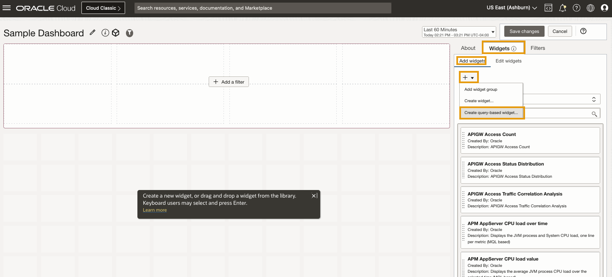
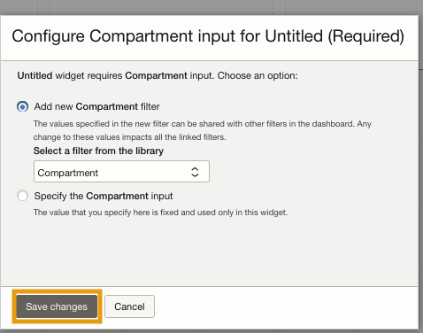
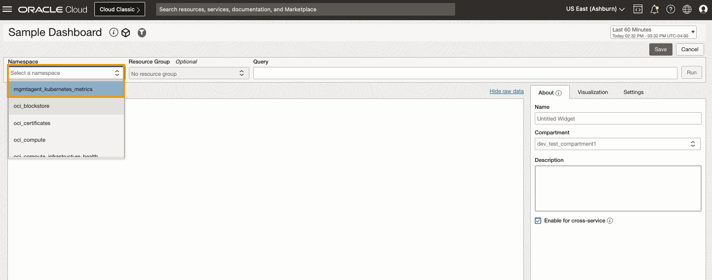
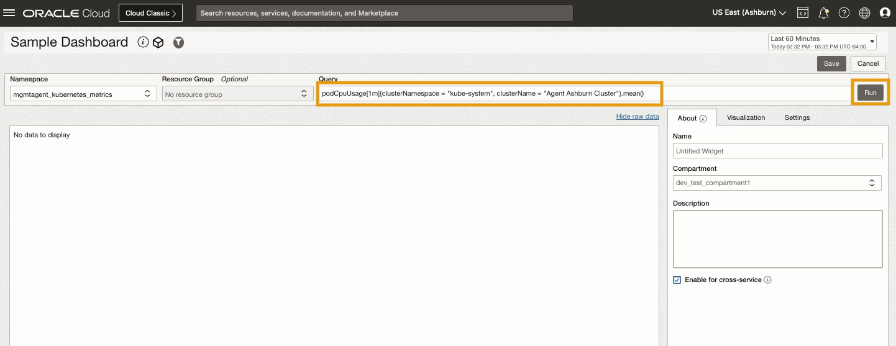
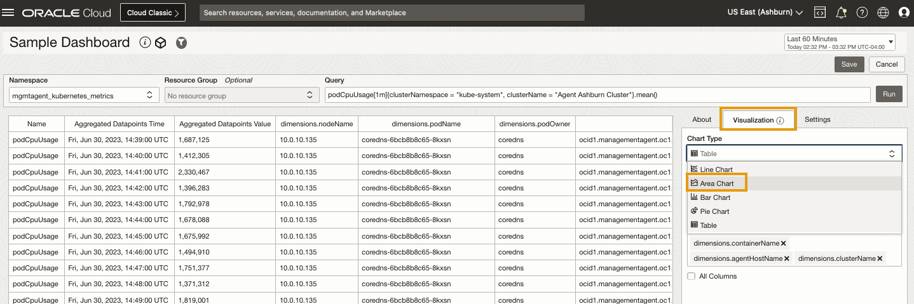
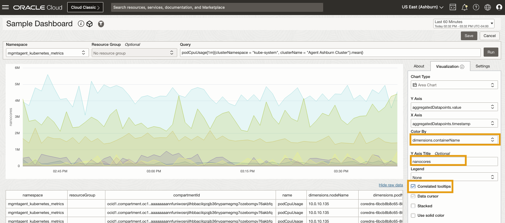
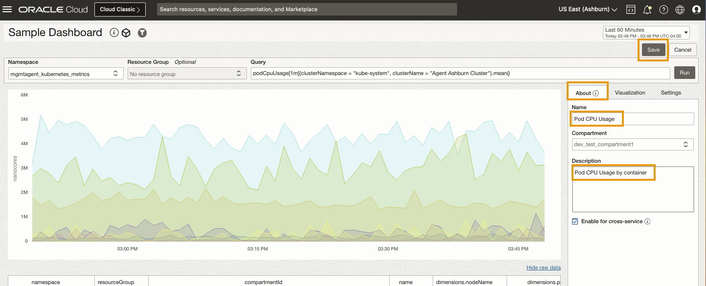
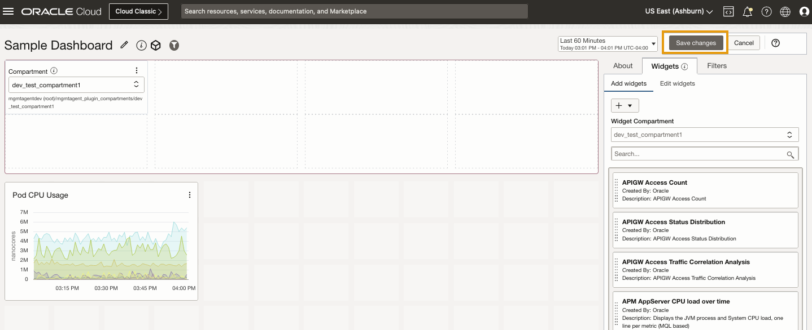

# Designing Dashboards

## Introduction

In this lab, you will be creating a metric widget to visualize metrics in the dashboard.

Watch the video below for a quick walk-through of the lab.

### Objectives

* Create a Metric Widget using an MQL Query
* Add the metric to the dashboard

Estimated Time: 10 minutes

## Task 1: Create a widget for pod resource usage metrics (query based widget)
You can create a metric widget based an an MQL Query as shown below

1. Create a Metric Widget. Click on the highlighted sections


2. Associate Compartment filter 
If this is the first metric widget you are creating then you will be prompted to add a new Compartment filter.  If you are adding another metric widget then you can reuse an existing compartment filter to associate with the metric widget you are creating.


3. Select Metric Namespace 
Select the OCI Monitoring metric namespace that contains the data for the metric widget.  For the Kubernetes Pod Metrics, the namespace is _mgmtagent_kubernetes_namespace_


4. Run Metric Query 
Add the metric query and run the query.  For Pod CPU Usage by container, you can add the following query:
    ``` 
    <copy>
    podCpuUsage[1m]{clusterNamespace = "kube-system", clusterName = "Agent Ashburn Cluster"}.mean() 
    <copy>
    ```
    **Note**: Replace "Agent Ashburn Cluster" with the name of the cluster provided to you for the Lab
    

5. Change Visualization to Area Chart 
When you run the query, you will get the metric data in tabular form.  You can change the visualization to area chart as shown below:


6. Visualize Metric data by dimension 
Set the _Color By_ to visualize the metric data by dimension.  Select the _containerName_ dimension as shown below.
Also set the title for the y-axis to _nanocores_.  Kubernetes reports POD usage in terms of nano cores.


7. Set the name for the metric widget and save it 
Assign a name to the metric widget as shown here and save it.


8. Save the dashboard 
Save the dashboard to associate the new metric widget with your dashboard.  You are done!



**Congratulations!** In this lab, you have successfuly completed the following tasks:

* Create a Metric Widget using an MQL Query
* Add the metric to the dashboard

You may now **proceed to the next lab**.

## Acknowledgements
* **Author** - Madhavan Arnisethangaraj, OCI Management Agent
* **Contributors** -  Madhavan Arnisethangaraj, Nirav Gandhi, OCI Management Agent
* **Last Updated By/Date** - Madhavan Arnisethangaraj, August, 2023
