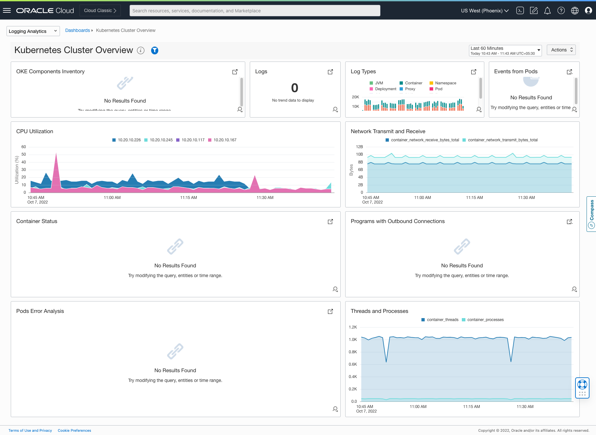
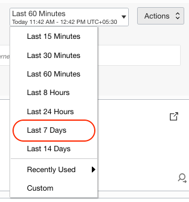
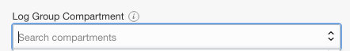
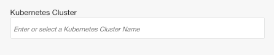
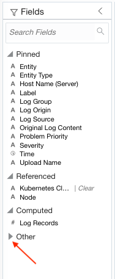

# Log Exploration using Logging Analytics Dashboard.

## Introduction

This lab will walk you through the steps to visualize the log from the OKE Cluster.

Estimated Time: 30 minutes

### About <Product/Technology> 
In this lab we will be exploring
* Dashboards - 
* Widgets - 

### Objectives

In this lab, you will:
* Visualize the data from the OKE Cluster through Dashboards and Widgets.

### Prerequisites

* **Ingestion Flow Setup** and **Custom Log Collection** lab should be completed

## Task 1: Visualization with Dashboards and Widgets

1. From Navigation Menu  > **Observability & Management** > **Logging Analytics** > **Dashboards**

2. A Dashboard page will be displayed. This page will list the pre-created Dashboards.

3. Click on the **Kubernetes Cluster Overview** Dashboard from the table.

4. **Kubernetes Cluster Overview** page will be displayed.
    

5. Click on the Filter Panel button shown as below.
    

6. Select the time range as **Last 7 Days** from the Time Range Picker.
    

7. Key in the **Compartment** value obtained from the Terraform Values Frame in the Log Group Compartment textbox. The compartment value will be in the format **LL-12345** .
    
    
8. Key in the **Kubernetes Cluster Name** value obtained from the Terraform Values Frame.
    

9. You should be able to see the all the widgets displaying the data specific to your OKE Cluster.
     

## Task 2: Overview of Widgets

1. **Logs**
    - This widget displays all the total number of logs ingested from the selected OKE Cluster in the specified time range.
    - OCI Logging Analytics can collect and manage terabytes of data at a given point in time.
       
    - Click on the View Query Icon to view the query used to populate the data in widget.   
        
    - The query used to populate the data will be displayed.
          

2. **Namespaces**
    This widget displays total number of namespaces present in the selected OKE Cluster.
        

3. **Log Types**

    - This widget displays different log types from the cluster.

    - We collect 20+ types of logs from the cluster, and this covers all the tiers of the cluster such as Node, Pods, Container etc.

    - All the tiers of the cluster are shown in the chart legends. 
          

    - Click on the each legend to view the trends of the corresponding log.

4. **Cluster Components**
    - This widget displays the different components of the cluster such as Cluster Name, number of Nodes and number of Pods.
        

5. **Events From Pods**
    - This widget displays the events from all the pods of the selected cluster  
        

6. **Connections Trend**  
    - This widget displays the newtwork connection trends in the selected OKE Cluster.
    - Hover over any point to view the newtwork connections in the cluster, the chart will be displayed.
        
    - The chart aggregates and groups the connections based on the direction (inbound or outbound), IPs involved and the number of connections.          

## Task 3: Deep Dive into Log Types Widget

1.  Click on the Punch Out Icon on the Log Types widget.
      

    This will take to the "Tile view" of Log Explorer in context of **Kubernetes Cluster Name** .
    

2. Select the visualization "Records with Histogram".
    

3. In the Fields panel, click on the Other icon
       

**Congratulations!**, this lab ends here, kindly proceed  to next lab.
## Acknowledgements
* **Author** - Vikram Reddy , OCI Logging Analytics
* **Contributors** -  Vikram Reddy, Santhosh Kumar Vuda , OCI Logging Analytics, Madhavan Arnisethangaraj, OCI Management Agent
* **Last Updated By/Date** - Vikram Reddy, Sep, 2022
