# Log Exploration using Logging Analytics Dashboard.

## Introduction

This lab will walk you through the steps to visualize the log from the OKE Cluster.

### About
In this lab we will be exploring
* Dashboards - 
* Widgets - 


### Objectives

In this lab, you will:
* Visualize the data from the OKE Cluster through Dashboards and Widgets.

### Prerequisites

* **Ingestion Flow Setup** and **Custom Log Collection** labs should be completed

Estimated Time: 30 minutes

## Task 1: Visualization with Dashboards and Widgets

1. Copy-paste the following link in your browser's address bar to navigate to the Dashboard. **Kubernetes Cluster Overview** page will be displayed.
    
      ```
        <copy>
          https://cloud.oracle.com/loganalytics/dashboards?id=ocid1.managementdashboard.oc1..aaaaaaaaad24nv2zeottsuszcmklnoegmh3kqeelnvja6tp7gso4rmo6ze5a
        </copy>
      ```
  // Screenshot to be updated once finalized.

  >**Note:** The logs ingested from your **Kubernetes Cluster** as part of [Lab 2](?lab=ingestion) and [Lab 3](?lab=custom-log-collection) will exists in your **Log Group Compartment**. Thus all the widgets will be empty till we set these fields, which will be performed in the next steps.  

2. Click on the **Scope Filter** panel
    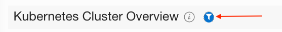
    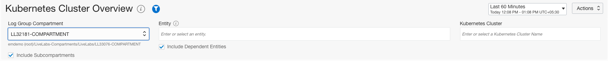

3. Key in the **Compartment** value in the **Log Group Compartment** field and **Kubernetes Cluster Name** value in the **Kubernetes Cluster** field.
    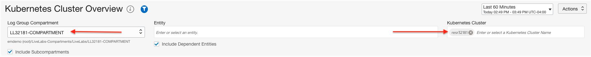

   > **Note:** Refer to the **Compartment** field in [Lab2 Task1](?lab=ingestion#Task1:GatheringRequiredInformation) for **Log Group Compartment** value.
    
4. You should be able to see the all the widgets displaying the data specific to your OKE Cluster.
     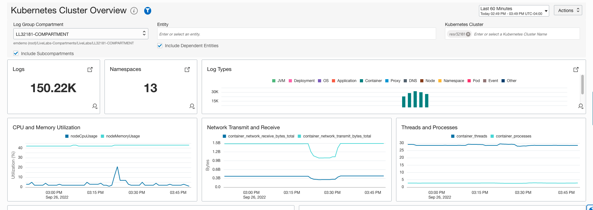

## Task 2: Overview of Widgets

1. **Logs**
    - This widget displays all the total number of logs ingested from the selected OKE Cluster in the specified time range.
    - OCI Logging Analytics can collect and manage millions of records.
      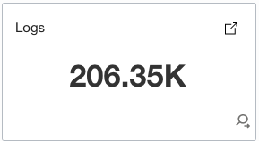 
    - Click on the View Query Icon to view the query used to populate the data in widget.   
      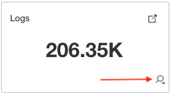  
    - The query used to populate the data will be displayed.
      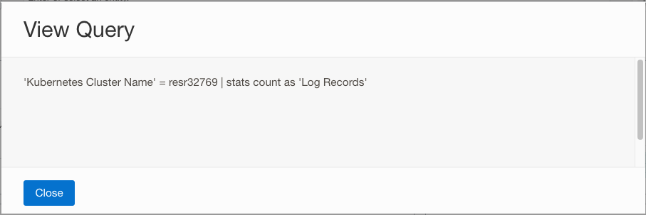 
    - Click on the **Close** button.  
    - The detailed explaination of this widget is discussed in [Task 3](#Task3:DeepDiveintoLogsWidget). 

2. **Namespaces**
    This widget displays total number of namespaces present in the selected OKE Cluster.
      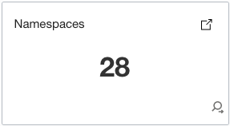  

3. **Log Types**

    - This widget displays different log types from the cluster.

    - We collect 20+ types of logs from the cluster, and this covers all the tiers of the cluster such as Node, Pods, Container etc.

    - All the tiers of the cluster are shown in the chart legends. 
      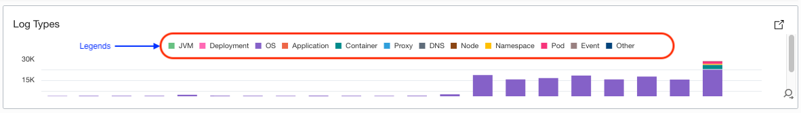    

    - Click on the each legend to view the trends of the corresponding log.

4. **CPU and Memory Utilization**, **Network Transmit and Receive** & **Threads and Processes**
    - These widgets show the metrics data from OCI Monitoring.
      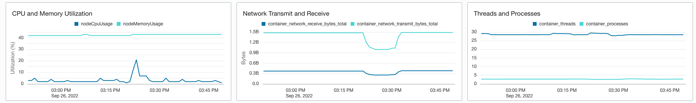
    - Refer to Lab #5 for the steps about how to build Metric widgets.

5. **Cluster Components**
    - This widget displays the summary of components for your Kubernetes cluster. You can click on each link to get details for that component. 
      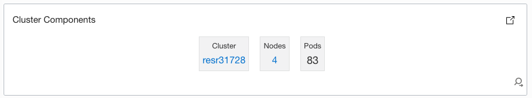  

    -  Click on **Cluster** link. This would open a new tab with the cluster details page. On this page you can view the details of your cluster.
      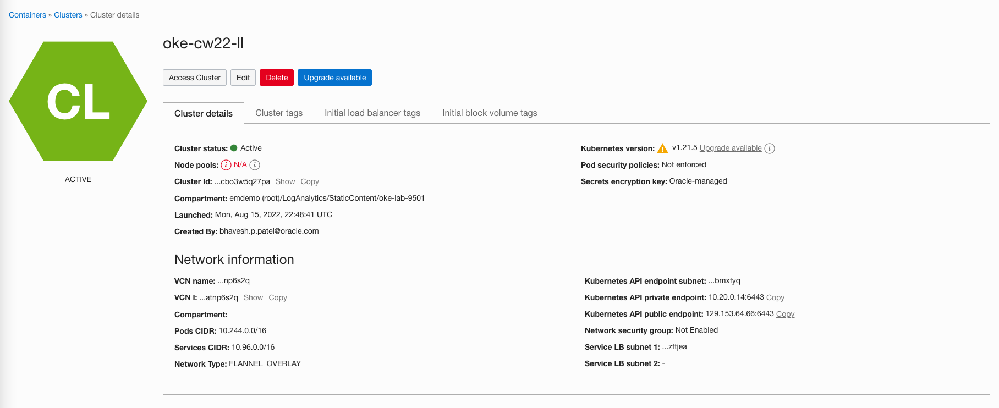  

      >**Note:** The cluster name you see in this page can be different from the one you had in the dashboard page. This is because we are using a single physical cluster in the backend for the purposes of this workshop.

    - Switch back to the Dashboard tab and click on the number of **Nodes** link. This would open a new tab with the node details page..   
      // Clicking on Node is navigating to Log Explorer
      // Clicking on Node Pools shows authorization error.

6. **Events From Pods**
    - This widget displays the events from all the pods of the selected cluster  
      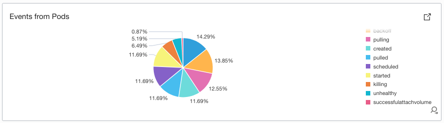  

7. **Connections Trend**  
    - This widget displays the network connection trends in the selected OKE Cluster.
    - Hover over any point to view the network connections in the cluster, the chart will be displayed.
      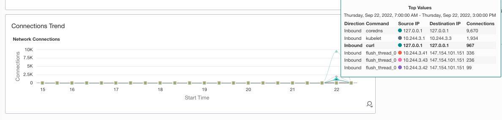  
    - The chart aggregates and groups the connections based on the direction (inbound or outbound), IPs involved and the number of connections.          
    // direction - outbound only or (inbound or outbound).

## Task 3: Deep Dive into Logs Widget


1.  Click on the Punch Out Icon on the Logs widget.
    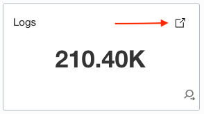  

    This will take you to the "Tile view" of Log Explorer in context of **Kubernetes Cluster Name** .
    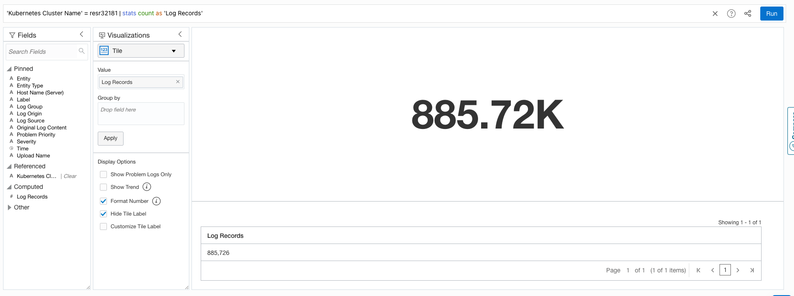

2. Select the visualization "Records with Histogram". This will take you to the "Records with Histogram view" in context of **Kubernetes Cluster Name**.
   The bar chart  shows the trends of the logs.
    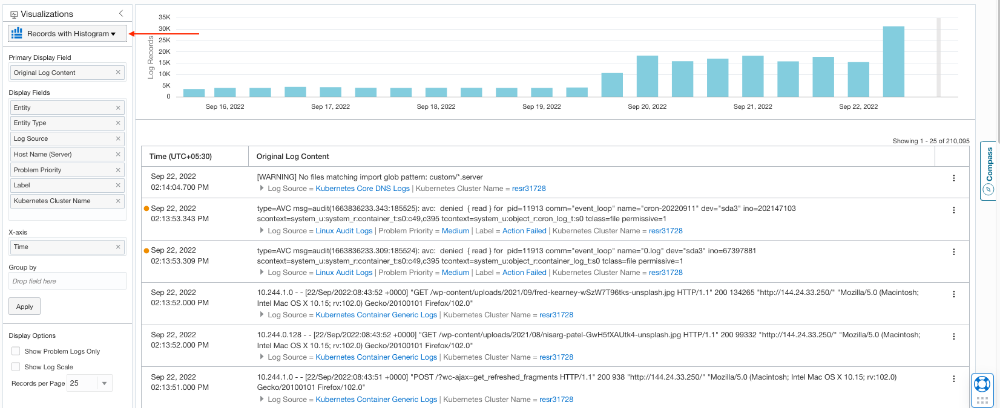


3. Click on the Other icon in the Fields Panel to view all the other fields automatically parsed from the cluster logs. 
    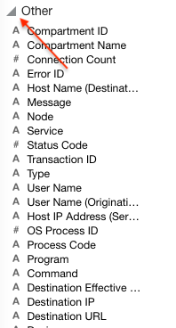
   
4. In the Fields panel, in the _Search Fields_ textbox, search for the field **Node**.
    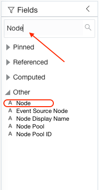   

5. Drag and Drop the **Node** field in the **Group by** textbox under **Visualization Panel** and click **Apply**.
    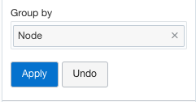  
   The results will be grouped by Node.
    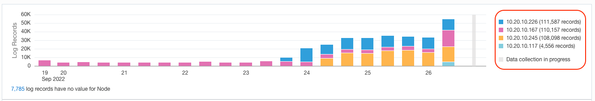  

6. Select the "Pie Chart" visualization.  
    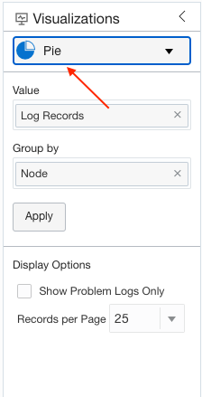
   The query carries over the group by automatically and the data in step #4 will be represented in the "Pie Chart" view. 
    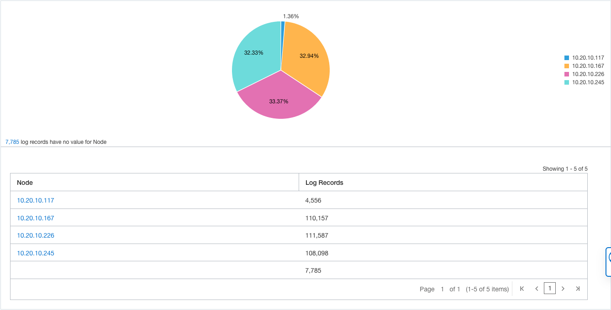

7. Select the "Tree Map" visualization.  
    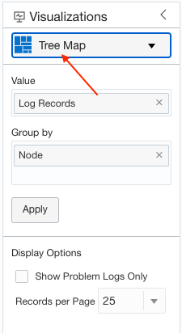
   
   In the Fields panel, in the _Search Fields_ textbox, search for the field **Pod**.
     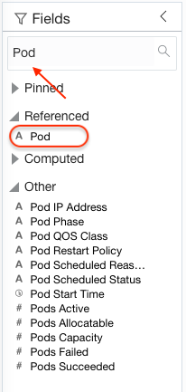
   
   Drag and Drop the **Pod** field in the **Group by** textbox under **Visualization Panel** and click **Apply**.
     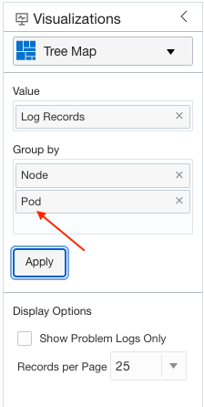

   The results will be grouped by Node and Pod.
    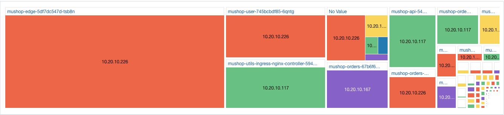


**Congratulations!**, you have successfully visualized the data from the OKE Cluster through Dashboard and Widgets. Kindly proceed  to next lab.
## Acknowledgements
* **Author** - Vikram Reddy , OCI Logging Analytics
* **Contributors** - Sreeji Das,  Santhosh Kumar Vuda, Vikram Reddy , OCI Logging Analytics
* **Last Updated By/Date** - Vikram Reddy, Sep, 2022
