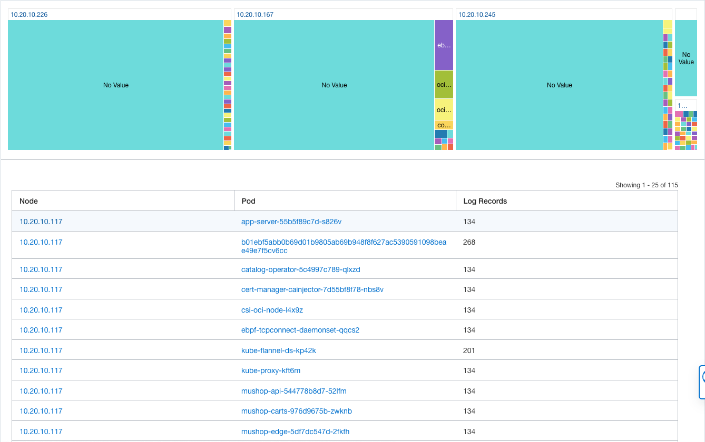

# Log Exploration using Logging Analytics Dashboard.

## Introduction

This lab will walk you through the steps to visualize the log from the OKE Cluster.

### About
In this lab we will be exploring
* Dashboards - 
* Widgets - 

### Objectives

In this lab, you will:
* Visualize the data from the OKE Cluster through Dashboards and Widgets.

### Prerequisites

* **Ingestion Flow Setup** and **Custom Log Collection** lab should be completed

Estimated Time: 30 minutes

## Task 1: Visualization with Dashboards and Widgets
// To Be Replaced with the Direct URL for Kubernetes Cluster Overview.

1. From Navigation Menu  > **Observability & Management** > **Logging Analytics** > **Dashboards**

2. A Dashboard page will be displayed. This page will list the pre-created Dashboards.

3. Click on the **Kubernetes Cluster Overview** Dashboard from the table.

4. **Kubernetes Cluster Overview** page will be displayed.
    

5. Select the time range as **Last 7 Days** from the Time Range Picker.
        

6. Click on the Filter Panel button.
    

7. Key in the **Compartment** value obtained from the Terraform Values Frame in the Log Group Compartment textbox. The compartment value will be in the format **LL-12345** .
    
    
8. Key in the **Kubernetes Cluster Name** value obtained from the Terraform Values Frame.
    

9. You should be able to see the all the widgets displaying the data specific to your OKE Cluster.
     

## Task 2: Overview of Widgets

1. **Logs**
    - This widget displays all the total number of logs ingested from the selected OKE Cluster in the specified time range.
    - OCI Logging Analytics can collect and manage millions of records.
       
    - Click on the View Query Icon to view the query used to populate the data in widget.   
        
    - The query used to populate the data will be displayed.
       
    - The detailed explaination of this widget is discussed in Task #3.     

2. **Namespaces**
    This widget displays total number of namespaces present in the selected OKE Cluster.
        

3. **Log Types**

    - This widget displays different log types from the cluster.

    - We collect 20+ types of logs from the cluster, and this covers all the tiers of the cluster such as Node, Pods, Container etc.

    - All the tiers of the cluster are shown in the chart legends. 
          

    - Click on the each legend to view the trends of the corresponding log.

4. **Cluster Components**
    - This widget displays the different components of the cluster such as Cluster Name, number of Nodes and number of Pods.
        

5. **Events From Pods**
    - This widget displays the events from all the pods of the selected cluster  
        

6. **Connections Trend**  
    - This widget displays the newtwork connection trends in the selected OKE Cluster.
    - Hover over any point to view the newtwork connections in the cluster, the chart will be displayed.
        
    - The chart aggregates and groups the connections based on the direction (inbound or outbound), IPs involved and the number of connections.          

  // To Be Updated after the discussion - CPU and Memory Utilization, Network Transmit and Receive and Threads and Processes

## Task 3: Deep Dive into Logs Widget

1.  Click on the Punch Out Icon on the Logs widget.
      

    This will take you to the "Tile view" of Log Explorer in context of **Kubernetes Cluster Name** .
    

2. Select the visualization "Records with Histogram". This will take you to the "Records with Histogram view" in context of **Kubernetes Cluster Name**.
   The bar chart  shows the trends of the logs.
    

3. Click on the Other icon in the Fields Panel to view all the other fields automatically parsed from the cluster logs. 
    
   
4. In the Fields panel, in the _Search Fields_ textbox, search for the field **Node**.
       

5. Drag and Drop the **Node** field in the **Group by** textbox under **Visualization Panel** and click **Apply**.
      
   The results will be grouped by Node.
      

6. Select the "Pie Chart" visualization.  
    
   The query carries over the group by automatically and the data in step #4 will be represented in the "Pie Chart" view. 
    

7. Select the "Tree Map" visualization.  
    
   
   In the Fields panel, in the _Search Fields_ textbox, search for the field **Pod**.
     
   
   Drag and Drop the **Pod** field in the **Group by** textbox under **Visualization Panel** and click **Apply**.
     

   The results will be grouped by Node and Pod.
   // Screenshot To Be Updated once the fix is available.
    

**Congratulations!**, you have successfully visualized the data from the OKE Cluster through Dashboard and Widgets. Kindly proceed  to next lab.
## Acknowledgements
* **Author** - Vikram Reddy , OCI Logging Analytics
* **Contributors** -  Vikram Reddy, Santhosh Kumar Vuda , OCI Logging Analytics, Madhavan Arnisethangaraj, OCI Management Agent
* **Last Updated By/Date** - Vikram Reddy, Sep, 2022
