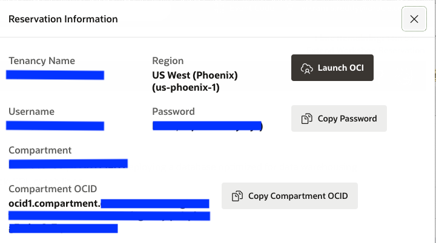
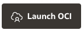
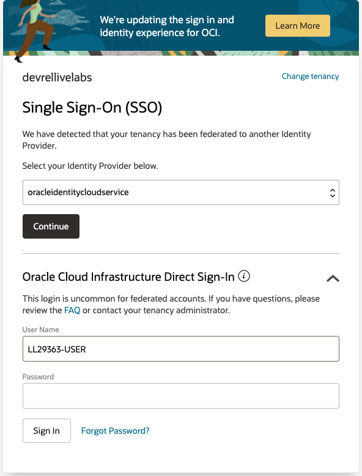
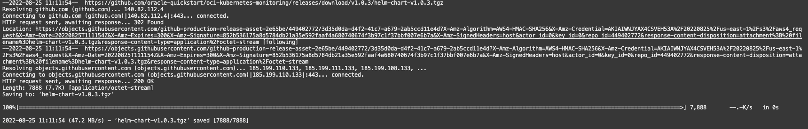

# OKE Monitoring with Logging Analytics

## Introduction

This lab will walk you through the steps to configure open source log collector fluentd to collect OKE System and Service log using package manager Helm.

Estimated Time: 40 minutes

### About <Product/Technology> 
In this lab we will be using following tools:
* fluentd - open source data collector
* helm - package manager for Kubernetes
* kubectl - kubernetes command line tool

### Objectives

In this lab, you will:
* Set up fluentd to collect system/service logs as well custom container logs
* Visualize the data in the OCI Logging Analytics Log Explorer 


### Prerequisites

* Basic Understanding of Kubernetes

## Task 1: Launching Cloud Shell

1. On the home page of this Live Lab, click on the **View Login Info** link
  
  

2. Reservation Information will be displayed. Keep the below fields handy.
  - Kubernetes Cluster Id
  - Kubernetes Cluster Name
  - Kubernetes Namespace
  - imagePullSecrets
  - url
  - ociLANamespace
  - ociLALogGroupID

  


3. Click on the Launch OCI button   


4. A Single Sign On Page will be displayed.
  


5. Key In the password copied in the step 2 and click on Sign In button.


6. Change Password Page will be displayed. Fill in the required details and click on Save New Password.
  


7. Oracle Cloud Home Page will be displayed.   

8. Click the **Cloud Shell**    button. 

	

9. A Cloud Shell Instance will be created and text area will be displayed as below. 

  


## Task 2: Setting Up Kube Config In Cloud Shell

1. To Set up kubeconfig for the OKE Cluster replace the Cluster ID value in the below command.
    ```
     <copy>
       oci ce cluster create-kubeconfig --cluster-id <CLUSTER_ID> --file $HOME/.kube/config --region us-phoenix-1 --token-version 2.0.0  --kube-endpoint PUBLIC_ENDPOINT
     </copy>

    ```

2. If the Cluster Id `ocid1.cluster.oc1.phx.abcxyzxxxxxxxxxxxxx` then the command will look like below.
     
     ```
     <copy>
        oci ce cluster create-kubeconfig --cluster-id ocid1.cluster.oc1.phx.abcxyzxxxxxxxxxxxxx --file $HOME/.kube/config --region us-phoenix-1 --token-version 2.0.0  --kube-endpoint PUBLIC_ENDPOINT
     </copy>

     ```

3. Copy the modified command in the step II and paste it in the Cloud Shell and hit Enter. A new config file will be created.

    ```
     oci ce cluster create-kubeconfig --cluster-id ocid1.cluster.oc1.phx.abcxyzxxxxxxxxxxxxx --file $HOME/.kube/config --region us-phoenix-1 --token-version 2.0.0  --kube-endpoint PUBLIC_ENDPOINT
    
New config written to the Kubeconfig file /home/livelab/.kube/config
    ```

## Task 3: Accessing OKE Cluster In Cloud Shell
1. Run the following command to verify if the kubeconfig is configured properly and you can access the OKE Cluster.

     ```
       <copy>
          kubectl get nodes
       </copy>
     ```
   
     ```
       $ kubectl get nodes
       NAME          STATUS   ROLES   AGE   VERSION
       10.0.10.116   Ready    node    91d   v1.21.5
       10.0.10.136   Ready    node    77d   v1.21.5
       10.0.10.146   Ready    node    77d   v1.21.5
     ```
  > **Note:** Node ip's will differ for every cluster.

## Task 4: Download Helm Charts from GitHub
1. In the present working directory create the directory oke-livelab and navigate into it. 
  > **Note:** You can use the command - `mkdir oke-livelab && cd $_`

2. Download the helm chart configuration tar from the [github] (https://github.com/oracle-quickstart/oci-kubernetes-monitoring/releases/tag/v1.0.3) using the following command.
    ```
    <copy>
       wget https://github.com/oracle-quickstart/oci-kubernetes-monitoring/releases/download/v1.0.3/helm-chart-v1.0.3.tgz 
    </copy>
    ```  
3. The content will be downloaded.
    

4. Unpack the tar file by using the below command.
    ```
        <copy>
          tar zxvf helm-chart-v1.0.3.tgz
        </copy>
    ```
 5. Validate helm-chart directory and its contents are extracted.   
    

## Task 5: Create Custom values yaml file
1. In the **oke-livelab** directory created in the above task, create a directory external-values , using following command.
      ```
        <copy>
          mkdir external-values
        </copy>
      ```


2. Create a file values.yaml in the external-values directory using following command.
      ```
        <copy>
          touch values.yaml
        </copy>
      ```
3. In the values.yaml file created above, paste the following content and update the values of the respective fields.
      ```
      <copy>
      namespace: <Kubernetes Namespace Shown In Reservation Information>
      image:  
        imagePullSecrets: <image-pull-secret>
        url: <docker-image-pull-url>
   
      # Logging Analytics Namespace
      ociLANamespace: <LA Namespace Shown In Reservation Information>
      # Logging Analytics Default Log Group ID
      ociLALogGroupID: <LA Log Group Id Shown In Reservation Information>
      # Kubernetes Cluster ID
      kubernetesClusterID: <Kubernetes Cluster Id Shown In Reservation Information>
      # Kubernetes Cluster NAME  
      kubernetesClusterName: <Kubernetes Cluster Name Shown In Reservation Information>

      </copy>
      ```
## Task 6: Verifying Helm Configuration
1. Once the values.yaml is updated, it is important to perform the dry-run to validate the configuration is correct. To perform this check, 
  run the following command.
      ```
        <copy>
          helm template --values ~/oke-livelab/external-values/values.yaml ~/oke-livelab/helm-chart/
        </copy>
      ```
 2. Validate the above command return  no errors or failures.     
 
## Task 7: Install Helm Chart
1. Once the dry-run is completed without any errors. Install the helm-chart to apply the configuration for log-collection.
      ```
        <copy>
         helm install <release-name-of-choice> --values ~/oke-livelab/external-values/values.yaml ~/oke-livelab/helm-chart/
        </copy>
      ```
  > **Note:** Provide the release-name-of-choice and keep it handy.

2. To verify the pods are created in the OKE, execute the following command and check the output. Keep the pod names handy for next steps.

    ```
      <copy>
      kubectl get pods --namespace=Live-Lab-Generated-Kubernetes-Namespace |grep fluentd
      </copy>
    ```
    
   > **Note:** Provide the correct kubernetes namespace. 


## Task 8: Verify All Resources Are Created
  As part of this deployment following resources are created - 
  - daemonset
  - deployment
  - configMap
  
1. Daemonset
    - A DaemonSet ensures that all (or some) Nodes run a copy of a Pod. In this case we are running logs collection daemon on each node. 
    - We have used Daemonset to collect the Kubernetes System Logs.  
    - To validate the fluentd daemonset is running, execute the command - 
      ```
        <copy>
          kubectl get daemonset oci-la-fluentd-daemonset --namespace=Live-Lab-Generated-Kubernetes-Namespace
        </copy>
      ```  
    - Output will be in-line with the below snapshot.    
    
  

2. Deployment 
    - A Kubernetes deployment is a resource object in Kubernetes that provides declarative updates to applications.
    - We have used deployment to collect the Kubernetes Object Logs
    - To validate the fluentd deployment is running, execute the command -
      ```
        <copy>
          kubectl get deployments oci-la-fluentd-deployment --namespace=Live-Lab-Generated-Kubernetes-Namespace
        </copy>
      ```  
    - Output will be in-line with the below snapshot.  
    

3. ConfigMap
    - A ConfigMap is an API object used to store non-confidential data in key-value pairs.


4. To verify fluentd is up and running
    - For Kubernetes System 
     ```
     <copy>
        kubectl logs <fluentd-daemonset-pod-name-from-task-7.2> --namespace=Kubernetes-Namespace-In-Reservation-Information |grep 'fluentd worker'
     </copy>
     ```
     - You should see the below message
     ```
        2022-08-18 10:34:31 +0000 [info]: #0 starting fluentd worker pid=14 ppid=7 worker=0
        2022-08-18 10:35:06 +0000 [info]: #0 fluentd worker is now running worker=0
     ```
     - For Kubernetes Objects
     ```
     <copy>
        kubectl logs <fluentd-deployment-pod-name-from-task-7.2> --namespace=Kubernetes-Namespace-In-Reservation-Information |grep 'fluentd worker'
     </copy>
     ```
     - Output will be same as above.
     
5. Verify logs are sent to Logging Analytics 
     - To verify logs are sent to the Logging Analytics execute the following command. 
    ```
    <copy>
        command to be updated once the feature is ready
    </copy>
    ```
     - Check for the below message in the logs
     ```
     I, [2022-08-16T12:31:32.234958 #11]  INFO -- : Generating payload with 95  records for oci_la_log_group_id: ocid1.loganalyticsloggroup.oc1.abc.abcxxxxxxxxyx543xxxxxx
     I, [2022-08-16T12:31:32.402328 #11]  INFO -- : The payload has been successfully uploaded to logAnalytics -
                         oci_la_log_group_id: ocid1.loganalyticsloggroup.oc1.abc.abcxxxxxxxxyx543xxxxxx,
                         ConsumedRecords: 95,
                         Date: Tue, 16 Aug 2022 12:31:32 GMT,
                         Time: 2022-08-16T12:31:32.000Z,
                         opc-request-id: D61380FCECC84BD8A84349A766CF59FE/DD09F19E0CDBCDFCC5A4741CB178C3DF/897B96A83E503277C0B2287E2D4B2221,
                         opc-object-id: c9959334-65ef-403f-9224-7e7c28e44587
     ```
   
## Task 9: Validate in the Log Explorer

1. From Navigation Menu  > **Observability & Management** > **Logging Analytics** > **Home**

2. From the Logging Analytics Home Page, select Log Explorer from the drop down menu.
    

3. By default, the Log Explorer will show the Pie-Chart view of all the logs received from the OKE. 
    

4. Drill Down to any log source for e.g Kubernetes Kubelet Logs
     

5. The view would be like below.
     

6. Click on the expand field button, all the captured fields are displayed.
        

## Learn More

* [Kubernetes Documentation](https://kubernetes.io/docs/home/)

## Acknowledgements
* **Author** - Vikram Reddy , OCI Logging Analytics
* **Contributors** -  Vikram Reddy, Santhosh Kumar Vuda , OCI Logging Analytics
* **Last Updated By/Date** - Vikram Reddy, Aug, 2022


