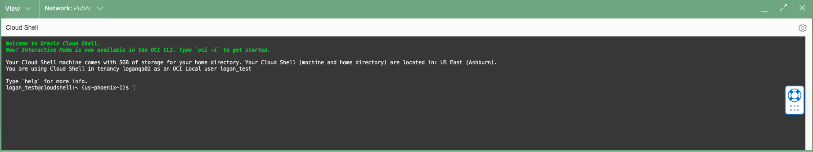
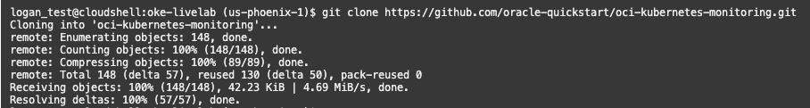
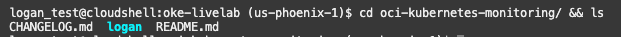
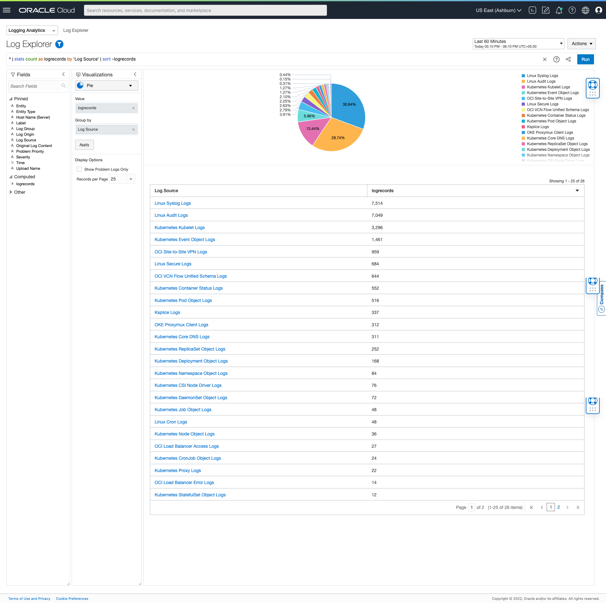

# OKE Monitoring with Logging Analytics

## Introduction

This lab will walk you through the steps to configure open source log collector fluentd to collect OKE System and Service log using package manager Helm.

Estimated Time: 30 minutes

### About <Product/Technology> 
In this lab we will be using following tools:
* fluentd - open source data collector
* helm - package manager for Kubernetes

### Objectives

In this lab, you will:
* Set up fluentd to collect system/service logs as well custom container logs
* Visualize the data in the OCI Logging Analytics Log Explorer 


### Prerequisites

This lab assumes you have following details handy that were displayed upon the succesful completion of setup:
* Kubernetes Namespace 
* LA Namespace
* Log Group 
* Cluster ID
* Cluster Name

## Task 1: Launching Cloud Shell

1. Click the **Cloud Shell**    button. 

	

	> **Note:** Use this format for notes, hints, tips. Only use one "Note" at a time in a step.


2. A Cloud Shell Instance will be created and text area will be displayed as below. 

  


## Task 2: Setting Up Kube Config In Cloud Shell

1. To Set up kubeconfig for the OKE Cluster replace the Cluster ID value in the below command.
    ```
     <copy>
    $ oci ce cluster create-kubeconfig --cluster-id <CLUSTER_ID> --file $HOME/.kube/config --region us-phoenix-1 --token-version 2.0.0  --kube-endpoint PUBLIC_ENDPOINT
     </copy>

    ```

2. If the Cluster Id `ocid1.cluster.oc1.phx.abcxyzxxxxxxxxxxxxx` then the command will look like below.
     
     ```
     <copy>
       $ oci ce cluster create-kubeconfig --cluster-id ocid1.cluster.oc1.phx.abcxyzxxxxxxxxxxxxx --file $HOME/.kube/config --region us-phoenix-1 --token-version 2.0.0  --kube-endpoint PUBLIC_ENDPOINT
     </copy>

     ```

3. Copy the modified command in the step II and paste it in the Cloud Shell and hit Enter. A new config file will be created.

    ```
    logan_test@cloudshell:~ (us-phoenix-1)$ oci ce cluster create-kubeconfig --cluster-id ocid1.cluster.oc1.phx.abcxyzxxxxxxxxxxxxx --file $HOME/.kube/config --region us-phoenix-1 --token-version 2.0.0  --kube-endpoint PUBLIC_ENDPOINT
    
    New config written to the Kubeconfig file /home/logan_test/.kube/config
    ```

## Task 3: Accessing OKE Cluster In Cloud Shell
1. To verify whether the kubeconfig is correctly set up and you are able to access the OKE Cluster run the command **kubectl get nodes**.
   
     ```
      logan_test@cloudshell:~ (us-phoenix-1)$ kubectl get nodes
       NAME          STATUS   ROLES   AGE   VERSION
       10.0.10.116   Ready    node    91d   v1.21.5
       10.0.10.136   Ready    node    77d   v1.21.5
       10.0.10.146   Ready    node    77d   v1.21.5
     ```
  > **Note:** Node ip's will differ for every cluster.

## Task 4: Download Helm Charts from GitHub
1. In the present working directory create the directory oke-livelab and navigate into it. 
  > **Note:** You can use the command - `mkdir oke-livelab && cd $_`

2. Download the helm chart configuration from the [github] (https://github.com/oracle-quickstart/oci-kubernetes-monitoring) using the following command.
    ```
    <copy>
    git clone https://github.com/oracle-quickstart/oci-kubernetes-monitoring.git
    </copy>
    ```  
3. The content will be downloaded.
    

4. Check the `oci-kubernetes-monitoring` is cloned and validate it has logan directory by running the command **cd oci-kubernetes-monitoring/ && ls**.
     

## Task 5: Create Custom values yaml file
1. In the **oke-livelab** directory created in the above task, create a directory external-values , using command **mkdir external-values**.

2. Create a file values.yaml in the external-values directory using command **touch values.yaml**

3. In the values.yaml file created above, paste the following content and update the values of the respective fields.
      ```
      <copy>
      namespace: <Kubernetes Namespace Generated Upon Clicking Green Button>
      image:  
        imagePullSecrets: <image-pull-secret>
        url: <docker-image-pull-url>
   
      # Logging Analytics Namespace
      ociLANamespace: <LA Namespace Generated Upon Clicking Green Button>
      # Logging Analytics Default Log Group ID
      ociLALogGroupID: <LA Log Group Id Generated Upon Clicking Green Button>
      # Kubernetes Cluster ID
      kubernetesClusterID: <Kubernetes Cluster Id Generated Upon Clicking Green Button>
      # Kubernetes Cluster NAME  
      kubernetesClusterName: <Kubernetes Cluster Name Generated Upon Clicking Green Button>

      </copy>
      ```
## Task 6: Verifying Helm Configuration
1. Once the values.yaml is updated, it is important to perform the dry-run to validate the configuration is correct. To perform this check, 
  run the following command.
      ```
        <copy>
          helm template --values ~/oke-livelab/external-values/values.yaml ~/oke-livelab/oci-kubernetes-monitoring/logan/helm-chart/
        </copy>
      ```
 2. Validate the above command return  no errors or failures.     
 
## Task 7: Install Helm Chart
1. Once the dry-run is completed without any errors. Install the helm-chart to apply the configuration for log-collection.
      ```
        <copy>
         helm install <release-name-of-choice> --values ~/oke-livelab/external-values/values.yaml ~/oke-livelab/oci-kubernetes-monitoring/logan/helm-chart/
        </copy>
      ```
  > **Note:** Provide the release-name-of-choice and keep it handy.

## Task 8: Verify All Resources Are Created
(To Be Updated)
1. Define deployment and add screenshot (for K8S Object Collection)
2. Define deamonset and add screenshot (for K8S Logs Collection)
3. Define configMap and add screenshot (for K8S Object and Logs)
4. Add path to output plugin logs and attach screenshot.
## Task 9: Validate in the Log Explorer
(To Be Updated)
1. Once the logs are collected, you can head over to Log Explorer to validate the data.
    
## Learn More

*(optional - include links to docs, white papers, blogs, etc)*

* [URL text 1](http://docs.oracle.com)
* [URL text 2](http://docs.oracle.com)

## Acknowledgements
* **Author** - Vikram Reddy , Logging Analytics
* **Contributors** -  Vikram Reddy, Santhosh Kumar Vuda , Logging Analytics
* **Last Updated By/Date** - Vikram Reddy, Aug, 2022


