# OKE Monitoring with Logging Analytics

## Introduction

This lab will walk you through the steps to configure an open source log collector fluentd to collect OKE System and Service log using package manager Helm.

Estimated Time: 40 minutes

### About <Product/Technology> 
In this lab we will be using the following tools:
* fluentd - open source data collector
* helm - package manager for Kubernetes
* kubectl - Kubernetes command line tool

### Objectives

In this lab, you will:
* Set up fluentd to collect system/service logs as well custom container logs
* Visualize the data in the OCI Logging Analytics Log Explorer 


### Prerequisites

* Basic Understanding of Kubernetes


## Task 1: Generating the Prerequisite Values

1. On the **Kubernetes and OKE Monitoring and Troubleshooting** home page click on the View Login Info link. 

2. A Reservation Information page will be displayed.

3. Keep the below fields handy from the Terraform Values frame of the Reservation Information page.

    i. **Kubernetes\_Cluster\_Id:** The OCID of the Kubernetes Cluster created for this live lab session

   ii. **Kubernetes\_Cluster\_Name:** The name of the Kubernetes Cluster created for this live lab session

  iii. **Kubernetes\_Namespace:** Namespace of Kubernetes in which the helm chart needs to be installed

   iv. **Kubernetes\_Service_Account:** Kubernetes service accounts are Kubernetes resources, created and managed using the Kubernetes API, meant to be used by in-cluster Kubernetes-created entities, such as Pods, to authenticate to the Kubernetes API server or external services.

    v. **Container\_Image_URL:** URL of the docker image which needs to be pulled that contains all the necessary plugins and dependencies for log collection to work seamlessly.

   vi. **Logging\_Analytics\_Namespace:** OCI Tenancy Namespace to which the collected log data to be uploaded
  
  vii. **Logging\_Analytics\_LogGroup_Id:** The OCID of the Logging Analytics Log Group where the logs must be stored.


## Task 2: Launching Cloud Shell
  
1. On Oracle Cloud Home Page click the **Cloud Shell**    button. 

  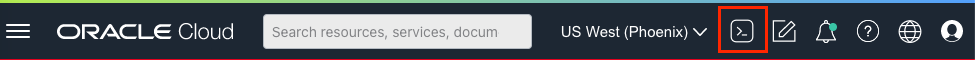

2. A Cloud Shell Instance will be created and the text area will be displayed as below. 
  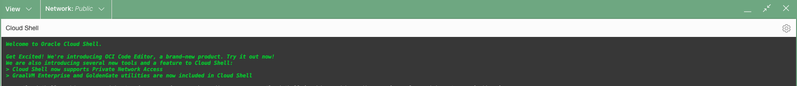

 

## Task 3: Setting Up Kube Config In Cloud Shell

1. To Set up kubeconfig for the OKE Cluster replace the Cluster ID value in the below command.
    ```
     <copy>
       oci ce cluster create-kubeconfig --cluster-id <Kubernetes_Cluster_Id> --file $HOME/.kube/config --region us-phoenix-1 --token-version 2.0.0  --kube-endpoint PUBLIC_ENDPOINT
     </copy>

    ```

2. If the Cluster Id `ocid1.cluster.oc1.phx.abcxyzxxxxxxxxxxxxx` then the command will look like below.
     
     ```
     <copy>
        oci ce cluster create-kubeconfig --cluster-id ocid1.cluster.oc1.phx.abcxyzxxxxxxxxxxxxx --file $HOME/.kube/config --region us-phoenix-1 --token-version 2.0.0  --kube-endpoint PUBLIC_ENDPOINT
     </copy>

     ```

3. Copy the modified command in step II and paste it into the Cloud Shell and hit Enter. A new config file will be created.

    ```
     oci ce cluster create-kubeconfig --cluster-id ocid1.cluster.oc1.phx.abcxyzxxxxxxxxxxxxx --file $HOME/.kube/config --region us-phoenix-1 --token-version 2.0.0  --kube-endpoint PUBLIC_ENDPOINT
    
New config written to the Kubeconfig file /home/livelab/.kube/config
    ```
## Task 4: Accessing OKE Cluster In Cloud Shell
1. Run the following command to verify if the kubeconfig is configured properly and you can access the OKE Cluster.

     ```
       <copy>
          kubectl get nodes
       </copy>
     ```
   
     ```
       $ kubectl get nodes
       NAME          STATUS   ROLES   AGE   VERSION
       10.0.10.xxx   Ready    node    91d   v1.21.5
       10.0.10.xxx   Ready    node    77d   v1.21.5
       10.0.10.xxx   Ready    node    77d   v1.21.5
     ```
  > **Note:** Node ip's will differ for every cluster.


## Task 5: Download Helm Charts from GitHub
1. In the present working directory create the directory oke-livelab and navigate into it. 
    ```
      <copy>
          mkdir oke-livelab && cd $_
      </copy>
    ```

2. Download the helm chart configuration tar from the [github] (https://github.com/oracle-quickstart/oci-kubernetes-monitoring/releases/tag/v.2.0.0) using the following command.
    ```
    <copy>
       wget https://github.com/oracle-quickstart/oci-kubernetes-monitoring/releases/download/v.2.0.0/helm-chart-v2.0.0.tgz 
    </copy>
    ```  
3. The output of the above step would be in line with the below.
    ```
    Length: 10750 (10K) [application/octet-stream]
    Saving to: ‘helm-chart-v2.0.0.tgz’
    100%[============================================================>] 10,750      --.-K/s   in 0.001s  
    2022-09-07 10:06:21 (17.0 MB/s) - ‘helm-chart-v2.0.0.tgz’ saved [10750/10750]
    ```
   

4. Unpack the tar file by using the below command.
    ```
        <copy>
          tar zxvf helm-chart-v2.0.0.tgz
        </copy>
    ```
 5. Validate the helm-chart directory and its contents are extracted.   
    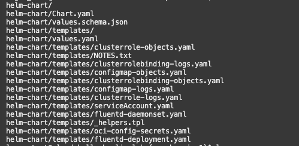

## Task 6: Create Custom values yaml file
1. In the **oke-livelab** directory created in the above task, create a directory external-values, using following command.
      ```
        <copy>
          mkdir external-values && cd $_
        </copy>
      ```


2. Create a file values.yaml in the external-values directory using the following command.
      ```
        <copy>
          touch values.yaml
        </copy>
      ```
3. In the values.yaml file created above, paste the following content and update the values of the respective fields.
      ```
      <copy>
namespace: <Value of Kubernetes_Namespace obtained from Terraform Values Frame>
image:
   url: <Value of Container_Image_URL obtained from Terraform Values Frame>
   imagePullPolicy: Always

ociLANamespace: <Value of Logging_Analytics_Namespace obtained from Terraform Values Frame>
ociLALogGroupID: <Value of Logging_Analytics_LogGroup_Id obtained from Terraform Values Frame>
kubernetesClusterID: <Value of Kubernetes_Cluster_Id obtained from Terraform Values Frame>
kubernetesClusterName:  <Value of Kubernetes_Cluster_Name obtained from Terraform Values Frame>
createServiceAccount:  false
serviceAccount: <Value of Kubernetes_Service_Account obtained from Terraform Values Frame>
fluentd:
   baseDir: /var/log/<Value of namespace specified above>
   tailPlugin:
      readFromHead:  false
      </copy>
      ```
 4. The above **values.yaml** contains the basic values that need to be changed for log collection to work. The detailed **values.yaml** could be found using the below command.

      ```
        <copy>
          cat ~/oke-livelab/helm-chart/values.yaml
        </copy>
      ```


## Task 7: Verifying Helm Configuration
1. Once the values.yaml is updated, it is important to perform the dry run to validate the configuration is correct. To perform this check, 
  run the following command.
      ```
        <copy>
          helm template --values ~/oke-livelab/external-values/values.yaml ~/oke-livelab/helm-chart/
        </copy>
      ```
 2. Validate that the above command returns no errors or failures.     
 
## Task 8: Install Helm Chart
1. Once the dry-run is completed without any errors. Install the helm-chart to apply the configuration for log collection.
      ```
        <copy>
         helm install <release-name-of-choice> --values ~/oke-livelab/external-values/values.yaml ~/oke-livelab/helm-chart/ -n=<Value of Kubernetes_Namespace  obtained from Terraform Values Frame>
        </copy>
      ```
  > **Note:** Provide the release-name-of-choice and keep it handy.

2. To verify the pods are created in the OKE, execute the following command and check the output. Keep the pod names handy for the next steps.

    ```
      <copy>
      kubectl get pods -n=<Value of Kubernetes_Namespace  obtained from Terraform Values Frame> |grep fluentd
      </copy>
    ```
    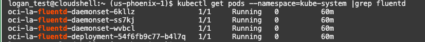
   > **Note:** Provide the correct kubernetes namespace. 


## Task 9: Verify All Resources Are Created
  As part of this deployment following resources are created - 
  - daemonset
  - deployment
  - configMap
  
1. Daemonset
    - A DaemonSet ensures that all (or some) Nodes run a copy of a Pod. In this case we are running logs collection daemon on each node. 
    - We have used Daemonset to collect the Kubernetes System Logs.  
    - To validate the fluentd daemonset is running, execute the command - 
      ```
        <copy>
          kubectl get daemonset oci-la-fluentd-daemonset -n=<Value of Kubernetes_Namespace  obtained from Terraform Values Frame>
        </copy>
      ```  
    - Output will be in-line with the below snapshot.    
    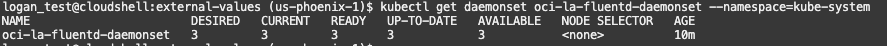
  

2. Deployment 
    - A Kubernetes deployment is a resource object in Kubernetes that provides declarative updates to applications.
    - We have used deployment to collect the Kubernetes Object Logs
    - To validate the fluentd deployment is running, execute the command -
      ```
        <copy>
          kubectl get deployments oci-la-fluentd-deployment --n=<Value of Kubernetes_Namespace  obtained from Terraform Values Frame>
        </copy>
      ```  
    - Output will be in-line with the below snapshot.  
    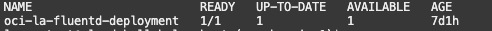

3. ConfigMap
    - A ConfigMap contains the fluentd configuration for Kubernetes System Logs and Kubernetes Objects Logs


4. To verify fluentd is up and running
    - For Kubernetes System 
     ```
     <copy>
        kubectl logs <fluentd-daemonset-pod-name-from-task-7.2> -n=<Value of Kubernetes_Namespace  obtained from Terraform Values Frame> |grep 'fluentd worker'
     </copy>
     ```
     - You should see the below message
     ```
        2022-08-18 10:34:31 +0000 [info]: #0 starting fluentd worker pid=14 ppid=7 worker=0
        2022-08-18 10:35:06 +0000 [info]: #0 fluentd worker is now running worker=0
     ```
     - For Kubernetes Objects
     ```
     <copy>
        kubectl logs <fluentd-deployment-pod-name-from-task-7.2> -n=<Value of Kubernetes_Namespace  obtained from Terraform Values Frame> |grep 'fluentd worker'
     </copy>
     ```
     - Output will be the same as above.
     
5. (Optional) Verify logs are sent to Logging Analytics 
     - To verify logs are sent to the Logging Analytics, first execute the following command. 
    ```
    <copy>
        kubectl exec -n=<Value of Kubernetes_Namespace  obtained from Terraform Values Frame> --stdin --tty <fluentd-daemonset-pod-name-from-task-7.2>   -- /bin/bash
    </copy>
    ```
    
    - The above command will open a bash shell.
    
    - Run the following command to check the output plugin logs.
      ```
        tail -f /var/log/oci-logging-analytics.log
      ``` 
    
     - Check for a similar message in the logs
     ```
     I, [2022-08-16T12:31:32.234958 #11]  INFO -- : Generating payload with 95  records for oci_la_log_group_id: ocid1.loganalyticsloggroup.oc1.abc.abcxxxxxxxxyx543xxxxxx
     I, [2022-08-16T12:31:32.402328 #11]  INFO -- : The payload has been successfully uploaded to logAnalytics -
                         oci_la_log_group_id: ocid1.loganalyticsloggroup.oc1.abc.abcxxxxxxxxyx543xxxxxx,
                         ConsumedRecords: 95,
                         Date: Tue, 16 Aug 2022 12:31:32 GMT,
                         Time: 2022-08-16T12:31:32.000Z,
                         opc-request-id: D61380FCECC84BD8A84349A766CF59FE/DD09F19E0CDBCDFCC5A4741CB178C3DF/897B96A83E503277C0B2287E2D4B2221,
                         opc-object-id: c9959334-65ef-403f-9224-7e7c28e44587
     ```
   
## Task 10: Validate in the Log Explorer

1. From Navigation Menu  > **Observability & Management** > **Logging Analytics** > **Home**

2. From the Logging Analytics Home Page, select Log Explorer from the drop-down menu.
   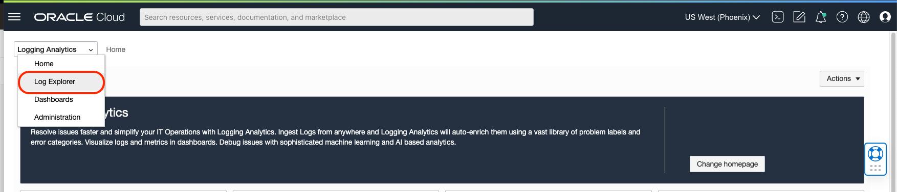 

3. By default, the Log Explorer will show the Pie-Chart view of all the logs received from the OKE. 
    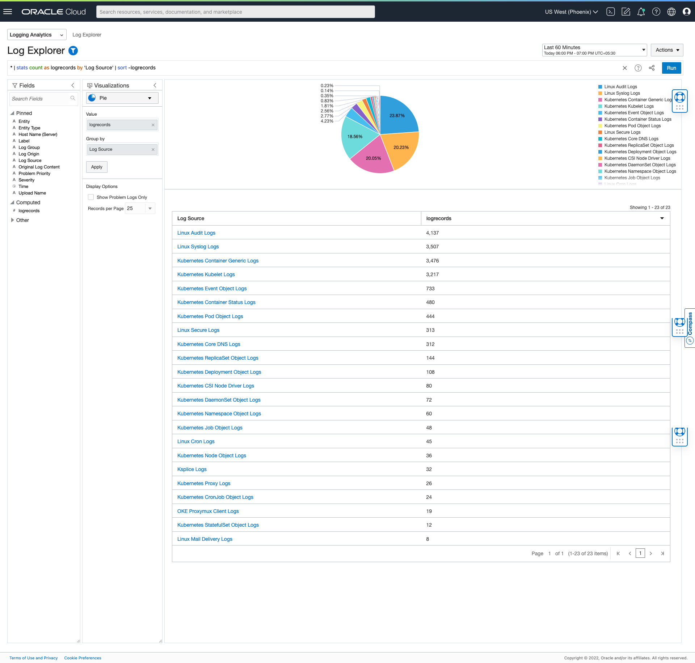

4. Drill Down to any log source for e.g Kubernetes Kubelet Logs
    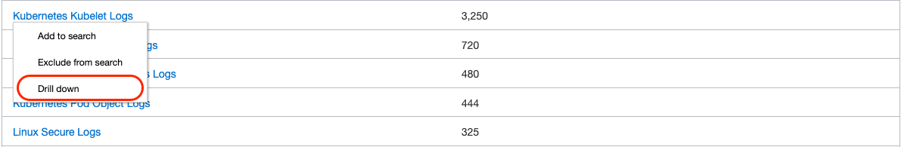 

5. The view would be like below.
    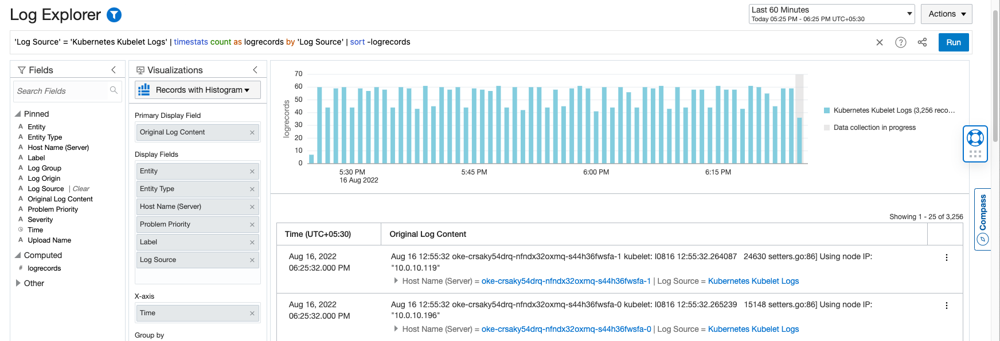 

6. Click on the expand field button, all the captured fields are displayed.
    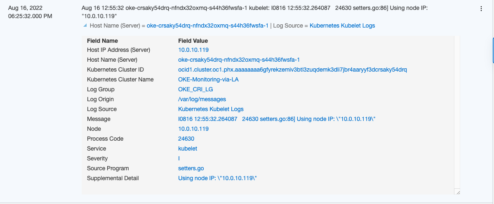    

## Acknowledgements
* **Author** - Vikram Reddy , OCI Logging Analytics
* **Contributors** -  Vikram Reddy, Santhosh Kumar Vuda , OCI Logging Analytics
* **Last Updated By/Date** - Vikram Reddy, Sep, 2022